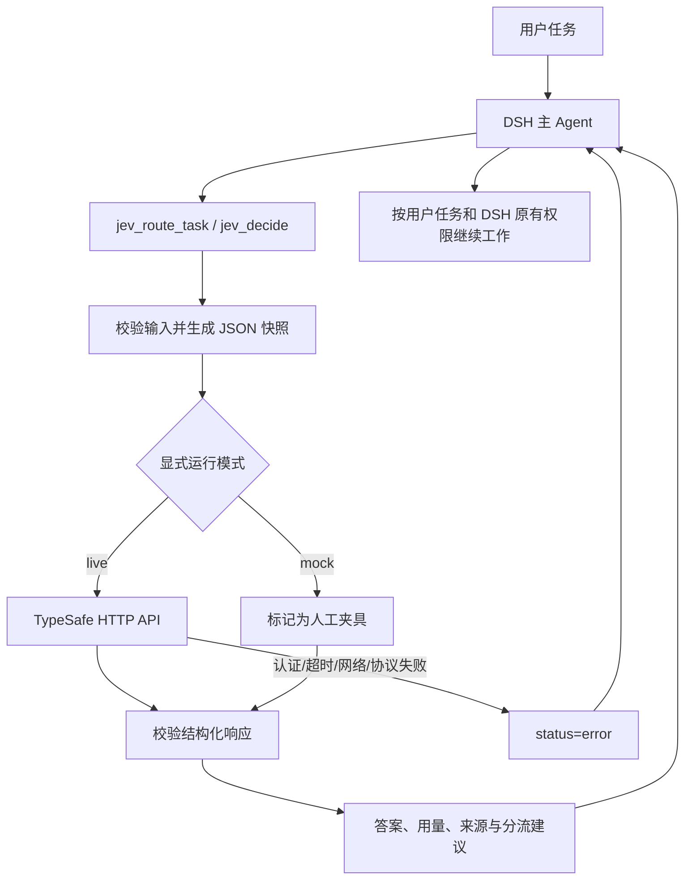

# 实现设计

## 目标

让 DSH 的主 Agent 能把一个判断问题交给 Jev，收到稳定的结构化结果，再决定如何推进。第一版选择“任务分流”作为可演示场景，同时保留通用工具，方便扩展成文档分类、资料完整性检查等场景。

## 请求链路

`jev_decide` 直接接受独立问题集合。`jev_route_task` 生成固定三题，等待一次 API 返回后在本地计算建议。这不是三次连续推理，也没有让一个问题隐式依赖另一个问题的答案。

## 文件职责

| 文件 | 职责 |
| --- | --- |
| `src/index.ts` | Cordis 插件配置、两个 DSH 工具的注册、JSON 结果渲染 |
| `src/contracts.ts` | 请求规范化、资源限制、三类响应校验 |
| `src/client.ts` | 固定端点 HTTP 调用、取消与超时、异常归一化 |
| `src/router.ts` | 中文问题模板 `task-router-v1` 与分流规则 |
| `src/mock.ts` | 明确标注的人工测试数据 |
| `src/mode.ts` | 向 DSH systemPrompt 注册中文模式提示 |
| `cordis.patch.yml` | npm 包作为 DSH bundle 安装后的宿主工具注册 |
| `presets/jev-decision/` | 模式清单、显示名称和 Agent 插件组合 |
| `scripts/` | 实际 DSH 运行时演示、真实 API 检查、模式安装和打包验收 |
| `examples/routing-cases.json` | 三个固定的真实分流联调输入；预期分支仅供报告比较，不发送给模型 |
| `examples/chat-workspace/` | 完整聊天演示的练习起点，供复制到独立目录后修改 |

## 为什么使用 TypeScript

DSH 的原生扩展基于 Node.js / Cordis。Python Notebook 适合此前的 Jev cookbook，本次交付需要被 DSH 加载，因此采用原生 TypeScript 插件并附中文说明。HTTP 请求遵循 TypeSafe 官方协议，不额外绑定 Python 或 TypeSafe SDK 版本。

## 生命周期与模式

宿主安装后提供工具。选择 Jev 模式时，DSH 会在该 preset 的作用域中挂载工具和提示词；同名注册在作用域内覆盖宿主项，不产生两个可见同名工具。注册通过 Cordis effect 管理，卸载释放工具和提示片段。

模式还组合了已有的提问、文件读取/修改、文件搜索和 shell 工具。它不替换宿主模型、文件系统、沙箱或审批服务。该组合面向 DSH 0.1.5-rc.2 的 `agent.cordis.yml` 机制。

## 失败语义

失败结果只暴露分类后的错误，不回显 HTTP 错误正文或原始异常。`retryable` 表示可在原因消除后重新调用，不表示插件自动重试。没有 API Key、输入非法和预先取消时，`request_attempted=false`；请求开始后为 true，这不代表服务已完成计费或推理。

响应校验采用容差：概率和与 1 的差最多 0.02；Choice 最高项比较容差 0.001；Score 与概率加权期望差最多 0.03。容差避免微小数值舍入导致拒绝，不用于修正不合规答案。API 若发生版本变化，应先更新契约测试，再调整验证规则。

## 刻意保留的范围

第一版不实现自动多轮路由状态机、自动重试、投票、缓存、评测平台或自定义界面。0.1.1 只在模式提示中补充：澄清或资料检查取得新事实后可再次分流，相同输入不循环请求；API 失败不生成有效建议。这些提示仍须通过真实聊天验证，不是执行层强制规则。也不声称能强制主模型每次先调用 Jev，或靠语言模型判断落实权限控制。业务评测和阈值校准属于原任务以外的可选后续工作。
