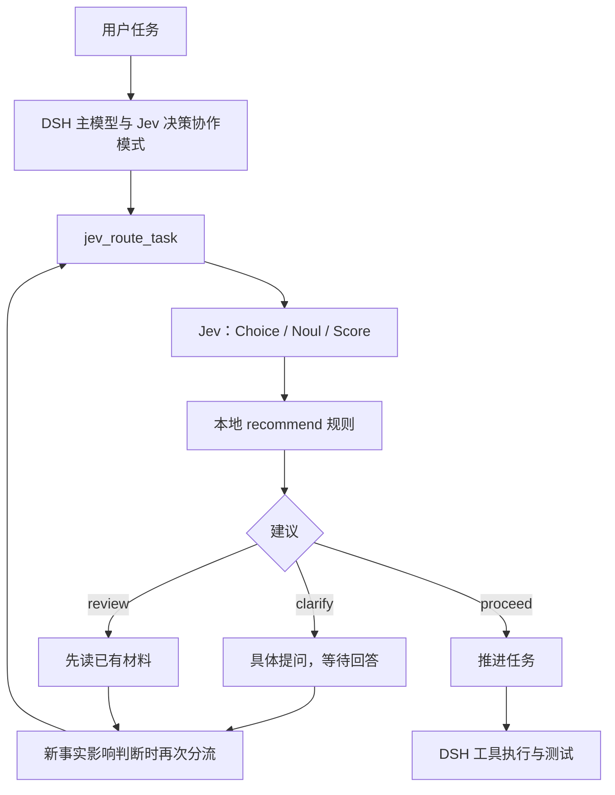

# DSH × Jev：一个决策协作插件的学习案例

本案例把“判断”和“执行”拆开观察：Jev 用类型化问题判断当前任务，插件用确定性规则给出建议，DeepSeek Harness 主模型负责继续阅读、提问、修改与测试。工程版本为 **0.1.2**；实验日期为 **2026-09-24**。

[交互式 Notebook](../../../notebooks/dsh_jev_decision_experiments.ipynb) · [安装说明](../README.md) · [公开证据](../validation/README.md)

## 要解决什么问题

用户的“修复日期解析函数”可以开始工作，“把那个东西弄好”通常需要澄清，“看看材料，代码和文案都处理一下”可能先读材料更合适。只看最终回复，难以知道 Agent 是否分清了这些情况。本实验让决策信号与后续工具轨迹都能被检查。

它不把 Jev 当聊天模型，也没有替换 DeepSeek。两套 API 各司其职：`TYPESAFE_API_KEY` 用于 Jev，`DEEPSEEK_API_KEY` 用于 DSH 主模型。

## 怎样连接起来



这里的箭头描述模式要求的流程。**它由主模型遵循提示词，不是强制的权限状态机**。DSH 的沙箱和审批仍负责工具权限，proceed 不会扩大权限。旧版失败案例正好说明了这种边界。

| 文件 | 学习重点 |
|---|---|
| [`src/contracts.ts`](../src/contracts.ts) | 限制输入与校验三种原语的响应 |
| [`src/client.ts`](../src/client.ts) | 固定服务端点、凭据读取、超时与结构化错误 |
| [`src/router.ts`](../src/router.ts) | 三道题与本地分流规则 |
| [`src/index.ts`](../src/index.ts) | 向 DSH 注册工具，返回可检查的数据 |
| [`src/mode.ts`](../src/mode.ts) | 主模型在何时分流、澄清与继续 |
| [`presets/jev-decision/agent.cordis.yml`](../presets/jev-decision/agent.cordis.yml) | 模式中的插件与工具组成 |
| [`scripts/check-chat-live.mjs`](../scripts/check-chat-live.mjs) | 显式挂载预设并采集核心会话证据 |

## 从小到大的四层验证

1. **逻辑层**：`npm test`。协议、异常、边界、作用域、安装器。无需密钥。
2. **安装层**：`npm run test:install`。打包后用官方 CLI 安装到临时 home，发现并挂载预设、执行工具。此层使用明确标注的 mock，不调用付费 API。
3. **Jev 接口层**：`npm run check:live` 和 `npm run check:routes`。真实调用原语和三条任务分流，但没有聊天主模型。
4. **完整任务层**：运行核心会话脚本，检查主模型工具顺序、澄清等待、实际文件与测试。核心运行时成功不能替代网页完整交互验收。

先在 Notebook 中看一次完整证据链，再沿 README 的命令动手复现。Notebook 默认实时模式，至多 4 次 TypeSafe 请求；显式选择 recorded 时只重读归档。两种模式不会自动互相回退。

## 实验观察

| 输入/检查 | 实际观察 | 能说明什么 |
|---|---|---|
| 整理会议纪要 | writing；Noul 0.91；Score 0.24；1329 ms | 一次请求能返回三种原语 |
| 三个固定分流样本 | proceed / clarify / review；676 / 549 / 259 ms | 三条示例路径真实触发过 |
| 完整明确任务 | 首步分流返回 review；阅读后修复；4 个测试通过 | 主模型能消费建议并完成该次任务 |
| 0.1.2 模糊任务 | clarify → 实际提问 → 脚本回答 → proceed → 修复；2 个测试通过 | 该次运行在回答前未改变 date.mjs |
| 0.1.1 模糊任务 | 得到 clarify 后读 README、猜目标、改源码，未实际澄清 | 正确判断不等于正确执行 |
| 0.1.2 材料任务 | network_error；未修改源码 | 接口失败应独立记账；本次不继续排查 |

以上是小样本观察，不是准确率、长期稳定性或性能基准。明确任务在两个实验中 context 不同，一个得到 proceed、一个得到 review，不能选择性只展示一致结果。归档明确任务还把纯空白输入视作空字符串；是否接受该扩展要看真实业务要求。

## 三个可迁移的教训

**先验证模式真的挂载。** 默认 headless 尝试没有自动挂载 Jev 预设，只输出了模型文字，不能作为工具集成成功。现在脚本调用 `agentPresets.mount`，并检查提示词段落及工具列表。

**把“先做什么”写清楚，再看真实轨迹。** 0.1.2 规定首个工具调用单独分流，不和读文件/执行命令并发；clarify 后先问具体问题并等待回答。新样本改善了行为，但提示词并不能保证所有未来任务遵循。

**分别保存判断、动作与结果。** Jev 输出正确不代表文件修改正确；模型声称完成不等于测试通过；`captured` 只表示证据保存完成。独立复跑测试可以验证保存下来的产物，但不会重演整个模型过程。

## 可复现范围与还缺什么

| 项目 | 当前状态 | 如何补足 |
|---|---|---|
| 源码、锁文件、模式、测试、中文说明 | 已纳入本仓库 | 按 README 从干净目录安装 |
| 同机新目录安装 | 见[仓库集成验证](../validation/INTEGRATION.md) | 不复用原项目 node_modules，用锁文件安装并走官方安装检查 |
| DSH 核心完整会话 | 已有真实记录 | 换新练习副本重跑 clear / clarify，保留文件与结果 |
| 网页完整交互 | 待完成 | 新会话选择“Jev 决策协作”，选练习目录，提交模糊任务、回答澄清、检查工具与文件；保存不含密钥或访问令牌的截图 |
| 另一台机器从零复现 | 待完成 | 同伴按下方模板记录环境、命令、差异与测试 |
| 业务准确率与阈值校准 | 未评估 | 先定义标签与错误成本，再建立调参与留出测试集 |
| 网络问题根因 | 暂缓 | 保留失败记录，不把重试成功改写成稳定性通过 |

网页检查本轮观察到 DSH 页面正常加载；之后桌面自动化返回窗口不可用，未完成模式选择与聊天，故不记为通过。同机新目录验证不等于跨机器验收。

### 同伴验收模板

```text
日期 / 操作系统 / CPU 架构：
Node / npm / pnpm / 插件 / DSH 版本：
仓库 commit：
执行过的安装与测试命令：
是否使用独立 DSH_HOME 与新的练习副本：
界面是否选择 Jev 决策协作：
首个工具是否为 jev_route_task：
clarify 后是否实际提问、等待回答：
回答前有无文件改变：
最终差异与独立测试结果：
失败情况与未完成项：
脱敏报告 / 截图位置：
```

模板只收集环境与行为证据，不收集 API Key。示例目录中的内容可发给两家 API；用真实项目时先确定哪些上下文适合提交。

## 理论衔接

官方 [System One](https://docs.typesafe.ai/concepts/system-one)、[State](https://docs.typesafe.ai/concepts/state)、[Primitives](https://docs.typesafe.ai/primitives)、[Confidence](https://docs.typesafe.ai/confidence)、[How to Build](https://docs.typesafe.ai/concepts/how-to-build-with-system-one)。对应中文材料见仓库 `content/`，Notebook 内有直接链接。

版本化 DSH 资料和接口依据见 [SOURCES.md](SOURCES.md)。本工程锁定 DSH `0.1.5-rc.2`，不宣称兼容主分支所有版本。
