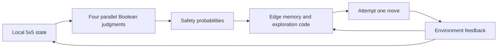

# Atomic maze judgments and code planning

The pipeline separates local perception from route composition. Each model request contains an agent-centered **5×5 ASCII window**, its coordinates, and four independent Boolean questions: is a one-cell north/east/south/west attempt traversable? Goal coordinates, shortest-path actions, route lengths, and oracle labels are absent from model inputs.

## Fixed-route question benchmark

Code executes the same shortest routes on the preselected 8×8, 16×16, and 50×50 maps: **16, 24, and 96 moves**, respectively. Every eighth pre-move state contributes four questions, giving **17 states / 68 questions**. Input and route hashes match across systems.

This benchmark gives the model **diagnostic-only** authority. Its outputs cannot change the route, so the 3/3 BFS completion result belongs to the planner. The model measurement is its atomic probability quality on those fixed states.

| System | Accuracy | Scalar Brier ↓ | NLL ↓ | Safe planner moves predicted unsafe |
|---|---:|---:|---:|---:|
| [Starting NanoJev](../results/composed_initial.json) | 64.71% | 0.26087 | 0.74897 | 0/17 |
| [Full-map game training](../results/composed_games_api.json) | 64.71% | 0.23129 | 0.65612 | 0/17 |
| [Local-question training](../results/composed_local_atomic.json) | 75.00% | 0.16611 | 0.47854 | 4/17 |
| [Jev](../results/composed_jev.json) | 76.47% | 0.13321 | 0.40277 | 9/17 |
| [Geometry reference](../results/composed_reference.json) | 100.00% | 0.00000 | 0.00000 | 0/17 |

The majority-class baseline is **64.71%** (44 true / 24 false). Brier here is scalar Bernoulli squared error; the event experiment reports the two-class summed Brier, which is twice this value. The fixed route sample is small and contains correlated states from three maps.

## Matching local training inputs

`build_local_maze_data.py` transforms existing maze snapshots using exactly the inference renderer. It preserves map groups and train/dev/calibration/test/OOD assignments. Labels describe one-step geometry; no route action is a training target. The 50×50 split tests local judgments at held-out board sizes, not reasoning over all 2,500 cells at once.

Use fresh data/run directories. The released checkpoint download and CUDA setup are in the [README](../README.md); these commands reproduce the local pilot from generated inputs.

```bash
python3 scripts/build_scaled_games.py --output-dir data/scaled_games_v4b
python3 scripts/build_local_maze_data.py --input data/scaled_games_v4b/policy \
  --output data/local_maze_v1
CUDA_VISIBLE_DEVICES=0 python scripts/train_pipeline_decisions.py \
  --input data/local_maze_v1 --output-dir runs_repro/local_atomic_seed17 \
  --init-checkpoint checkpoints/NanoJev --objective gold_distribution --loss ce \
  --steps 300 --head-steps 0 --seed 17 --eval-every 50 --batch-questions 16 \
  --microbatch-questions 4 --max-microbatch-tokens 16384 --max-length 2048 \
  --gradient-checkpointing --precision bf16 --disable-native-triton
python3 scripts/evaluate_composed_maze.py \
  --episodes results/rollout_pilot_episodes.jsonl --engine checkpoint \
  --checkpoint runs_repro/local_atomic_seed17 --output runs_repro/composed_local_atomic.json
```

The new evaluation is saved to `runs_repro/composed_local_atomic.json`. The table above describes the committed `results/composed_*.json` reports. `python3 scripts/summarize_composed_maze.py` reads those committed reports and rewrites `docs/ATOMIC_PLANNING.md`; it does not consume `runs_repro` outputs.

Whole-map direct-action results remain a separate [planning stress test](DEVELOPMENT_RESULTS.md).

## Frozen local dataset

The [dataset manifest](../results/local_maze_data_manifest.json) records **300 states / 1200 questions** (train: 576, dev: 192, calibration: 192, test: 176, ood: 64). Source-map assignments are retained, with no cross-split source groups. Only state and question fields enter the model; full environment geometry stays in metadata for reproducible simulation.

The local model starts from the released NanoJev checkpoint and trains for 300 CE updates, with dev-NLL checkpoint selection (selected step 300). All held-out questions are retained in the [question report](../results/local_atomic_question_summary.json).

| Split | Questions | Accuracy | Constant true | Scalar Brier ↓ | NLL ↓ |
|---|---:|---:|---:|---:|---:|
| test | 176 | 77.84% | 56.25% | 0.14358 | 0.44045 |
| ood | 64 | 76.56% | 56.25% | 0.15599 | 0.44656 |

## Model-guided execution

The [edge-exploration controller](../scripts/evaluate_model_edges_maze.py) makes model judgments part of execution. It stores attempted edges, ranks unknown directions using predicted safety and goal distance, and uses BFS only on already traversed open edges to find another exploration frontier. A collision leaves the agent in place and marks that edge blocked. Low-probability probes allow recovery from false-negative judgments.



See [the model-guided results](MODEL_EDGE_RESULTS.md) for the five-system comparison, including constant-0.5 perception and perfect local perception under the same exploration code. This experiment is separate from the diagnostic-only BFS table above.

```bash
python3 scripts/evaluate_model_edges_maze.py \
  --episodes results/rollout_pilot_episodes.jsonl --engine checkpoint \
  --checkpoint runs_repro/local_atomic_seed17 --max-steps 0 \
  --output runs_repro/model_edges_local_atomic.json
```

## API probability records

Jev measurements use the gateway's rounded Boolean probabilities, converted to a unit-sum controller distribution by the existing worker. All 68 native vectors in this fixed diagnostic run already sum to one within 1e-12. Local journal entries retain API call and request hashes; the report's `input_sha256` instead identifies the full local request including its transport ID.
