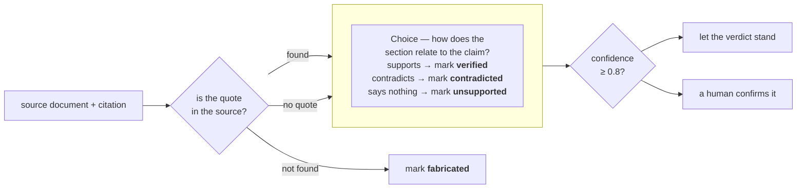

# Double-checking citations

> 通过对照源文档核查错误或幻觉引用。一个 Choice 问题判断引文的上下文是否支持该论断。

LLM 会回答问题并附上引用：对每一条论断，给出源文档中的一节，以及该论断所依赖的引文。这些引用中有些是错误的或凭空捏造的：引文可能根本不在文档里，也可能逐字出现在文档中，而它的上下文所说的却与论断相反。

逐条人工检查很慢：找到文档，在文档里找到引文，然后阅读足够的上下文来判断它是否支持该论断。

要把这个检查自动化，我们先通过普通的字符串匹配找出缺失的引文，然后再用一个 `Choice` 问题读取每条幸存引文的上下文，判断它是否支持该论断。



下面，来自某 LLM 关于 RFC 7519（JSON Web Token）答案的八条引用将通过这一检查。四条准确的引用以 0.93 或更高的置信度返回 `verified`。全部四条植入的失败案例都被抓了出来：一条捏造的引文、一条被反驳的论断，以及两条进入人工环节的不受支持引用。

`check_citation()`，也就是你在这里构建的函数，接收一个源文档和一条引用，返回四种判定之一：`verified`、`unsupported`、`contradicted` 或 `fabricated`。它还会返回一个置信度，用以标记那些应该由人来查看的条目。

## 环境准备

```bash theme={null}
pip install ipython 'cooksafe>=0.2.0,<0.3.0'
```

然后设置 `TYPESAFE_API_KEY`。每次 API 调用都缓存在 `json_cache.json` 中，该文件随实战指南一同提供，因此重新运行会重放已发布的数字，而不是调用 API。删除该文件即可全部在线运行。

下方的数字来自 2026-08-16 的 `jev-1.12`。

```python theme={null}
import json
import os
import re
from pathlib import Path
from time import perf_counter

from cooksafe import JsonCache, make_playground_link
from IPython.display import Markdown, display
from typesafe_sdk import Choice, TypeSafeClient

TYPESAFE_MODEL = "jev-1.12"
AUTO_ACCEPT = 0.8  # start high for more human review as you build trust in the model

client = TypeSafeClient(
    api_key=os.environ.get("TYPESAFE_API_KEY", "cache-only"),
    base_url=os.environ.get("TYPESAFE_ENDPOINT"),
    timeout=120.0,
)
json_cache = JsonCache(Path("json_cache.json"))
```

## 加载源文档与引用

源文档是 [RFC 7519](https://www.rfc-editor.org/rfc/rfc7519.html)（JSON Web Token），从 rfc-editor.org 抓取，并随本实战指南一同提交为 `rfc7519.txt`。下面的代码去掉页面页眉和页脚，然后把文本切分成带编号的小节。

`citations.json` 中的八条引用是某个 LLM 针对该 RFC 写下的。四条是准确的；另外四条被我们改造成会未通过检查的。

```python expandable theme={null}
def load_source() -> str:
    """RFC 7519 verbatim, minus the page headers and footers that interrupt its paragraphs."""
    lines = []
    for line in Path("rfc7519.txt").read_text().splitlines():
        bare = line.lstrip("\f")
        if re.match(r"Jones, et al\.\s.*\[Page \d+\]$", bare):
            continue
        if re.match(r"RFC 7519\s+JSON Web Token \(JWT\)\s+May 2015$", bare):
            continue
        lines.append(bare)
    return re.sub(r"\n{3,}", "\n\n", "\n".join(lines))


def split_sections(source: str) -> dict[str, str]:
    """Map each numbered section ("4.1.3") to its text, split on the RFC's header lines."""
    boundary = re.compile(r"(?m)^(?:(\d+(?:\.\d+)*)\.  .+|Appendix [A-Z]\..*)$")
    marks = list(boundary.finditer(source))
    sections = {}
    for mark, nxt in zip(marks, marks[1:] + [None]):
        if mark.group(1) is None:  # an appendix header only terminates the section before it
            continue
        sections[mark.group(1)] = source[mark.start() : nxt.start() if nxt else len(source)].strip()
    return sections


SOURCE = load_source()
SECTIONS = split_sections(SOURCE)
CITATIONS = json.loads(Path("citations.json").read_text())

print(f"{len(SOURCE):,} characters, {len(SECTIONS)} numbered sections, {len(CITATIONS)} citations")
print("\nA citation with a quote:")
print(json.dumps(CITATIONS[1], indent=2))
print("\nA claim-only citation:")
print(json.dumps(next(c for c in CITATIONS if c["quote"] is None), indent=2))
```

```
58,365 characters, 45 numbered sections, 8 citations

A citation with a quote:
{
  "id": "aud_reject",
  "claim": "If a validator does not find itself in a token's audience list, it has to reject the token.",
  "quote": "If the principal processing the claim does not identify itself with a value in the \"aud\" claim when this claim is present, then the JWT MUST be rejected.",
  "section": "4.1.3"
}

A claim-only citation:
{
  "id": "iat_future",
  "claim": "The \"iat\" claim requires validators to reject tokens whose issue time is in the future.",
  "quote": null,
  "section": "4.1.6"
}
```

## 在源文档中找到每条引文

不在源文档中的引文就是捏造的，而查明这一点并不需要模型。先对空白和弯引号做归一化，使引文在跨 RFC 换行时仍能匹配，然后把它作为子串去查找。匹配还会指出引文来自哪一节，而那一节正是模型在下一步要读的文本。

一条引用可以只点名某一节而不引用其中的任何内容。这种情况下没有可匹配的东西，因此直接取引用所点名的节，交给模型处理。

```python theme={null}
def normalize(text: str) -> str:
    """Collapse whitespace and fold curly quotes, so a quote matches across line wraps."""
    table = str.maketrans({"“": '"', "”": '"', "‘": "'", "’": "'"})
    return re.sub(r"\s+", " ", text.translate(table)).strip()


def find_quote(sections: dict[str, str], quote: str) -> str | None:
    """The number of the section that contains the quote verbatim, or None."""
    needle = normalize(quote)
    for number in sorted(sections, key=lambda n: [int(p) for p in n.split(".")]):
        if needle in normalize(sections[number]):
            return number
    return None


def locate(sections: dict[str, str], citation: dict) -> tuple[str, str | None]:
    """Step 1 for one citation: a status, plus the section step 2 will read."""
    if citation["quote"] is None:
        return "section-only", sections[citation["section"]]
    number = find_quote(sections, citation["quote"])
    if number is None:
        return "missing", None
    return "found", sections[number]


for citation in CITATIONS:
    status, section = locate(SECTIONS, citation)
    where = f"section of {len(section):,} chars" if section else "not in the source"
    print(f"{citation['id']:<18}{status:<14}{where}")
```

```
epoch_seconds     found         section of 3,122 chars
aud_reject        found         section of 761 chars
sig_reporting     missing       not in the source
clock_skew        found         section of 529 chars
exp_required      found         section of 529 chars
pii_encryption    found         section of 1,653 chars
iat_future        section-only  section of 270 chars
duplicate_names   found         section of 918 chars
```

## 验证源文档是否支持该论断

到了这一步仍然带有引文的引用已经与源文档逐字匹配。这还不够：引文可能准确，而建立在它之上的论断依然是错的。做出这个判断需要引文的上下文，即第一步找到的那一节。

每条幸存的引用各有一个 `Choice` 问题，覆盖一节与一条论断之间可能存在的三种关系。
概率最高的选项就是判定结果，而 `AUTO_ACCEPT`（上文代码中的 0.8）决定如何处置它：

* 置信度达到或超过 0.8：判定结果自行成立；
* 低于 0.8：由人来确认判定结果，之后才能对其采取行动。

一开始把阈值设高，然后随着你观察模型在自己文档上的表现再调低。

```python expandable theme={null}
QUESTIONS = {
    "relation": Choice(
        instructions="How does the section relate to the claim?",
        criteria={
            "supports": "The section states the claim or directly implies that it is true",
            "contradicts": "The section states the opposite of the claim or implies it is false",
            "says_nothing": "The section does not address what the claim asserts, either way",
        },
    ),
}

RELATION_TO_VERDICT = {
    "supports": "verified",
    "contradicts": "contradicted",
    "says_nothing": "unsupported",
}


@json_cache
def ask(claim: str, section: str) -> dict:
    started = perf_counter()
    response = client.system_one(
        state={"claim": claim, "section": section},
        questions=QUESTIONS,
        model=TYPESAFE_MODEL,
    )
    answer = response.answers["relation"]
    return {
        "choice": answer.choice,
        "probabilities": answer.probabilities,
        "confidence": answer.confidence,
        "seconds": round(perf_counter() - started, 2),
        "input_tokens": response.usage.input_tokens or 0,
        "output_tokens": response.usage.output_tokens or 0,
    }


def verdict(status: str, answer: dict | None) -> dict:
    """Fold step 1 and step 2 into one of the four labels, plus an auto-or-review flag."""
    if status == "missing":
        # confidence None: no model was called, so there is no model confidence to report
        return {"verdict": "fabricated", "confidence": None, "auto": True}
    return {
        "verdict": RELATION_TO_VERDICT[answer["choice"]],
        "confidence": answer["confidence"],
        "auto": answer["confidence"] >= AUTO_ACCEPT,
    }


def check_citation(sections: dict[str, str], citation: dict) -> dict:
    status, section = locate(sections, citation)
    answer = ask(citation["claim"], section) if section is not None else None
    return {"id": citation["id"], "status": status, "answer": answer, **verdict(status, answer)}
```

## 检查每一条引用

全部八条引用经过同一个检查：

```python theme={null}
print(f"{'citation':<18}{'quote':<14}{'relation':<14}{'conf':>6}  {'verdict':<13}{'action':>7}")
for citation in CITATIONS:
    result = check_citation(SECTIONS, citation)
    answer = result["answer"]
    relation = answer["choice"] if answer else "-"
    conf = f"{answer['confidence']:.2f}" if answer else "-"
    action = "auto" if result["auto"] else "review"
    print(
        f"{result['id']:<18}{result['status']:<14}{relation:<14}{conf:>6}"
        f"  {result['verdict']:<13}{action:>7}"
    )
```

```
citation          quote         relation        conf  verdict       action
epoch_seconds     found         supports        0.93  verified        auto
aud_reject        found         supports        0.95  verified        auto
sig_reporting     missing       -                  -  fabricated      auto
clock_skew        found         supports        0.99  verified        auto
exp_required      found         contradicts     0.99  contradicted    auto
pii_encryption    found         says_nothing    0.27  unsupported   review
iat_future        section-only  says_nothing    0.56  unsupported   review
duplicate_names   found         supports        0.99  verified        auto
```

四条引用返回 `verified`，一条 `fabricated`，一条 `contradicted`，以及两条 `unsupported`。

* `epoch_seconds`、`aud_reject`、`clock_skew` 和 `duplicate_names` 是那四条准确的。它们全部以 0.93 或更高的置信度返回 `verified`，远高于 `AUTO_ACCEPT`。
* `sig_reporting` 从未到达模型。它的引文不在 RFC 中，因此仅凭字符串匹配就把它标记为 `fabricated`。
* `exp_required` 逐字引用了 4.1.4 节，而同一节写道 "Use of this claim is OPTIONAL"，因此它是 `contradicted`，置信度 0.99。
* `pii_encryption` 和 `iat_future` 分别以 0.27 和 0.56 返回 `unsupported`，都低于阈值，因此两条都交给了人。`pii_encryption` 说明了为什么单靠字符串匹配是不够的：它的引文逐字存在于源文档中，而它出自的那一节对该论断只字未提。

要把这套方法指向你自己的数据，替换 `rfc7519.txt` 和 `citations.json` 即可。
`load_source()` 和 `split_sections()` 是为 RFC 的版式编写的，所以形状不同的文档需要自己的解析代码。

归一化之后，字符串匹配是精确匹配：被截断或稍作改写的引文会返回 `fabricated`。一个能容忍粗糙引用的生产系统需要改用模糊匹配。

## 在 Playground 中打开

链接中保存了一条引用的论断与所在小节，以及那个问题。打开它即可在浏览器中实时运行同一个调用。

```python theme={null}
example = next(c for c in CITATIONS if c["id"] == "exp_required")
_, example_section = locate(SECTIONS, example)
playground_link = make_playground_link(
    {"claim": example["claim"], "section": example_section}, QUESTIONS, models=[TYPESAFE_MODEL]
)
display(Markdown(f"🔗 [Open one citation's claim + section in the TypeSafe playground]({playground_link})"))
```

<a href="https://console.typesafe.ai/playground#share/N4IgJg9gxgrgtgUwHYBcAqCAeKQC4AEIwAOiFADYCGAlnKQaQKIBuCATgJ74BSA6mvjgwAzinzUkFGGAT5KSfFgAO1NpRTUICjYgDcc-CggBrZPgDu1FAAsIMMcUchlj0uOH4kEMc0rlqYAB0pAA0+KTCCFAaWvThIAAsgQCMgUn44U4uTvgAFIyYKmoxCmi0CACU+ADCVLSOSA0Z+GjWsq7OhR15yqrqmtrlVRQ0cOIyqNQAZtQIHjayvcUDhuX4scQKGRBsclMo7BbW1FDWhm08-PgAsgCqAMoCAHIA8gIARrKUUFAISgdgfBTHb4JRsaBzYQSADmgQyrQQTQyYIhwihSGh6ym53aWS6ORGtHwbAQAEcYKo5ud1Dj8LA2CTUPgwOoEAB6HSIzbNO6PfCffkIYEk2lLfpaZmsjlrfyiBCAiS0jrZNyEuDBTZI-AASTgSnICEQqHYHmuAEEAJqg8HMAKyYX4YQQRCOuB+cj4A0IcyUDhhEQwd1cLyCHayGzyLWUIHewQSexzMJGOQ-OxMh0UaDGR2mcxwnUoDy+cgwWS8j5fTzwT5sLVQLQoGhIGEGJ7wdgnAAirPwxdL+dukSx52oHjV7nwLwACmhtS8nmaADLBEAAXxAYRAKL1hYw2DwhBIIBJVBKcSPKA4SkRB9IpwgJxvYVIElEbBg0QGwjipAAEhBzGZCAqQWR0ohKYkEFPcMIFpNUAH5QniKA2CsDtKHPCIYCUJQdkLH8QARMDPwlURWXmC5xxBMBKWicguFofVZgomkrAnFB3yfZCGzUGjom-W9CIuSISIUMiDgo2QIBwiAoQOYdQKo3ZGP8Kk2NHIE-EiJCIl9YQAH0vBsGECKIkSIMgKkjLkMAwBJNEjhpRS6jGSg0XYQswgQKw2l2H0OFIVcgo3QhKBUAA1E0BgPEBmGSEKQEiA1onla4IBkchhAPABtEAACsEGYABaVJkgAJhAABdVcgA" target="_blank" rel="noreferrer" className="text-primary">在 TypeSafe Playground 中打开一条引用的论断与所在小节 →</a>
