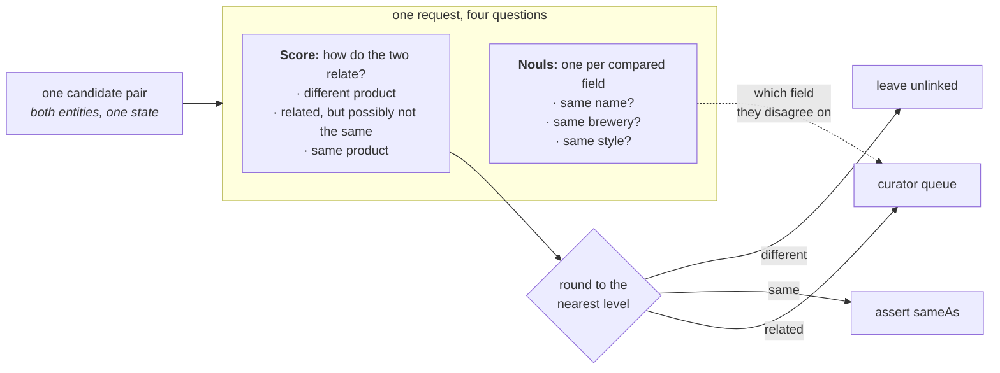

# Knowledge graph entity alignment

> Decides which of 450 candidate pairs from two beer catalogues describe the same product. One TypeSafe Score question carries the whole decision, because its three levels are the three things you can do with a pair: merge it, leave it unlinked, or hand it to a curator. There is no threshold to fit, and three Noul questions ride along in the same request to tell the curator which field the two sources disagree on.

*知识图谱中的一个关键问题是判断新来的实体是否与已有实体重复，尤其是在仅有来自不同来源的自然语言可用的情况下。给定潜在的重复对，一个 TypeSafe `Score` 就能判定每一对是否为重复，或者是否值得交给策展人仔细查看。*

假设两个数据源描述了同一批事物的重叠集合，你需要知道一侧的哪条记录与另一侧的哪条记录指的是同一样东西。知识图谱把这些记录称为*实体*，并保存每个实体所记录的事实。某个廉价但粗糙的第一轮比对已经比较了两个数据源，并挑出了 450 对值得细看的配对。剩下的工作就是对每一对做出判断。

不恰当地合并两个实体是代价更高的错误，因为关于任一实体的每条事实现在都描述了合并后的实体，而链接到任一实体的内容也会一并带过来。之后再撤销它意味着要弄清每条事实来自哪里。漏掉一个匹配只会留下一个重复项，因此这个判断需要第三个选项：那些既不能安全合并、也不能安全丢弃的配对。

这个判断是一个 `Score` 问题，三种结果各占一个层级：

* **different product** — 让两个实体保持未链接
* **related, but possibly not the same** — 交给策展人决定
* **same product** — 合并它们

我们使用 Score 问题，是因为我们想把语义标签，即评分标准，直接附加到每个结果上，包括中间那个结果。Noul 问题本可以通过对其输出做阈值处理间接做到这一点，而 Choice 问题则会丢失三种结果之间的有序关系。

接下来，对于我们想要考量的实体每个字段，关于这些字段是否匹配的 `Noul` 问题可以搭载在同一个请求中。如果分数既没有落在"same product"层级、也没有落在"different product"层级，这些 noul 就会为策展人提供更详细的信息。

最终你会得到一个 `route()`，它接收一个候选配对并返回三种结果之一，不需要任何你必须针对自己的数据拟合的阈值。



## 环境准备

```bash theme={null}
pip install matplotlib ipython "typesafe-sdk>=0.5.7" cooksafe --extra-index-url https://pypi.typesafe.ai/
```

然后设置 `TYPESAFE_API_KEY`。每次调用都会缓存到 `json_cache.json` 中，该文件随实战指南一同提供，因此重新渲染会重放已发布的数字而无需调用 API。删除该文件即可全部在线重新运行。

下方的数字来自 2026-08-11 的 `jev-1.12`。

```python theme={null}
import json
import os
from concurrent.futures import ThreadPoolExecutor
from pathlib import Path

import matplotlib
import matplotlib.pyplot as plt
from cooksafe import JsonCache, make_playground_link
from IPython.display import Markdown, display
from typesafe_sdk import Noul, Score, TypeSafeClient

matplotlib.use("Agg")  # headless render

TYPESAFE_MODEL = "jev-1.12"
MAX_WORKERS = 6  # small pool; the public endpoint rate-limits above roughly eight

client = TypeSafeClient(
    api_key=os.environ.get(
        "TYPESAFE_API_KEY", "cache-only"
    ),  # keyless kernels replay the cache
    base_url=os.environ.get("TYPESAFE_ENDPOINT"),
    timeout=120.0,
)
json_cache = JsonCache(Path("json_cache.json"))
```

## 加载候选配对

这些配对来自一个公开的基准数据集，即 Magellan 集合中的 Beer 数据：两个从不同网站抓取的啤酒目录，已经被那轮粗糙的第一遍筛减为 450 对。每个实体带有四个字段：name、brewery、style 和 alcohol content。每对还带有 `known_same_as`，即基准数据自己的答案。

文本完全保持发布时的原样，没有做任何预处理：从未转换回字符的 HTML 实体、被拆成独立单词的撇号、少量解码错误的字符。

每对发出一个请求，因此你的花费取决于你拿到的配对数量，而不是任一数据源的规模。

```python theme={null}
PAIRS = json.loads(Path("candidate_pairs.json").read_text(encoding="utf-8"))
BY_ID = {pair["id"]: pair for pair in PAIRS}

print(f"{len(PAIRS)} candidate pairs. The first one, as the model will see it:")
print(json.dumps({k: PAIRS[0][k] for k in ("entity_a", "entity_b")}, indent=2)[:420])
```

```
450 candidate pairs. The first one, as the model will see it:
{
  "entity_a": {
    "name": "C N Red Imperial Red Ale",
    "brewery": "Redwood Lodge",
    "style": "American Amber / Red Ale",
    "abv": "8.10 %"
  },
  "entity_b": {
    "name": "Kinetic Infrared Imperial Red Ale",
    "brewery": "Kinetic Brewing Company",
    "style": "American Strong Ale",
    "abv": "9.30 %"
  }
}
```

## 为每个候选配对提问一个 Score 问题和三个 Noul 问题

两个实体放入同一个状态，作为 `entity_a` 和 `entity_b`，因此问题针对的是*这一对*，而不是任何单独一侧。全部四个问题搭载在同一个请求中。

下面三段层级描述就是全部的决策：每个层级就是一个结果。本文件中的任何地方都没有阈值常量。你甚至可以在还没有见过任何一个分数之前就写下这些描述，而这对于需要拟合的数字来说是不成立的。

中间那个层级值得仔细措辞。这里它涵盖了变体、特别版，以及那些可能合理地指向任一产品的名称，让它们到达策展人手中，而不是被合并或被丢弃。

`OUTCOME` 为三个结果命名。合并结果被称为 `assert sameAs`，因为 `sameAs` 是记录两个实体为同一样东西的标准方式，而写下一条这样的记录正是合并实际发生的方式。

四个字段中有三个各得到一个 `Noul` 问题：name、brewery 和 style。酒精含量没有问题，因为比较两个数字是算术；想要的话在代码里计算即可。要把这套方法用于另一类数据，你需要重写 `QUESTIONS` 和 `LEVELS`。唯一另外涉及啤酒的代码是打印结果的两个函数，它们点名了这些字段。

```python expandable theme={null}
LEVELS = [
    "They describe two different products.",
    "They describe closely related products that may or may not be the same one: "
    "a variant, a special edition, or a name that could plausibly refer to either.",
    "They describe one and the same product.",
]
OUTCOME = {0: "leave unlinked", 1: "curator queue", 2: "assert sameAs"}

QUESTIONS = {
    "link_state": Score(
        instructions="How do the two entity descriptions relate as products?",
        criteria=LEVELS,
    ),
    "same_name": Noul(
        instructions="Do the two entities state the same beer name?",
    ),
    "same_brewery": Noul(
        instructions="Are the two entities from the same brewery?",
    ),
    "same_style": Noul(
        instructions="Do the two entities describe the same beer style?",
    ),
}


@json_cache
def score(pair_id: str) -> dict:
    """One request about one candidate pair -> the score plus the three noul answers."""
    pair = BY_ID[pair_id]
    response = client.system_one(
        state={"entity_a": pair["entity_a"], "entity_b": pair["entity_b"]},
        questions=QUESTIONS,
        model=TYPESAFE_MODEL,
    )
    link = response.answers["link_state"]
    return {
        "score": link.score,
        "probabilities": link.probabilities,
        "confidence": link.confidence,
        "properties": {
            k: response.answers[k].noul for k in QUESTIONS if k != "link_state"
        },
        # tokens and requests are the durable units; don't cache a derived cost
        "input_tokens": response.usage.input_tokens or 0,
        "output_tokens": response.usage.output_tokens or 0,
    }


def route(score_value: float) -> str:
    """The whole decision rule: the nearest level names the outcome."""
    return OUTCOME[min(int(score_value + 0.5), len(LEVELS) - 1)]


def show(pair_id: str) -> None:
    pair, result = BY_ID[pair_id], score(pair_id)
    print(
        f"{pair_id}  score {result['score']:.2f}  confidence {result['confidence']:.2f}"
        f"  ->  {route(result['score'])}"
    )
    for side in ("entity_a", "entity_b"):
        e = pair[side]
        print(f"    {e['name'][:44]:<46}{e['brewery'][:30]:<32}{e['style'][:22]}")
    nouls = result["properties"]
    print(
        f"    name {nouls['same_name']:.2f}   brewery {nouls['same_brewery']:.2f}   "
        f"style {nouls['same_style']:.2f}"
    )
```

四对配对。`c446` 是一个产品，`c427` 是两个。另外两对因不同的原因落在中间层级：`c100` 名称和酿酒厂相同，但两个数据源对它的 style 措辞不同；而 `c428` 把一款啤酒与它的一个水果加酒花变体配成了一对。

```python theme={null}
for pair_id in ("c446", "c427", "c100", "c428"):
    show(pair_id)
    print()
```

```
c446  score 1.94  confidence 0.92  ->  assert sameAs
    Thomas Hooker Old Marley Barleywine           Thomas Hooker Brewing Company   American Barleywine
    Thomas Hooker Old Marley Barleywine           Thomas Hooker Brewing Company   Barley Wine
    name 0.97   brewery 0.99   style 0.81

c427  score 0.03  confidence 0.95  ->  leave unlinked
    Frost Quake Bourbon Barrel Aged Barley Wine   Wellington County Brewery       American Barleywine
    Lompoc Bourbon Barrel Aged Proletariat Red A  Lompoc Brewing                  Amber Ale
    name 0.02   brewery 0.09   style 0.08

c100  score 1.30  confidence 0.27  ->  curator queue
    Belle Gueule Rousse                           Brasseurs R.J.                  American Amber / Red A
    Belle Gueule Rousse                           Brasseurs RJ                    Amber Lager/Vienna
    name 0.95   brewery 0.94   style 0.35

c428  score 1.10  confidence 0.77  ->  curator queue
    Ambleside Amber Ale                           Bridge Brewing Company          American Amber / Red A
    Bridge Ambleside Amber Ale - Pomegranate & G  Bridge Brewing Company          Amber Ale
    name 0.63   brewery 0.98   style 0.74
```

## 路由每个候选配对

```python expandable theme={null}
# 450 candidate pairs, one request each; a small pool keeps a live run to a few minutes.
with ThreadPoolExecutor(max_workers=MAX_WORKERS) as pool:
    scored = list(pool.map(lambda pair: score(pair["id"]), PAIRS))

scores = [result["score"] for result in scored]
by_outcome: dict[str, list[str]] = {name: [] for name in OUTCOME.values()}
for pair, s in zip(PAIRS, scores):
    by_outcome[route(s)].append(pair["id"])

SURFACE, INK, INK2, MUTED = "#fcfcfb", "#0b0b0b", "#52514e", "#898781"
GRID, AXIS, BLUE, ORANGE = "#e1e0d9", "#c3c2b7", "#2a78d6", "#eb6834"

BINS, TOP = 20, len(LEVELS) - 1
counts = [0] * BINS
for s in scores:
    counts[min(int(s / TOP * BINS), BINS - 1)] += 1
centers = [(i + 0.5) / BINS * TOP for i in range(BINS)]
queued = [c if route(x) == "curator queue" else 0 for c, x in zip(counts, centers)]
settled = [c if route(x) != "curator queue" else 0 for c, x in zip(counts, centers)]

fig, ax = plt.subplots(figsize=(7.2, 3.6), facecolor=SURFACE)
ax.set_facecolor(SURFACE)
for side in ("top", "right"):
    ax.spines[side].set_visible(False)
for side in ("left", "bottom"):
    ax.spines[side].set_color(AXIS)
ax.tick_params(colors=MUTED, labelcolor=INK2, labelsize=9)
ax.set_axisbelow(True)
ax.grid(axis="y", color=GRID, linewidth=0.8)
ax.bar(
    centers, settled, width=TOP / BINS * 0.9, color=BLUE, label="settled automatically"
)
ax.bar(
    centers, queued, width=TOP / BINS * 0.9, color=ORANGE, label="sent to the curator"
)
for edge in (0.5, 1.5):
    ax.axvline(edge, color=INK2, linewidth=1, linestyle="--")
ax.set_xticks([0, 0.5, 1, 1.5, 2])
ax.set_xticklabels(["0\ndifferent", "0.5", "1\nrelated", "1.5", "2\nsame"])
ax.set_xlabel("score for the pair", color=INK2, fontsize=9)
ax.set_ylabel("candidate pairs", color=INK2, fontsize=9)
ax.set_title(
    f"{len(PAIRS)} candidate pairs, scored once each",
    loc="left",
    color=INK,
    fontsize=11,
)
ax.legend(frameon=False, labelcolor=INK2, fontsize=9)
display(fig)
plt.close(fig)

for name in ("assert sameAs", "curator queue", "leave unlinked"):
    n = len(by_outcome[name])
    print(f"{name:<16}{n:>5}  ({n / len(PAIRS):>5.1%})")
```

```
assert sameAs      40  ( 8.9%)
curator queue      50  (11.1%)
leave unlinked    360  (80.0%)
```


`route()` 改变答案的两个分数值就是切割点。大多数配对都被定下来：360 对低于下切割点，40 对高于上切割点，剩下 50 对交给策展人。

在这一数据集上，分数并不会整齐地落在整数上。大多数落在 0.25 附近。两款毫无共同之处的啤酒可能仍然共享一个风格名称，它们的酿酒厂名称也可能看起来相似，所以模型会把一部分概率分给中间层级而不是一点都不分。决定一对配对归属的是它落在切割点的哪一侧。它离某个层级有多近并不参与决策。

两个切割点的拥挤程度并不相同。有九对配对位于上切割点 1.5 附近 0.1 以内，而这个切割点决定的是什么会被合并进图谱。有四十七对配对与下切割点 0.5 靠得同样近，而这个切割点只决定策展人是否会看到该配对。这两个数字都不是你调出来的。它们都源自你对层级的措辞，而中间层级的措辞正是把配对在"交给策展人"与"保持未链接"之间移动的那个因素。

## 在 Playground 中打开

下面的 Playground 链接会打开 `c428`，它得分 1.10 并被送去了策展人。它把 *Ambleside Amber Ale* 与 *Bridge Ambleside Amber Ale - Pomegranate & Galena Hops* 配成一对：相同的酿酒厂，相同的酒精含量。全部四个问题都随附其中。

```python theme={null}
playground_link = make_playground_link(
    {"entity_a": BY_ID["c428"]["entity_a"], "entity_b": BY_ID["c428"]["entity_b"]},
    QUESTIONS,
    models=[TYPESAFE_MODEL],
)
display(
    Markdown(
        f"🔗 [Open this pair + questions in the TypeSafe playground]({playground_link})"
    )
)
```

<a href="https://console.typesafe.ai/playground#share/N4IgJg9gxgrgtgUwHYBcAqCAeKQC4AEIwAOiMigJYoCeA+gIakEkhL2JP6kCCcARgBsEAZwpgE+XnwQAnSUNIAaLiD4yEAd1nVOpAEIyxAcwkHNFJEfwBhCHAAO9JDpDLSwmgrwresilCdJfll8AHp8ACUEMHkEJRV6PgA3XRAAVgA6AGYABnwAUlIAXzcyVCo6Pk4WNg5vfUMwEyDBETEJKRDuIXwAWnwABTsEIxknehQJADJ8AHF6ITZ8AAkIe2F40jVNbVSDY1N1DQsrWwcnF1KPai8CHmC5brjXBOTUzNyC4qKXkHsZOz2FDCDDYbxEUgCCwAa1oHgmz2YpBo9kRKmEUAg6k2ICghkmhkY3gA2qQ0AALBDUfDiDGGaT4FAaCA0igAMzZsnI+H+EDAMCgwIyOIpVJpIjxFAZUAEEGECAE1PUAgRMV5-MFwkZ5Im+Dg9GpWL1BvwSAgKHwDJQlPwwnYEggSAQBHo+CS9EJqGUruEqKgFAW+GiVAojuURtdtQk1t1mJgAjVKpgokESoQnLkKBZCColJkwpeZMp1NpkoZjokThi1okdsQPIBGpQBYAuqULB4ZALKI6NvUQKsNDSWTXGcyg+UaOK6RQgaGkFrlQj8PQteru8IAPzFK722hR6rI6io1Jm+M4jsoLuC+d9u4gAAiI5tTOzk4oIltKGXo7rEmkIRRtuIAlOie7bFoMguEiIAomipBngIF4Lle3a3qk3DqNq0bjuQIafmyAJwNhtr2paRzaMBoHuHu1y3PgLBwaeEDnoWICXtePYLqkT4ka+E6UJQn6lvS0Y2n+loICEdEIFRPzKCA9D2BQABqsiiI64JJAAjL88pCIK0QALJ8gqwgkiAABWCBJL02kZNpABMIAtkUQA" target="_blank" rel="noreferrer" className="text-primary">在 TypeSafe Playground 中打开这对配对与问题 →</a>
