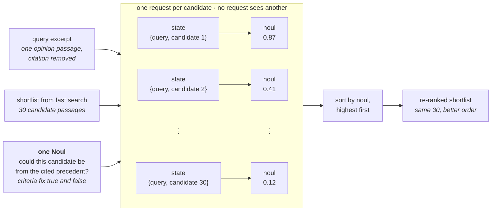

# 重排序

> 为 40 个 CLERC 法律查询各构建一份 30 段的 BM25 短名单，然后对每个查询-候选对使用一个 TypeSafe 问题，把 top-1 准确率从 5% 提升到 18%，top-10 准确率从 38% 提升到 62%。

你有成千上万份文档，需要找出能回答某个具体问题的那一份。那么该怎么找到它？

第一步，先用关键词匹配之类的快速方法，把数千个候选缩减为一份看起来靠谱的短名单。我们称之为快速搜索。

快速搜索擅长这个，但它无法告诉你短名单上哪个候选是正确的。这正是重排序的用武之地。它直接用查询为短名单上的每个候选打分，并把最好的排到最前。

下面的两个步骤都在 CLERC 数据集的 3,565 段法院意见文本上运行：BM25 为 40 个查询中的每一个构建含 30 个候选的快速搜索短名单，然后 TypeSafe 对每份短名单进行重排序。经过重排序后，18% 的查询中正确段落排名第一，而仅用快速搜索时只有 5%。

**在此过程中，你将学到：**

* 快速搜索做什么，以及为什么它不是完整的答案
* 重排序是什么，以及它如何衔接在快速搜索步骤之后
* TypeSafe 如何用一个查询为单个候选打分，以及这能把结果改善多少

## 亲手试试

[在 TypeSafe Playground 中打开一个查询、一个候选和一条重排序问题](https://console.typesafe.ai/playground#share/N4IgJg9gxgrgtgUwHYBcAqCAeKQC4AEIwAOiAI4wIBOAngPpZTUAOKpBpUANgIYCWcfADMIVfADc+EXiilIAzvghD8AaWQoYUANY18UPpK75mVaAjAwqCADT4UACwR6h-Yygj55KHigT4efV4BfBhmCCR8AHcHPigHfGsuPgQVKB5IgCN-AHMqDL8wADp8NCd8AFk+bUVIfCQIFHw+MA0+IRpAFAIMsCUrRIR5BB4qePxIQfrGgfFhrm79HhghpRUeKFkI4VEJKRk5RWU1DS1dfUM+YwByEzMmS2sSitEECFmqOwAxazAwFMr1tEeIoGk1AswRig9B57OURNZuBB5FZ-OtNpEeoskKD8Nl8E4uL1rPJwgo+JkuP54QEkHpTOYHjxjK0hAgNoo+JFHP56UwLJycvISmhPNz8Fg-KhYb5Yf4qjUvAgENp7J5MlQBQEgvxBNTJNJfAdVrK+GJLDy7oNFBqcg4UIoYEhWmIxZ92o58ABBRBOn1NGFigCqSD4hXwAGUfH5FABhCLeUMwdF2bkuNyqrxR1HakJhLYxOIJJIpNIZXG5fKoCzl9LLfzfCx-OWAvgg6aBHJvahIP0BDY7GKedJZfwE3rJHgUqk7KDx2SadFM3YG9FC-AASUi+AASgBRAAinpjaAP+FlEbC1kQ+DjViagx8FNbTl6gSE+UQUVEKuprT8VDgTlNRiZAtU7d4ew0ABaEl4xeXpZyocJ8nRZpFA7LsqEgqU0R2alZwUeckzkJdmCscIhjXdcmjHaUmkAHAIQOsfAilY88AHFMOwpooGsXxJkCRDkMNLZMj0Ek2T4JdeCiOxqTFIQ7ycSsmGNcDuz9JcIEyAArNlZFmeQ7ExawfE5RRqVDIYuBUZhqDgDINACJMHFEUNoU8HhmHCTkwXwBydLcqFjTFP4EQ8KhDhURwZSE0QRKQFNyjilC5DQkxISgkLyk4iDe2pMikKRSYjldU1vC9H0wD9IpAFwCDdigCJoAGYAE5WrsABGTqAFYIyKGMUBKVqADZOqKOxg2dc8ABkEHVABnyJ3x4T9vy+H4mwBKB0pxDC8qc3CxEHLFy3xBBCXwCcp22MR9X2eNsvrd0Em9ZBqo0QBMAkUfdKHwAAFS15FjXg6xKcMlTsBAihyCbKpKAAhDJtGoRRnioFBYZvURmBKcQSk+CwSgACQga8ZogMt0cxko4yQuGAHY+s+Ipmt6TqABYAAZOq67mRqgrnWvwAAKVqPRjU0ik69qRoASlIOxOB6Fp+LoCFgZ4HIEHYfBSB8bRNWUFQtjjUR5E+gIwHeWR5GA2IxjrRQxXkLgIByMsjkADAJw0ud58ARmAuEpFBLcs+1y2oLEjPPPxsFuaBgjgZ2HBlM3IvSr2yn8X2uH9wPg4Qf1U7BARFGz-BPhGHc+FtUPFHCZJZHSYwtfewIZTFJxIWNN6NXSIpLfqgAObrK-BsJcfwdrmrsdq+pF8N9wAOQATXwGXWuauWSm9FB8m0b7dlU0xBhaJy-nkLz6VmXoxR4a3qFthA-TsTlxAgQ2kBySr954Q+G7SDiDQN+SBlKhmrO+MmzQI6n1aEwYGOxgRXR6G7KgvQjj-WQJESMCUkr+CwdieQNA84ZCkjuNwZgH7YzgBCWkdh6IxSaKGaIlxjB7WDhAKIJggHNyXA-G2rYjZcnKAAbXDDpOyGx1hB2rgIp+Qjv5eFrkgOqXpvIlAAEzDx6iUOai0RGgSEJcasyIWFa34IRX+B8aS9DQPudcdhuA6gFKA-8AQJxJU7uUawikr7uE8MwXgqlYjoUfhjVsL8nJbDFOGKRPhYC8DEKnXo91+K9FCZXcqYInRZKEB6N6vonI2jtGuT0+So5YDsn8MMl9ZzvBAeefcrZ95xCaLeDGiQg7ViYdY-+dhsi1hWEcKyQRir2BSM7UU5RCbOiXLlDSGg7BRGQYEBZWFexHWMk0SkwImjUjdJFJohSPpSkKhRQYxlcm9NGdYPSGw0pHH0WYJAR96QXNfOE5+myHQKBgKGSclJbrjFbEEngehOQA2wRGKMaUUnLhkD0mZ2TKrvRqqUZKEA7z4DyAUaszylo0maEgHSjoHlbExKIZ01Y942MxPY9cGZL5gr0M8iIR95ERKGL2GJ5Q4n6RkUk4U5RgwQN6Lg6M2NsVHE9N5OYFkdixLZBEXoktRj-KaNYd4QxGqdU0ePfAbNDXD2HqLTe29hU8kclwI+EBmBAS2MYo5Uwwy9Npf-IEMcxKx3slFc8lIcitgeiI2KfEwyhjsHtfA6zuLilQO5N+xRtmGtalzAA3LY2UkQCLcBgK0O+JdzyzOoPMrivYVltiaPITw79pC31YQUuAf8VS9LFDIf8R94FCMerOIOvQ8QETttS3orI5mt3JYlZoSamops6lBNqmjaaxFSPgAAUnm7W+Bl4ICiA5SIl8hhVkagAdQrHihCCj4oahKD1MegZwYlG6lzBem8OY7w3Iy09+IeCzHOpdCITA7CBwxlsfG+Bj2XEAt-DwkR-ojC-j-T0LkgqNOaiNPq97+r4AZr1M1o1Opyyub0K+LR-IZGhAIS5dE+yrmNKYQw-E43zkmadatiBZCIEUHiawHt0HVmQepDZGh+ETuBYOoii5jDnOKmuCGthxQlFhnYcMZZvgZAMPIWcXoMaKAAGRekcCHOIMdNxQDxiUUVYYJWTAAPJcBoLQuINC4Bww5sPZq+BMPhhvZozRdgeocxGnh4eDM5YZoRlweAEgSirxGEXeQug7Acx6gzTzD7p6tV5hvLmXMObBc0WFyoEBxkUzAJu5eEBH1c1S2B9cVBJAx25qlrzj6Rqzw3gzfVIsZadffdRdKrhTQZivtCQt9EsViHSJRcYkk-hKJApEej4hGNojSoBOuZ1WhRILTKUq5RvCMdTr+nE2RkCkAAL4gDsCAektD7QYGwHgQgJAQCtjoAYQodBq1WCYLrF7UI7K61IA0IOis9avcIlQLQq4gcgArhQagehGAsB4mTSYUDBCBEDOGYQFgS3GF7Z0u1DqMS5IrdEDUKBJTNDgIgP4-F7MBDMI6V85xYUxM8rcNkePUAZrFB9hKMDrIqFTlxpUkQrxdkareS6-OVZgEYxrK+m68QY+ox96sp97hOU6OMCAkwWEPkBc+c8EkDDGJ2gG0iZgKKhjSmKBHtBxSYCYEhZhSAP4o3QswiOAvUI+VQAAfjB5wSn1ApJ-f1lDnWT3SAV2HH8BXfgMqa03QdyVOwjdPnkE4FO-gzftCc1DykdgDtOhGGAOwrlCSuKUGIVwGwMpU+7NRh3lAnfI7d01VpmQkyTBhLcl+Uu2cJSKCHkArguBDFh-H+XivgTK-8K2fy1ALp6ApcowCSTVT2p2jsSAGwNRIAQBmlhExK1eEnozl2UjC87XeUiO3vL-CO6Ry7lHAxkglVURd87l3rteR8AABqqMcgT2IA4gnUV2hA1k+kFgzwrQU+T2oiIAEkFgdAiK3gIAAAuudkAA)

## 如何在数千份文档中找到那一份？

你有一堆文档，还有一个查询——一段描述你要找什么内容的文字。堆里的某处有唯一一份能回答它的文档。

逐份把每个文档与查询比对是可行的，代价是每个文档一次比较：数百万份文档意味着每个查询要做数百万次比较。你可以用两步方法提升性能：

1. 用一种快到足以跑遍整堆文档的方法，把这堆文档缩减为一份可能候选的短名单。
2. 对短名单应用更精确的一步，找出确切正确的答案。


本实战指南在一个法院意见数据集上测试了这一设置，见下文[在真实示例上进行重排序](#re-ranking-on-a-real-example)。

## 什么是快速搜索？

快速搜索是任何能够把查询与大型语料库中的每个文档进行比较、并快速返回一份带排名短名单的方法。常见方法包括关键词搜索（例如 BM25）和稠密嵌入（dense embeddings，按语义比较段落）。系统经常将两者结合使用。

这里的第一步只用了 BM25，别无其他。BM25 依据共享词语给段落排名。让这一步保持简单，可以把注意力集中在重排序上——这正是本实战指南的重点。快速搜索方法的选择是次要问题：重排序只会看到进入短名单的那些段落。

## 什么是重排序？

重排序拿到快速搜索已经产出的短名单，并把它排成更好的顺序。它不是一次性把查询与整个语料库比较，而是把查询与短名单上的每个候选逐一比较，再按该分数对短名单排序。


这个分数可以来自语言模型。把查询和一个候选一起交给它，问候选在多大程度上回答了查询。这样，即使最佳匹配的措辞与查询不同，重排序也能在短名单上找到它。

## 用 TypeSafe 重排序

重排序器需要为每个查询-候选对给出可比较的分数。通用语言模型可以产出这些分数，或者直接对整份短名单进行排名。但对于独立的成对打分，你需要定义一套打分标尺，并提示模型对每个候选采用同一标准。重复调用仍可能为同一对给出不同分数，而通用生成还会给这个只需要一个数字的任务平添时间和成本。

### TypeSafe 返回什么

有了 TypeSafe，打分请求可以保持为一个是否问题：

```text theme={null}
Could this candidate passage be from the cited precedent?
```

单纯的是或否不足以给 30 个候选排名。`Noul` 返回的则是一个介于 0 和 1 之间的数字，称为 [noul](/primitives/noul)。noul 是 TypeSafe 对答案有多大可能是“是”的估计。

问题的 criteria 定义了什么算真、什么算假。TypeSafe 把它们应用于每个查询-候选对，并直接返回 noul。这个 noul 就是应用用来排序的分数。你无需为通用模型发明一套打分标尺，而且 TypeSafe 就是为更快、更便宜、更一致地完成这种重复打分而构建的。

用简化的伪代码来表示，一次 TypeSafe 打分调用如下：

```python theme={null}
question = Noul(
    instructions="Is this candidate the cited case?",
    criteria=NoulCriteria(
        true="The candidate states the specific rule the query cites.",
        false="The candidate is only on a similar topic.",
    ),
)
response = client.system_one(state={...}, questions={"is_cited_source": question})
response.answers["is_cited_source"].noul  # -> 0.87
```

TypeSafe 把查询与一个候选放在一起、对照该问题进行阅读，并返回一个 noul。

你可以用它来重排序一份短名单：对短名单上的每个候选运行同一个问题，然后按每次调用返回的 noul 对短名单排序，最高者在前。

```python theme={null}
nouls = {candidate: ask_typesafe(query, candidate) for candidate in shortlist}
reranked = sorted(shortlist, key=lambda c: nouls[c], reverse=True)  # highest noul first
```

下图展示了“每个候选一次请求”是如何产生用于重排短名单的分数的。



## 一个重排序示例

快速搜索和重排序现在在一个法律检索数据集 [CLERC](https://aclanthology.org/2025.findings-naacl.441/) 上运行。本示例使用 3,565 段法院意见文本和 40 个查询。

### 环境准备

第一步安装本次演练所依赖的软件包：

* `bm25s` 与 `datasets` 构建快速搜索短名单。
* `typesafe-sdk` 与 `cooksafe` 负责重排序和 API 缓存。
* `matplotlib` 绘制结果图表。

```bash theme={null}
pip install bm25s datasets matplotlib "typesafe-sdk>=0.5.7" cooksafe --extra-index-url https://pypi.typesafe.ai/
```

下一个代码块设置 TypeSafe 客户端以及本次演练其余部分会用到的常量，例如调用哪个 TypeSafe 模型、快速搜索交给重排序器的短名单有多大。调用 TypeSafe 需要 `TYPESAFE_API_KEY`。

```python theme={null}
import hashlib
import json
import os
import random
from concurrent.futures import ThreadPoolExecutor
from pathlib import Path

import msgspec
from cooksafe import JsonCache
from IPython.display import display
from typesafe_sdk import Noul, NoulCriteria, TypeSafeClient

TYPESAFE_MODEL = "jev-1.12"
PRICE = (
    0.042,
    0.00,
)  # $ per 1M tokens (input, output); TypeSafe jev-1.12 as of 2026-08
N_ROWS = 170  # CLERC rows pooled into the shared corpus
N_QUERIES = 40  # rows we evaluate
TOP_K = 30  # candidates the shortlist hands to the re-ranker, per query

client = TypeSafeClient(
    api_key=os.environ.get(
        "TYPESAFE_API_KEY", "cache-only"
    ),  # keyless kernels replay the cache
    base_url=os.environ.get("TYPESAFE_ENDPOINT"),
    timeout=120.0,
)
json_cache = JsonCache(Path("json_cache.json"))
```

### 用快速搜索给段落排名

这里使用的数据集是一个美国法院意见语料库，汇集了 170 行。每行的构成如下：

* **Query**：一段删除了引注的意见节选。
* **Gold**：被删引注原本指向的段落，也就是该查询唯一正确的答案。
* **Candidates**：语料库中的其余所有段落，每一段都可能是查询被错误匹配上的对象。

170 行中有 40 行被选中作为查询进行评估。其余 130 行只会以候选的身份出现。

下一个单元格使用上文描述的技术构建短名单：

1. 加载语料库。
2. 用 BM25 针对每个查询对它排名。

这里还没有 TypeSafe，这只是快速搜索步骤。

```python expandable theme={null}
CLERC_FILE = (
    "https://huggingface.co/datasets/jhu-clsp/CLERC/resolve/main/"
    "teva_train_dir/train_data.jsonl.gz"
)


def cid(text: str) -> str:
    """Corpus id: a content hash, so passages shared across queries dedupe."""
    return hashlib.sha1(text.encode("utf-8")).hexdigest()[:16]


@json_cache
def build_slice(n_rows: int, n_queries: int, seed: int) -> dict:
    """Stream CLERC rows, pool ``n_rows`` of them into a corpus, pick ``n_queries`` to evaluate."""
    from datasets import load_dataset  # heavy import, keep local

    stream = load_dataset("json", data_files=CLERC_FILE, streaming=True, split="train")
    rows = []
    for row in stream:
        if (
            row.get("positive_passages")
            and len(row.get("negative_passages") or []) == 20
        ):
            rows.append(row)
        if len(rows) >= 1000:
            break

    rng = random.Random(seed)
    picked = rng.sample(rows, n_rows)
    corpus, pool = {}, []
    for row in picked:
        gold = row["positive_passages"][0]["text"]
        corpus[cid(gold)] = gold
        for neg in row["negative_passages"]:
            corpus[cid(neg["text"])] = neg["text"]
        pool.append(
            {"qid": str(row["query_id"]), "query": row["query"], "gold": cid(gold)}
        )
    # hold out the first 20 pooled rows; evaluate on the rest
    queries = rng.sample(pool[20:], n_queries)
    # sort the corpus by id so every run — live or cache replay — iterates it identically
    return {"queries": queries, "corpus": dict(sorted(corpus.items()))}


def bm25_rankings(corpus: dict[str, str], queries: dict[str, str], k: int = 100):
    """Rank every passage in the corpus by word overlap with each query."""
    import bm25s

    cids = list(corpus)
    retriever = bm25s.BM25()
    retriever.index(bm25s.tokenize([corpus[c] for c in cids], stopwords="en"))
    qids = list(queries)
    idxs, _ = retriever.retrieve(
        bm25s.tokenize([queries[q] for q in qids], stopwords="en"), k=min(k, len(cids))
    )
    return {q: [cids[i] for i in idxs[row]] for row, q in enumerate(qids)}


def gold_rank(ranked: list[str], gold: str) -> int | None:
    """1-based rank of the gold id, or None if it isn't in the list."""
    return ranked.index(gold) + 1 if gold in ranked else None


SURFACE, INK, INK2, MUTED = "#f8f8f2", "#34342f", "#34342f", "#7c7c77"
GRID, AXIS, BLUE, GREEN = "#d8d8cf", "#d8d8cf", "#5d76a2", "#6f9b52"


def bar_chart(labels: list[str], shares: list[float], title: str) -> None:
    """A small single-series bar chart of shares (0-1, shown as percentages)."""
    import matplotlib.pyplot as plt

    fig, ax = plt.subplots(figsize=(5, 3.2), facecolor=SURFACE)
    ax.set_facecolor(SURFACE)
    for side in ("top", "right"):
        ax.spines[side].set_visible(False)
    for side in ("left", "bottom"):
        ax.spines[side].set_color(AXIS)
    ax.tick_params(colors=MUTED, labelcolor=INK2, labelsize=9)
    ax.set_axisbelow(True)
    ax.grid(axis="y", color=GRID, linewidth=0.8)

    bars = ax.bar(labels, shares, width=0.55, color=[BLUE, GREEN][: len(labels)])
    ax.bar_label(
        bars,
        labels=[f"{s * 100:.0f}%" for s in shares],
        padding=4,
        color=INK,
        fontsize=11,
    )
    ax.set_ylim(0, 1.1)
    ax.set_yticks([0, 0.25, 0.5, 0.75, 1.0])
    ax.set_yticklabels(["0%", "25%", "50%", "75%", "100%"])
    ax.set_ylabel(f"share of {len(queries)} queries", color=INK2, fontsize=9)
    ax.set_title(title, loc="left", color=INK, fontsize=11)
    plt.tight_layout()
    display(fig)
    plt.close(fig)


ds = build_slice(N_ROWS, N_QUERIES, seed=0)
corpus: dict[str, str] = ds["corpus"]
queries = {q["qid"]: q["query"] for q in ds["queries"]}
golds = {q["qid"]: q["gold"] for q in ds["queries"]}

candidates = {q: ranked[:TOP_K] for q, ranked in bm25_rankings(corpus, queries).items()}

in_top_k = sum(golds[q] in candidates[q] for q in queries)
at_rank_1 = sum(candidates[q][0] == golds[q] for q in queries)

bar_chart(
    [f"In top {TOP_K}", "At rank 1"],
    [in_top_k / len(queries), at_rank_1 / len(queries)],
    f"Where the correct passage lands, {len(queries)} queries against {len(corpus):,} candidates",
)
```


### 快速搜索不太可能把正确段落排到第一

图表展示的是在 3,565 个候选中，快速搜索把正确段落放在了什么位置。

快速搜索能够可靠地把语料库缩小为一份包含正确答案的短名单：40 个查询的短名单 100% 都包含正确答案。但那段正确文本很少排在短名单第一位，只有 5% 的时候排第一。

下文的重排序只会对短名单上已有的前 30 个候选重新排序。它无法加入快速搜索没有选中的段落。在这里，全部 40 个查询的短名单都包含正确段落，因此重排序可以专注于把每一段放到更好的位置。

### 用 TypeSafe 对它重排序

重排序用查询为短名单上的每个候选打分，然后按分数排序。TypeSafe 对每一对提出的问题是：这个候选是否可能就是查询中被删引注所指向的段落。

下一个单元格完成以下工作：

1. 定义这个问题。
2. 在每份短名单上对每个候选各问一次：40 个查询乘以 30 个候选，共 1,200 次调用，以并发方式执行而不是一个接一个。
3. 按 TypeSafe 返回的分数对每份短名单排序，得到重排序后的结果。

```python expandable theme={null}
is_cited_source = Noul(
    instructions=(
        "The query excerpt comes from a US federal court opinion and was written "
        "immediately around a citation to a precedent; the citation itself has been "
        "removed. Could the candidate passage be from that cited precedent — does it "
        "establish the specific legal proposition the query excerpt invokes at its "
        "citation point?"
    ),
    criteria=NoulCriteria(
        true=(
            "The candidate passage states or establishes the specific rule, standard, "
            "holding, or fact pattern that the query excerpt attributes to its removed "
            "citation."
        ),
        false=(
            "The candidate passage is merely on a similar topic or doctrine; it does not "
            "supply the specific proposition the query excerpt relies on."
        ),
    ),
)


@json_cache
def score_candidate(model: str, query: str, candidate: str, question_json: str) -> dict:
    """One TypeSafe call about one (query, candidate) pair: a noul, plus token usage."""
    # the SDK takes a question as its JSON dict, so the cached string decodes straight in
    question = json.loads(question_json)
    response = client.system_one(
        state={"query_excerpt": query, "candidate_passage": candidate},
        questions={"is_cited_source": question},
        model=model,
    )
    return {
        "noul": response.answers["is_cited_source"].noul,
        "input_tokens": response.usage.input_tokens or 0,
        "output_tokens": response.usage.output_tokens or 0,
    }


# Each of the 40 queries has 30 candidates, so re-ranking every shortlist means 1,200 independent
# calls — cheap enough to fire all at once with a thread pool instead of one after another.
pair_list = [(q, c) for q in queries for c in candidates[q]]
question_json = msgspec.json.encode(is_cited_source).decode()
with ThreadPoolExecutor(max_workers=12) as pool:
    results = pool.map(
        lambda p: score_candidate(
            TYPESAFE_MODEL, queries[p[0]], corpus[p[1]], question_json
        ),
        pair_list,
    )
pair_scores = {q: {} for q in queries}
for (q, c), result in zip(pair_list, results):
    pair_scores[q][c] = result

reranked = {
    q: sorted(candidates[q], key=lambda c: -pair_scores[q][c]["noul"]) for q in queries
}


def chart_before_after(
    runs: dict[str, dict[str, list[str]]], thresholds: list[int]
) -> None:
    """Grouped bar chart: how often the correct passage lands in the top N, for each run."""
    import numpy as np
    import matplotlib.pyplot as plt

    labels = list(runs)
    colors = [BLUE, GREEN]

    def share_in_top(rankings, k):
        return sum(
            gold_rank(rankings[q], golds[q]) in range(1, k + 1) for q in queries
        ) / len(queries)

    fig, ax = plt.subplots(figsize=(6.5, 3.6), facecolor=SURFACE)
    ax.set_facecolor(SURFACE)
    for side in ("top", "right"):
        ax.spines[side].set_visible(False)
    for side in ("left", "bottom"):
        ax.spines[side].set_color(AXIS)
    ax.tick_params(colors=MUTED, labelcolor=INK2, labelsize=9)
    ax.set_axisbelow(True)
    ax.grid(axis="y", color=GRID, linewidth=0.8)

    x = np.arange(len(thresholds))
    width = 0.35
    for i, (label, rankings) in enumerate(runs.items()):
        shares = [share_in_top(rankings, k) for k in thresholds]
        offset = (i - (len(labels) - 1) / 2) * width
        bars = ax.bar(x + offset, shares, width * 0.92, color=colors[i], label=label)
        ax.bar_label(
            bars,
            labels=[f"{s * 100:.0f}%" for s in shares],
            padding=3,
            color=INK2,
            fontsize=8.5,
        )

    ax.set_xticks(x, [f"top {k}" for k in thresholds])
    ax.set_ylim(0, 1)
    ax.set_yticks([0, 0.25, 0.5, 0.75, 1.0])
    ax.set_yticklabels(["0%", "25%", "50%", "75%", "100%"])
    ax.set_ylabel(f"share of {len(queries)} queries", color=INK2, fontsize=9)
    ax.set_title(
        "How often the correct passage lands near the top",
        loc="left",
        color=INK,
        fontsize=11,
    )
    ax.legend(frameon=False, labelcolor=INK2, fontsize=9, loc="upper left")
    plt.tight_layout()
    display(fig)
    plt.close(fig)


chart_before_after(
    {"Fast search": candidates, "+ TypeSafe re-rank": reranked}, [1, 5, 10]
)

calls = [pair_scores[q][c] for q in queries for c in pair_scores[q]]
input_tokens = sum(call["input_tokens"] for call in calls)
output_tokens = sum(call["output_tokens"] for call in calls)
cost = input_tokens / 1_000_000 * PRICE[0] + output_tokens / 1_000_000 * PRICE[1]
print(
    f"{len(calls)} TypeSafe calls used {input_tokens:,} input and "
    f"{output_tokens:,} output tokens, costing ${cost:.4f}."
)
```

```
1200 TypeSafe calls used 1,536,002 input and 25,200 output tokens, costing $0.0645.
```


### 重排序把正确答案推向顶部

图表在三个阈值上比较快速搜索与“快速搜索 + 重排序”。在每一个阈值上，重排序都把正确段落推向更靠前的位置：

* **Top 1** — 5% → 18%
* **Top 5** — 15% → 35%
* **Top 10** — 38% → 62%

报告的 token 数与成本涵盖了用于重排这 40 份短名单的全部 1,200 次 TypeSafe 调用。

每个 CLERC 行包含一个正确段落和 20 个负例段落。本次演练把 170 行的段落汇入同一个共享语料库。对 40 个评估查询中的每一个，BM25 从整个语料库中选出 30 个候选，而不仅是该行附带的 20 个负例。随后 TypeSafe 针对每个选中的候选阅读查询，并对这 30 段文本进行重排序。

为了清晰起见，本次演练对每一对只问了一个问题。真实应用会在一次调用中对同一对提出多个问题。具体做法参见[并行问题实战指南](/cookbooks/parallel_questions)和 [Speculative Fan-Out 模式](/patterns/fan-out)。

***

## 下一步

同样的构建模块也出现在 TypeSafe 文档的其他地方：

* [Noul](/primitives/noul)：TypeSafe 如何把一个是否问题变成一个分数。
* [Speculative Fan-Out](/patterns/fan-out)：如何在一次调用中就同一份文档提出多个问题。
* [Line-by-line Search](/cookbooks/semantic_find)：另一种按语义而非关键词搜索语料库的方法。
