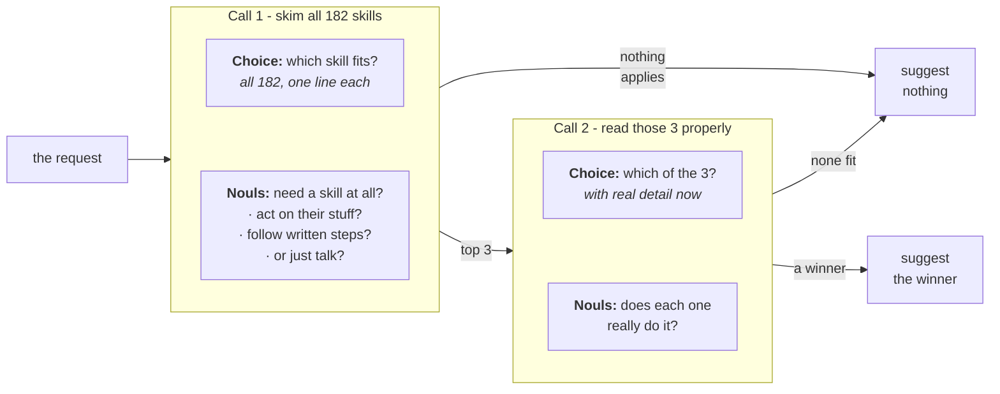

# 技能建议

> 为代理的一轮对话从 Nous Research 的 Hermes 目录中的 182 个技能里挑选至多一个：第一个 TypeSafe 请求对所有技能排序，并询问这一轮是否根本需要技能；第二个请求认真阅读前三名，可以把它们全部拒绝。胜出者的名字进入代理系统提示词的单独一行，无论是它加载的错误技能，还是它在本无技能适用时加载的技能，数量都下降了一半以上。

*代理通过截断技能并把它们全部加载进系统消息来选择技能，这会增加成本、降低技能选择性能，并在会话余下的时间里引发上下文腐化。我们的应对方式是每轮使用两个 TypeSafe 请求——一个给技能排序，一个验证所选技能——并把错误的技能加载减少一半以上。*

拥有庞大技能名册的代理几乎是在没有任何信息的情况下做出选择的。名册以索引的形式到达它手中：每个技能一行，描述被截断，以免完整文本挤占对话空间。本文所用的代理框架 Hermes 默认把它截到 60 个字符。例如在这个宽度下，*编辑* `.pptx` 文件的技能读起来和*撰写*它们的技能几乎一模一样。你要求一份路演 PPT，代理可能加载错误的那个。而在根本没有技能适用的一轮里，它也可能照样加载一个，因为一列名字会诱使人去猜。

本实战指南不改动这些描述，而是改用渐进式披露：先廉价地读取全部 182 个技能，再详细阅读其中三个。在决定是否加载技能、加载哪个技能之前，先进行两个 TypeSafe 请求。第一个请求把名册中的每个技能与用户的这一轮对话对照，并回答这一轮是否根本需要技能。第二个请求只重新阅读前三名，此时带上每个技能的完整描述及其指令的开头部分，并且可以把它们全部拒绝。

胜出者的名字会作为额外一行加入该轮代理的系统提示词：

```
<skill_relevance>
Relevant to the current request: pptx-author. Ignore this if it does not fit what the user
actually asked for.
</skill_relevance>
```

代理保留其完整索引和自己的判断，那一行只是告诉它先查看哪个条目。名册本身从不改变，因此基于它的任何前缀缓存依然有效。针对 `claude-haiku-4-5-20251001` 的 488 个请求，使用来自 Hermes 名册的技能：

|                                      | 加载了错误的技能 | 本无技能适用也加载了技能 |
| ------------------------------------ | --------------------- | --------------------------- |
| 仅凭其名册的代理    | 16.8%                 | 9.8%                        |
| **带 TypeSafe 建议的代理** | **7.3%**              | **4.0%**                    |
| 被告知正确答案的代理        | 2.5%                  | 1.2%                        |

第三行表明犯错的下限并不是零，因为即便拿到了正确的技能，代理也不总是加载它，任何选择方法无论多好都越不过这道坎。

你最终会得到一个 `suggest()` 函数（最多返回一个技能名）、一个把结果包装进系统提示词的 `suggestion_block()`，以及生成上表的整套脚手架，随时可以指向你自己的名册。



## 准备工作

* 安装 TypeSafe 客户端、Anthropic 客户端以及实战指南共享辅助工具。
* 设置一个 [TypeSafe API key](https://console.typesafe.ai/keys)，并为被测量的代理准备一个 Anthropic 密钥。

```bash theme={null}
pip install anthropic matplotlib ipython "typesafe-sdk>=0.5.7" cooksafe --extra-index-url https://pypi.typesafe.ai/
export TYPESAFE_API_KEY=your-key-here
export ANTHROPIC_API_KEY=your-key-here
```

> **注意：** 下面的代码块是同一个脚本，按顺序排列。要跟着操作，请按所示顺序把它们放进单个文件。

## 缓存结果

`JsonCache` 保存每次调用的结果，并以输入为键，因此重新运行时只是回放下面的数字，而不会调用任何一个 API。删除 `json_cache.json` 即可实时运行。已发布的运行使用 `jev-1.12` 与 `claude-haiku-4-5-20251001`，渲染于 2026-07-31。

```python expandable theme={null}
import json
import os
from collections import defaultdict
from concurrent.futures import ThreadPoolExecutor
from pathlib import Path
from time import perf_counter

import anthropic
import matplotlib
import matplotlib.pyplot as plt
from matplotlib.ticker import PercentFormatter
from cooksafe import JsonCache, make_playground_link
from IPython.display import Markdown, display
from typesafe_sdk import Choice, Noul, TypeSafeClient

matplotlib.use("Agg")  # headless render

TYPESAFE_MODEL = "jev-1.12"
AGENT_MODEL = (
    "claude-haiku-4-5-20251001"  # the agent under test, pinned so scores are stable
)

SHORTLIST = 3  # candidates carried from the first request into the second
EXCERPT_CHARS = (
    700  # SKILL.md characters each candidate brings; the roster file stores 1600
)
GATE_THRESHOLD = (
    0.30  # mean of the three request nouls, below which nothing is suggested
)
FITS_THRESHOLD = (
    0.30  # a shortlist whose best "does this fit" noul is under this is dropped
)
WORKERS = 8  # small pool: enough to keep a live run to minutes, gentle on rate limits

assert EXCERPT_CHARS <= 1600, (
    "the shipped roster file stores 1600 body characters per skill"
)

client = TypeSafeClient(
    api_key=os.environ.get(
        "TYPESAFE_API_KEY", "cache-only"
    ),  # keyless kernels replay the cache
    base_url=os.environ.get("TYPESAFE_ENDPOINT"),
    timeout=120.0,
)
agent = anthropic.Anthropic(api_key=os.environ.get("ANTHROPIC_API_KEY", "cache-only"))
json_cache = JsonCache(Path("json_cache.json"))
```

## 第 1 步：加载名册

`hermes_roster.json` 保存了 [NousResearch/hermes-agent](https://github.com/NousResearch/hermes-agent)（MIT）在某个固定提交上的 182 个技能。每条记录包含一个技能的名称和类别、索引中显示的描述、完整描述，以及其 `SKILL.md` 的开头。

下面的索引，以及提示词中位于其上方的指令，都原样复制自 Hermes。

```python expandable theme={null}
ROSTER = json.loads(Path("hermes_roster.json").read_text(encoding="utf-8"))
BY_NAME = {skill["name"]: skill for skill in ROSTER}

# Verbatim from hermes-agent agent/prompt_builder.py:build_skills_system_prompt.
PREAMBLE = (
    "## Skills (mandatory)\n"
    "Before replying, scan the skills below. If a skill matches or is even partially relevant "
    "to your task, you MUST load it with skill_view(name) and follow its instructions. "
    "Err on the side of loading — it is always better to have context you don't need "
    "than to miss critical steps, pitfalls, or established workflows. "
    "Skills contain specialized knowledge — API endpoints, tool-specific commands, "
    "and proven workflows that outperform general-purpose approaches. Load the skill "
    "even if you think you could handle the task with basic tools like web_search or terminal. "
    "Skills also encode the user's preferred approach, conventions, and quality standards "
    "for tasks like code review, planning, and testing — load them even for tasks you "
    "already know how to do, because the skill defines how it should be done here.\n"
    "Whenever the user asks you to configure, set up, install, enable, disable, modify, "
    "or troubleshoot Hermes Agent itself — its CLI, config, models, providers, tools, "
    "skills, voice, gateway, plugins, or any feature — load the `hermes-agent` skill "
    "first. It has the actual commands (e.g. `hermes config set …`, `hermes tools`, "
    "`hermes setup`) so you don't have to guess or invent workarounds.\n"
    "If a skill has issues, fix it with skill_manage(action='patch').\n"
    "After difficult/iterative tasks, offer to save as a skill. "
    "If a skill you loaded was missing steps, had wrong commands, or needed "
    "pitfalls you discovered, update it before finishing.\n"
    "\n"
)
FOOTER = "\n\nOnly proceed without loading a skill if genuinely none are relevant to the task."
IDENTITY = (
    "You are Hermes, a capable AI assistant with access to tools and a library "
    "of skills. You help the user with coding, research, and everyday tasks.\n\n"
)


def render_index() -> str:
    """The body of <available_skills>: skills grouped by category, both sorted by name."""
    by_category = defaultdict(list)
    for skill in ROSTER:
        by_category[skill["category"]].append(skill)
    lines = []
    for category in sorted(by_category):
        lines.append(f"  {category}:")
        for skill in sorted(by_category[category], key=lambda s: s["name"]):
            lines.append(f"    - {skill['name']}: {skill['description']}")
    return "\n".join(lines)


CATALOG_PROMPT = (
    IDENTITY
    + PREAMBLE
    + "<available_skills>\n"
    + render_index()
    + "\n</available_skills>"
    + FOOTER
)

widths = [len(skill["description"]) for skill in ROSTER]
print(f"{len(ROSTER)} skills in {len({s['category'] for s in ROSTER})} categories")
print(f"roster prompt: {len(CATALOG_PROMPT):,} characters")
print(
    f"index description: {sum(widths) / len(widths):.0f} characters on average, "
    f"{max(widths)} at most"
)
print("\none category, as the agent reads it:")
index_lines = render_index().splitlines()
start = index_lines.index("  apple:")
end = next(
    i
    for i in range(start + 1, len(index_lines))
    if not index_lines[i].startswith("    ")
)
print("\n".join(index_lines[start:end]))
```

```
182 skills in 33 categories
roster prompt: 16,089 characters
index description: 54 characters on average, 60 at most

one category, as the agent reads it:
  apple:
    - apple-notes: Manage Apple Notes via memo CLI: create, search, edit.
    - apple-reminders: Apple Reminders via remindctl: add, list, complete.
    - findmy: Track Apple devices/AirTags via FindMy.app on macOS.
    - imessage: Send and receive iMessages/SMS via the imsg CLI on macOS.
```

## 第 2 步：给代理自身评分

`requests.json` 保存了 488 个单轮请求，其中 315 个恰好由一个技能覆盖，另外 173 个没有任何技能覆盖。

被覆盖的请求由 Claude Sonnet 5 依据每个技能自己的 `SKILL.md` 编写，因此标签是可信的，而且这些请求比用户发送的更容易。

那 173 个未被覆盖的请求全都是为了惩罚瞎猜而写的：85 个日常请求，42 个没有任何技能能解答的技术问题（*解释什么是 monad*），还有 46 个要求某种名册里没有技能覆盖的具体事物的请求，比如在一个只覆盖 X 而别无其他的名册上要求*把这条发到 Mastodon*。

评分只读取代理的第一次响应。两个数字都是错误率，因此每个都是越低越好：

* **错误加载**：在被覆盖的请求中，第一次 `skill_view` 调用并非覆盖技能的占比。一轮完全没有加载任何东西也算失误。
* **无谓加载**：在未被覆盖的请求中，代理调用 `skill_view` 的占比。

```python theme={null}
REQUESTS = json.loads(Path("requests.json").read_text(encoding="utf-8"))
POSITIVES = [p for p in REQUESTS if p["gold"]]
NEGATIVES = [p for p in REQUESTS if not p["gold"]]

print(
    f"{len(REQUESTS)} requests: {len(POSITIVES)} covered by a skill "
    f"({len({p['gold'] for p in POSITIVES})} distinct skills), {len(NEGATIVES)} covered by none"
)
print(f"\ncovered   [{POSITIVES[0]['gold']}]  {POSITIVES[0]['text']}")
print(f"uncovered  {NEGATIVES[0]['text']}")
```

```
488 requests: 315 covered by a skill (171 distinct skills), 173 covered by none

covered   [1password]  I've got a config.yaml with `{{ op://app-prod/db/password }}` placeholders in it — can you set up my project to pull the real values in at runtime instead of hardcoding them?
uncovered  Add these three cards to our Trello backlog.
```

建议放在系统提示词中它自己的一个区块里，位于名册之后而不是名册内部，这样名册文本在每一轮都完全一致，以维持前缀缓存。

代理有一套最小的工具集，其中包括 `skill_view`，用于通过自由文本名称加载技能。名称必须与技能完全匹配才算正确加载。

```python expandable theme={null}
# Verbatim from hermes-agent tools/skills_tool.py:SKILL_VIEW_SCHEMA.
SKILL_VIEW_DESCRIPTION = (
    "Skills allow for loading information about specific tasks and workflows, as "
    "well as scripts and templates. Load a skill's full content or access its "
    "linked files (references, templates, scripts). First call returns SKILL.md "
    "content plus a 'linked_files' dict showing available references/templates/"
    "scripts. To access those, call again with file_path parameter."
)
TOOLS = [
    {
        "name": "skill_view",
        "description": SKILL_VIEW_DESCRIPTION,
        "input_schema": {
            "type": "object",
            "properties": {
                "name": {"type": "string", "description": "The skill name."}
            },
            "required": ["name"],
        },
    },
    {
        "name": "terminal",
        "description": "Run a shell command on the user's machine and return its output.",
        "input_schema": {
            "type": "object",
            "properties": {"command": {"type": "string"}},
            "required": ["command"],
        },
    },
    {
        "name": "read_file",
        "description": "Read a file from the user's filesystem.",
        "input_schema": {
            "type": "object",
            "properties": {"path": {"type": "string"}},
            "required": ["path"],
        },
    },
    {
        "name": "web_search",
        "description": "Search the web and return result snippets.",
        "input_schema": {
            "type": "object",
            "properties": {"query": {"type": "string"}},
            "required": ["query"],
        },
    },
]


@json_cache
def run_turn(model: str, arm: str, request: str, suggestion: str) -> dict:
    """One measured turn. ``arm`` is in the key so each arm samples independently."""
    system = [
        {"type": "text", "text": CATALOG_PROMPT, "cache_control": {"type": "ephemeral"}}
    ]
    if suggestion:
        system.append({"type": "text", "text": suggestion})  # after the breakpoint
    response = agent.messages.create(
        model=model,
        max_tokens=1024,
        system=system,
        tools=TOOLS,
        messages=[{"role": "user", "content": request}],
    )
    usage = response.usage
    return {
        "loaded": [
            str(block.input.get("name", ""))
            for block in response.content
            if block.type == "tool_use" and block.name == "skill_view"
        ],
        "input_tokens": usage.input_tokens or 0,
        "output_tokens": usage.output_tokens or 0,
    }


def summarise(turns: dict[str, dict]) -> dict[str, float]:
    """Two failure rates: wrong loads on covered requests, needless ones on uncovered."""
    hits = [turns[p["text"]]["loaded"][:1] == [p["gold"]] for p in POSITIVES]
    over = [bool(turns[p["text"]]["loaded"]) for p in NEGATIVES]
    return {
        # both metrics are errors, so the two columns read the same direction
        "wrong_load": 1 - sum(hits) / len(hits),
        "needless_load": sum(over) / len(over),
    }


def run_arm(arm: str, suggestions: dict[str, str]) -> dict[str, dict]:
    """One measured turn per request, in a small pool. 488 calls."""
    texts = [request["text"] for request in REQUESTS]
    with ThreadPoolExecutor(max_workers=WORKERS) as pool:
        turns = pool.map(
            lambda t: run_turn(AGENT_MODEL, arm, t, suggestions.get(t, "")), texts
        )
        return dict(zip(texts, turns))
```

代理首先仅凭其名册运行，就像它今天的工作方式一样。它的两个错误率是本实战指南其余部分用来衡量的基线。

```python theme={null}
baseline = run_arm("baseline", {})
base_scores = summarise(baseline)
print(
    f"wrong loads    {base_scores['wrong_load']:.1%}   ({len(POSITIVES)} covered requests)"
)
print(
    f"needless loads {base_scores['needless_load']:.1%}   ({len(NEGATIVES)} uncovered requests)"
)

# where the wrong loads land: a neighbour of the right skill, or somewhere unrelated?
misses = [
    (p["gold"], baseline[p["text"]]["loaded"][0])
    for p in POSITIVES
    if baseline[p["text"]]["loaded"] and baseline[p["text"]]["loaded"][0] != p["gold"]
]
same_category = sum(
    1
    for gold, got in misses
    if got in BY_NAME and BY_NAME[got]["category"] == BY_NAME[gold]["category"]
)
print(
    f"\nof {len(misses)} wrong first picks, {same_category} came from the right skill's own "
    f"category"
)
```

```
wrong loads    16.8%   (315 covered requests)
needless loads 9.8%   (173 uncovered requests)

of 36 wrong first picks, 10 came from the right skill's own category
```

错误加载落在正确技能所属类别中的频率远高于随机概率，因此难点在于把几个相似项区分开。代理其实已经在大致正确的位置寻找了。

## 第 3 步：给整个名册排序

一个请求携带两类问题：

* **`which`** 是一个针对全部 182 个技能名称的 [`Choice`](/primitives/choice) 问题，以索引描述作为每个选项的评判标准（与代理自己得到的文本相同）。它的概率就是排序。
* **三个关于该请求的 [`Noul`](/primitives/noul) 问题**，印在下文中，各自以不同的方式询问这一轮想要的是执行动作而不是得到解释。`prose_suffices` 的计分方向相反。三者的均值决定是否提出任何建议，低于 0.30 时什么都不建议。

两者在同一次请求中发出，因此排序和检查只花一次往返。

写下这三个问题，为的是询问是否需要执行动作。关于主题内容的问题无法把 *解释什么是 monad* 与需要技能的请求区分开，因为两者都是软件。

一个 `Choice` 问题可以轻松容纳这个规模的名册。若再大几倍，你就得把它拆成若干块并分别排序，然后对胜出者运行同样的入围筛选步骤。

```python expandable theme={null}
CHOICE_INSTRUCTIONS = (
    "Which of these skills, if any, is the right one to load to help with the "
    "user's latest request?"
)
GATE_QUESTIONS = {
    "acts_on_user_system": (
        "Is the assistant being asked to act on the user's files, accounts, devices, "
        "or online services, rather than only to explain or advise?"
    ),
    "would_follow_documented_procedure": (
        "Would a careful expert answering this consult a specific documented procedure "
        "or set of commands, rather than answering from general understanding?"
    ),
    "prose_suffices": (
        "Could a knowledgeable generalist fully satisfy this request in prose, with "
        "no tools, no documentation, and no access to the user's files or accounts?"
    ),
}
INVERTED = {"prose_suffices"}  # a yes here points away from needing a skill


def build_state(request: str) -> dict:
    return {"request": request, "recent_context": ""}


@json_cache
def rank_wide(request: str) -> dict:
    """Request 1: rank all 182 skills, and score the request for whether a skill applies."""
    questions = {
        "which": Choice(
            instructions=CHOICE_INSTRUCTIONS,
            criteria={skill["name"]: skill["description"] for skill in ROSTER},
        )
    }
    for key, text in GATE_QUESTIONS.items():
        questions[f"gate::{key}"] = Noul(instructions=text)
    started = perf_counter()
    response = client.system_one(
        state=build_state(request), questions=questions, model=TYPESAFE_MODEL
    )
    ranked = sorted(
        response.answers["which"].probabilities.items(), key=lambda kv: -kv[1]
    )
    values = {
        key.removeprefix("gate::"): answer.noul
        for key, answer in response.answers.items()
        if key.startswith("gate::")
    }
    oriented = [(1.0 - v) if k in INVERTED else v for k, v in values.items()]
    return {
        "ranked": ranked[
            :12
        ],  # more than any shortlist needs, and keeps the cache small
        "gate": sum(oriented) / len(oriented),
        "values": values,
        "seconds": round(perf_counter() - started, 2),
        "input_tokens": response.usage.input_tokens or 0,
        "output_tokens": response.usage.output_tokens or 0,
    }


DEMO = [
    "Can you save this recipe as a new note in my 'Recipes' folder in Notes.app so it syncs"
    " to my phone? Just write it up in whatever editor pops up.",
    "Can you put together a pitch deck skeleton (cover, situation overview, comps, precedent"
    " transactions, DCF, LBO) as a .pptx, using our firm-template.pptx for branding and"
    " footnoting each valuation number back to the cell it came from in the model?",
    "Post this announcement to my Mastodon account.",
]
for request in DEMO:
    wide = rank_wide(request)
    verdict = "suggest" if wide["gate"] >= GATE_THRESHOLD else "stay quiet"
    print(f'"{request[:78]}"')
    print(f"  needs a skill {wide['gate']:.2f} -> {verdict}   ({wide['seconds']}s)")
    for name, probability in wide["ranked"][:SHORTLIST]:
        print(f"    {probability:.3f}  {name:<38}{BY_NAME[name]['description']}")
    print()
```

```
"Can you save this recipe as a new note in my 'Recipes' folder in Notes.app so "
  needs a skill 0.75 -> suggest   (0.31s)
    0.990  apple-notes                           Manage Apple Notes via memo CLI: create, search, edit.
    0.010  computer-use                          Drive the user's desktop in the background — clicking, ty...
    0.000  concept-diagrams                      Generate flat, minimal educational SVG visuals as HTML.

"Can you put together a pitch deck skeleton (cover, situation overview, comps, "
  needs a skill 0.76 -> suggest   (0.16s)
    0.700  powerpoint                            Create, read, edit .pptx decks, slides, notes, templates.
    0.300  pptx-author                           Build PowerPoint decks headless with python-pptx.
    0.000  chroma                                Embedding database for RAG and semantic search.

"Post this announcement to my Mastodon account."
  needs a skill 0.78 -> suggest   (0.16s)
    0.550  xurl                                  X/Twitter via xurl CLI: raw post search, posting, DM, media.
    0.140  computer-use                          Drive the user's desktop in the background — clicking, ty...
    0.080  openhands                             Delegate coding to OpenHands CLI (model-agnostic, LiteLLM).
```

Notes.app 请求没有歧义，其排名最高的选项就是正确的那个。无论排序怎么优化都救不了 Mastodon 那个：三个问题都说需要技能，因为向账户发帖是一个动作，而名册里只有发布到 X 的技能、没有 Mastodon 的技能，于是最接近的技能照样胜出。

剩下的是那份演示文稿。两个领先者都是 `.pptx` 技能，而在 60 个字符的宽度下，宽泛的 Choice 问题把编辑技能排在了撰写技能前面，可这个请求要的恰恰是撰写一份演示文稿。

## 第 4 步：给前三名重新排序

三个选项留出了容纳完整描述加上每个技能自己的 `SKILL.md` 开头的空间，因此第二个请求用更好的证据来回答同一个问题：

* **`which`** 是针对入围名单的 `Choice` 问题，以那段更长的文本作为每个选项的评判标准。
* **`fits::{name}`** 是每个候选技能一个 `Noul` 问题：这个技能是否做到了请求所要求的具体事情？每个问题独立作答，因此它们可以全部都很低，最高值低于 0.30 的入围名单会被整体舍弃。

```python expandable theme={null}
RERANK_INSTRUCTIONS = (
    "Exactly one of these skills is the right one to load for the user's latest "
    "request. Which one? Read what each actually does, not just its name."
)


def rerank_criteria(names: tuple[str, ...], excerpt: int) -> dict[str, str]:
    return {
        name: f"{BY_NAME[name]['description_full']} — {BY_NAME[name]['body'][:excerpt]}"
        for name in names
    }


def rerank_questions(names: tuple[str, ...], excerpt: int) -> dict:
    questions = {
        "which": Choice(
            instructions=RERANK_INSTRUCTIONS, criteria=rerank_criteria(names, excerpt)
        )
    }
    for name in names:
        questions[f"fits::{name}"] = Noul(
            instructions=(
                f"Does the skill '{name}' do the specific thing the user's request asks "
                f"for? It is described as: {BY_NAME[name]['description_full']}"
            )
        )
    return questions


@json_cache
def rerank(request: str, names: tuple[str, ...], excerpt: int) -> dict:
    """Request 2: the same Choice over a shortlist, plus one absolute noul per candidate."""
    started = perf_counter()
    response = client.system_one(
        state=build_state(request),
        questions=rerank_questions(names, excerpt),
        model=TYPESAFE_MODEL,
    )
    return {
        "winner": response.answers["which"].choice,
        "fits": {
            key.removeprefix("fits::"): answer.noul
            for key, answer in response.answers.items()
            if key.startswith("fits::")
        },
        "seconds": round(perf_counter() - started, 2),
        "input_tokens": response.usage.input_tokens or 0,
        "output_tokens": response.usage.output_tokens or 0,
    }


for request in DEMO:
    wide = rank_wide(request)
    if wide["gate"] < GATE_THRESHOLD:
        print(f'"{request[:78]}"\n  scored too low, nothing suggested\n')
        continue
    shortlist = tuple(name for name, _ in wide["ranked"][:SHORTLIST])
    result = rerank(request, shortlist, EXCERPT_CHARS)
    best = max(result["fits"].values())
    verdict = result["winner"] if best >= FITS_THRESHOLD else "nothing fits"
    print(f'"{request[:78]}"')
    print(f"  was {shortlist[0]} -> {verdict}   ({result['seconds']}s)")
    for name in shortlist:
        print(f"    fits {result['fits'][name]:.2f}  {name}")
    print()
```

```
"Can you save this recipe as a new note in my 'Recipes' folder in Notes.app so "
  was apple-notes -> apple-notes   (0.12s)
    fits 0.60  apple-notes
    fits 0.54  computer-use
    fits 0.01  concept-diagrams

"Can you put together a pitch deck skeleton (cover, situation overview, comps, "
  was powerpoint -> pptx-author   (0.09s)
    fits 0.73  powerpoint
    fits 0.38  pptx-author
    fits 0.02  chroma

"Post this announcement to my Mastodon account."
  was xurl -> xurl   (0.09s)
    fits 0.56  xurl
    fits 0.38  computer-use
    fits 0.05  openhands
```

两个 `.pptx` 技能一旦各自带上自己的文本就区分开了：演示文稿请求翻转到了撰写技能。

`fits` noul 与 Choice 在这里意见不一致：noul 给编辑技能打了更高的分，而 Choice 选了撰写技能。它们决定的是不同的事情。Choice 决定的是*哪个*技能，noul 决定的是*是否*要发表任何意见。

Mastodon 请求挺过了双重检查：它最高的 `fits` noul 落在 0.30 以上，于是这个方案为一个关于 Mastodon 的请求建议了 X 技能。大多数类似的请求都能被拦下。第二轮只能拒绝宽泛排序交给它的东西，而这里交给它的是三个擦边项。

下面的函数就是整个方案：两个请求加两个阈值，最多返回一个技能名。

要把它指向你自己的名册，替换 `hermes_roster.json` 即可。上面的每个问题都只从该文件读取 `name`、`description`、`description_full` 和 `body`，其他任何地方都不了解 Hermes。

```python theme={null}
def suggest(request: str) -> tuple[str, ...]:
    """At most one skill name for a request, or () for "nothing here applies"."""
    wide = rank_wide(request)
    if wide["gate"] < GATE_THRESHOLD:
        return ()
    shortlist = tuple(name for name, _ in wide["ranked"][:SHORTLIST])
    result = rerank(request, shortlist, EXCERPT_CHARS)
    if max(result["fits"].values()) < FITS_THRESHOLD:
        return ()
    return (result["winner"],)


def suggestion_block(names: tuple[str, ...]) -> str:
    """What gets appended after the roster, in the suggestion.

    This string is a measured input rather than prose: it goes to the agent, so it is part
    of every graded turn's cache key. Editing a word here silently invalidates the shipped
    results and costs a live re-run to restore them.
    """
    body = (
        f"Relevant to the current request: {', '.join(names)}. Ignore this if it does not "
        "fit what the user actually asked for."
        if names
        else "No skill in the roster appears relevant to this request."
    )
    return f"\n\n<skill_relevance>\n{body}\n</skill_relevance>"


print(suggestion_block(suggest(DEMO[1])))
print(suggestion_block(suggest(DEMO[2])))
```

```


<skill_relevance>
Relevant to the current request: pptx-author. Ignore this if it does not fit what the user actually asked for.
</skill_relevance>


<skill_relevance>
Relevant to the current request: xurl. Ignore this if it does not fit what the user actually asked for.
</skill_relevance>
```

## 第 5 步：测量建议

488 个请求中的每一个都会发给代理三次，每次是一个受测回合。这些运行唯一的区别在于告诉代理的内容：

|                         | 系统提示词中放入的内容                                     |
| ----------------------- | ------------------------------------------------------------------ |
| 仅代理             | 什么都不加                                                            |
| 带建议的代理 | `suggest()` 返回的内容                                      |
| 被告知答案的代理  | 覆盖技能的名称，没有覆盖技能时则为"没有任何技能适用" |

第三种并不实际可达成；它是其他两种用来衡量的上限。

这段建议的措辞同时承担两项工作。它说明这条建议可以被忽略，因为语气再强硬也会在错误建议上赢得顺从，而错误的建议比没有建议更糟。同时，没有可建议内容的回合仍会发送一句说明这一点的话；什么都不发的话，名册自身"宁可加载"的指令就会无人制衡。

```python expandable theme={null}
texts = [request["text"] for request in REQUESTS]
with ThreadPoolExecutor(max_workers=WORKERS) as pool:  # up to 488 x 2 TypeSafe requests
    suggested = dict(zip(texts, pool.map(suggest, texts)))
WIDE = {text: rank_wide(text) for text in texts}  # all cache hits now; reused below

arms = {
    "baseline": {},
    "TypeSafe": {
        request["text"]: suggestion_block(suggested[request["text"]])
        for request in REQUESTS
    },
    "oracle": {
        request["text"]: suggestion_block((request["gold"],) if request["gold"] else ())
        for request in REQUESTS
    },
}
scores = {
    arm: summarise(run_arm(arm, suggestions)) for arm, suggestions in arms.items()
}

print(f"{'run':<10}{'wrong loads':>13}{'needless loads':>16}")
for arm, row in scores.items():
    print(f"{arm:<10}{row['wrong_load']:>13.1%}{row['needless_load']:>16.1%}")


def fewer(metric: str) -> str:
    """The plain ratio between the two arms' error rates."""
    return f"{scores['baseline'][metric] / scores['TypeSafe'][metric]:.1f}x fewer"


print(
    f"\nbaseline -> TypeSafe:  {fewer('wrong_load')} wrong loads, "
    f"{fewer('needless_load')} needless ones"
)
```

```
run         wrong loads  needless loads
baseline          16.8%            9.8%
TypeSafe           7.3%            4.0%
oracle             2.5%            1.2%

baseline -> TypeSafe:  2.3x fewer wrong loads, 2.4x fewer needless ones
```

```python theme={null}
moved = [
    (
        baseline[p["text"]]["loaded"][:1] == [p["gold"]],
        run_turn(AGENT_MODEL, "TypeSafe", p["text"], arms["TypeSafe"][p["text"]])[
            "loaded"
        ][:1]
        == [p["gold"]],
    )
    for p in POSITIVES
]
print(
    f"of {len(POSITIVES)} covered requests: {sum(not b and a for b, a in moved)} the suggestion "
    f"fixed, {sum(b and not a for b, a in moved)} it broke"
)
```

```
of 315 covered requests: 37 the suggestion fixed, 7 it broke
```

建议修复的请求远多于它弄错的，但它确实弄错了一些代理本来自己能做对的请求。一个自信满满的错误建议比完全没有建议更有说服力，这就是把建议放到回合前面的代价。

```python expandable theme={null}
SURFACE, INK, INK2, MUTED = "#fcfcfb", "#0b0b0b", "#52514e", "#898781"
GRID, AXIS, BLUE, ORANGE = "#e1e0d9", "#c3c2b7", "#2a78d6", "#eb6834"

ARM_COLOR = {"baseline": BLUE, "TypeSafe": ORANGE, "oracle": MUTED}


def style(ax):
    ax.set_facecolor(SURFACE)
    for side in ("top", "right"):
        ax.spines[side].set_visible(False)
    for side in ("left", "bottom"):
        ax.spines[side].set_color(AXIS)
    ax.tick_params(colors=MUTED, labelcolor=INK2, labelsize=9)
    ax.set_axisbelow(True)


panels = [
    ("wrong_load", f"wrong loads\n{len(POSITIVES)} covered requests"),
    ("needless_load", f"needless loads\n{len(NEGATIVES)} uncovered requests"),
]
names = list(scores)
fig, axes = plt.subplots(1, 2, figsize=(8.4, 3.6), facecolor=SURFACE)
for ax, (metric, title) in zip(axes, panels):
    style(ax)
    ax.grid(axis="y", color=GRID, linewidth=0.8)
    values = [scores[arm][metric] for arm in names]
    bars = ax.bar(
        names,
        values,
        0.58,
        color=[ARM_COLOR[arm] for arm in names],
        # the oracle is a ceiling, not a competitor: gray, and hatched so it never depends
        # on colour alone
        hatch=["", "", "///"],
        edgecolor=SURFACE,
        linewidth=1.2,
    )
    ax.bar_label(
        bars,
        labels=[f"{v:.1%}" for v in values],
        padding=3,
        color=INK2,
        fontsize=9,
    )
    ax.set_title(title, loc="left", color=INK2, fontsize=9.5)
    ax.set_ylim(0, max(values) * 1.28)
    ax.yaxis.set_major_formatter(PercentFormatter(xmax=1, decimals=0))
    ax.set_ylabel("% of those requests - lower is better", color=INK2, fontsize=9)
fig.suptitle(
    f"Hermes' {len(ROSTER)}-skill roster, {len(REQUESTS)} requests, {AGENT_MODEL}",
    x=0.02,
    ha="left",
    color=INK,
    fontsize=11,
)
fig.tight_layout()
display(fig)
plt.close(fig)
```


## 结果说明了什么

* 错误加载从 16.8% 降到 7.3%，无谓加载从 9.8% 降到 4.0%，已经覆盖了凭截断索引瞎猜与被告知答案之间差距的大部分。
* 一些代理原本自己能做对的请求，在附上建议后反而做错了。具体数字见上文。

当你的代理携带庞大的名册时，照搬这个形状即可：先对全部内容做一次廉价的排序，再仔细审视其中两三个。任何一步都可能空手而归。

## 在 Playground 中打开

为第 4 步的演示文稿请求构建一个 Playground 链接，以每个候选技能的完整描述和正文摘录作为其评判标准。

```python theme={null}
demo_shortlist = tuple(name for name, _ in rank_wide(DEMO[1])["ranked"][:SHORTLIST])
playground_link = make_playground_link(
    build_state(DEMO[1]),
    rerank_questions(demo_shortlist, EXCERPT_CHARS),
    models=[TYPESAFE_MODEL],
)
display(
    Markdown(
        f"🔗 [Open the shortlist + questions in the TypeSafe playground]({playground_link})"
    )
)
```

<a href="https://console.typesafe.ai/playground#share/N4IgJg9gxgrgtgUwHYBcAqCAeKQC4AEIwAOiAE4ICOMCAziqQaQMICGS+AnhDPgA4wU+FBADmCFAAsEZfK34BLFFEn4wCKAGt8tTQgA2EiBwAUUCADcZAGh1KYrFAuP5LMiwoQB3W+bh9aWz4KKAR1VGEydlpWKCdjQPwAEWYAMVsAGQAhAHkASjlaOXwAOj4+FExbGFoFJFFXGFkAMwUyOABaFAR-fUcEMorMfGaIWQAjKKQwOob2MBGICBQkZdn8BFjVC1Z9B3iOJHhxmXxx2O0RYWl8UP19fCVb1kQRsgg4R44pBHw4CHU+gA-KRbKQQsgUAB9cyoLAMPD4UikAC+IFsIGCHwqtAw2ERRFIXkkChUjHwJBAKE4fAQ5NIKggpLp6KRICgZCUMgUrHJlL4EC8MgFdQRTBAzAo-VsUrAtjCT0GlTUGk0iVo+gU6kSq26iW6vX6tBK+EAKAT4ADE+AACoLhUyIgBlTQKe74SWbboyzZyuTTDYzIS2oVkW2ilVaIrm5rvTq0DmOFT4cRIGSOZwcLxKVTlSopgBW+p6fD63Q651oYQDSnWHnkMxCQgAGgBZDJ-dgKASljO2Wi01h6WS6ui+SSsMgoRLzFW1UQcACKAEETUv8AADJWYdePIryABaAElrXIyCoFFZXM18K3261DMbLVaAOrSb4QfAAVUrX5-UgURS6K6DzsJwwgKK88hbq4shlMswz3r8AFfBYED6FYCx1H6YFeKwYHmqwRR1AIKC2DwKAkWREzLJIBAcp66walqvzqJGQRKEmrFqlR-AUJWqDpgkADc+CyusYwbNgURxOs3TYG8HzYaUuaYCJCpOPUkkARpDTBHQkKCUgtAiX44x1OJsj9pqKA6TomrqCMrp0CJXhjC6mlZlIwjFqWdD4CYcGVHkth9NwgjqgOQ74COiQSX4iCoI+aCcqI4iyMSyAIFYsg-PgNSnAlBxFMQJXgKq1glaQSKlUx2oVaV1WkHp-EoIZ9VVRJFDNDIyChHuylDAA9IFCFOUgLwDE+NoUBQ1AAVyoJsipHSsIIkhjPSIBZDAroLMGMhhhEXFFNIrBgA+RSeTmnBSMYHQqSa5pWstq23bI1rvGAMChMU0GIa4HAzLoeW1Jp658Dd61IPdQybr+vwZRwYXRQgVZXICF6nPWqqFMU-0Tk4zSxKR0XLGonKXvImqXvtoYOkIla0LUxirmArAVFWMaKUuqCSO8fCkgA5EU4NDCta1jDuM7gxxkgdFxO5AfcREcAA2uwUj86StCDa041IFAPL6B0lZkB4fUALomJINkBLgg2DaI2YwOMJR+INGt8xAAtQDrevsIbuwm+4zK0HkJpoDcLbMCeg34DkzStKEHQAFKOmcUwqH5EDXrlYwKE7436HuFDk97tILOa-57kz8B+ad510EU1qQyz+CpBJuWTBAZ02HI+iypwJskuUVa04dQivetnKaUrDwmLVo46JFpwxfKcAnGAiSIDMrDBToqPXL84w7foKAdFh4N2mQIqoIrLr3BHJKAQ-DzIVTBc2zIHRCp-Qh8I4boZBvgwFTAsUYsh-iAnLBcKsx1-IC2UKoY6thDzMD+D0CAiRNjANmEUGKBQMqlyyjIMCRwN4FRqEIFA0lfhXHkLQHgZ4EZuXGEsTQJoLRWhyIIPgi0GRezgLyREpAACiFCwAzE0mzVqFZfgQPwAAJSXAAcT9AsSsQjUCkgPhOFQj1LTukEfIDo8daTQ0dEwn64jN5SIaEkRwrA5H4Ejr8Jch4OjjScJeGRTjCLyIkifXa6wMgZBbHIcomooCGUutmDB-wyCcE4S+N8wgPz5SMbGeQAAqbJ35fjMGMfgRGuBcn4FMdtYJmllFqJMBQGhngdjG1WqIQqVYUxpgOAUdmJZSQxPKfgAAcqjBY+hoC7EGpWfQzQOjrXoFWKwcQJK+OcaY58GtXDmJNlY34jC9gHH8kuABWd8AACYSgAAYCimI+ssZYNJ1hYRHGwiAaoBmOh6BrHRlY9GqDcLISAsBCpFFMY6EQM8Gg9FsXg4pcTECtV8fgXJLYJCcl9rkggpjcmnIACzWAAMwXIuQAanwCopQAAJF2OhWpkFoGUrF2SACM1gACcRLSUQLVAypF2SLBMpKPiwVZSF6yMMLYIUCBND6DAhQQw-iw4DNyUcrYvxzkXPwFE5AlYym5Pyf3IBXjMYq3mWdDFSrsnWjqBoYwCBzUtnYKwcQCwoBjJgL6V6EATbRM1JpRlqR3GOkdOa60TRdkQVdBOJQYEflnkkLYVYGCEWOItc+TYdZughs+t9A5bZPHph8Y41ZvKFxgCmCgc1FLP5shRGCEAdR6BkBzRmWgm1RGYGJjKgGvwc5Hx-HPIiRRcopRtt2tJmqe7gM7jcfKZBhaaqNEIWaNB6AmlfKSP5qYgRKJ9MU8cQhNhJmJg4e4YFIBL11PgfMVDHhTmihNEoqI62tCnLgXAAoQy3zFBSUg1JaSbVWDAfQ-D61GRoc2hIm0kgQD8rlOe+BBYfvtKKQWagPxwdpIbJO1xZIztNvO5ddBJ66CKBA7dh4hDIW1ByBQm9CgEA9NKUSPp5SBgGsqFBdlmI6mWEvA0JYjSPpALWtkL7aBvpehLMgfJf00hZOKQDwHWSkAbeBmSkGREgGg7Bm48HENiynmMVDkAj7Lw0AobD-5NK5VnQRqgK7iNvLI-gCju5Zw0bo4RAglT9B7WvhPCMbyG4XVhV5CGt1oYPSfaJpQ4ncAqCyTJqkcmAM8CU3W1TTb1NGSgzBodunX4IYSx8Vgxn0O6cwxZnRVmGg2fw0UQj9BChObGORyjRRqOck8+J-ANiwh2LUEW-xixZA1PUQfLRTgoC6LjUJlEaIMTswUAANRkMzJABJ+WshAFMjQ3QwAtgBAYWgiJVYgHzFlDoAqmWnJABbFEQA" target="_blank" rel="noreferrer" className="text-primary">在 TypeSafe Playground 中打开入围名单 + 问题 →</a>

## 下一步

同样的形状还出现在别处：[意图路由](/patterns/intent-routing)用于路由到处理器而非技能，[置信度](/confidence)用于选取这两个阈值，[推测性扇出](/patterns/fan-out)用于把所有问题放进一个请求。
