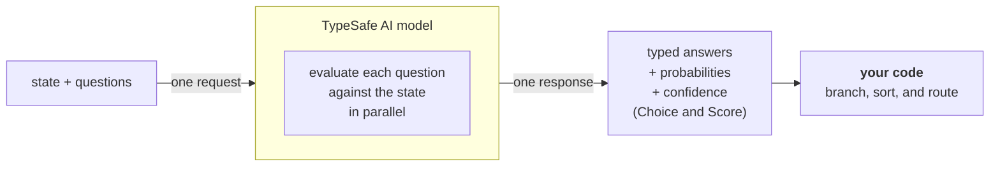

# 简介

> Jev 是 TypeSafe 的旗舰模型，也是首个 System One 模型。发送状态和类型化问题，获得你的代码可直接使用的结构化答案。

大语言模型（LLM）的设计目的是生成供人类阅读的文本。当你需要模型做出一个供代码消费的判断时，就产生了错位：你在强迫一个文本生成系统输出结构化决策，然后再把结果解析回代码可以依赖的形式。

Jev 是 TypeSafe 的旗舰模型，也是首个 [System One 模型](/concepts/system-one)。System One 模型专为做出软件可直接使用的快速结构化决策而构建。Jev 针对*状态*评估类型化*问题*，并直接返回结构化结果。没有文本生成，也无需解析。你得到的是类型化的值和概率分布，代码可以据此进行分支、排序和路由。Choice 和 Score 还会返回[置信度](/confidence)，你的代码可以用它来决定是否行动以及如何行动。

## TypeSafe 原语

TypeSafe 提供三种 *AI 原语*。与软件原语类似，我们的 AI 原语模块化、可组合、结构化、可靠且快速。每种原语询问不同类型的*问题*，并返回不同类型的答案。

| 问题类型                     | 目标                         | 返回                                    |
| ---------------------------- | ---------------------------- | --------------------------------------- |
| [Choice](/primitives/choice) | 从列表中选择一个选项         | `choice`, `probabilities`, `confidence` |
| [Score](/primitives/score)   | 按量规为状态打分             | `score`, `probabilities`, `confidence`  |
| [Noul](/primitives/noul)     | 这句话是真的吗？             | `noul` (0–1)                            |

三种*问题*类型可以在一次 API 调用中混用。每个*问题*都在一次请求中针对同一个*状态*并行且相互独立地评估。增加问题几乎不会改变响应时间。每个问题都是独立评估的，因此增加更多问题不会造成上下文腐化（context-rot）。

## 原子问题，在代码中组合

当每个问题只询问一件具体、边界清晰的事情时，System One 模型工作得最好。把每个问题看作一次直觉判断：即一个学识渊博的人在给定恰当上下文时，几秒钟内就能做出的那种判断。

如果你想问的问题需要长时间推理，或同时衡量多个独立因素，就把它分解。将每个因素作为单独的问题来问，然后在代码中用逻辑组合结果。这样既能保证每次单独评估的可靠性，也让你完全掌控各维度的权重。

例如，不要问“给这个创业路演打分”，而是分别询问市场规模、技术可行性和差异化。用你自己的公式组合这些分数。当优先级变化时，只需修改代码中的一个系数，而无需重写提示词。

## 后续步骤

* [快速开始](/introduction/quickstart) —— 立即上手所需的一切。
* [AI 入门](/introduction/machine-learning-primer) —— 为什么 TypeSafe 训练模型做校准决策而非生成文本。
* [原语（问题）](/primitives) —— 如何定义问题、在 Choice、Score 和 Noul 之间做出选择，以及如何一次提出多个问题。
* [置信度](/confidence) —— TypeSafe 如何报告确定性，以及如何在架构层面使用它。
* [模式](/patterns) —— 使用 TypeSafe 构建系统的常见模式。
