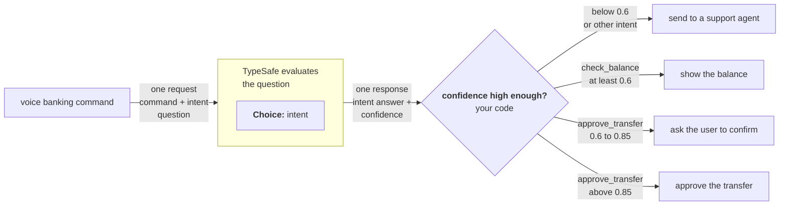

# 置信度门控路由

> 把置信度用作第二个维度。答案告诉你“是什么”；置信度告诉你“是否行动”。

export function TypesafeExample({example, display, title}) {
  const keyStrUriSafe = "ABCDEFGHIJKLMNOPQRSTUVWXYZabcdefghijklmnopqrstuvwxyz0123456789+-$";
  function compressToEncodedURIComponent(input) {
    if (input == null) return "";
    return _compress(input, 6, function (a) {
      return keyStrUriSafe.charAt(a);
    });
  }
  function _compress(uncompressed, bitsPerChar, getCharFromInt) {
    if (uncompressed == null) return "";
    var i, value, context_dictionary = {}, context_dictionaryToCreate = {}, context_c = "", context_wc = "", context_w = "", context_enlargeIn = 2, context_dictSize = 3, context_numBits = 2, context_data = [], context_data_val = 0, context_data_position = 0, ii;
    for (ii = 0; ii < uncompressed.length; ii += 1) {
      context_c = uncompressed.charAt(ii);
      if (!Object.prototype.hasOwnProperty.call(context_dictionary, context_c)) {
        context_dictionary[context_c] = context_dictSize++;
        context_dictionaryToCreate[context_c] = true;
      }
      context_wc = context_w + context_c;
      if (Object.prototype.hasOwnProperty.call(context_dictionary, context_wc)) {
        context_w = context_wc;
      } else {
        if (Object.prototype.hasOwnProperty.call(context_dictionaryToCreate, context_w)) {
          if (context_w.charCodeAt(0) < 256) {
            for (i = 0; i < context_numBits; i++) {
              context_data_val = context_data_val << 1;
              if (context_data_position == bitsPerChar - 1) {
                context_data_position = 0;
                context_data.push(getCharFromInt(context_data_val));
                context_data_val = 0;
              } else {
                context_data_position++;
              }
            }
            value = context_w.charCodeAt(0);
            for (i = 0; i < 8; i++) {
              context_data_val = context_data_val << 1 | value & 1;
              if (context_data_position == bitsPerChar - 1) {
                context_data_position = 0;
                context_data.push(getCharFromInt(context_data_val));
                context_data_val = 0;
              } else {
                context_data_position++;
              }
              value = value >> 1;
            }
          } else {
            value = 1;
            for (i = 0; i < context_numBits; i++) {
              context_data_val = context_data_val << 1 | value;
              if (context_data_position == bitsPerChar - 1) {
                context_data_position = 0;
                context_data.push(getCharFromInt(context_data_val));
                context_data_val = 0;
              } else {
                context_data_position++;
              }
              value = 0;
            }
            value = context_w.charCodeAt(0);
            for (i = 0; i < 16; i++) {
              context_data_val = context_data_val << 1 | value & 1;
              if (context_data_position == bitsPerChar - 1) {
                context_data_position = 0;
                context_data.push(getCharFromInt(context_data_val));
                context_data_val = 0;
              } else {
                context_data_position++;
              }
              value = value >> 1;
            }
          }
          context_enlargeIn--;
          if (context_enlargeIn == 0) {
            context_enlargeIn = Math.pow(2, context_numBits);
            context_numBits++;
          }
          delete context_dictionaryToCreate[context_w];
        } else {
          value = context_dictionary[context_w];
          for (i = 0; i < context_numBits; i++) {
            context_data_val = context_data_val << 1 | value & 1;
            if (context_data_position == bitsPerChar - 1) {
              context_data_position = 0;
              context_data.push(getCharFromInt(context_data_val));
              context_data_val = 0;
            } else {
              context_data_position++;
            }
            value = value >> 1;
          }
        }
        context_enlargeIn--;
        if (context_enlargeIn == 0) {
          context_enlargeIn = Math.pow(2, context_numBits);
          context_numBits++;
        }
        context_dictionary[context_wc] = context_dictSize++;
        context_w = String(context_c);
      }
    }
    if (context_w !== "") {
      if (Object.prototype.hasOwnProperty.call(context_dictionaryToCreate, context_w)) {
        if (context_w.charCodeAt(0) < 256) {
          for (i = 0; i < context_numBits; i++) {
            context_data_val = context_data_val << 1;
            if (context_data_position == bitsPerChar - 1) {
              context_data_position = 0;
              context_data.push(getCharFromInt(context_data_val));
              context_data_val = 0;
            } else {
              context_data_position++;
            }
          }
          value = context_w.charCodeAt(0);
          for (i = 0; i < 8; i++) {
            context_data_val = context_data_val << 1 | value & 1;
            if (context_data_position == bitsPerChar - 1) {
              context_data_position = 0;
              context_data.push(getCharFromInt(context_data_val));
              context_data_val = 0;
            } else {
              context_data_position++;
            }
            value = value >> 1;
          }
        } else {
          value = 1;
          for (i = 0; i < context_numBits; i++) {
            context_data_val = context_data_val << 1 | value;
            if (context_data_position == bitsPerChar - 1) {
              context_data_position = 0;
              context_data.push(getCharFromInt(context_data_val));
              context_data_val = 0;
            } else {
              context_data_position++;
            }
            value = 0;
          }
          value = context_w.charCodeAt(0);
          for (i = 0; i < 16; i++) {
            context_data_val = context_data_val << 1 | value & 1;
            if (context_data_position == bitsPerChar - 1) {
              context_data_position = 0;
              context_data.push(getCharFromInt(context_data_val));
              context_data_val = 0;
            } else {
              context_data_position++;
            }
            value = value >> 1;
          }
        }
        context_enlargeIn--;
        if (context_enlargeIn == 0) {
          context_enlargeIn = Math.pow(2, context_numBits);
          context_numBits++;
        }
        delete context_dictionaryToCreate[context_w];
      } else {
        value = context_dictionary[context_w];
        for (i = 0; i < context_numBits; i++) {
          context_data_val = context_data_val << 1 | value & 1;
          if (context_data_position == bitsPerChar - 1) {
            context_data_position = 0;
            context_data.push(getCharFromInt(context_data_val));
            context_data_val = 0;
          } else {
            context_data_position++;
          }
          value = value >> 1;
        }
      }
      context_enlargeIn--;
      if (context_enlargeIn == 0) {
        context_enlargeIn = Math.pow(2, context_numBits);
        context_numBits++;
      }
    }
    value = 2;
    for (i = 0; i < context_numBits; i++) {
      context_data_val = context_data_val << 1 | value & 1;
      if (context_data_position == bitsPerChar - 1) {
        context_data_position = 0;
        context_data.push(getCharFromInt(context_data_val));
        context_data_val = 0;
      } else {
        context_data_position++;
      }
      value = value >> 1;
    }
    while (true) {
      context_data_val = context_data_val << 1;
      if (context_data_position == bitsPerChar - 1) {
        context_data.push(getCharFromInt(context_data_val));
        break;
      } else context_data_position++;
    }
    return context_data.join("");
  }
  function buildHref(ex) {
    const documentText = ex.state === undefined ? "" : typeof ex.state === "string" ? ex.state : JSON.stringify(ex.state, null, 2);
    return "https://console.typesafe.ai/decode#share/" + compressToEncodedURIComponent(JSON.stringify({
      apiVersion: "v1",
      documentText,
      promptsText: JSON.stringify(ex.questions, null, 2),
      selectedModels: ex.selectedModels
    }));
  }
  const displayedExample = display === "questions" ? example.questions : example.state === undefined ? {
    questions: example.questions
  } : {
    state: example.state,
    questions: example.questions
  };
  const code = JSON.stringify(displayedExample, null, 2);
  const href = buildHref(example);
  return <div style={{
    margin: "1.25rem 0"
  }}>
      <CodeBlock language="json" filename={title ?? "request"}>
        {code}
      </CodeBlock>
      <div className="pb-8">
        <a href={href} target="_blank" rel="noreferrer" className="text-primary">
          Try it in the Playground →
        </a>
      </div>
    </div>;
}

TypeSafe 最强大的特性之一是[置信度](/confidence)。通过有意识地设计基于置信度的决策门控方式，你可以构建既可靠又安全的系统。

## 示例：语音银行指令

设想你正在构建一个语音银行界面，让用户能够以语音方式与自己的账户交互。虽然你总是希望解读用户意图时具有足够的置信度，但有些操作比其他操作风险更高，因而需要更高的置信度阈值。



### 第 1 步：确定用户的意图

<TypesafeExample
  title="questions"
  display="questions"
  example={{
questions: {
  intent: {
    type: 'choice',
    instructions: 'What action is the user requesting?',
    criteria: {
      check_balance: 'Check the balance of an account',
      approve_transfer: 'Approve the pending transfer request',
      other: 'Something else',
    },
  },
},
}}
/>

### 第 2 步：置信度门控路由

```python theme={null}
action = response.answers["intent"]

# Below 0.6 confidence on any action, route to a human
if action.confidence < 0.6:
    route_to_support_agent(account_id)

elif action.choice == "check_balance":
    # Low stakes. 0.6 confidence is sufficient.
    show_balance(account_id)

elif action.choice == "approve_transfer":
    if action.confidence > 0.85:
        # High stakes, but high confidence. Safe to act automatically.
        approve_transfer(account_id)
    else:
        # High stakes, moderate confidence. Verify intent first.
        ask_user_to_confirm("Just to confirm: you would like to approve this transfer, is that correct?")

else:
    route_to_support_agent(account_id)
```

0.6 的下限会捕捉模型真正不确定的一切情况。在这个下限之上，每种操作类型都有各自的阈值，其依据是：如果分类错误就执行操作，后果有多严重。以 0.6 的置信度查询余额没有问题，因为最坏的情况不过是用户需要再听一遍余额播报。但批准转账需要非常高的置信度（>0.85），否则系统应当请用户确认。

关于如何在自己的系统中思考置信度的更多细节，参见[置信度](/confidence)。
