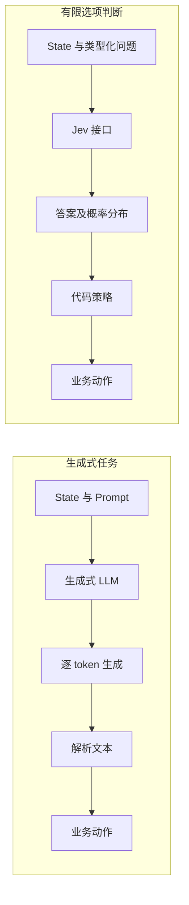

# 第一章 · 认识 Jev

> 本章回答一个问题：当答案本来就在有限选项里时，是否有必要让模型先生成一段文字，再把文字解析回标签？

## 为什么学判断模型

以「这条工单是否需要人工处理」为例。生成式 LLM 通常逐 token 生成文本；现代实现可以用 KV cache 重用先前计算，但仍要按自回归步骤生成后续 token。[KV cache 文档](https://huggingface.co/docs/transformers/v4.53.0/kv_cache)解释了缓存复用如何减少重复计算，也指出每个新 token 仍依赖前序 token。要求模型只输出 JSON 可以减少解析问题，却不会把任务变成直接返回概率分布。

Jev 的公开接口把分析内容作为 state，把答案范围写成类型化问题，并返回选项与概率。应用代码据此执行阈值、权限、路由和动作规则。这里讲的是接口提供的能力，不对未公开的服务端计算方式作假设。

流程可以概括为：允许使用的证据 → 明确问题与选项 → 类型化答案及概率 → 确定性策略 → 业务动作。



### 一条工单经过两种路径

```text
工单：「充电器冒烟，刚买两天」

生成式路径
  工单 + prompt → “这可能涉及安全问题，请转人工……”
  → 解析文本 / 校验 JSON → 代码决定后续动作

有限选项路径
  工单 + Choice{安全问题, 退款, 普通咨询}
  → 概率分布{安全问题: 0.93, 退款: 0.05, 普通咨询: 0.02}
  → 代码检查策略 → 转人工处理
```

这组概率只是结构示意，不是 API 实测。例子要表达的是：模型回答“属于哪类”和应用决定“接下来做什么”是两个步骤；涉及安全的动作仍要走既定人工流程。

读图时要留意两条路径真正的分界：右侧把“答案表示”和“业务策略”拆成两个环节。类型化输出能让程序更容易检查答案范围，但是否准确、概率是否可信，仍要通过目标数据评测；代码策略也不能因为收到高概率就省略授权与安全校验。

Jev 适合有限答案空间中的判断、路由、打分和筛选；长篇生成、开放式问答、创作仍应交给生成模型。它与普通分类器、NLI 和 reranker 的区别也不是简单的「谁更聪明」：

| 方法 | 常见输出 | 更适合的任务 | 需要注意 |
|---|---|---|---|
| 生成式 LLM | 自由文本，也可受格式约束 | 解释、写作、开放式推理 | 生成结果仍需校验；JSON 约束不等于概率校准 |
| 固定标签分类器 | 训练标签上的类别或分数 | 标签集合长期固定、可积累标注数据 | 新标签通常需要重训或额外设计 |
| NLI / reranker | 蕴含关系或相关性分数 | 文本蕴含、候选排序 | 分数语义由模型与训练任务决定 |
| Jev 类类型化决策接口 | 请求中定义的类型化答案与分布 | 同一任务需要明确问题、选项和可读概率 | 分布质量和延迟仍须在目标数据上测量 |

## 本章实验地图

| 实验 | 要回答的问题 | 看什么 | 结果能说明什么 |
|---|---|---|---|
| 同一工单的 Noul、Choice、Score | 同一份 state 能否承载不同类型的问题？ | 返回结构、选项概率、代码如何读值 | 展示接口组合方式；不证明多问没有额外成本 |
| 20 条校准示例 | 概率和单条预测正确性是否相同？ | 预测概率组与实际频率 | 人工小样本只帮助理解概念，不足以评估模型校准 |
| 赛事指挥台 | 如何把类型化判断接到业务动作？ | 医疗升级、补给路由、FAQ 分支 | 展示策略代码；不表示 API 能保证安全处置 |

**扩展练习：测量问题数的影响。** 在同一数据、问题集合和 API 版本下比较 1、3、5、10 个问题；每种设置多次重复，记录 p50/p95 延迟、输入 token、费用、错误率和问题间结果变化。不要预设「多问不增加延迟」，要从测量中得出结论。

## 阅读与运行

第一次阅读建议依次看 Notebook 的「Jev 是什么」「三分钟上手」「场景地图」「概率为什么可信」和「赛事指挥台」。有真实 API key 时按 Notebook 的实时模式运行；离线示例只演示数据结构，不是服务返回。

官方 Introduction、Quickstart 和 Use Case Map 的中文对应内容见[翻译站](https://datawhalechina.github.io/jev-cookbook/)。本地实验来源与限制见[第十一章知识库](../11_知识库/README.md)。

## 学完后

你应能判断一个任务是否有清晰的有限答案空间，写出一份不泄漏答案的 state，并把模型输出交给代码策略处理。下一章会拆解 state、原语、概率和置信度；[入门 Notebook](01_认识Jev.ipynb)是本章实践入口。
