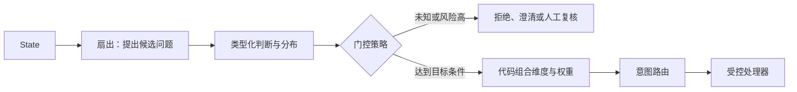

# 第三章 · 架构模式

> 原语定义“问什么”，架构模式定义“判断结果怎样进入程序”。本章围绕一个边界展开：模型提供语义信号，代码负责权限、规则、顺序和副作用。

## 四种模式与取舍

| 模式 | 目标 | 常见代价或失败方式 |
|---|---|---|
| 推测性扇出 | 同一份 state 一次提出多个可能需要的问题，减少后续往返 | 多算暂时用不到的问题；请求更大，不保证延迟不变 |
| 置信度门控 | 高风险或不确定样本转人工、重试或升级模型 | 覆盖率下降；置信度不能替代风险标签或真实验证 |
| 复合评分 | 保留多个维度，让业务代码按岗位或目标组合 | 权重表达业务取舍；尺度不一致时加权没有清晰含义 |
| 意图路由 | 将输入送往匹配的处理器，避免无关路径 | 路由器本身会错；需要未知类、fallback 和监控 |

### 选择最大概率，不总是最优动作

如果不同错误的业务代价不同，直接选择最大概率类别可能并非最合适策略。给定预测分布 `p(y | x)` 与损失函数 `L(a, y)`，决策理论中的 Bayes 动作是最小化后验期望损失的动作；可参阅 [CMU Bayesian decision theory 讲义](https://www.cs.cmu.edu/~hchai2/courses/10624/lectures/Lecture3.pdf)：

$$
a^*=\arg\min_a\sum_y p(y\mid x)L(a,y).
$$

**玩具例子（损失单位任意，只用于演算）**：模型判断“有紧急问题”的概率为 0.20。自动关闭的损失在问题确实紧急时是 100、否则是 0；转人工审核无论如何都记作 4。于是自动关闭的期望损失为 `0.20 × 100 + 0.80 × 0 = 20`，转人工为 `4`。尽管“非紧急”是最大概率类别，最小期望损失策略仍是转人工。

当动作就是预测类别且采用 0–1 损失时，这个规则会退化为最大概率类别。实际设计还要把拒绝、澄清、人工审核作为可选动作，并用验证数据和真实业务成本确定阈值。

## 置信度门控：风险与覆盖率

拒绝选项（selective prediction）允许系统只对一部分样本自动作答。**Coverage** 表示自动接收的比例，**risk** 表示这些已接收样本中的错误率。降低阈值通常会增加覆盖率，也可能增加风险；提高阈值通常相反。阈值应按标注数据与业务损失选择，而不是把 0.7 当成通用常数。

[SelectiveNet (ICML 2019)](https://proceedings.mlr.press/v97/geifman19a.html) 将 reject option 与 risk–coverage trade-off 作为研究问题。教程里的门控是应用策略示例，不是 SelectiveNet，也不自动提供风险保证。

## 按实验读本章

[架构模式 Notebook](01_架构模式.ipynb)依次做四个练习：

1. **推测性扇出**：同一工单打包五个问题，再与逐条调用对照。记录总往返、问题数、输入量、延迟和未使用答案；据此权衡批量与开销。
2. **置信度门控**：对四条语音指令应用门槛。门槛是演示政策；生产阈值要在独立标注数据上按误判成本选择。
3. **复合评分**：给同一组简历算多个维度，再用不同岗位权重排序。核实分数尺度、权重由谁决定，以及排名变化是否符合业务意图。
4. **意图路由**：把五类消息分派给处理器。另加未知意图、低置信和处理器失败路径，避免把“未识别”硬塞进最接近的已知类。

在智能家居中，用户的自然语言先产生候选判断；代码检查允许操作、目标设备和动作顺序，再执行状态变更。多问题请求可以减少往返，但是否更快或更便宜取决于输入长度、服务端实现、网络和调用方式，应实测。

## 设计检查

- 固定规则、授权、金额限制和安全联锁放在代码中，不靠模型记忆。
- 遇到无证据、低置信或超出选项范围的结果，要有拒绝或人工升级路径。
- 多维分数先定义单位、尺度和权重来源；权重是业务政策，不是模型事实。
- 对自动动作记录输入版本、判断结果、使用的规则和动作结果，便于复盘。

下一步可按场景挑选[第四章的 Cookbook](../04_实战指南/README.md)，或直接看[第五章的 3D 智能家居演示](../05_智能家居实验/README.md)。
