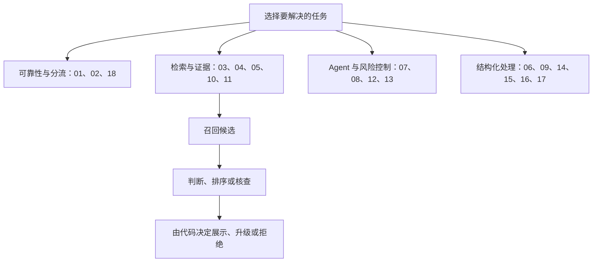

# 第四章 · 实战指南（18 篇 Cookbook）

> 每篇 Notebook 都演示一个可组合的“state → 类型化判断 → 代码处理”配方。它们是理解接口与快速试验的起点；小样本演示不能直接当成生产效果证明。

## 按任务选择学习路线

| 路线 | 篇目 | 你会看到什么 |
|---|---|---|
| 判断稳定性与分流 | 01 自一致性 Noul · 02 自一致性 Choice · 18 基于置信度的分类 | 重复运行、保留完整分布、把不确定样本交给后续策略 |
| 检索与证据 | 03 并行提问 · 04 重排序 · 05 逐行语义搜索 · 10 RAG 段落分类 · 11 引用核查 | 候选召回、相关性排序、段落筛选与来源核对 |
| Agent 与风险控制 | 07 函数调用 · 08 技能推荐 · 12 LLM 防护栏 · 13 SDE 级联 | 由语义判断辅助路由、候选验证和升级 |
| 结构化处理 | 06 结构恢复 · 09 实体对齐 · 14 日期抽取 · 15 预解析值抽取 · 16 层级分类 · 17 自动研究特征发现 | 在已有候选、字段或片段上作有限选择，再由代码拼装结构 |



## 先放进完整的 RAG 流水线

一个典型路径是：检索器从语料召回候选 → reranker 重排候选 → 生成模型依据保留的片段回答 → 引用核查器检查证据指向。Jev 可以辅助相关性判断或段落分类；它不会替代向量检索，也不负责生成最终答案。

评测各层要使用对应指标：Recall@K 衡量前 K 个候选是否覆盖相关项，MRR 关注首个相关项的位置，nDCG@K 允许相关度分级并衡量前 K 排序质量。查询、候选集和相关性标注都要固定，才可比较。定义与背景见 [Stanford《Introduction to Information Retrieval》](https://nlp.stanford.edu/IR-book/)。

读 RAG 实验时要把三个问题分开：**正确证据有没有被召回？** **召回后有没有排在合适位置？** **最终答案有没有被证据支持？** reranker 只能重排已召回的候选，无法找回根本没进入候选集的文档；引用核查也不等于证明答案完整或事实无误。因此，检索、排序、回答和归因要分别设指标，再观察整体链路。

**一条具体查询的文字走查（虚构示例）**：

```text
用户问题：订单取消了，退款一般多久到账？
Retriever top-20：退款政策、订单取消记录、支付方式 FAQ、若干相似问答……
Jev / reranker：判断哪些片段与“取消后的退款时效”直接相关，并排序
生成器：只用排在前面的政策与订单证据组织答案
引用核查：逐条检查“退款时限”“该订单已取消”是否分别被来源支持
```

如果退款政策没有进入 Retriever 的 top-20，后续 reranker 和引用核查都无法补回这条证据；如果回答写出了政策片段没有覆盖的时限，引用核查应标记为缺少支持，而不是用相似度分数替它背书。

## 18 篇实验地图

| 编号 | 配方 | 操作时重点观察 |
|---:|---|---|
| 01 | 自一致性 Noul | 重复调用的概率波动；增加调用是否值得成本 |
| 02 | 自一致性 Choice | 保留每类概率，不只投票多数类别 |
| 03 | 并行提问 | 一次请求与逐条调用的往返数、输入长度和延迟 |
| 04 | 重排序 | 对已召回的候选打分；阈值与排序用途分开 |
| 05 | 逐行语义搜索 | 先定位相关行，再判断有无答案、选取证据 |
| 06 | 结构恢复 | 判断相邻片段关系，由确定性代码重新拼接 |
| 07 | 函数调用 | 在允许的函数目录中选择；代码验证参数并执行 |
| 08 | 技能推荐 | 先召回候选，再从候选中选主技能 |
| 09 | 实体对齐 | 先限制候选对，再处理逐对语义判断的组合开销 |
| 10 | RAG 段落分类 | 过滤候选段落；Notebook 只打印提示词，不调用生成模型 |
| 11 | 引用核查 | 先用字符串检查抓明显不存在的引用，再判断语义支持 |
| 12 | LLM 防护栏 | 把判定映射到策略；字符串规则可处理的输入先走确定性规则 |
| 13 | SDE 级联 | 逐字段验证已有提取结果，再按代码策略升级或接受 |
| 14 | 日期抽取 | 候选值识别与日历解析分开，低置信结果进入审核 |
| 15 | 预解析值抽取 | 先用规则抽取候选，再判断角色或值的含义 |
| 16 | 层级分类 | 比较贪心下行与小束宽搜索的路径差异 |
| 17 | 自动研究特征发现 | 先把文本转换为候选特征；本 Notebook 不执行自动研究循环 |
| 18 | 基于置信度的分类 | 依据阈值或层级决定自动分类、回退或人工复核 |

## 怎样解释结果

- **重复调用**只能描述当前端点、问题与运行条件下的波动，不能证明所有输入都稳定。可在同一条件重复并报告样本数、分布与错误率。
- **自一致性**多次采样或提问会增加成本。应在独立验证集上确认它是否真的改善正确率或风险，再考虑只对临界样本使用。
- **筛选、排序、生成**是不同阶段。排序指标的改善不自动意味着最终回答更准确；还要检查候选召回、上下文预算和回答证据。
- **安全配方**只是策略骨架。越权、金融、医疗或会造成不可逆结果的动作仍需代码权限检查、人工审核和审计记录。

知识补充中的社区数字来自特定来源和样本。例如收录的 SciFact 重排序报告使用 80 条样本，记录 nDCG@10 相对变化 +0.0778；该报告未做显著性检验。这只是该数据和基线下的报告值，不表示普遍优于其他 reranker。来源快照见[第十一章 SOURCES](../11_知识库/jev-cookbook/SOURCES.md)。

## 运行方式

从本目录的章节 Notebook 中选一篇，先看其运行要求。离线替身只验证程序如何消费返回结构；需要比较速度、成本或准确率时，固定数据、端点与问题版本，并单独标明离线还是实时 API。

如果你正在搭建 RAG，推荐顺序为 03 → 04 → 05 → 10 → 11；如果是 Agent，读 07 → 08 → 12 → 13；如果是结构化数据，读 06 → 09 → 14 → 15 → 16 → 17。
