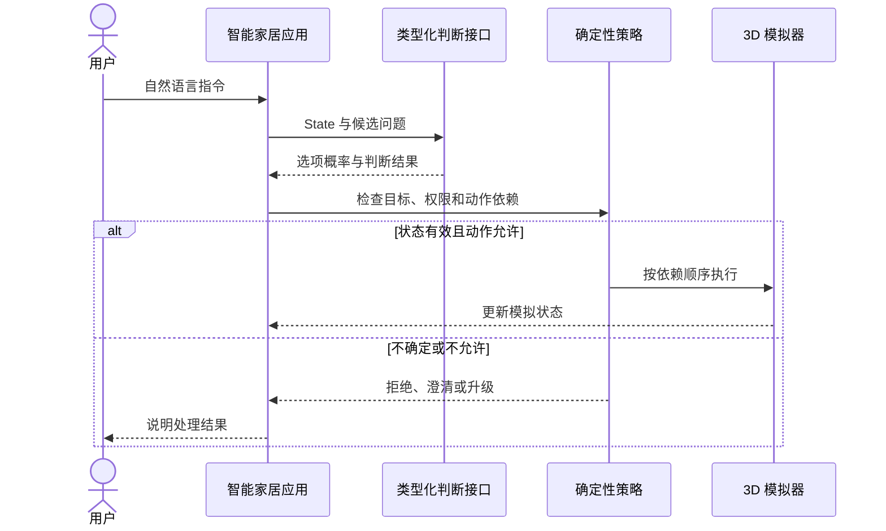

# 第五章 · 智能家居实验

> 用同一套房间状态练习四件事：理解用户意图、检查动作依赖、由代码控制副作用、观察完整调用链。这里的 3D 房间是模拟器，不是实际家居设备控制器。

## 系统怎样工作

用户语句 → state 与候选问题 → Jev 返回类型化判断 → 应用代码检查权限和依赖 → 3D 模拟器更新状态 → 追踪面板记录结果。

Jev 负责语义判断，例如用户想开哪盏灯、指令是否包含多个动作；代码负责设备白名单、动作映射、顺序、失败处理和状态写入。模型回答“很可能是开灯”不等于程序已经授权开灯。



### 复合指令的执行清单

```text
用户：「关厨房灯，然后锁书房门」
动作 A：关闭 kitchen.light       ─┐
                                  ├─ A 成功后再执行 B
动作 B：锁定 study.door          ─┘

执行前：检查用户有权控制这两台设备，并读取当前设备版本
执行中：按依赖顺序运行；失败时记录已完成动作，不盲目重放整条指令
重试时：沿用同一 action_id，设备端 / 应用端防止重复副作用
执行后：读取新状态并写入追踪记录
```

这里的“然后”表示顺序约束；若两项操作互不依赖，应用才可并行执行。以上是阅读 Notebook 时可对照的控制清单，不表示示例模拟器实现了真实设备授权或 exactly-once 语义。

## Notebook 与演示覆盖什么

| 环节 | 场景 | 建议观察 |
|---|---|---|
| 推测性扇出 | “把咖啡烧上” | 一次请求打包多个潜在判断，应用只读取实际分支所需答案；记录问题数、输入量和往返 |
| 复合指令 | “关厨房灯，然后锁书房门” | 判断是否有依赖；有先后关系时由代码串行执行，无依赖时才考虑并行 |
| 同设备连续动作 | “先开客厅灯再关掉” | 检查状态读写是否保留指令顺序，避免并行竞争产生随机终态 |
| 状态查询 | “客厅灯开着吗” | 将语义解析与本地模拟状态读取分开 |
| 生成式模型对照 | 同一任务经不同处理链路 | 控制模型、提示词、网络、预热和输出长度；比较端到端延迟与费用，不把单次结果当普遍倍数 |
| 语音输入 | 麦克风流式识别 | 区分 ASR 首字延迟、识别完成时间、Jev 判断和动作执行时间 |

Notebook 展示一次投机调用；浏览器应用支持实时追踪。具体概率、耗时和费用会随模型版本、网络及配置变化，查看时请同时记录运行日期和所用端点。文字交互可以只运行 Notebook；语音与 3D 体验需要启动本地演示，并按其说明配置额外服务。

## 理论补充：依赖图、竞态与幂等

把多条动作看成有向图：若 B 必须等 A 完成，写入边 A → B；互不依赖的动作才可并行。它定义的是动作之间的**部分顺序**，不必把所有操作一律串行。模型可以提供“可能相关”的信号，但应用要用明确策略把它转换成执行顺序。阈值和动作关系属于本地策略，应由代表性指令集验证。

并发工作流要特别留意：

- **竞态**：两个动作同时读取旧状态并写入冲突结果。
- **幂等**：重试同一动作时避免重复开锁、重复扣款或重复创建任务。[RFC 9110 §9.2.2](https://www.rfc-editor.org/rfc/rfc9110.html#section-9.2.2)用“多次相同请求的预期效果等同于一次请求”定义 HTTP 方法幂等性；业务动作也应设计可安全重试的语义，但日志等附带副作用仍可能重复。
- **过期状态**：判断和执行之间设备状态可能已变化；执行前重新读取关键状态，或通过版本号条件更新，避免基于旧 state 执行。
- **失败恢复**：记录已完成步骤，并定义补偿、回滚或人工介入方式。

现实系统还应在动作前检查用户权限、设备允许的动作和安全联锁。语义判断不能绕过这些确定性检查。

## 运行与下一步

配套服务与 3D 页面在 [smart_home_demo](smart_home_demo/)。运行方法、环境变量和演示边界以该目录和 Notebook 内说明为准。先读[第三章架构模式](../03_架构模式/README.md)，再运行[智能家居 Notebook](01_智能家居实验.ipynb)；想看更完整的端到端应用，可接着读[第七章](../07_实战应用/README.md)。
