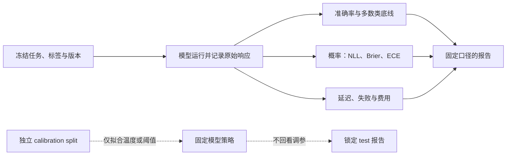
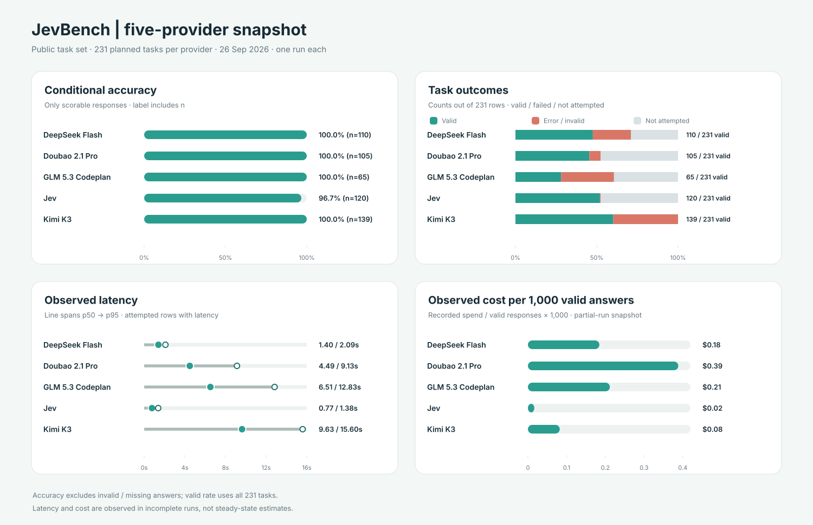
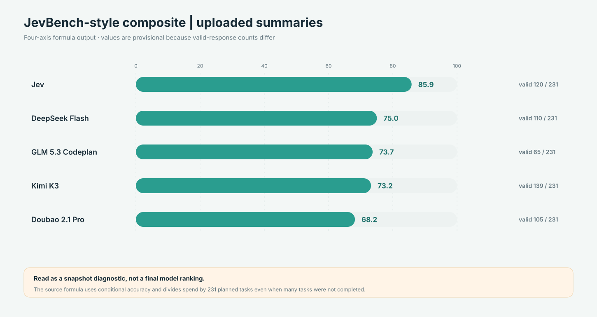
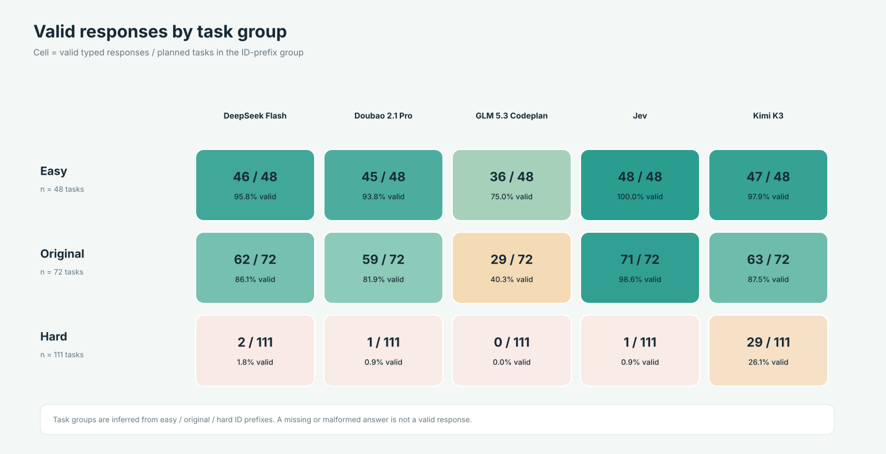
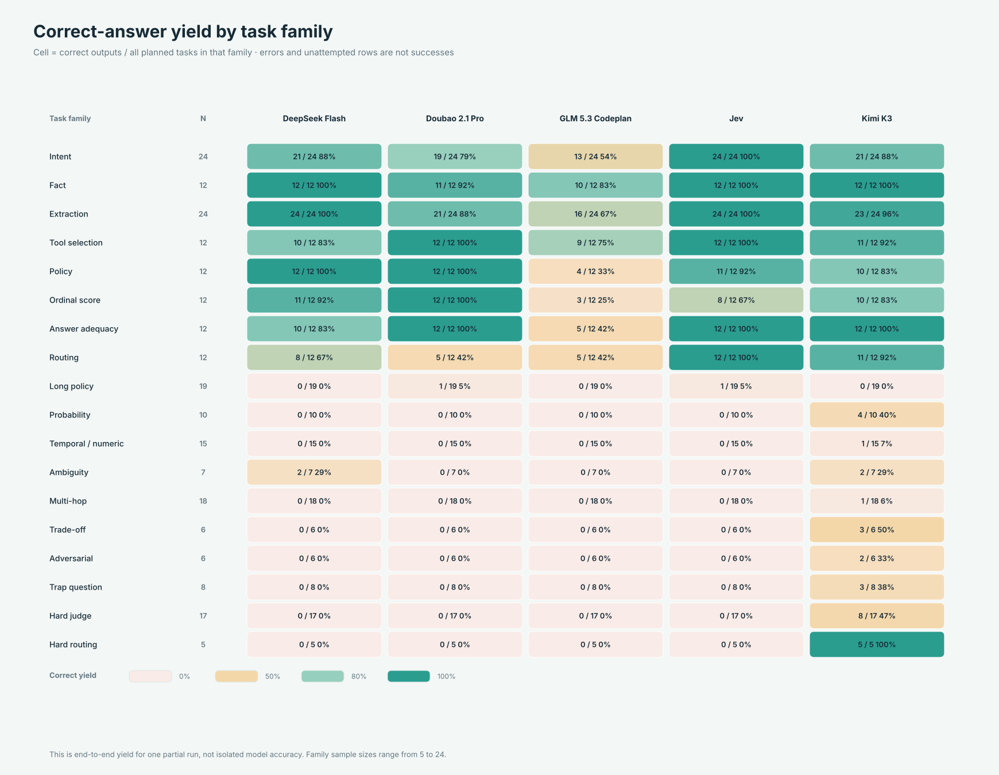
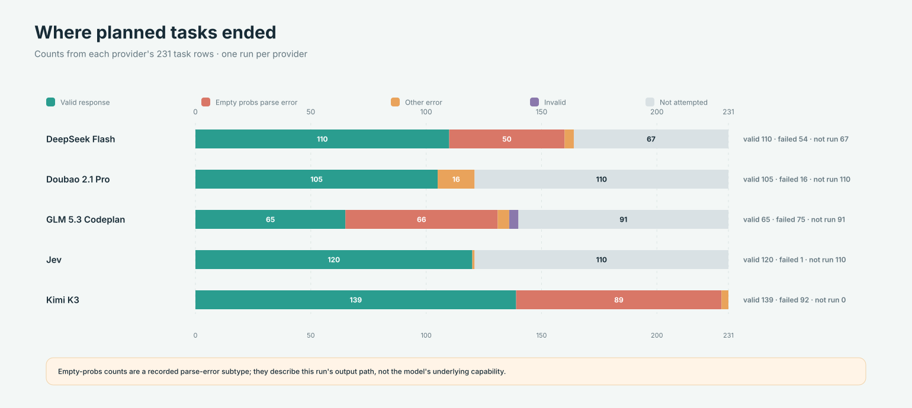

# 第六章 · 模型评测

> 评测的目的不是宣布一个模型“最好”，而是用固定任务回答：它会不会答对、概率是否有用、拒答后风险如何变化、运行要花多少时间和费用？

## 本章有哪些材料

| 内容 | 用途 |
|---|---|
| [模型评测 Notebook](01_模型评测.ipynb) | 用本地公开任务比较 Laya 与 Jev，并观察多数类底线、准确率、Brier 和 ECE |
| [benchmark 工具](benchmark/) | 单次运行账本、适配器、题集转换、预算和演示结果 |
| [通用评测框架](llm_eval/) | 面向多个供应商和本地端点的扩展评测框架 |

当前练习题文件包含 231 条公开任务：48 easy、72 original、111 hard。它与知识库中 JevBench v1.2.3 的完整冻结运行不是同一份样本规模：后者的上游记录说明每个系统有 534 道决策，包含未公开的 held-out 数据。比较时不要把 Notebook 的公开子集得分说成完整榜单得分。

如果需要外部参照，使用本仓库收录的 JevBench **v1.2.3 快照**（来源 commit a83840b，2026-09-21；见[来源清单](../11_知识库/jev-cookbook/SOURCES.md)）。排名、价格和延迟取决于版本、费率、机器与调整方法；本章不把历史榜单写成当前性能保证。



## 示例：预测正确率与概率校准回答不同问题

准确率把预测压成类别后计数，回答“选中的类别对了多少”；校准则保留概率，把相近置信度的样本聚在一起，检查预测概率与实际频率是否一致。因此，一个模型可能准确率较高但概率过度自信，也可能平均校准较好却仍有不少类别判断错误。样本量不足时要报告不确定区间，避免把少量样本的分桶波动误认成稳定偏差。

下面用 200 个预测展示为什么要分箱检查概率（教学用假设数字）：

| 预测置信度区间 | 样本数 | 正确数 | 准确率 / 经验频率 | 组内现象 |
|---|---:|---:|---:|---|
| 约 0.80 | 100 | 80 | 0.80 | 这组的置信度和命中比例一致 |
| 约 0.95 | 100 | 76 | 0.76 | 这组明显过度自信 |

两组总体准确率是 78%；如果只报准确率，看不出高置信组的概率质量出了问题。这种示意表也提醒我们：校准结论取决于分箱和样本数，正式报告应给出分箱规则与不确定性。

## 评测指标各自回答什么

| 指标 | 回答的问题 | 解读时的限制 |
|---|---|---|
| 准确率 / 加权准确率 | 最终类别答对多少？ | 必须与多数类底线、类别分布和置信区间一起看 |
| NLL | 真实类别分到了多少概率？ | 错误且过度自信的预测会受到较大惩罚 |
| Brier | 整个预测分布与结果相差多大？ | 是整体概率评分，不能单独解释成“校准度” |
| Reliability diagram / ECE | 预测置信度与经验正确率是否接近？ | ECE 依赖分桶和样本量；要注明实现与分箱 |
| Risk–coverage | 自动接收的样本比例与其错误风险怎样变化？ | 拒答阈值要按业务损失选择 |
| 延迟与费用 | 真实部署链路要多久、花多少？ | 报告 p50/p95、设备、网络、并发、计费口径和数据日期 |

NLL、Brier 和 ECE 不能互相替代。二分类 Brier 的经典分解包含 reliability、resolution 与不确定性；它不是纯校准指标。[Murphy (1973)](https://doi.org/10.1175/1520-0450(1973)012%3C0595%3AANVPOT%3E2.0.CO%3B2)。温度缩放可作为校准集上的后处理练习；在 test 上挑温度会泄漏测试信息。参见 [Guo 等 (2017)](https://proceedings.mlr.press/v70/guo17a.html)。

## 可复现评测的步骤

1. 冻结任务集、答案选项、模型/SDK 版本和指标实现；保存文件哈希。
2. 固定随机种子、提示词、重试规则、预算及错误处理；服务错误不能悄悄回退为另一模型。
3. 同时报多数类基线、每类结果和整体结果；对小样本报告区间或重复运行。
4. 记录未解析输出与失败请求；若提供方仍计费，费用统计要包含这些请求。
5. 延迟分开报告首次启动、预热后和端到端链路，并给出 p50/p95。
6. 将模型选择与阈值选择分开；如做温度缩放或门控，在 calibration split 拟合，只在固定 test 上最终报告。

## 2026-09-26 五模型快照：先看有效回答，再看分数

本节按随附 ZIP 中各 provider 的 `summary.json` 与 `results.jsonl` 汇总；每个模型只有一次运行，图表展示该次记录的 231 个任务状态。图中模型名称沿用数据包里的 provider / model 别名，不代表完整的模型版本说明。仓库保存指标摘要、状态分布和题型 / 难度分组计数，不复制原始响应、prompt 或费用账本：[快照数据](figures/jevbench-2026-09-26/snapshot.json) · [ZIP 摘要脚本](benchmark/scripts/prepare_jevbench_snapshot.py) · [图表生成脚本](benchmark/scripts/render_jevbench_snapshot.py)。如需从原 ZIP 重建快照和 SVG，可在仓库根目录运行：

```bash
python3 main/06_模型评测/benchmark/scripts/prepare_jevbench_snapshot.py --zip "/path/to/jevbench_data_20260926_1543(1)_副本.zip"
python3 main/06_模型评测/benchmark/scripts/render_jevbench_snapshot.py
```



图中的口径不同，读数时要分开看：**条件准确率**只在成功解析且可评分的回答里计算；**有效回答率**以全部 231 道计划题为分母；`p50/p95` 只用实际产生延迟记录的请求；观测成本以本次已记账费用除以有效回答数，再乘 1,000 折算。右上角的 231 是计划题数，不能当成 231 道都已完成。

| 模型别名 | 有效回答 | 条件准确率 | 正确回答 / 231 | p50 / p95（秒） | 观测成本 / 1,000 个有效回答 |
|---|---:|---:|---:|---:|---:|
| DeepSeek Flash | 110 / 231（47.6%） | 100.0%（n=110） | 47.6% | 1.40 / 2.09 | $0.18 |
| Doubao 2.1 Pro | 105 / 231（45.5%） | 100.0%（n=105） | 45.5% | 4.49 / 9.13 | $0.39 |
| GLM 5.3 Codeplan | 65 / 231（28.1%） | 100.0%（n=65） | 28.1% | 6.51 / 12.83 | $0.21 |
| Jev | 120 / 231（51.9%） | 96.7%（n=120） | 50.2% | 0.77 / 1.38 | $0.02 |
| Kimi K3 | 139 / 231（60.2%） | 100.0%（n=139） | 60.2% | 9.63 / 15.60 | $0.08 |

这里同时给出“条件准确率”和“正确回答 / 全题数”，是因为评测框架的 `accuracy` 分母是 `n_scorable`，不会把未运行或未能解析的题计作错误；`n_scorable` 的计算见 [`aggregate()`](llm_eval/llm_eval/metrics.py#L151-L154)。因此，四个 provider 显示的 100% 是各自有效子集上的结果，不是完整 231 题的准确率。本次最高的全题正确产出率是 Kimi 的 139/231（60.2%）；Jev 是 116/231（50.2%）。它们仍受单次运行、错误输出和未完成任务影响，不能外推成模型能力排名。

### 综合分是本次快照诊断，不是最终榜单



数据包汇总分从高到低为 Jev 85.9、DeepSeek 75.0、GLM 73.7、Kimi 73.2、豆包 68.2。分数是文件中已有公式的原样输出；当前实现用条件准确率计算 Intelligence，并用全部计划题数 231 归一化费用，而不是有效回答数（见 [`jevbench_score()`](llm_eval/llm_eval/metrics.py#L307-L354)）。本次没有任何模型得到 231 个有效回答，所以有效样本、成本分母和时延样本并不一致。**Jev 的综合分最高只描述这批不完整运行的公式结果，不能据此判定其整体效果最佳。**

### 有效回答集中在题集前段

按 task ID 的 easy / original / hard 前缀统计有效回答数：



Jev 在 easy 和 original 组分别返回 48/48、71/72 个有效结果，DeepSeek 为 46/48、62/72；hard 组中，Jev 只有 1/111，DeepSeek 2/111。Kimi 的 hard 组有效回答数最高，为 29/111，但仍有 82 条错误结果。条件准确率因而主要反映已成功解析的题目，并没有覆盖相同难度、相同题量的模型输出。图中 hard 组的低值首先说明这次运行没有得到足够有效结果，不能单独解释成模型在 hard 题上的能力低。

### 按题型查看端到端正确产出

这份快照还包含 18 个 family 的逐题状态。下图把**正确输出数除以该题型的全部计划题数**；解析失败和未运行的题都不会算作正确产出。它展示本次评测链路最终产出在哪里中断，不是只对有效回答计算的模型准确率。



基础题型中，Jev 在 intent、fact、extraction、routing 上分别得到 24/24、12/12、24/24、12/12；Kimi 在 hard judge 得到 8/17、hard routing 得到 5/5，是本次 hard 题中有效产出较多的模型。多种题型的样本数只有 5–12 条，而且各模型错误位置不同；这些格子适合定位复跑重点，不足以形成稳定的题型能力结论。

### 运行异常解释了许多“缺失成绩”

逐题状态显示，运行完成度受到解析和预算停止条件明显影响。下面按 231 条计划任务拆开显示有效回答、空 `probs` 解析错误、其他错误、格式无效与未运行记录；它能区分“得到可评分回答”和“评测链路没有产出可评分回答”。



图里空 `probs` 是记录中的解析错误子类，说明这次结果处理链路没有拿到可解析概率；它本身不能说明错误究竟来自模型、服务响应还是适配器。逐 provider 的状态为：

- **DeepSeek Flash**：110 条有效，54 条 error，67 条未运行；54 个错误中有 50 条记录为空 `probs`。运行在连续错误停止条件触发后结束。
- **Doubao 2.1 Pro**：105 条有效、16 条 error、110 条未运行；未运行记录标记为 `settlement_exceeded_reservation`，表示账本结算超过预留费用后停止。
- **GLM 5.3 Codeplan**：65 条有效、71 条 error、4 条 invalid、91 条未运行；71 个错误中有 66 条为空 `probs`，随后触发连续错误停止条件。
- **Jev**：120 条有效、1 条 HTTP 520 error、110 条未运行；停止记录同样是 `settlement_exceeded_reservation`。
- **Kimi K3**：231 条都产生了运行记录，其中 139 条有效、92 条 error；89 个错误是空 `probs` 解析失败。

这意味着分数同时混入了输出格式 / 解析失败、费用预留停止和题目难度分布。下一轮应先修正或验证空输出解析与结算预留，再让各 provider 完成同一批计划题；之后再重复运行并比较准确率、ECE、Brier 和成本。当前汇总中的 ECE / Brier 也只覆盖有效概率输出：

| 模型别名 | Brier ↓ | ECE ↓ | 有效样本数 |
|---|---:|---:|---:|
| DeepSeek Flash | 0.00105 | 1.28% | 110 |
| Doubao 2.1 Pro | 0.00041 | 0.77% | 105 |
| GLM 5.3 Codeplan | 0.00058 | 0.85% | 65 |
| Jev | 0.05204 | 4.39% | 120 |
| Kimi K3 | 0.00713 | 3.07% | 139 |

ECE 低不等于已证明可靠校准；这里的样本来自选择后的有效回答，置信度还集中在高分箱，且没有重复实验或区间估计。应把它们作为复跑前的描述性指标，不用来给模型作校准能力定论。

### 这次快照能支持的结论

1. **先看产出覆盖，再看条件准确率。** Kimi 有效回答最多，为 139/231；它的全题正确产出率也是本次最高的 60.2%。四个 provider 的有效子集准确率为 100%，但它们只覆盖 28.1%–60.2% 的计划题，因此这个 100% 不能代表完整题集表现。
2. **Jev 的延迟最低，费用快照也最低。** 本次记录 Jev 的 p50/p95 为 0.77/1.38 秒，按“已记录费用 ÷ 有效回答数 × 1,000”折算为每 1,000 个有效回答约 $0.02。该折算来自不完整的单次运行，不代表稳定吞吐下的单位成本，也不适合脱离日期、调用配置与计费方案做长期价格承诺。
3. **Hard 组的主要现象是覆盖不足。** 除 Kimi 返回 29/111 条有效回答外，其余模型只返回 0–2 条。当前 hard 组结果首先反映运行中断与解析问题；有效样本不足以判断模型在高难题上的相对能力。
4. **空概率错误值得先排查。** DeepSeek、GLM、Kimi 分别记录了 50、66、89 条空 `probs` 解析错误。这些异常会同时压低有效回答率并改变准确率、校准指标的样本构成。复跑前应检查响应格式、概率字段映射、截断处理和错误重试记录。
5. **校准指标看起来低，但样本经过了筛选。** DeepSeek、豆包、GLM 的 ECE 在 0.77%–1.28%，Jev 为 4.39%，Kimi 为 3.07%；这些数只对成功解析的回答计算，尚无共同覆盖题集、重复运行或区间估计，不足以给模型作校准排名。

后续更有解释力的评测顺序是：先让每个 provider 对计划任务形成完整、可审计的状态记录；再按共同有效样本比较准确率和校准；最后重复运行并分别报告 p50/p95、总账单、每个有效答案成本与失败率。这样可把模型判断能力与调用链路可靠性分开诊断。

本章 Notebook 是评测方法的教学练习，不因使用公开数据就自动成为完整榜单复现。完整数据定义、结果快照和限制见[第十一章 JevBench 资料](../11_知识库/jev-cookbook/15-jevbench/README.md)。若要训练本地候选模型，下一步读[第十章 Laya](../10_本地模型/README.md)。
