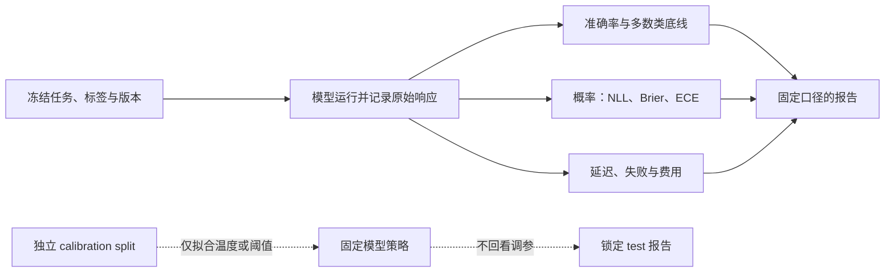

# 第六章 · 模型评测

> 评测的目的不是宣布一个模型“最好”，而是用固定任务回答：它会不会答对、概率是否有用、拒答后风险如何变化、运行要花多少时间和费用？

## 本章有哪些材料

| 内容 | 用途 |
|---|---|
| [模型评测 Notebook](01_模型评测.ipynb) | 用本地公开任务比较 Laya 与 Jev，并观察多数类底线、准确率、Brier 和 ECE |
| [benchmark 工具](benchmark/) | 单次运行账本、适配器、题集转换、预算和演示结果 |
| [通用评测框架](llm_eval/) | 面向多个供应商和本地端点的扩展评测框架 |

当前练习题文件包含 231 条公开任务：48 easy、72 original、111 hard。它与知识库中 JevBench v1.2.3 的完整冻结运行不是同一份样本规模：后者的上游记录说明每个系统有 534 道决策，包含未公开的 held-out 数据。比较时不要把 Notebook 的公开子集得分说成完整榜单得分。

如果需要外部参照，使用本仓库收录的 JevBench **v1.2.3 快照**（来源 commit a83840b，2026-09-21；见[来源清单](../11_知识库/jev-cookbook/SOURCES.md)）。排名、价格和延迟取决于版本、费率、机器与调整方法；本章不把历史榜单写成当前性能保证。

## 示例：预测正确率与概率校准回答不同问题

准确率把预测压成类别后计数，回答“选中的类别对了多少”；校准则保留概率，把相近置信度的样本聚在一起，检查预测概率与实际频率是否一致。因此，一个模型可能准确率较高但概率过度自信，也可能平均校准较好却仍有不少类别判断错误。样本量不足时要报告不确定区间，避免把少量样本的分桶波动误认成稳定偏差。

下面用 200 个预测展示为什么要分箱检查概率（教学用假设数字）：

| 预测置信度区间 | 样本数 | 正确数 | 准确率 / 经验频率 | 组内现象 |
|---|---:|---:|---:|---|
| 约 0.80 | 100 | 80 | 0.80 | 这组的置信度和命中比例一致 |
| 约 0.95 | 100 | 76 | 0.76 | 这组明显过度自信 |

两组总体准确率是 78%；如果只报准确率，看不出高置信组的概率质量出了问题。这种示意表也提醒我们：校准结论取决于分箱和样本数，正式报告应给出分箱规则与不确定性。

## 评测指标各自回答什么

| 指标 | 回答的问题 | 解读时的限制 |
|---|---|---|
| 准确率 / 加权准确率 | 最终类别答对多少？ | 必须与多数类底线、类别分布和置信区间一起看 |
| NLL | 真实类别分到了多少概率？ | 错误且过度自信的预测会受到较大惩罚 |
| Brier | 整个预测分布与结果相差多大？ | 是整体概率评分，不能单独解释成“校准度” |
| Reliability diagram / ECE | 预测置信度与经验正确率是否接近？ | ECE 依赖分桶和样本量；要注明实现与分箱 |
| Risk–coverage | 自动接收的样本比例与其错误风险怎样变化？ | 拒答阈值要按业务损失选择 |
| 延迟与费用 | 真实部署链路要多久、花多少？ | 报告 p50/p95、设备、网络、并发、计费口径和数据日期 |

NLL、Brier 和 ECE 不能互相替代。二分类 Brier 的经典分解包含 reliability、resolution 与不确定性；它不是纯校准指标。[Murphy (1973)](https://doi.org/10.1175/1520-0450(1973)012%3C0595%3AANVPOT%3E2.0.CO%3B2)。温度缩放可作为校准集上的后处理练习；在 test 上挑温度会泄漏测试信息。参见 [Guo 等 (2017)](https://proceedings.mlr.press/v70/guo17a.html)。

## 可复现评测的步骤

1. 冻结任务集、答案选项、模型/SDK 版本和指标实现；保存文件哈希。
2. 固定随机种子、提示词、重试规则、预算及错误处理；服务错误不能悄悄回退为另一模型。
3. 同时报多数类基线、每类结果和整体结果；对小样本报告区间或重复运行。
4. 记录未解析输出与失败请求；若提供方仍计费，费用统计要包含这些请求。
5. 延迟分开报告首次启动、预热后和端到端链路，并给出 p50/p95。
6. 将模型选择与阈值选择分开；如做温度缩放或门控，在 calibration split 拟合，只在固定 test 上最终报告。

本章 Notebook 是评测方法的教学练习，不因使用公开数据就自动成为完整榜单复现。完整数据定义、结果快照和限制见[第十一章 JevBench 资料](../11_知识库/jev-cookbook/15-jevbench/README.md)。若要训练本地候选模型，下一步读[第十章 Laya](../10_本地模型/README.md)。
