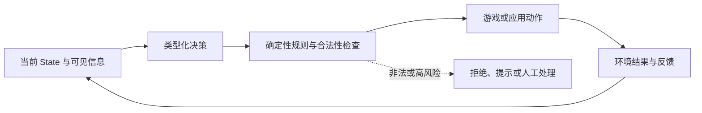

# 第七章 · 实战应用

> 这章收录九个可运行项目。阅读时跟踪同一条链：state 由哪些信息组成、模型作哪个有限判断、确定性代码怎样采取动作、动作结果如何反馈。

## 项目地图

| 项目 | 观察重点 | 先读哪里 |
|---|---|---|
| [Gridloop / 贪吃蛇](app/jev-games/games/gridloop/) | 每一步动作选项、游戏状态与双模型对照 | 项目 README 与统一 Web 入口 |
| [扫雷](app/jev-games/games/minesweeper/) | 候选格与概率推断怎样结合确定性规则 | 项目 README |
| [狼人杀](app/jev-games/games/werewolf/) | 多轮对话中身份判断的状态与证据范围 | 项目 README |
| [Jev Games Web](app/jev-games/apps/web/) | React + Vite 的统一演示入口 | 页面路由与项目接线 |
| [斗地主](app/doudizhu/) | 确定性牌局引擎、JSON state 与信息遮蔽 | 项目 README |
| [21 点](app/blackjack/) | gold 策略、爆牌概率与本地裁判 | 项目 README |
| [数独](app/sudoku/) | 约束搜索、试错记忆和错误分析 | README / EXPERIMENT 报告 |
| [Mario 复现](app/typesafe-mario-repro/) | 复现上游环境时如何排除相机、输入和帧同步等混杂因素 | 实验报告 |
| [智能家居](app/smart-home/) | 语音、路由、模型对照和端到端应用 | 项目 README；简化版见[第五章](../05_智能家居实验/README.md) |

前三个游戏与统一 Web 入口来自 [jev-games](https://github.com/lzdFeiFei/jev-games)；其余项目来自 [jev-playground](https://github.com/Bald0Wang/jev-playground)。项目均在本仓库的 app 目录，不必另行克隆上游。



## 怎么从项目读出方法

在不完全信息的游戏中，**模型可见的 state 应只包含代理当时可观察到的信息**；例如不能把对手的隐藏牌塞进判断输入，再把因此得到的胜率称为可部署策略。部分可观测决策过程会区分环境真实状态与 Agent 获得的观测，这正是检查输入边界的重要理由（见 [Kaelbling、Littman 与 Cassandra，1998](https://www.sciencedirect.com/science/article/pii/S000437029800023X)）。游戏引擎保留完整真值并裁定合法动作，策略看到观测并输出候选动作，回合结果再生成新的观测。这种边界也适用于业务系统：训练或评测输入不能偷看之后才产生的答案。

用四步记笔记：

1. **State**：判断时给了什么信息？哪些信息被有意隐藏？
2. **Decision**：模型具体选择哪个动作或类别？选项是否覆盖“未知 / 不行动”？
3. **Policy**：动作是否合法？游戏规则、权限、状态更新由哪段普通代码保证？
4. **Feedback**：结果如何进入下一次 state？怎么度量成功、失败或回合成本？

### 斗地主：隐藏状态与代理观测

```text
牌局引擎的完整状态（只供裁判使用）
  ├─ 本家手牌
  ├─ 其他玩家手牌        ← 对策略不可见
  └─ 已出牌记录、轮到谁

传给策略的 observation
  ├─ 本家手牌
  ├─ 已公开的出牌与叫分
  └─ 当前允许的出牌候选 + “不出”
         ↓ 类型化决策选候选
引擎再次验证候选是否合法 → 更新完整状态 → 生成下一次 observation
```

这段示意强调两道不同检查：输入不能泄漏对手手牌，输出也不能因为模型选中就跳过牌局引擎的合法性验证。实际字段以 [斗地主项目](app/doudizhu/) 的 state 构造代码为准。

以数独为例，试错结果可作为下一步判断的证据，但胜率变化只说明该求解器、棋盘生成方式和样本规模下的表现。Mario 复现也应把输入延迟、模拟器帧和相机状态作为实验变量，不能把环境故障直接归因给决策模型。数字以各项目内的实验报告为准。

游戏胜率、演示成功或单次 API 返回都不是生产可靠性证明。若要迁移到现实业务，补充代表性标注集、失败与未知分支、权限检查、重复运行以及人工升级策略。

## 来源与许可

- jev-games 上游未附 LICENSE；版权归原作者，收录仅供学习参考。
- 其他项目按项目内声明与 [jev-playground](https://github.com/Bald0Wang/jev-playground) 的 CC0-1.0 约定收录。

改动或再分发前检查具体项目的 LICENSE 与来源说明；仓库级设计见 [app/ARCHITECTURE.playground.md](app/ARCHITECTURE.playground.md)。
