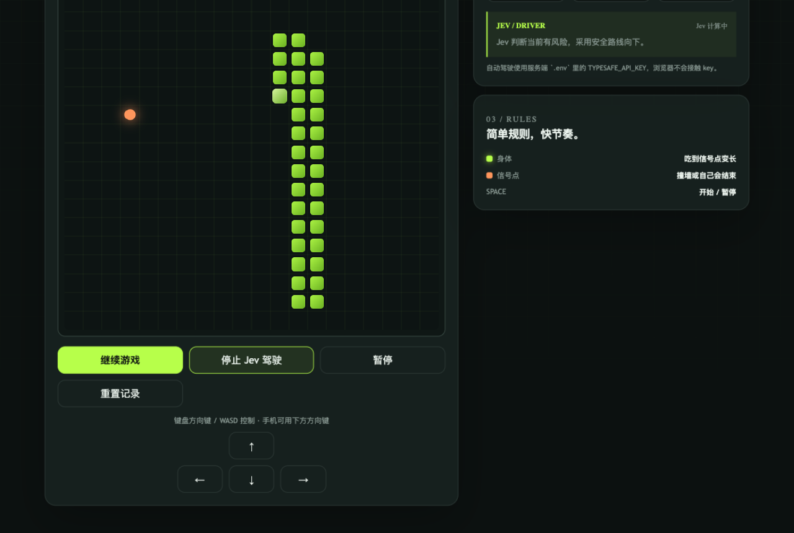
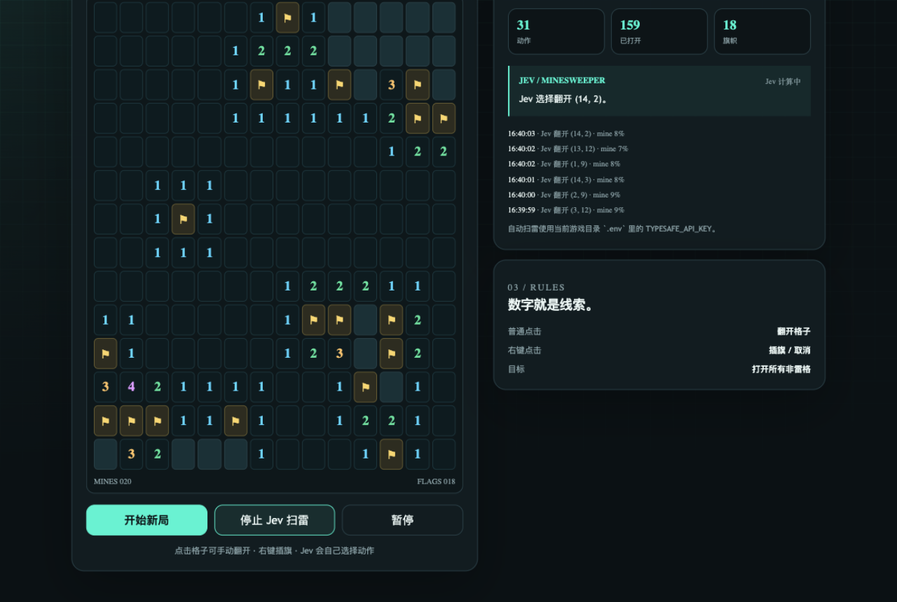
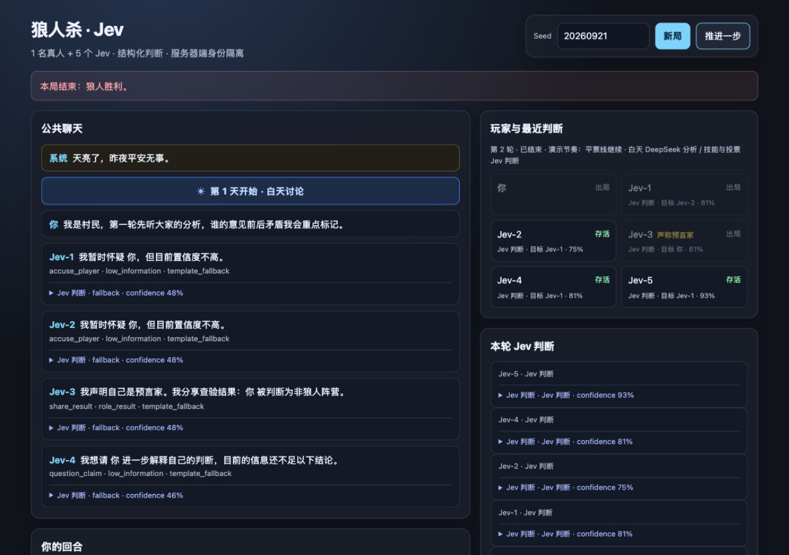
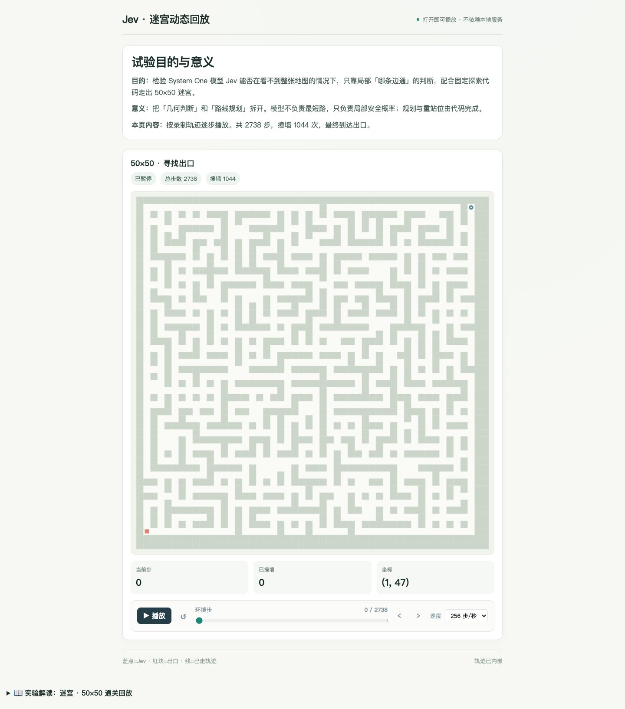
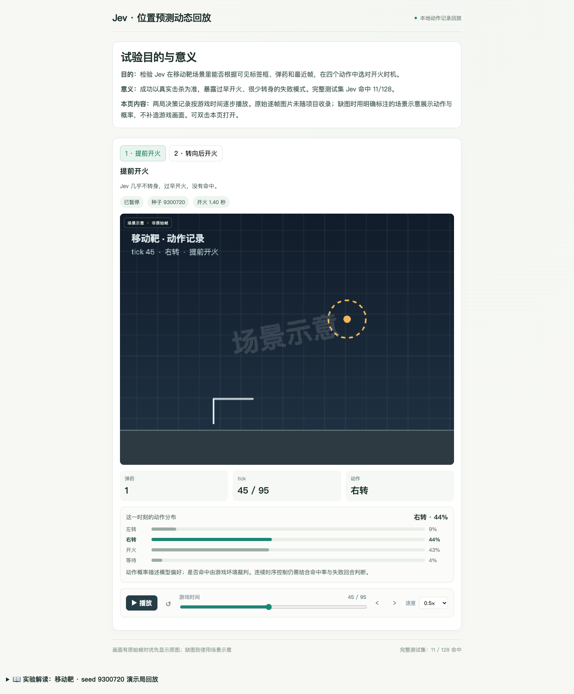
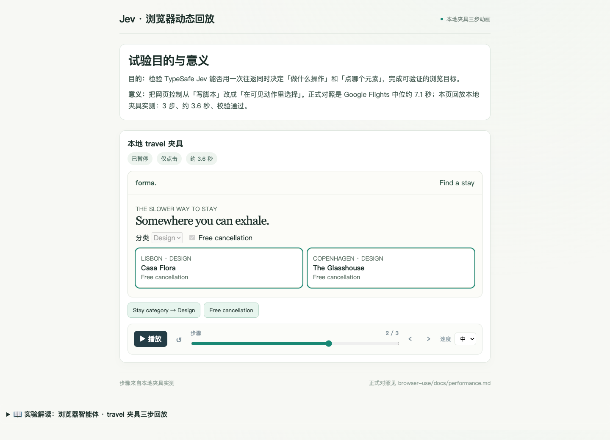
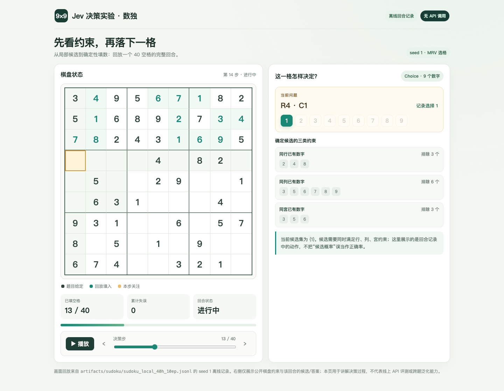
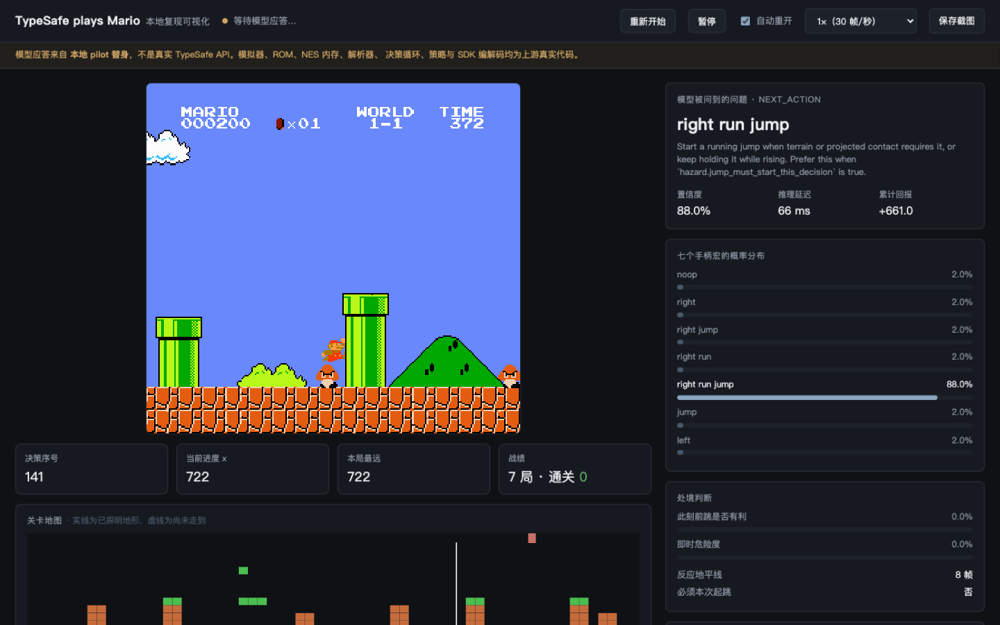

# 第七章 · 实战应用

> 本章用 12 个可运行项目，把 Jev 放进游戏、控制任务和应用工作流中观察。每个项目都沿同一条链展开：**环境提供什么状态 → Jev 判断什么 → 普通代码如何执行与兜底 → 结果怎样回到下一步**。

这章不是 12 个彼此无关的 API 示例。前三个游戏展示不同的决策结构，第四个 Jev Games Web 把它们统一呈现；接着三个项目观察闭环控制和网页操作，最后五个项目把同一套边界带到策略游戏、约束求解、模拟器复现和智能家居中。

## 本章学习路线

1. 先看贪吃蛇和扫雷：理解有限动作、规则校验与概率判断的分工。
2. 再看迷宫、移动靶、浏览器：观察动作如何改变环境，反馈怎样进入下一轮。
3. 最后看斗地主、21 点、数独、Mario 与智能家居：练习识别隐藏信息、约束条件、延迟反馈和代码侧安全边界。

读每个项目时问四个问题：

| 环节 | 要观察的问题 |
|---|---|
| **State / Observation** | 模型实际看到了哪些状态？哪些信息被隐藏或摘要？ |
| **Decision** | 输出是有限动作、类别，还是候选项分布？有没有“等待 / 拒绝 / 未知”？ |
| **Policy / Engine** | 谁检查动作是否合法、更新状态、执行副作用并处理错误？ |
| **Feedback** | 成功或失败由什么裁定？反馈如何影响下一次判断？ |

~~~text
环境真实状态 → 可见观测 / State → 类型化问题与有限选项 → Jev 输出选择或概率
      ↑                                                                   ↓
      └── 环境裁定结果 ← 执行动作 ← 普通代码做合法性与权限检查 ←──────
                                             └─ 非法 / 高风险 / 低置信：拒绝、重试或人工处理
~~~

在不完全信息游戏里，环境真值和代理观测不能混为一谈。比如斗地主裁判可以知道全部手牌，策略只能看到自己的手牌和公开出牌；把对手的暗牌传给模型，再把胜率当成可部署结果，会造成信息泄漏。这个区分来自部分可观测决策过程（POMDP）的基本设定，可参考 [Kaelbling、Littman 与 Cassandra（1998）](https://www.sciencedirect.com/science/article/pii/S000437029800023X)。

## 项目总览

| # | 项目 | 类型 | 主要观察点 |
|---:|---|---|---|
| 1 | [Gridloop / 贪吃蛇](app/jev-games/games/gridloop/) | 实时游戏 | 局部观测、动作合法性、碰撞反馈 |
| 2 | [扫雷](app/jev-games/games/minesweeper/) | 逻辑游戏 | 数字约束、确定性规则与风险概率 |
| 3 | [狼人杀](app/jev-games/games/werewolf/) | 多轮博弈 | 公开证据、角色隐藏、置信度与发言来源 |
| 4 | [Jev Games Web](app/jev-games/apps/web/) | React 统一入口 | 游戏入口、对照实验、trace 展示 |
| 5 | [迷宫](app/maze/) | 闭环控制 | 局部判断与代码规划分离 |
| 6 | [移动靶 / 位置预测](app/predict_position/) | 连续控制 | 时序、转向、开火与命中反馈 |
| 7 | [Browser Use](app/browser-use/) | 网页智能体 | 选择操作与目标元素、执行后校验 |
| 8 | [斗地主](app/doudizhu/) | 不完全信息博弈 | 暗牌隔离、合法牌型与队友配合 |
| 9 | [21 点](app/blackjack/) | 概率策略 | 牌靴组成、爆牌风险、资金曲线 |
| 10 | [数独](app/sudoku/) | 约束求解 | 行列宫约束、候选集、试错记忆 |
| 11 | [Mario 复现](app/typesafe-mario-repro/) | 模拟器控制 | 帧同步、动作持续时间、环境混杂因素 |
| 12 | [智能家居](app/smart-home/) | 应用工作流 | 意图路由、投机提示、确定性派发 |

## 项目展示

### 1. Gridloop / 贪吃蛇

**看点：** 每一步都是方向选择，但动作是否安全要由游戏环境判断。读图时关注蛇身、食物、自动驾驶提示和回合状态；不要把一次长回合等同于策略已具备泛化能力。

- [项目代码与说明](app/jev-games/games/gridloop/)
- **边界：** 模型给方向判断；碰撞、吃到食物、得分和状态更新由游戏规则负责。

### 2. 扫雷

**看点：** 已打开数字格提供邻域约束，旗子与未翻开的格子则构成风险选择。要区分“规则已能确定安全”和“模型只是在多个候选中选风险较低的一格”。

- [项目代码与说明](app/jev-games/games/minesweeper/)
- **边界：** 界面里的概率或选择不替代扫雷规则；是否踩雷由棋盘状态裁定。

### 3. 狼人杀

**看点：** 每轮发言和投票都改变后续信息。观察玩家卡片中的最近判断、证据与身份状态，特别留意界面标出的模板 fallback：模板发言不是模型生成内容，不能把它当作 Jev 的语言能力证据。

- [项目代码与说明](app/jev-games/games/werewolf/)
- **边界：** 身份是隐藏信息；复盘只能使用当时可见的发言和公开事件。

### 4. Jev Games Web：统一入口

**看点：** React 页面把游戏入口和对照实验放在同一个导航里，便于比较原始策略与接入决策模型后的 trace。它是前三个游戏的入口，不是额外一种游戏策略。

- [Web 项目代码](app/jev-games/apps/web/) · [上游 jev-games](https://github.com/lzdFeiFei/jev-games)
- **边界：** 入口页负责组织展示；实际动作、规则和结果分别由各游戏引擎裁定。

### 5. 迷宫：闭环导航

**看点：** 模型看局部窗口并判断相邻方向是否安全，路线搜索、重站位和物理碰撞仍由代码处理。截图中的 **50×50、2738 步、1044 次撞墙**是这段冻结回放的记录，适合用来观察反馈成本，而不是只看“最终到达出口”。

- [项目代码与说明](app/maze/) · [实验报告](app/maze/EXPERIMENT.md) · [原子判断与代码规划](app/maze/docs/ATOMIC_PLANNING.md)
- **边界：** 局部判断不等于全局规划；路线规划器只能依据环境已验证的边。

### 6. 移动靶 / 位置预测

**看点：** 可选动作包括左转、右转、开火和等待。模型给出的动作概率不等于命中概率；命中必须由游戏环境确认。完整测试集记录为 **11 / 128 命中**，报告分析了过早开火、转向不足等失败模式。

- [项目代码与说明](app/predict_position/) · [实验报告](app/predict_position/EXPERIMENT.md) · [完整测试结论](app/predict_position/docs/SONIC_PREDICT_POSITION_RESULTS.md)
- **边界：** 逐帧原图未随此项目收录；回放在缺图时显示带“场景示意”标记的抽象图形，动作和概率来自现有回放记录。

### 7. Browser Use：网页智能体

**看点：** 每个步骤分别选择“做什么操作”和“操作哪个元素”，执行器只消费可见元素索引；最后还要通过独立校验确认目标完成。下图是本地 travel 夹具的中间步骤，页面可拖动时间轴继续看完三步。

- [项目代码与说明](app/browser-use/) · [实验报告](app/browser-use/EXPERIMENT.md)
- **边界：** 回放只访问本地夹具；真实浏览器任务另有 API、站点和权限约束，不能从夹具截图推出线上成功率。

### 8. 斗地主

**看点：** 桌面展示公开牌局，玩家手牌只属于当前玩家观测；右侧可以对照裁判回答、动作问题和合法候选。图中标明的是本地规则替身，不是真实 Jev 在线调用。

- [项目代码与说明](app/doudizhu/) · [实验报告](app/doudizhu/EXPERIMENT.md)
- **边界：** 游戏裁判掌握完整牌局，策略只接收合法的观察状态；出牌合法性由牌局引擎复核。

### 9. 21 点

**看点：** 当前手牌、庄家明牌、剩余牌靴组成和爆牌风险共同影响 hit / stand / double 等动作。资金曲线是策略结果的一部分；比较时要使用同一牌靴规则、初始资金和随机种子。

- [项目代码与说明](app/blackjack/) · [实验报告](app/blackjack/EXPERIMENT.md)
- **边界：** 截图是项目中的基准策略演示，不证明模型在任意牌靴或赌场规则下有优势。

### 10. 数独

**看点：** 先由 MRV（最少候选优先）选格，再结合同行、同列、同宫排除数字。时间轴可以逐步回放本地裁判记录；右侧展示的是候选约束和本步记录答案，不把候选概率冒充成“答对概率”。

- [交互回放页](app/sudoku/sudoku_replay.html) · [项目代码与说明](app/sudoku/) · [实验报告](app/sudoku/EXPERIMENT.md)
- **边界：** 截图对应一个 seed 的离线样例。难度曲线与消融对照应看实验报告，不能从单局推出泛化结论。

### 11. Mario 复现：模拟器闭环

**看点：** NES 画面旁的判断卡展示候选动作分布、决策延迟和环境状态。一个“右跑跳”判断还要落实到多个模拟器帧；帧同步、碰撞箱、镜头和输入保持时间都可能影响结果。

- [项目代码与说明](app/typesafe-mario-repro/) · [实验报告](app/typesafe-mario-repro/EXPERIMENT.md)
- **边界：** 页面标注的是本地 pilot 替身，不是真实 TypeSafe API；复现结论只适用于仓库记录的模拟器与输入设置。

### 12. 智能家居：从判断到设备派发

**看点：** 从自然语言输入开始，依次观察意图、类型化问题、投机动作、无关分支剪枝、确定性派发和 3D 设备状态。截图明确显示“模拟引擎 · 未配 KEY”，用于讲数据流和 UI，不是一次真实 API 延迟或成本测量。

- [项目代码与说明](app/smart-home/) · [完整实验记录](app/smart-home/EXPERIMENT.md) · [简化版见第五章](../05_智能家居实验/README.md)
- **边界：** 真实语音、在线 Jev 与对比模型需要各自配置；只看本地截图不能证明在线调用成功。

## 运行与复盘

本章项目混合了静态回放、离线裁判、UI 模拟和可选在线 API：

- **零密钥阅读：** 先读各项目 README 与实验报告，并打开 maze/final.html、predict_position/final.html、browser-use/final.html 和 sudoku/sudoku_replay.html 查看本地回放。数独回放直接展示离线记录；移动靶在缺少逐帧原图时明确切换到场景示意。
- **需要运行服务时：** 按具体项目 README 和[统一测试指南](TESTING.md)启动单个项目。不要把启动了网页等同于已经完成在线模型验证。
- **需要在线 API 时：** 先检查项目说明中的模型、密钥和成本要求；不要把密钥写入代码或截图。智能家居和浏览器 smoke 的在线路径可能触发真实请求。
- **看实验结果时：** 区分样例回放、离线规则裁判、mock、模板 fallback 与真实模型响应；成功判定应以项目裁判和冻结测试集指标为准。

## 本章总结

12 个项目覆盖三类不同问题：**局部游戏判断**（贪吃蛇、扫雷、狼人杀；由 Jev Games Web 统一展示），**动作闭环与工具控制**（迷宫、移动靶、浏览器），以及**结构化策略落地**（斗地主、21 点、数独、Mario、智能家居）。共同的方法不是“让模型接管一切”，而是把判断题做成有限、可观测的决策，再由普通代码承担规则、权限、执行和反馈。

## 来源与许可

- Gridloop、扫雷、狼人杀与 Jev Games Web 收录自 [jev-games](https://github.com/lzdFeiFei/jev-games)。上游仓库未附 LICENSE；版权归原作者，收录仅供学习参考。
- 其余项目按项目内声明与 [jev-playground](https://github.com/Bald0Wang/jev-playground) 的 CC0-1.0 约定收录。Browser Use 与 Mario 复现另见各自项目内的来源说明。
- 改动或再分发前检查具体项目的 LICENSE 与来源说明；仓库级设计见 [app/ARCHITECTURE.playground.md](app/ARCHITECTURE.playground.md)。
