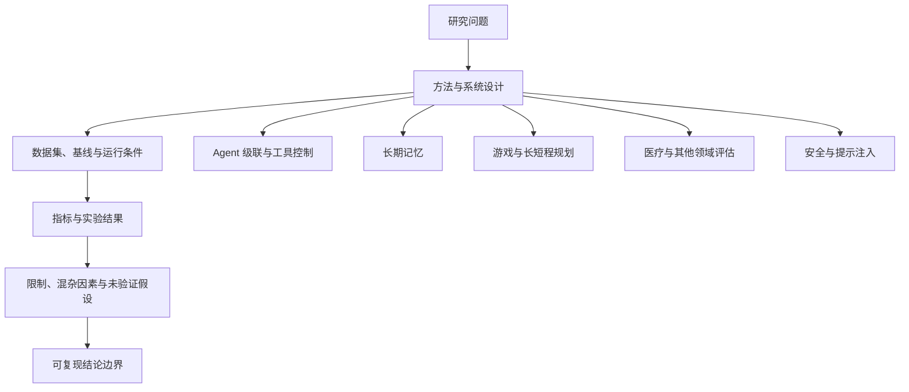

# 第八章 · 前沿研究

> 本章把本地复现实验与 2026 年 9 月的早期研究快照放在一起。除注明的本地 Notebook 外，以下新论文均为预印本；数字是作者报告的结果，尚不能当成独立复现或通用能力保证。

## 研究阅读卡片

读每个项目时记下：

1. 它要解决什么问题，原假设是什么？
2. state、判断原语和后续动作分别是什么？
3. 使用哪些数据集、基线和模型版本？
4. 指标如何计算，是否有对照、消融或重复实验？
5. 哪些结论只适用于当前样本？哪些尚未验证？



每篇研究先把“**作者报告了什么**”与“**实验实际支持什么**”分开记。抽象摘要适合定位问题，方法与附录确定任务、数据和基线，运行日志与统计分析决定证据强度；消融和多次独立重复可以帮助识别收益来自哪里。预印本的数字应保留论文版本和发布日期，并标成作者报告值，不能写成本教程已验证的事实。

### 把一句研究结论拆成可核对字段

以 REFLEX 报告“强模型调用减少 72.7%”为例，读者可以把它拆成：

```text
对照组：只用哪个强模型？每个任务允许调用几次？
实验组：Jev 什么时候接管、什么时候回退？
分母：100 项任务里哪些任务计入调用数？失败任务是否保留？
指标：减少的是请求次数、token 数，还是费用？
质量约束：任务成功率是否同时报告，和什么基线比较？
边界：这是不是论文作者的报告值？仓库有没有独立复现？
```

拆成这些字段后，百分比才有可解释的分母和对照条件；若论文未提供某一项，就把它记为未知，不根据摘要猜测。

## Jev-Mem：用判断模型辅助记忆读写

[Jev-Mem 上游项目](https://github.com/libingzheren/Jev-Mem)与论文 [arXiv:2609.23986](https://arxiv.org/abs/2609.23986)探索用类型化问题辅助决定存储、分类、检索和冲突处理。可以把它拆成两类问题：记忆管线对哪些事实作判断，以及代码如何把这些判断组合成读写动作。

本仓库的 Notebook 记录了 2026-09-25 的特定运行，包括一个 16 轮中文对话的四路对照、48–384 轮的上下文长度练习，以及一个 419 轮 LoCoMo 样本上的实验。文档中的准确率与 token 数是该次设置的观察值，不是整套 LoCoMo 或所有长对话的保证。使用其结果前，先检查对应 Notebook 的模型、问题集、基线、评分过程和样本范围。

入口：[实验讲解](jev_mem/jev_mem_walkthrough.ipynb) · [长程缩放](jev_mem/jev_mem_scaling.ipynb) · [项目说明](jev_mem/README.md)。

## JevHarness：开发与执行分开

[JevHarness 项目分析](jev_harness/JevHarness%20项目分析与评估.md)讨论由强模型在开发阶段生成或修改 Harness，再由显式控制流、特征和判断节点完成在线任务。阅读时区分上游项目的主张与本仓库的分析；它不是本章完成的受控性能对照。

这种开发时离线迭代、执行时显式授权的分工，可与第七章的确定性游戏引擎和第九章的 Agent 工具门控对照。若执行链仍在线调用 Jev，减少的可能是强生成模型的调用，不代表系统不再依赖推理服务。

## 最近的研究方向：Agent、游戏控制、医疗评估与安全

| 研究 | 研究问题 | 该怎样读结果 |
|---|---|---|
| [REFLEX with Jev for Efficient Selective Control in LLM Agents](https://arxiv.org/abs/2609.26532) | 低置信或需要生成时再回退到强 LLM，研究类型化判断能否减少强模型调用 | 作者在冻结的 100 项任务上报告 95% 成功率、强模型调用减少 72.7%；也报告收益受动作集合、授权边界候选与回退基线影响。不是本仓库复现，先查任务定义和对照。 |
| [JEV-Star: Fast, Low-Cost StarCraft II Control with Language-Model Planning](https://arxiv.org/abs/2609.27331) | 将短时动作选择交给 Jev，将较长时程规划交给 GPT-6 | 作者报告组合控制器完成多场完整对局；论文同时指出对照系统之间的界面改动未被完全隔离，因此不能把全部差异归因于规划器。适合研究“局部判断 + 长程计划”的接口。 |
| [Can Jev Judge Radiology Reports?](https://arxiv.org/abs/2609.27607) | 用双向、逐陈述支持性判断比较放射科报告 | 作者报告与专家错误计数的相关结果，并做受控错误实验；指标受报告长度和错误定义影响。报告相似性判断不等于临床安全性或诊断能力。 |
| [Calibrated Decision Models for Autonomous Penetration-Testing Harnesses](https://arxiv.org/abs/2609.28940) | 探索在自动化渗透测试中用 Jev / Laya 判定发现、严重度和 Agent 路由 | 论文描述的是一个 13 个漏洞目标上的探索性对照；作者明确指出单次比较不足以建立统计显著性。只把它当作工作流假设与评测设计参考。 |
| [Decision Hijacking](https://arxiv.org/abs/2609.28613) | 测量恶意 state 内容怎样改变类型化动作概率 | 510 个重建案例用于研究注入影响，不代表线上发生率；schema 限制输出空间，但不构成权限边界。接着看[第九章安全补充](../09_Agent集成/README.md)。 |

这些论文对应五种不同问题：级联效率、游戏控制、报告评估、安全自动化和提示注入。它们使用的数据、任务成功定义与基线不同，不能把结果排成同一条性能榜。需要引用具体百分比时，应引用论文版本和日期，并复核论文是否有更新。

## 阅读顺序与下一步

建议先读[第二章原语](../02_核心概念/README.md)，再看[第六章评测方法](../06_模型评测/README.md)，然后逐个核对本章数据与基线。涉及长期记忆、工具权限或现实动作的系统，还应明确删除/写入权限、状态更新规则、失败恢复和人工复核路径。
