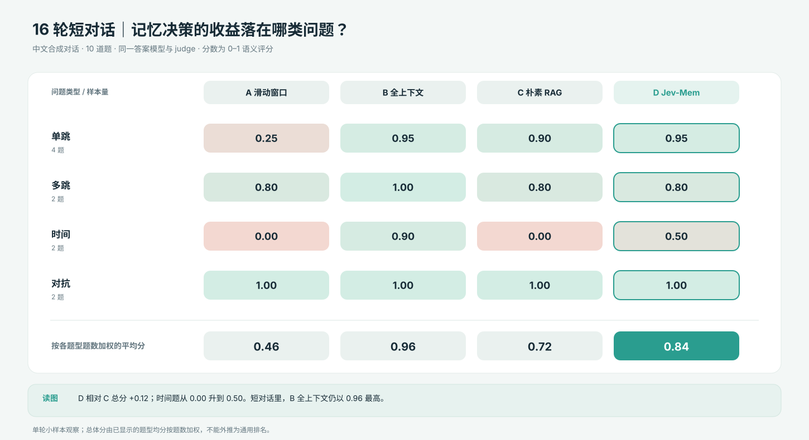
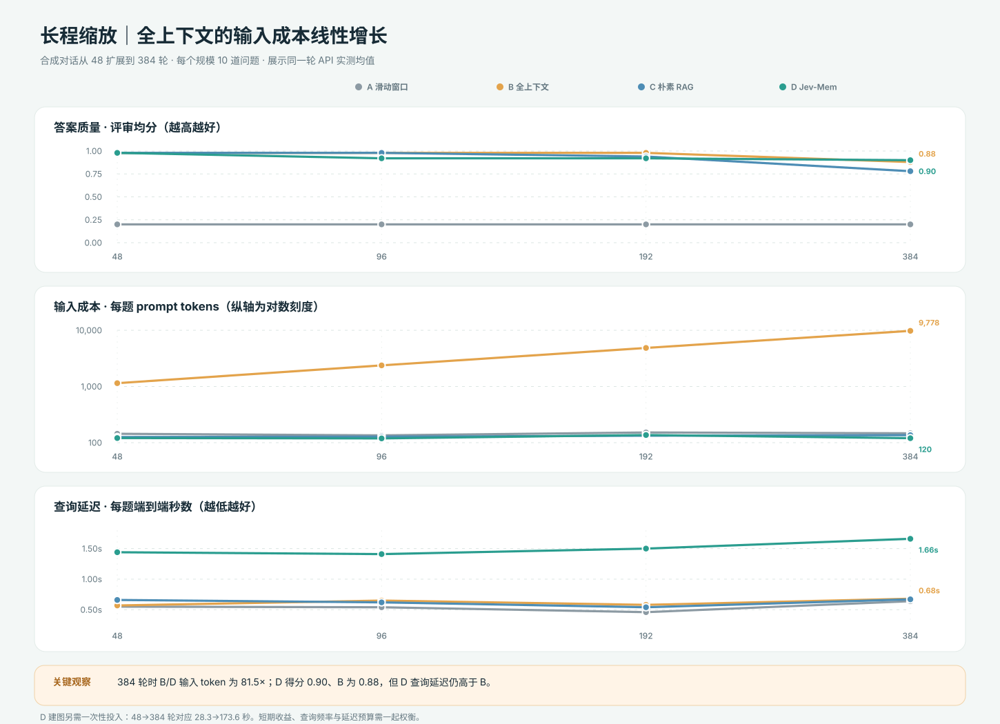
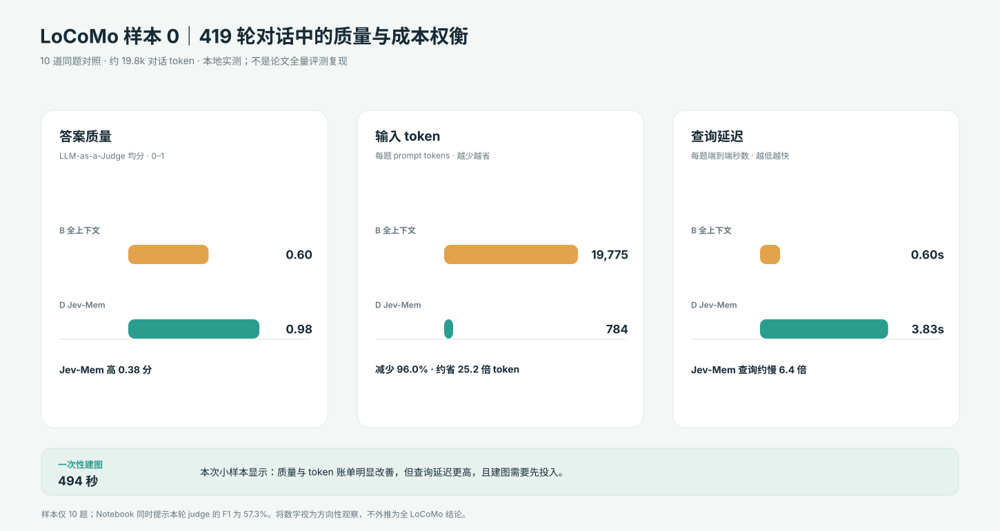

# Jev-Mem 研究笔记本（System-One 控制的智能体记忆）

> **关于本目录 / About**: 本目录是对 [Jev-Mem](https://github.com/libingzheren/Jev-Mem)
> （UT Dallas，2026-09-21 开源，[arXiv:2609.23986](https://arxiv.org/abs/2609.23986)）的独立研究快照：
> 架构走读 + 四臂对照实验 + 长程缩放实验 + 真 LoCoMo 基准。笔记本内的输出全部为
> **2026-09-25 真实 API 实测结果**（System-One = 真 Jev `jev-latest`，System-Two = DeepSeek
> `deepseek-chat`，embedding = 硅基流动 Qwen3-Embedding-0.6B）；API key 不在仓库内。
> 文中提到的 `../Jev-Mem` 路径指本地克隆（MIT License，架构图引自其 docs/figures）。

| 文件 | 内容 |
|---|---|
| `jev_mem_walkthrough.ipynb` | 三平面架构讲解、写入/读取管线走读（7 组 Jev 类型化决策）、16 轮中文对话四臂实验（滑窗 / 全上下文 / 朴素 RAG / Jev-Mem） |
| `jev_mem_scaling.ipynb` | 长程缩放：同一组事实与题目拉到 48~384 轮，质量/延迟/token 缩放曲线；附真 LoCoMo 样本 0（419 轮）Jev-Mem vs 全上下文对照；§5 三组实验结论总览与选型判据 |
| `overall_structure.png` | Jev-Mem 论文架构图（引自上游仓库） |

## 实验效果图

以下图表把两本 Notebook 中已保存的实验均值重新排成便于阅读的图。数据快照在 [`figures/jev-mem-2026-09-25/snapshot.json`](figures/jev-mem-2026-09-25/snapshot.json)，可用 [`scripts/render_jev_mem_charts.py`](scripts/render_jev_mem_charts.py) 重新生成 SVG。

16 轮、10 题的中文对话里，全上下文加权均分为 0.96，Jev-Mem 为 0.84；Jev-Mem 相对朴素 RAG 的提升集中在时间题（0.00→0.50），加权均分增加 0.12。短对话时，全上下文仍是强基线；平均分掩盖了不同题型上的机制差异。

随着合成对话从 48 扩展到 384 轮，全上下文每题输入从 1,144 增到 9,778 token，Jev-Mem 则约为 119–137 token；384 轮时约相差 81.5 倍。质量方面，全上下文在 48–192 轮保持 0.98，384 轮降至 0.88；Jev-Mem 在 384 轮为 0.90。Jev-Mem 在本轮查询延迟较高，且建图耗时随规模增长，所以 token 和质量收益需结合查询时延及查询频率判断。

LoCoMo 样本 0（419 轮，10 题）中，Jev-Mem 的评审分为 0.98，全上下文为 0.60；每题输入约 784 对 19,775 token，约省 25 倍。但 Jev-Mem 查询耗时 3.83 秒，全上下文为 0.60 秒，另需 494 秒一次性建图。Notebook 同时提示本轮 judge 的 F1 为 57.3%，这些小样本数字只能用于观察权衡，不代表完整 LoCoMo 评测。

图中数据口径：短对话按题型题数加权计算总分；长程缩放每个规模 10 题，展示本轮平均值；LoCoMo 只取样本 0 的 10 题。分数由 LLM-as-a-Judge 产生，单次运行会有评分噪声。这里的本地实验与论文在完整 LoCoMo 上报告的数字是两种不同评测，不能互相替代。

核心数字（详见笔记本）：D Jev-Mem 对朴素 RAG 的增益集中在时间/多跳题（决策面与 embedding 质量正交）；
全上下文每题 token 随轮数线性涨（384 轮时 81 倍差），D 恒定 ~120 tok；真 LoCoMo 上全上下文 0.60 对 D 0.98。
