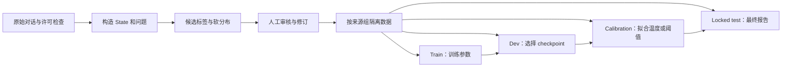

# 第十章 · 本地模型（Laya）

> 本章把“使用一个类型化决策模型”扩展成完整研究闭环：读模型卡 → 准备数据 → 审核标签 → 训练候选 → 校准与评测 → 本地服务。Laya 是开源权重路线的案例，不代表与 Jev 具有相同训练数据、输出质量或服务行为。

## Laya 与 Jev 的关系

Laya 提供 state、类型化问题和候选概率的模型接口；本仓库包含英语、多语言和特定工作流 checkpoint 的说明。模型架构、参数量、上下文长度、许可及适用语言，以具体 checkpoint 的模型卡和[模型介绍与对比](模型介绍与对比.md)为准。不能仅因它们采用相近的输入输出形式，就假定分布已校准、标签泛化能力相同或能无缝替换服务端。

下图是建议采用的训练评估闭环；当前实验报告中的伪标签尚未人工审核，相关结果边界见下文。

## 本章资料与实验

| 内容 | 读者会做什么 |
|---|---|
| [模型介绍与对比](模型介绍与对比.md) | 按任务、语言、资源和模型卡信息选择 checkpoint |
| [FINETUNING 操作指南](FINETUNING.md) 与 [RLCD 原理](RLCD原理与实验优化.md) | 理解数据审核、训练目标和实验运行边界 |
| [中文数据构造 Notebook](zh_dataset_construction.ipynb) 与 data_generation | 从对话构造 state、问题和候选软标签，并保留审核流程 |
| [全量 v2 实验记录](experiments/full-v2-20260924/README.md) | 对照 Head-only SFT、LoRA-SFT 与 RLCD-style |
| [官方配方适配复跑](experiments/rlcd-official-recipe-20260925/README.md) | 检查 proper-score 奖励、辅助交叉熵、温度拟合和结果差异 |
| serve.py / client.py | 暴露本地服务并接入评测工具 |

## 训练与评估的理论主线

比较训练方法时，要分清“**更新哪些参数**”和“**用什么目标训练**”是两条不同的轴。本仓库的 Head-only SFT 只更新决策 head；LoRA-SFT 冻结大部分基础参数，只训练低秩更新与决策 head；LoRA 的原始方法就是冻结预训练权重并注入可训练低秩矩阵，降低需要更新的参数量（[Hu 等，2021](https://arxiv.org/abs/2106.09685)）。SFT 用标签目标拟合输出，RLCD-style 则用概率评分奖励优化分布，并可搭配辅助 CE。它们的比较仍须控制数据、切分、预算、seed 和选模规则，参数更省不等于任务效果一定更好。

| 本仓库的路线 | 可训练部分（对应实验配置） | 主要训练信号 | 重点对照什么 |
|---|---|---|---|
| Head-only SFT | 决策 head | 监督标签 / 软目标的交叉熵 | 冻结主干时，已有表征是否足够 |
| LoRA-SFT | 决策 head 与指定层的低秩更新 | 同类监督目标 | 增加少量可训练参数后，留出集概率质量是否改善 |
| RLCD-style | 全量 encoder + 决策 head；冻结 act head | proper-score reward、logit 高斯探索与辅助 CE | reward 上升是否也带来 dev/test CE、Brier、校准和准确率改善 |

表中的路线概括的是本仓库[全量 v2 实验配置](experiments/full-v2-20260924/README.md)，不是所有 Head-only、LoRA 或 RLCD 实现的固定定义。比较结果前应先核对训练脚本究竟解冻了哪些参数、训练目标如何实现。

State 的划分单位要能阻止相似对话同时进入训练和测试；当前方案按来源组隔离。推荐流程为：

原始对话 → 只根据当前用户输入与此前上下文构造 state → 候选标签与软分布 → 人工审核 → train / dev / calibration / locked test → 训练 → 选择 checkpoint → calibration 集拟合后处理 → locked test 报告。

严格适当评分规则解释了为什么训练或比较概率分布时要考虑概率质量，而不只优化 argmax。RLCD-style 的平均 reward 上升不保证真实概率校准、正确率或泛化同时提高；要一起看 dev soft CE、NLL、Brier、ECE、类别级结果和 risk–coverage，并保证标签来源可靠。这里的分数来自伪标签时，只能说明模型与那些伪标签的匹配程度。

## 当前实验怎样解读

仓库中的 2026-09-24 与 2026-09-25 报告明确标注了 ShareGPT 候选和 DeepSeek 投票伪标签尚未人工审核。RLCD-style 与所谓官方配方适配的结果是探索性比较；官方实现、数据集、训练资源和切分并不完全相同。2026-09-25 复跑还说明 reward 提高没有带来 dev CE 同步改善；温度缩放改善的是当前伪标签指标，不能据此宣称经过人类金标校准或已具备业务可靠性。

开始新实验前读完整报告中的数据哈希、切分、训练配置、所见 test 的历史和许可说明。zh-pilot-112 是独立 pilot，不能与全量 v2 数据混写。数据构造和训练状态以带日期的实验报告为准。

## 从模型到应用

训练与校准之后，再通过本地服务在第六章相同的固定任务上做比较；记录设备、并发、模型哈希和计费/延迟口径。权重许可以模型卡和上游仓库为准，ShareGPT 等源语料仍需单独审查许可与隐私条款。模型下载与服务配置见 [laya-model 知识库资料](../11_知识库/jev-cookbook/laya-model/README.md)。
