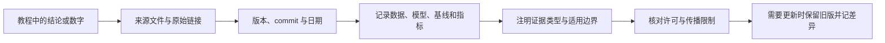

# 第十一章 · 知识库

> 这是教程的证据索引：用来找到数字、代码和观点从哪里来，收录时使用了哪个版本，以及哪些许可和限制需要保留。

## 快照范围

本章含从上游 jev-cookbook 导出的 21 个资料板块和 Laya 示例。目录重排和收录范围见[来源清单](jev-cookbook/SOURCES.md)，该清单记录了 2026-09-23 打包时各上游 commit、文件数量、未收录内容和许可。快照日期不代表资料仍是上游最新版本。



查数字时可按证据链倒着走：先找到 README 中的结论，再核对来源文件 / 论文版本、数据切分、运行配置与原始结果。官方接口文档能支持“接口这样定义”，论文能支持“作者在该设置下报告了结果”，本地日志能支持“本仓库这次运行观察到结果”；三者不能互相替代。若缺少原始数据、标签或运行条件，应把说法降为案例观察或待验证假设。

### 把一个实验数字记成可追溯的记录

```yaml
claim: "这里写希望引用的结论，不把它改写成更强的主张"
source: "论文 / 上游页面 / 本地报告路径"
version_or_commit: "tag、commit、论文版本"
dataset_and_split: "数据集、样本数、切分、是否有人审标签"
model_and_run: "模型、参数、日期、硬件、重试与成本口径"
metric_and_baseline: "指标定义、对照组、区间或重复次数"
evidence_type: "接口文档 / 作者报告 / 本仓库实测 / 离线示例"
limitations: "哪些范围尚不能从这条记录推出"
license: "代码、数据或文章的再使用条件"
```

任何一个字段缺失，都应限制对应结论的强度：例如只保存了 Notebook 输出截图、没有原始数据和运行配置，就不宜称为“可复现基准”。

## 按用途查找

| 资料 | 可查内容 | 阅读时注意 |
|---|---|---|
| [官方文档中译](jev-cookbook/01-official-docs-zh/) | System One、state、原语和官方配方的中文材料 | 非官方社区翻译；接口变动时核对官方文档 |
| [NanoJev](jev-cookbook/02-nanojev/) | 小型应用的确定性引擎与判断接口模式 | 示例不等于生产级模型基准 |
| [JevBench](jev-cookbook/15-jevbench/) | v1.2 系列冻结题集、计分方法和结果 | 比较前确认 v1.2.3 的计分、价格和延迟调整 |
| [Rerank 研究文章](jev-cookbook/18-wechat-rerank-experiment/article.md) | 80 条 SciFact 上的重排序对照 | 单一数据集、候选集与基线上的报告 |
| [Fast Jev Compaction](jev-cookbook/04-fast-jev-compaction/) | Claude Code 上下文压缩示例 | 上游版本与许可见 SOURCES |
| [Eve 与研究报告](jev-cookbook/08-eve-decision-models/) | 决策模型横向讨论 | 区分二手分析与原始实验 |
| Laya 资料 | [架构](jev-cookbook/19-wechat-laya-architecture/article.md)、[开源发布](jev-cookbook/20-wechat-laya-oss-release/article.md)、[榜单报道](jev-cookbook/21-wechat-laya-hf-trending/article.md)、[本地接口](jev-cookbook/laya-model/README.md) | 参数、排行榜和下载信息都要回到当前模型卡复核 |
| 其他板块 | trader、技能、SDK、飞书研究与公众号文章 | 私有文档或受版权保护的内容不能因被收录就自由再分发 |

## 给实验结论标注证据

引用数字时，至少写清：

- **出处与版本**：上游链接、commit 或 benchmark tag。
- **时间与范围**：运行日期、数据集、样本数量和切分。
- **运行条件**：模型版本、参数、端点、机器、并发、成本口径。
- **证据类型**：接口文档、可复现测量、离线演示、研究论文或二手报道。
- **适用边界**：基线、置信区间、选择偏差、隐私与许可限制。

例如，JevBench 的榜单结论应链接到固定的 v1.2.3 结果，而不是只引用网页上会继续更新的排名；重排序数字要同时标明 SciFact 和候选集。没有样本和标注支持的观察，应称为案例或假设，不能写成普遍性能。

## 使用与更新

查目录来源、commit、未收录范围和许可证，先看 [SOURCES.md](jev-cookbook/SOURCES.md)。引用或再分发公众号、飞书文档、上游未附许可的代码前，遵守来源清单中的限制。私有 wiki 的快照尤其不能因保存在仓库里而对外传播。

更新快照时保留旧版本可追溯性，并记录新的来源、commit、日期、差异与许可变化；对教程中受影响的数字同步更新对应章节说明。模型权重和数据集未随此知识库完整收录，按各自来源页面申请或下载。
