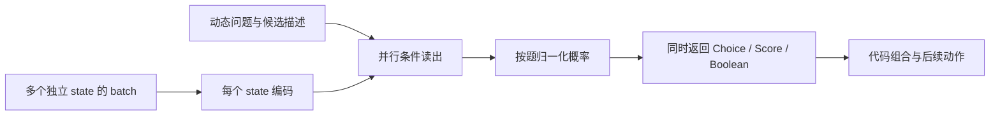

# Jev 核心特征 → RLCD 与并行结构 → OpenJev 技术重点

核验日：2026-09-17。本文响应用户的最新方向：**先查清核心特征，再决定技术；尚未开始学生训练。** 之前的 Qwen 0.6B、GLiClass、数据规模和时间安排都是待验证基线，不是最终模型选型。

## 当前核心判断

Jev 的特色来自三个部分的结合：**由每次请求定义的通用语义判断、面向真实结果的概率训练、非自回归的高并行决策输出。** 只实现 JSON 分类会遗漏后两者；只添加 calibration loss 会遗漏结构效率；只把已有 logits 做 softmax 会遗漏跨任务概率质量。

RLCD 是 TypeSafe 明确强调的核心后训练方向之一。其全称为 **Reinforcement Learning for Calibrated Decisions**，即「面向校准决策的强化学习」。[官方 AI primer](https://docs.typesafe.ai/introduction/machine-learning-primer)

原始 Jev 的具体 reward、优化器、采样训练机制和数据配方尚未由本轮可验证资料披露。因此要研究 RLCD 的目标及实现条件，但不能把任何现成 PPO/GRPO、Brier loss 或本文的理论假说直接改名为“已复现 RLCD”。

## 1. 特征与证据矩阵

| 核心特征 | 核验结论 | 证据与边界 | 对应技术需求 |
|---|---|---|---|
| 每次定义问题和候选 | 已确认 | instructions、criteria 随请求改变；不是固定训练标签分类器 | 问题/候选条件化表示；未见任务、规则和候选测试 |
| Choice / Score / Noul | 已确认且已实测 | 返回决策概率；Score 是等级期望；Noul 为 true 概率 | 动态候选打分、分组归一化、确定性类型后处理 |
| 非自回归决策输出 | 官方明确说明 | 不生成解释或逐 token 的答案；具体网络前向次数未公开 | batch 张量前向、并行读出，决策不依赖前一个生成答案 |
| 不使用 latent reasoning / CoT | 创始人原始 X 回复已由 Chrome 与官方 oEmbed 双重核验 | 作者把两者并称，要求可靠的 System 1，System 2 交给代码；不能外推为网络没有 hidden states 或绝不迭代 | 首版不训练生成式思维链；代码管理任务分解、计算与跨步状态 |
| 同 state 多题并行与隔离 | 官方明确说明；小型重复题演示吻合 | 一题不会读取另一题答案；本轮未完成复杂独立性或吞吐基准 | state 共享表征与严格问题分支；无题间注意泄漏 |
| 跨 state 的批量前向 | OpenJev 必须支持；Jev 公共 API 的独立 batch 入口未确认 | 官方明确一次 request 一个 state；state 的数组形式仍是一个共同上下文 | 真正的 batch 维度；各 state 之间隔离；不以 HTTP 并发冒充 GPU batch |
| calibrated probabilities | 官方训练目标明确；通用实际校准程度尚未独立验证 | 80% 概率对应一组事件约80%发生，不是单例保证；17 个简单判断不足以测校准 | proper scoring、可信标签、难度/歧义覆盖、独立校准和域外测试 |
| 原生 confidence | 官方定义及 adapter 公式已确认；网关 metadata 已实测 | 是分布统计量，不是单独的正确率预测器 | 可复用后处理，不是主要研究投入 |
| 接近 frontier 的语义判断 | 厂商报告，跨任务能力仍待独立测量 | 不能从小模型接口兼容推出同等能力 | 强预训练表征、任务多样性、规模/泛化曲线 |
| 精确计算/长链推理 | 官方承认限制 | 数学、日期比较、间接指代、无关长上下文和注入都有已知弱点 | 精确计算和组合逻辑放在代码；不为复现核心先造聊天/推理系统 |

来源：[Primitives](https://docs.typesafe.ai/primitives)、[Introduction](https://docs.typesafe.ai/introduction)、[State](https://docs.typesafe.ai/concepts/state)、[Speculative fan-out](https://docs.typesafe.ai/patterns/fan-out)、[已知局限](https://docs.typesafe.ai/model-jaggedness/jev-1.13)。

其中 no-CoT 的直接来源是创始人回应 Chip Huyen 的[原始回复](https://x.com/CompleteSkeptic/status/2099981459541143995)，日期为 2026-09-15。本轮让用户指定的本机 Claude Fable 5.1 xhigh 用 Chrome 阅读该回复，再用 X 官方 oEmbed 核对正文和作者；没有依赖媒体转述来确认这条特征。

“并行输出”不意味着无论批量多大都恒定延迟，也不证明内部恰好一次网络前向。它最重要的可验证性质是：输出答案不沿着一条自回归答案序列相互等待。吞吐还会受 state 长度、候选数、显存和服务调度影响。

## 2. 深挖官方材料带来的新增线索

官方 AI primer 把 RLCD 画为从 **pretrained language models** 出发的第三条后训练路径，另外两条是 RLHF 和 RLVR。因此，把 Jev 的工程目标理解为“更有效地取用预训练智能”比“必须从零训练完全不同的基础知识模型”更有公开证据。它没有公布实际使用的基座或结构。[AI primer](https://docs.typesafe.ai/introduction/machine-learning-primer)

创始人在 AI Engineer 演讲问答中给出更直接的解释：

- 14:08：被问到 classifier head 与 pretraining 的结合，没有公开具体结构。
- 14:26：认为 pretraining 本身不是主要问题，重点是如何取用已学到的能力。
- 15:43：明确把自身方向与 RLVR 区分。
- 16:19：核心目标是 calibrated decision-making。
- 16:41–16:53：听众追问分步奖励还是终局奖励，他没有确认任何一种，而转向说明 API 形态也会变化。

这是目标层面的披露，不是过程奖励、PPO 或特殊 head 的证据。[主办方完整演讲与 transcript](https://ai.engineer/talks/cJ0EOzey--o-whats-next-after-rlhf)

创始人的《The Bitterest Lesson》把任务选择、数据、算力、算法依次排序，强调任务与数据优先。因而我们应先定义正确的概率决策任务与真实反馈，不能仅从 RLCD 的名字推导某个优化器最重要。[官方文章](https://typesafe.ai/blog/bitterest-lesson)

### 社交讨论补齐了什么

- **X 一手披露：** 明确排除作者所称的 latent reasoning/CoT，是此次最能改变实现优先级的新增信息。优先做直接条件分布读出与代码组合，不能因为 RL 一词就先上长思维链训练。
- **HN 本人认可的抽象：** 创始人认可“用动态候选替换固定词表、直接输出分布”的高层解释，但仍保密具体架构。[原始回复](https://news.ycombinator.com/item?id=49719101)
- **Discord 弱线索：** 在服务器的 RLCD、calibration、reward 检索中，读到一位身份未确认为官方的成员将 town-hall 内容概括为“决策质量＋校准质量”。没有取得原始官方 reward 公式，也没有读完服务器全部分页，因此只保留为追索线索。[对应消息](https://discord.com/channels/1483217544214085663/1483217545040232496/1549952063289688107)
- **Discord 实验线索：** 有成员讨论 Choice/Noul 等价问法、标签文字和候选顺序对概率的影响。我们把这些加入评测设计；本轮未独立核验对方数据或实验数字。
- **仍然未知：** 参数量、底座、reward、优化器、parallel sampler 实现及训练真值来源。社区把 Qwen、LLaDA 或简单 label logits 称为“RLCD”，不能证明它们接近 Jev 内部机制。

公开来源详见 [X、HN 与会议增量核验](rlcd_public_discussion_zh.md)。Discord 浏览覆盖和原始记录另存本地私有文件，不将聊天记录打包成训练集。

## 3. RLCD 想解决什么

一个只追求“赢得本题”的随机策略，与一个诚实预测结果概率的模型，有不同的最优行为。假设同一可见信息下，事件真实发生率为 70%。

若模型从 `p` 随机选择 yes/no，只因选对而得奖：

```text
E[正确性奖励] = 0.7p + 0.3(1-p) = 0.3 + 0.4p
```

这个目标会把 `p` 推向 1。它学到了“押 yes”，没有学到诚实的 0.7。这里讨论的是这种简单 sampled-action correctness reward；不是对所有 RLVR 训练的完整定义。

如果直接评价其概率预测的 Brier 损失：

```text
E[(p-Y)^2] = 0.7(1-p)^2 + 0.3p^2
           = (p-0.7)^2 + 0.21
```

最优值在 `p=0.7`。Log loss 也有对应的严格适当评分性质。这说明训练目标必须奖励概率的诚实程度，仅奖励正确答案或偏好不会自动得到所需结果。这个数学解释不是 TypeSafe 公布的 RLCD reward。

同时，永远报总体基率也可以在整体上校准，却没有有用的条件判断能力。OpenJev 要同时学会辨别不同 state 的风险、在新问题上正确判断，以及报告可信概率；评测应包含 NLL/Brier、任务性能、分辨能力和 risk-coverage，不能只最小化一个整体 ECE 数字。

## 4. 哪些训练方式值得研究

| 候选路径 | 它能实现什么 | 在本项目中的地位 |
|---|---|---|
| 独立真值上的 CE/Brier | 直接学习条件结果概率，有可反传的明确目标 | 必须建立的概率学习对照 |
| 全分布监督 | 匹配教师的条件概率而非仅胜出标签 | 快速转移能力的候选主路线，须测学生校准是否保留 |
| 分布级 reward 的 RL | 当学习信号来自交互、采样或不可微反馈时优化诚实概率 | RLCD 同类研究路径；需要把 reward 和数据来源定义清楚 |
| Temperature scaling | 改善已有模型的概率尺度 | 后处理对照，无法补齐语义能力、排序错误或域外知识 |
| confidence 集中度公式 | 将输出分布压缩成一个数 | API 后处理，不等于概率训练 |

一个值得检验的采样型假说：同一状态独立采样两个答案 `A,B~p`，给观察到的结果 `Y` 定义：

```text
R = 1[A=Y] + 1[B=Y] - 1[A=B]
E[R] = 2p·q - ||p||² = ||q||² - ||p-q||²
```

其期望在 `p=q` 处最优，说明可以通过样本级信号构造鼓励完整概率的奖励。这是适当评分的采样估计及我们的理论推导，**不是发现了 Jev 的 sampler 或 RLCD 实现**。如果全部类别 logits 与真值都直接可用，反传 Brier 往往比 policy gradient 更直接；只有特定采样/交互约束才让 RL 形式有额外动机。详见 [RLCD 理论附件](rlcd_theory_zh.md)。

本轮已在 25 组二分类 `p,q` 上完整枚举 `A,B,Y`，核对奖励期望及 logit 的 score-function 梯度与解析表达式；最大绝对误差 `1.11e-16`。[检查结果](rlcd_algebra_check.json)。这只是代数自检，不是神经模型训练，也不构成算法优于 CE/Brier 的证据。

需要比较的不是“算法名看起来是否像 RLCD”，而是相同数据、骨干、预算下：硬标签学习、全分布监督、适当评分后训练，以及有明确动机的采样 RL，分别改善了哪些未见任务和概率指标。

## 5. 高并行如何变成真实结构

我们的输出目标可以表示为每个 state 的每个问题的条件分布：

```text
pθ(y_bj | state_b, question_bj, candidates_bj)
```

它不以刚刚生成的 `y_b,j-1` 为输入，也不需要先生成一段 JSON 再解析。不同 state 以 batch 维度一起处理，同一 state 的各题有独立读出。



最简单且语义正确的基线：把所有 `(state, question, candidate)` 展平为张量行，一次 batch `forward` 读每行标量，再按题分组 softmax。它已是非自回归输出，但重复编码 state；不能据此声称复制了 Jev 的共享计算效率。

效率原型则应考虑共享 state 表征，加并行的 question/candidate 分支。对于双向 encoder，需要 state-only 注意力或专门 cross-attention；对于因果骨干，可以共享不读取未来分支的前缀缓存。因果 attention 并不要求一定调用自回归 generate；关键看推理过程是否依赖已生成答案。

必须剖析三项：独立 state 的 batch 吞吐、多题共享 state 的增量成本、输出数量增加时是否出现逐答案 decode 增长。CLI 把多个 HTTP 请求同时发出，只证明客户端并发，不证明模型层做到了这些。

推理时题目隔离不等于现实中的事件相互独立。同一工单的「退款资格」「是否重复扣费」可能相关，不能直接把两个概率或 confidence 相乘当作整条流程的成功率。单题校准也不自动保证筛选、组合后的工作流校准；最终应在实际代码决策规则下测风险和覆盖率。

## 6. 据此调整项目优先级

1. **先锁定功能与概率指标。** 未见自然语言规则、候选集合变化、题间隔离、非自回归 batch、正确率与校准都应进入验收。现有简单演示只证明接口可用。
2. **数据以条件概率任务为单位。** 保存 state、问题、全部候选、概率或真实结果、来源和版本；同一 state 下问题变化与信息变化必须成组覆盖。不能先大量生成普通聊天 SFT 数据再希望它自然变成 Jev。
3. **并行读出和概率训练作为两条主线。** 结构对照解决吞吐，训练对照解决语义与校准；先分开验证，再组合。
4. **基座先比较，不预定最小模型。** 预训练骨干、instruction 模型、reranker/classifier 权重分别可能有不同起点；模型是否经历过偏好后训练值得作为变量，但创始人的观点不能替代实验。
5. **教师分布监督是可选训练路径。** 若学习的是 Jev 完整分布，可能转移其 RLCD 后的行为；这不要求逐步复制其原算法，也不会自动复制所有未见任务能力。后续若需要独立提高校准，仍要真实反馈和适当评分目标。
6. **训练前结束本轮调查并形成实验卡。** 不因某个社区项目名字带 RLCD 就直接下载训练；不先租大机或采满预算。

### 已能决定的 pipeline 与仍待实测的选择

```text
确定任务与概率含义
  → 自有规则/开放标签构建 state、问题、动态候选及独立结果
  → 按来源/模板/任务族划分训练、开发、校准、未见任务测试
  → 可替换教师补充完整分布或硬标签，保留信号类型与来源
  → 开放骨干 + 非自回归条件打分头，跨 state/题/候选 batch
  → 硬标签、全分布监督、适当评分、采样奖励的同条件对照
  → 独立校准与实际代码决策规则评测
  → 共享 state 计算优化，再测概率漂移与吞吐
  → 发布选定权重、数据构建流程、训练/推理代码和可复现结果
```

**数据的重点已经确定：** 同一 state 换问题、同一问题改事实、规则变化、信息不足、候选换序/改名、相近候选和域外任务。真实结果、规则真值、多人意见分布和教师意见分布分别标注；它们不代表同一种不确定性。信息不足不自动等于某个任意概率，也不能静默记为 false。教师生成新材料后，依然要由规则、可信原标签或独立复核给出真值。

**结构的重点已经确定：** 动态候选条件化判分、无答案 token 解码循环、跨 state 的真实张量 batch、同 state 的独立问题读出。先用展平实现建立正确性对照，并同时设计共享 state 分支；共享计算的版本只有通过隔离与数值对照后，才进入完整效率评测。

**初始化主线修订为通用 LLM，基座大小暂不锁定：** Base 与通用后训练 checkpoint 加动态候选读出；Qwen3-Reranker-0.6B 和 GLiClass 分别保留为迁移与效率对照。没有证据表明 reranker 必然更适合通用决策，也不能推断“Jev 必然很小”。如果未见任务能力不足，应比较更强开放骨干，而非只堆相同模板数据。最小可接受模型由语义、校准和真实负载的共同结果决定。训练前先落实 [训练查询分布](query_distribution_zh.md)。

| 实验卡 | 固定什么、改变什么 | 回答的问题 |
|---|---|---|
| 数据与目标 | 固定骨干、任务、数据分区和训练预算；比较独立硬标签、teacher argmax、完整 teacher 分布、独立 CE/Brier | 教师监督训练是否转移了概率信息；独立真值是否改善实际校准 |
| RL 动机 | 先在可知真实概率的合成环境中比较直接 proper loss 与多样本 proper reward；记录梯度估计、方差和用量 | RL 形式有何必要收益，是否只用更高方差估计同一目标 |
| 结构 | 尽可能固定权重和输入；比较独立 scorer、真实 batch、共享 state 分支 | 提速来自何处，是否损害题间隔离或概率 |
| 语义不变性 | 语义保持时换序/改 ID；语义改变时换关键事实/规则；增删无关题 | 模型理解的是问题，还是位置、标签与模板捷径 |
| 泛化与使用 | 保留未见任务与独立结果；在实际阈值和代码规则下测试 | 概率能否支持正确升级/拒答和可控风险，而非只在总体上好看 |

首个应用演示建议为多工单批量处理：每条工单并行判断路由、退款是否已发生、规则是否允许、紧急程度；代码合成下一动作。它能直观展示本项目最重要的结构性质，无需先实现 Doom 的闭环环境。准确率/排序指标、NLL/Brier、可靠性曲线和风险—覆盖曲线一起报告；吞吐分别按 state 数、问题数、候选数和输入长度测量。

## 7. 本轮状态与记录

已完成 15 次 Jev 功能探测，另完成 1 次可替换教师适配器的 Jev 分支验证。共 16 次成功调用；第一次免费层 403 另记。已知成功调用网关费用合计为 $0.000409752。尚未执行普通 LLM 教师 live 调用、批量标注或学生训练。

Jev 当前返回完整但保留两位小数的概率，不能称为原始 logits。普通 LLM 教师适配器只接收严格硬标签，不把自报概率当校准分布。所有 teacher 都会保留来源类型，以后可以更换数据来源而不混淆信号。

本机 Fable 架构讨论及三次浏览调查的 CLI 标价合计为 $6.60748725，可能由订阅覆盖，不能当作 Vercel 扣款。累计实际网关费用与 CLI 标价分别记账；远低于用户授权的 $100 API/数据预算，未将预算视为必须花完的额度。

Twitter/公开回复和 Discord 服务器内搜索的增量发现已纳入本次结论；没有取得的内部配方保持未知，不从市场宣传或社区猜测补全。

关联：[完整工程方案](replication_plan_zh.md)、[公开资料核验](jev_public_sources_zh.md)、[社交技术讨论](rlcd_public_discussion_zh.md)、[RLCD 理论与实验](rlcd_theory_zh.md)、[模型与数据基线详案](training_design_zh.md)。
