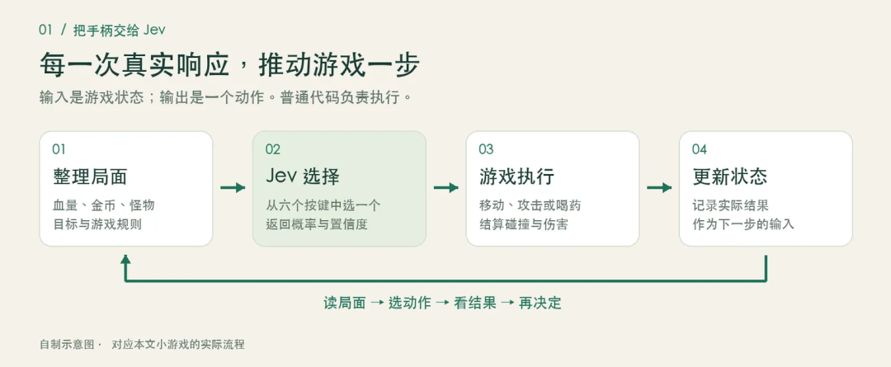
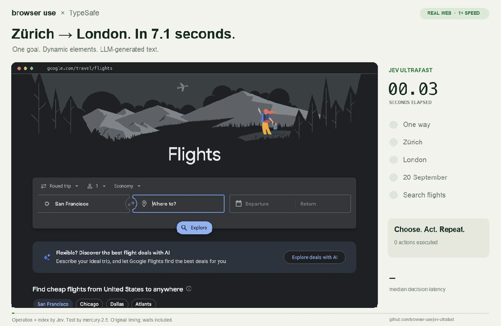

# 聊聊最近爆火的Jev 模型，到底是个啥？

作者：mason，Principal Research Leader

丨 导语 最近看到了一个挺有意思的东西，就是TypeSafe AI 做的 Jev。Reddit 上很多人用它玩 DOOM，也有人拿它玩 Mario。我申请之后，拿到 API Key 后，也做了一个网页小游戏，想看看它到底在里面起什么作用。一开始，我最想弄清楚的其实很简单：同样是让 AI 操作游戏，为什么要用 Jev？GPT 不能做吗？当然能。做完这个 demo，再看了一圈资料，我觉得可能值得讨论的是另一个问题：我们现在搭 Agent，经常让一个通用大模型反复决定下一步。这里面有多少事情，真的需要大模型完整的生成和推理能力？

## 一、老惯例，先看看Jev 到底是什么？

Jev 是 TypeSafe AI 在 9 月份推出的决策模型。创始人是 Diogo Almeida ，他曾在 OpenAI 参与过让语言模型更会听指令、跟人对话的相关研究。

TypeSafe 默默开发了两年，发布一个官方称为 **System One Models**的模型。使用方式简单可以理解成：把当前情况和问题给它，让它返回程序能直接使用的结果。其实本质上是分类模型。[官方介绍](https://docs.typesafe.ai/introduction)

接口主要有三种类型：

| 类型 | 问什么 | 返回什么 |
|---|---|---|
| **Choice：选择** | 玩家这句话在叫谁？ | 一个选项、各选项的概率，以及 confidence |
| **Score：评分** | 这段内容的风险处于哪个等级？ | 按定义的等级评分、概率分布，以及 confidence |
| **Noul：是非判断** | 这条请求需要转人工吗？ | “是”的概率，取值 0—1，不单独返回 confidence |

例如，在游戏的使用场景，我们可以每一步都问它：

我现在有多少血，怪物和金币在哪里，出口在哪里。目标是拿到金币并活着出去。现在应该按哪个键？

可选项提前定义好：**上、下、左、右、攻击、喝药**。Jev 返回其中一个动作，游戏执行，然后把变化后的局面再发给它。这个模型的好处是没有任何幻觉，严格按照大家提前定义好的输出标签来执行。

### 用 Codebuddy 简单做了一个调用的demo

视频故意在每一步多停留了几秒，方便看清右侧的三个部分：**它看到了什么、选了哪个动作、执行后发生了什么。** 停留时间是为了演示，不是模型响应时间。

这一局里，Jev 先攻击挡路的怪物，再往右移动，拿到金币，最后走到出口，一共 6 次真实 API 调用。第一步返回的“攻击”概率约为 95%，界面上的置信度约为 93%。这是两个不同的数，也都不是“这局有多大概率能赢”。 这个视频能说明：模型的选择确实驱动了游戏，响应也足够支持这种回合制交互。它还不能说明 Jev 比 GPT 更会玩。我们已经搭了相同地图、相同规则的对比版本，但目前没有完成有效的双模型实测，所以这里不放胜负和性能结论。 还有一次低血量测试挺有意思：角色只剩 20 点血时，Jev 第一手选了攻击，怪物反击后剩 5 点血。这个动作是不是最优，要看后续局面，不能只凭“没喝药”就下结论。它至少提醒我，**模型会作出自己的取舍，演示不应该把结果改成我们预先想看的答案。**

图 1：我们这个 demo 的实际分工。地图、伤害、碰撞由游戏代码处理；每一步按哪个键，由 Jev 返回。 这里我觉得最容易理解的一句话是：**Jev 是拿手柄的玩家，普通代码是游戏本身。** 它没有负责画地图，也没有生成整个游戏。我们也没有给勇者写一条自动通关路线。代码把局面整理成文字和数据，再把模型选出的动作交给游戏引擎执行。它看到的是状态描述，不是屏幕截图。

## 二、在看看几个社区的 Demo，理解它能做什么

可以先看 Browser Use 做的这个航班查询例子，这个例子 它把“判断”和“生成”分得挺直观的。

**[▶ 查看浏览器演示](https://github.com/browser-use/jev-ultrafast/blob/main/docs/demo.mp4)** · [项目代码](https://github.com/browser-use/jev-ultrafast) · [测试记录](https://github.com/browser-use/jev-ultrafast/blob/main/docs/performance.md)

动图与视频来自 Browser Use / jev-ultrafast。

页面先被整理成带编号的元素，Jev 决定操作什么、点哪个目标。需要填写城市名称时，再调用生成模型产生文字。

作者记录的一次查询用了 **7.073 秒**，其中有 **17 次 Jev 请求、2 次文字生成调用**。初始打开网页和最后的独立结果校验不在这个计时里。这是一次具体任务的记录，没有购票，也不能推广成“所有浏览器任务都能七秒完成”。[测量说明](https://github.com/browser-use/jev-ultrafast/blob/main/docs/performance.md)

这个例子有意思，是因为在这一趟操作里，选择下一步的次数明显多于写文字的次数。它展示了一种可以实际搭出来的分工。

其他几个社区的例子也值得看看：

| Demo | 看点 | 链接 |
|---|---|---|
| **DOOM** | 根据游戏状态连续选动作；官方称约每秒 10 次请求、约 7 美元/小时。输入是结构化状态，不是直接看画面 | [社区视频](https://www.reddit.com/r/typesafe_ai/comments/1whmszl/jev_playing_doom_in_real_time_with_10_decisions/) |
| **Mario** | 看模型选出的动作如何接到游戏上 | [社区视频](https://www.reddit.com/r/typesafe_ai/comments/1whrm0q/jev_playing_mario_bros_no_prior_training_wow/) |
| **Wikipedia 链接接龙** | 每一步从页面已有链接里选下一跳，逐渐走向目标词条 | [官方演示](https://typesafe.ai/blog/introducing-system-one-models-and-jev) |
| **智能家居** | 一句话里同时判断操作对象、范围和动作，再配合代码与生成模型 | [示例与演示](https://docs.typesafe.ai/demos/smart-home) |

看游戏演示时，还有个区别要记住：每秒做十次决策，不等于接管每一帧的物理和控制。渲染、碰撞、动画、执行仍然是游戏系统的工作。[DOOM 的输入与调用说明](https://typesafe.ai/blog/introducing-system-one-models-and-jev)

## 三、相比较自回归的大模型，它这个的优势在哪？

**为什么还要专门做一个 Jev？**

目前的自回归的大模型当然能分类，也能只返回一个动作。例如，现在的 Structured Outputs 还能约束输出字段和枚举值，所以不能拿“通用模型总要写一大段话”当作比较前提。[OpenAI Docs](https://developers.openai.com/api/docs/guides/structured-outputs)

但是真正的区别，还是要放到调用频率和整个使用场景里看。

如果只是偶尔分一条工单，模型多花几百毫秒，可能没什么感觉。但如果一个 Agent系统要反复判断几十次，或者一个系统每天要处理百万条内容，单次多花的时间和钱就会累积。

Jev正是基于这个假设，收窄了自己的训练任务。按照 官方TypeSafe 的描述，它采用面向决策的架构、并行采样，以及名为 RLCD 的训练方法，重点优化判断和概率校准。公开资料能让我们理解这个方向，但还不足以完整还原模型内部实现。[官方说明](https://typesafe.ai/blog/introducing-system-one-models-and-jev)

总体来看，目前三个方向可能的收益。

**一是更适合反复调用线上场景。** 官方公布的响应范围约为 70—500ms，输入价格为每百万 tokens 0.042 美元，输出免费。这是厂商口径，实际延迟会受网络、输入和负载影响。按每次总输入 1,000 tokens 粗算，一百万次请求的模型费用约 42 美元，其他服务和回退成本另算。[价格与延迟口径](https://typesafe.ai/blog/introducing-system-one-models-and-jev)

**二是减少没必要的串行步骤。** 比如收到一条反馈，可以同时判断业务类别、紧急程度和信息是否齐全，再由代码组合结果。它们如果只依赖同一份输入，就不必排队问三次。官方的智能家居例子也是这样做的：一次判断设备、范围和动作，再挑出相关结果执行。[智能家居演示](https://docs.typesafe.ai/demos/smart-home)

**三是让程序有机会识别犹豫。** 同样是选 A，“明显偏向 A”和“A、B 很接近”，后续处理可以不同。程序可以补充信息、换一个模型，或者把问题交给人。

不过这里有个容易混淆的细节：`confidence` 是从答案的概率分布计算出来的统计量，不是“这次一定有多大概率正确”。我们视频里，攻击的概率约为 95%，confidence 约为 93%；它们也都不是通关概率。[置信度说明](https://docs.typesafe.ai/confidence)

如果要拿它决定是否自动执行，得先用自己的数据检验。所谓概率校准，是看一批样本中，模型给出的概率和实际结果是否相符。不能看到一个 0.9，就替业务定下一条通用的自动执行规则。

更具体点，在应用场景会主要有以下四大类：

### 1. 游戏 NPC 与高频回合/实时决策 (Game AI & Simulation)

在需要每秒多次决策、但底层物理和渲染交给游戏引擎本身的场景中，用大模型逐字生成回答成本极高且延迟不可接受。

**回合制或轻量实时操作**：如驱动《DOOM》、《Mario》或《星际争霸》小范围战斗中的 AI 动作。游戏将当前地图状态、血量、敌我距离整理成结构化文本发给 Jev，Jev 在预设动作（`上/下/左/右/攻击/喝药`）中瞬间挑选最合适的操作。

**轻量级智能体操控**：如在无人机避障模拟、跑酷小游戏（如 Subway Surfers）中，高频输入传感器或游戏状态数据，输出导航操作

### 2. Complex Agent 内部的高频路由与工具调度 (Agent Routing & Guardrails)

在复杂的 AI Agent 工作流中，最容易出故障且高频发生的操作往往不是“写一整段话”，而是“选哪个工具”或“判断下一步去哪”。

**动态工具选择（Tool Selection）**：判断当前用户意图应该调用搜索、数据库查询还是代码执行。传统 LLM 可能幻觉出不存在的 API 名称，而 Jev 只会在提供的有效 API 列表里选择，消除了类型错误和非预期调用。

**置信度门禁（Confidence-Gated Fallback）**：利用 Jev 经过校准的置信度评分（Confidence）来做分流。例如：置信度高于 90% 时直接自动执行代码；置信度在 60%~90% 时切换调用通用大模型进一步思考；置信度低于 60% 时转接人工介入。

**安全护栏（Agent Guardrails）**：对每一个工具调用进行安全审查，实时输出 `Allow`（允许）、`Deny`（拒绝）或 `Ask`（二次确认）

### 3. 高吞吐量文本分类、工单流转与数据过滤 (Triage, Classification & Filtering)

对于每天需要处理百万级工单、邮件或长文档的业务系统，如果每个步骤都调用通用生成大模型，成本与推理时间不可承受。

**客服与工单自动分流（Email / Ticket Triage）**：根据用户输入的反馈文本，在几百毫秒内判断“负责团队”（如账单/技术/销售）以及“紧急程度”。

**复合维度评估（Composite Scoring）**：将模糊的评价拆解成多个独立维度评分。例如在 HR 简历筛选或合规审计中，一次性并发对候选人的各项指标按自定义等级（如 1-5 分）进行概率打分。

**浏览器自动化与网页接龙（Browser-Use Step Decision）**：在自动化网页浏览中，生成模型负责提取文字，而 Jev 专门负责根据页面已有元素编号，连续快速决定“点击哪一个元素”或“选择哪个链接”。

### 4. 多指令并行解析 (Command Parsing)

- **意图与目标识别**如在智能家居控制中，一句话输入后，Jev 可以同时评估并返回“操作对象”（如客厅灯）、“操作范围”（如全屋/局部）和“动作类型”（如关掉/调暗）。因为其并行评分（Speculative fan-out）特性，可以在一次 API 调用中并发完成多个判断。

## 四、未来前景咋看

如果直接问我怎么看，我的判断偏乐观。它抓住了 Agent 开发里一个常见问题：很多调用只是为了做一个判断，却动用了完整的文本生成过程。过去调用量小、产品还在验证阶段，大家不会太计较。等一个任务需要几十次模型调用、同时服务大量用户时，延迟和成本就很难忽略了。

**因此，在需要快速理解语义、再作出有限选择的任务，值得长期做。至于 Jev 能不能成为这个方向上的主要选择，现在还早。**

### 1、需求增长不只来自替换现有大模型

我认为，这个是Jev 最容易切入的机会，是替换 Agent 里那些高频、边界清楚的调用，比如选工具、筛选检索结果、判断下一步操作、决定是否升级到更强模型——这些任务虽然需要语义理解，但输出空间小，若效果接近，开发者自然会选择更快、更便宜的方案。 更重要的是，成本和延迟下降之后，以前因为不划算而没做的判断，现在可能也变得值得做了。

### 2、能替代多少大模型调用，取决于系统设计

复杂部分还是靠强模型规划，运行中的局部判断尽量交给轻模型，遇到新情况或高风险再升级处理。但难点在切换时机、上下文传递、计划失效等边缘条件，没处理好，省下的推理时间可能被重试和恢复抵消。 在这里，概率信息很重要，但前提是业务校准。我们需要知道在什么错误率下，哪些任务可以稳定交给快模型，而不只是看平均准确率。 Jev 有机会做的，不只是便宜推理，还包括评测、阈值选择、回退和监控。如果这些能力足够好，Jev 的价值就不只是低成本，而是帮开发者把一部分判断稳定自动化。 至于实时语音，不一定需要外接 Jev。全双工音频模型本身也可能解决打断、接话等问题，只有独立判断层带来明确收益时，才值得增加远程调用。

### 3、最大的竞争压力来自两边

一边是大模型厂商。结构化输出、工具调用、低延迟模型和蒸馏都在推进。大厂只要在核心任务上做到够好、够便宜，用平台和服务能力留住客户，Jev 的空间会受到挤压。开发者也会考虑接入成本，没必要多接一家供应商。

另一边是传统分类器和专用小模型。如果任务稳定、标签固定、数据充足，专用模型往往更便宜、易部署，简单任务甚至用规则就行。

所以，Jev 比较有吸引力的位置，是在这两者之间：任务需要通用语义理解，规则和候选变化频繁，开发者又不愿意为每个小判断单独训练模型。这个市场不小，特别是在企业流程、研发工具和交互应用里。但长期来看，Jev 能否持续做到“好用、稳妥、迁移成本低”，比单次推理便宜更关键。如果每换一个场景都要大量调优和修错，就算 API 便宜也未必真省钱。

最后，调用量大并不等于利润高。只要模型价格持续下降、迁移门槛低，Jev 还得靠服务质量和集成能力留住客户。技术方向成立，独立公司的商业空间还得进一步验证。

补充一下： 看到有社区用 JEV 实现了对话

[https://github.com/kyle-pena-nlp/jevchat/](https://github.com/kyle-pena-nlp/jevchat/)

大家什么感受，又回到了 Language model 的最初的开始！

