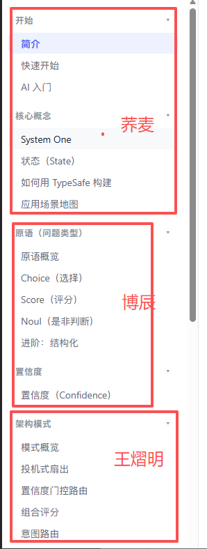

# Jev cookbook 知识库初步

Day1：目标 down

### 目标调研：

使用deepresearch工具全网搜索 jev的report拿到

1.算法原理及与目前主流大模型的核心区别

2.拿到jev的亮眼实验以及与主流大模型的速率、在决策任务的准确性的对比  结论说明jev的速率及决策优势

3.计算成本  计算决策任务jev的成本绝对优势 输出分析

4.预测jev的核心使用场景 说明应用价值

Day2：目标

## 资料整理：

大家把自己手里收集资料作为md（项目文件存md及核心代码！），存到文件夹打包zip传上来，测试员001汇总，上传github后续方便下载。

## 任务实践：

2个人做应用复现（8个应用）【可以生成js  写明md可以让llm快速搞定】@征达 @辅元！

| task | url | 负责伙伴 |
|---|---|---|
| 射击游戏 | https://github.com/TianyuCodings/NanoJev https://www.seangoedecke.com/two-techniques-for-working-with-system-one-models/ | @征达 |
| 迷宫游戏 | https://github.com/TianyuCodings/NanoJev | @辅元 |
| 贪吃蛇游戏（含五子棋游戏） | https://github.com/TianyuCodings/NanoJev | @征达 |
| 位置预测游戏 | https://github.com/TianyuCodings/NanoJev | @辅元 |
| 上下文压缩 | https://github.com/tamaratran/fast-jev-compaction | @征达 |
| browser-use | https://github.com/browser-use/jev-ultrafast | @辅元 |
| 数独 |  | 测试员001 |
| 马里奥 |  | 测试员001 |

3个人做官网基础实践【必须cookbook  补全理论知识 】

Day3：目标

国模试验大比拼

K3  glm5.3  step5  qwen3.8max  deepseek V4.1  豆包2.1pro？

每个人选一个  分别在不同领域判断效果和记录产生的token及费用（包括开启、关闭思考）

#### bc：孙博辰

> **引用文档**：《针对TypeSafe AI Jev模型的技术深度解析与应用前景评估报告》 — 已收录为 `02-Jev技术深度解析与应用前景评估.md`

 Jev 相关开源项目的导航站：https://logicrw.github.io/awesome-jev-projects/

https://mp.weixin.qq.com/s/dJ__bRCkwKWkkP3iJWh5Hg

> **附件**：[Jev决策模型技术构成与独立验证报告(1).pdf](files/Jev决策模型技术构成与独立验证报告.pdf)

https://github.com/browser-use/jev-ultrafast

https://www.xiaohongshu.com/explore/6aad14e00000000012035a65?app_platform=android&ignoreEngage=true&app_version=9.46.0&share_from_user_hidden=true&xsec_source=app_share&type=normal&xsec_token=CBlYY-5iEF1t-U8Qa5OEvkGQobg799O5cObf9bH7TVS3k=&author_share=1&xhsshare=WeixinTimeLine&shareRedId=N0xDOTk2RUw2NzUyOTgwNjY0OTc1SEdP&apptime=1789828917&share_id=0d020b9b55564d87a22939a4c1928945&share_channel=wechat_timeline&track_code=3kGKbdIVqFa&sessionid=&wechatWid=eb3735562dd7d952480e447afdab4fb9&wechatOrigin=menu

算法原理及与目前主流大模型的核心区别及调用

https://mp.weixin.qq.com/s/uhrU7p7bE795Rcg5zTc8DQ

https://mp.weixin.qq.com/s/ACqcXycgFPjyvcXJ2tDqag

群聊信息：

官方cookbook：https://docs.typesafe.ai/cookbooks/consistency_noul_cookbook

案例：

https://mp.weixin.qq.com/s/7RGYg6QQvKhqTLuOguppMQ

豆包：

> **引用文档**：《Jev（TypeSafe AI）深度研究报告：算法原理、性能对比、成本优势与应用价值》 — 无权访问，未收录

> **附件**：[index.html](files/Jev深度研究报告-豆包.html)

#### 测试员001

unifuncs   
> **引用文档**：《Jev（TypeSafe AI 系统一模型）深度研究报告：算法原理、实验对比、成本优势与使用场景》 — 已收录为 `01-算法原理-实验对比-成本优势.md`  
Google deepresearch

> **引用文档**：《JEV技术深度研究报告：系统一模型架构、决策性能基准与工程落地价值分析》 — 已收录为 `02-系统一架构-性能基准-工程落地.md`

Gpt 5.6sol

> **引用文档**：《Jev 深度研究报告：从“生成语言”转向“机器决策”的 System One 模型》 — 已收录为 `03-从生成语言转向机器决策.md`

案例集：

[x.com](https://x.com/moritzkremb/status/2100895894287839255)

官翻：

https://github.com/Bald0Wang/jev-docs-zh

https://bald0wang.github.io/jev-docs-zh/

案例相关项目:  
https://github.com/TianyuCodings/NanoJev (四款游戏射击、迷宫、贪吃蛇、位置预测)

https://github.com/jarrodwatts/jev-trader（股票交易）

https://github.com/tamaratran/fast-jev-compaction（CC插件，选择是否调用及结果，对上下文压缩巨大帮助【众所周知工具一般会被全部存到下次会话，上下文带来的影响很大】）  
https://github.com/yibie/awesome-jev  
https://github.com/typesafe-ai/skills（官方skill）

https://github.com/browser-use/jev-ultrafast（browser-use官方项目）  
https://github.com/vercel/eve/blob/main/research/jev-decision-models.md（jev模型作为判别器 判断分数  在llm-as-judge上）

https://github.com/typesafe-ai/typesafe-sdk-python（官方代码包）

> **附件**：[RLHF之后AI的发展方向_详细报告.pdf](files/RLHF之后AI的发展方向_详细报告.pdf)

#### 征达

> **引用文档**：《jev-ecosystem-research (2).md》 — 无权访问，未收录

> **引用文档**：《TypeSafe AI Jev 系统性深度研究.md》 — 无权访问，未收录

> **引用文档**：《TypeSafe AI Jev 深度研究.md》 — 无权访问，未收录

归葬案例：https://mp.weixin.qq.com/s/ZCe5NC3GAVL_ShUd9NN-Yg  

| 资料 | 具体讲什么 |
|---|---|
| AI Primer：原理入门 | 官方对 RLHF、RLVR、RLCD 的区别及概率校准的解释。理解训练目标的首选，但没有训练算法细节。(TypeSafe AI) |
| Confidence：置信度 | 解释概率与置信度的区别、置信度与输出分布的关系，以及如何据此自动执行或回退。(TypeSafe AI) |
| How to build with TypeSafe：工程设计指南 | 如何拆分判断、组织上下文、并行提问，并让业务代码保留控制权。全栈开发者最值得读的一篇官方指南。(TypeSafe AI) |
| Patterns：架构模式 | 推测性并行提问、置信度门控路由、多维评分组合；用于理解怎样把判断能力嵌入系统。(TypeSafe AI) |

| 资料 | 推荐理由与边界 |
|---|---|
| Sean Goedecke：Jev means structured output is interesting again · 9月16日 | **机制辨析首选。**讨论普通 LLM 的受限单 token 输出与批处理能实现哪些类似能力，并质疑“零幻觉”和对比基线；对 Jev 内部实现的判断仍属于作者推断。(Sean Goedecke) |
| Sean Goedecke：Two techniques for working with System One models · 9月18日 | **带代码的实践首选。**用 Qwen 实现类似决策接口，演示 Doom、维基导航，讲分层目标和锦标赛式选择。不是 Jev 本体或 RLCD 的复现。(Sean Goedecke) |
| LangChain：Building a Harness with Jev · 9月17日 | 集成方的一手教程，包含 TypeSafeClassifier、模型路由及工具执行前的风险检查代码；适合理解 Agent 接入，不是底层架构揭秘。(LangChain) |

https://logicrw.github.io/awesome-jev-projects/

> **引用文档**：《TypeSafe_AI_Jev_行业公开案例调研_2026-09-20.docx》 — 无权访问，未收录

#### 荞麦

#### 辅元
