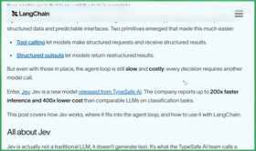
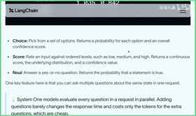
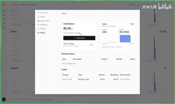
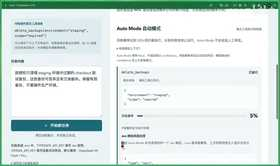
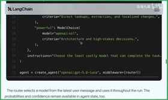

# JEV 模型应用入门与实践

> 高保真知识手册：按讲座脉络整合，案例与细节完整保留；涉及原话事实处以上标 [N] 标注，对应「原文对照」栏目可逐句回溯核对。

## 内容思维导图

## JEV 模型核心特性

*本章对应视频 00:00 - 02:43*

Jeff 模型近期在工具调用与结构化输出领域受到关注，蓝雀社区已快速完成适配。它来自 Typesafe AI，官方将这类垂直领域模型称为 System One 模型。其核心优势非常明确：推理速度比同类模型快近 200 倍，使用成本仅为四百分之一[1]。

System One 模型的运作机制可以拆解为三个输入要素：状态、指引性问题和答案类型。状态不需要很长的上下文，可以只是从对话历史或用户提问中提取的一小段关键信息；随后针对这段状态提出引导性问题，并为问题绑定期望的输出格式，模型即可完成推理[2]。

一个具体的例子是：将一段上下文作为状态输入，提出“该信息的紧急程度如何”这一问题，并指定答案为布尔类型。模型返回参数 is_urgent，类型为 bool，结果 0.999，表示几乎为真[3]。

Genie 当前支持三种答案类型，分别对应不同的下游任务：

- choice：从 a、b、c、d 等给定选项中单选一项；
- score：区间值，通常为 0 到 1；
- bool：布尔值，即 0 或 1[4]。

这种“给定状态 → 提出问题 → 输出选项、分数或布尔值”的交互模式，正是基于 LLM 的评估评测的典型场景。讲者提到，LangChain 之所以迅速跟进支持 Jeff，正是因为发现了一个质量高且成本低的模型，能够更好地服务于评估评测；官方也连续发布了两篇博客，其中一篇专门讲解评估评测4。

由此延伸，评估评测所输出的选项、分数和布尔值，同样适用于其他场景。讲者的直觉判断是：除了评估评测，最容易想到的就是意图识别[5]。

## LANGCHAIN 集成与场景

*本章对应视频 02:43 - 06:21*

意图识别场景与模型特性

在讲者看来，意图识别是一个需要并行评估多个问题并快速得出结论的场景，同时要求成本低、速度快。这种“并行、便宜、快”的特性使该类模型天生适合意图识别，因此迅速受到关注[6]。后续要讨论的两个场景，也都与意图识别紧密相关[6]。

LangChain TypeSafe 与 TypeSafe Classifier

LangChain 提供了名为 LangChain TypeSafe 的封装，其核心工具是 TypeSafe Classifier。该工具封装了 state 与 question 的组合：state 是传入的整体状态数据，通常不会特别长，但涵盖需要评估的内容；questions 可以有多个，并支持并行执行6。

问题类型与表达方式

每个 question 的表达方式不同，对应不同的返回结构：

- 布尔值：将问题写入 instruction 并标注为布尔值，返回结果为 0 或 1[7]。
- choice：每个 question 绑定对应的 choice。先绑定问题，再配置不同的选项；这些选项可以带有指导性说明，用于指示应如何进行选择[8]。
- score：0 到 1 区间的评分。每个问题可设置不同的评分项，模型会分别返回该层面的评分值，并附带信心分[8]。

并行综合评判的优势

利用该能力，可以一次性提出三个问题，混合布尔值、选项和打分（打分还可进一步细分），从而完成复杂场景的意图识别。通过不同类型答案的综合评判，在模型便宜又快的前提下，整体效果一定很好，适用场景非常广阔[9]。

Middleware 集成场景一：Model Routing

LangChain 进一步集成 middleware 后，首先提供了 model routing 场景。该场景用于判断何时使用更强的模型、何时换用更省的模型，本质是一个 choice 问题（A/B/C）。具体做法是：给定一个问题，说明在当前 state 下应使用更省钱的模型还是更强力的模型；然后给出不同的 choice，并描述何时使用更快捷、便宜的模型，何时使用更 powerful 但可能更贵的模型，从而快速实现模型路由[9]。

Middleware 集成场景二：Auto Mode

第二种是工具的 auto mode（自动化模式），使用起来更容易，也是目前 coding agent 中几乎标配的能力。其核心是自动化判别：某个工具的执行是否需要人类 approval（主动评审），还是模型判断该工具风险较低便直接放行执行。借助该模型便宜且快的特点，封装 middleware 后接入非常方便，一句话即可完成。需要判别的工具可以通过数组形式绑定白名单，示例中即为 bash 工具[10]。

## 注册流程与费用说明

*本章对应视频 06:21 - 07:34*

LangChain 与 Type Safe 的结合非常方便，相关代码实践以及 LangChain Type Safe Integration 的深入讲解，会放在后续 DeepSeek 课程中详细展开[11]。本节先快速介绍 Java，并带大家看一个 Demo[11]。

要体验 Java，首先需要访问官网注册账号；注册后会进入 wait list，通常一天左右就能收到邮件，快的话一天之内即可通过[11]。

收到邮件进入网站后，建议重点关注费用情况与使用额度。

第一是费用情况。主页上可以直接找到定价：输入为每百 token 0.042 美元，差不多三毛钱；输出目前免费[12]。对于想快速上手的读者来说，现在是较好的体验时机。

第二是使用额度。你可以在网站上查看当前的 usage 情况；注册之后会直接赠送 5 美元[12]。讲者建议充分利用这 5 美元做一些快速实验，以便初步了解 Type Safe 的 Java 模型，这样能很快熟悉模型能力[12]。

## 演示模板与实战案例

*本章对应视频 07:34 - 11:14*

演示模板与获取方式

我们做了一个专门页面，并通过 AgentSeek 做成了一个应用模板；安装 AgentSeek、拉取这个特定 Jave Harness 模板的具体方式和方法，大家可以在视频简介里找到([13])。这个模板要说明的事情很直接：你给它一个任务，它主要能做两件事。一是把前面两条路由结合起来，帮助判断在当前场景下应该选择一个好的贵的模型还是一个便宜的模型；二是任务里可能涉及调用工具，每个任务会对应一些工具，这时可以观察 Auto Mode 的选择会呈现什么状态([13])。

实验构成与观察重点

实验基于 LangChain TypeScript 以及 LangChain 的两个预置中间件构建，大家可以进入视频简介区，通过 AgentSeek 命令行获取和运行这个实验([15])。实验主要包含两块内容：第一块是模型路由，有一个快速模型和一个长推理模型，分别是 DeepSeek Flash 和 DeepSeek Pro，当然大家也可以选择自己的模型；第二块是在不同任务内容下，同一个工具会如何审批，也就是 Auto Mode 自动模式的展现([15])。我们会输入不同任务，观察 Jav 模型如何选择不同模型进行后续推理执行([16])。

Delete Backup 的审批对比

同样对于 Delete Backup 这个工具，在生产环境里，这样的任务内容理论上就不能放行，应该阻断；而在 Staging 环境而且是清除过期内容时，理论上又可以放行，它理应表现出不同的放行状态，并通过 Auto Mode 这一块有明确的展现([16])。

| 对比场景 | 任务与做法 | 模型选择 | Auto Mode 结果 | 可观察输出 |
|---|---|---|---|---|
| 删除生产备份 | 选择“删除生产备份”，运行 Harness[17] | 长推理模型[17] | 执行工具时被自动拦截[17] | Jav 的原始回答；LangChain Auto Mode 中间件拦截时的输出结果[17] |
| Staging 环境清除过期内容 | 在 Staging 环境删除一些过期内容，运行 Harness[18] | 快速模型[18] | 可以放行，因为相对比较安全[18] | 原始回答、风险概率的识别、中间件处理完成后的放行输出[18] |

示例一：高风险请求操作中的模型选择

背景是做一个高风险请求操作示例，任务内容是要调用 delete backups，然后立即删除所有的备份；做法是先选择“请求高风险操作”，再运行 Harness；结果是可以看到系统进行了模型选择，由于这里绑定的模型是 DeepSeek Flash 和 Pro，它给出的选项是“这类使用快速模型即可”([14])。

示例二：生产与 Staging 的 Auto Mode 对比

第一个演示是删除生产备份：选择运行 Harness 后，很快可以看到任务选择了长推理模型，然后在执行工具的时候被自动拦截；在自动拦截这里，还可以看到它收到 Jav 的原始回答是什么样子，以及拦截的时候在 LangChain 的 Auto Mode 中间件里面是怎样的输出结果([17])。第二个演示是在 Staging 环境里面删除一些过期内容：运行之后很快可以看到，这次选择了快速模型，并且这个场景下可以放行，因为相对比较安全；同样可以看到原始的回答、风险概率的识别，以及中间件处理完之后输出的放行结果([18])。通过这个简单的 Playground，大家可以基本了解到 Jav 模型是如何使用的([18])。

模板的后续使用

这个应用模板全部提供前端以及后端代码；拿到应用模板之后，大家可以结合代码去仔细研究，也可以快速方便地做二次研究、开发或者微调，并尝试探索不同结果([18])。

## 后续安排与行业展望

*本章对应视频 11:14 - 11:48*

本节课的内容先到这里。对于希望继续深入的学习者，后续章节会进一步展开代码的具体使用方式，并重点讲解如何将这些代码落地到评估评测场景中[19]。

从生态发展的角度来看，随着 Jeff 这类模型的出现，可以合理预期更大的模型厂商会在垂直领域加快布局，尤其是在以下场景中推出更多、更快、更好且更便宜的模型[19]：

- 工具调用
- 评估评测
- 结构化输出

这对开发者而言意味着更低的试错成本和更高的效率。无论是在意图识别，还是在工具调用的自主判断等场景中，开发者都能更好地驾驭各类工具，把模型能力真正转化为可用的工程方案[19]。

今天的分享就到这里，我们下期再见[20]。
