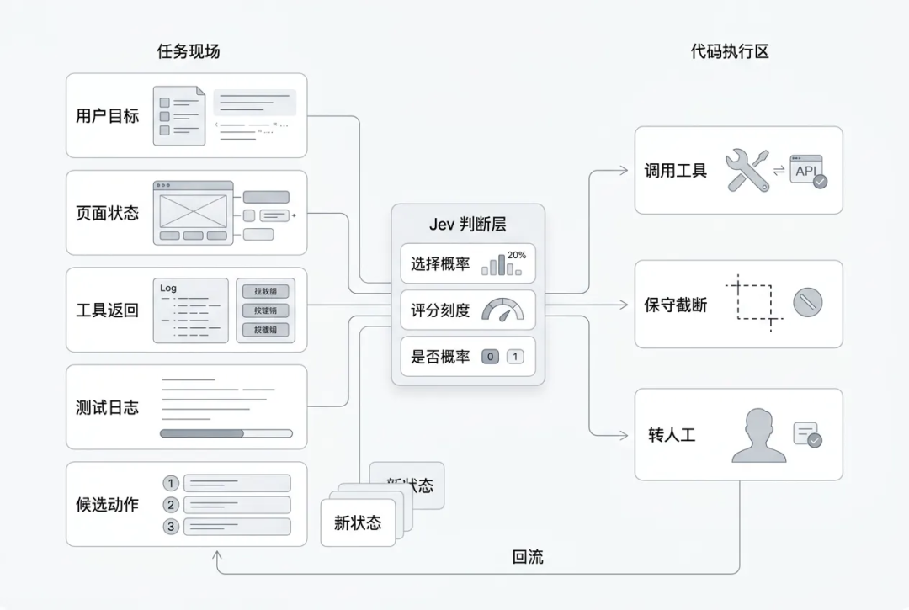
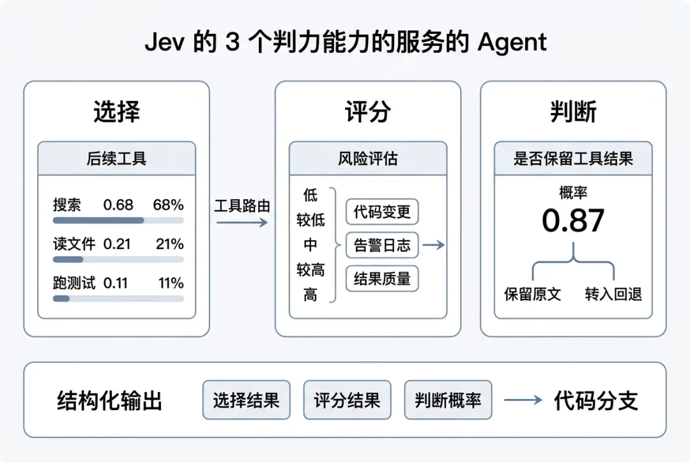
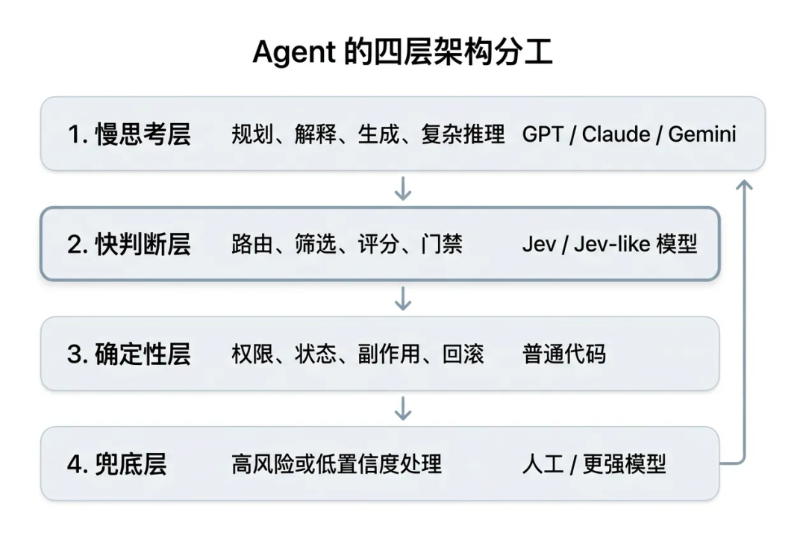
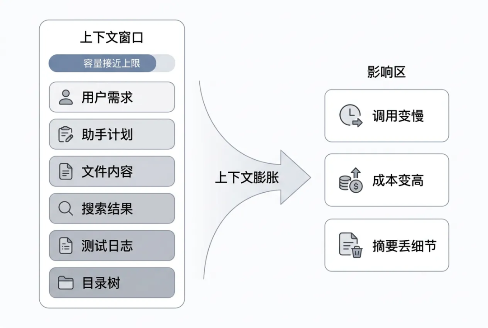
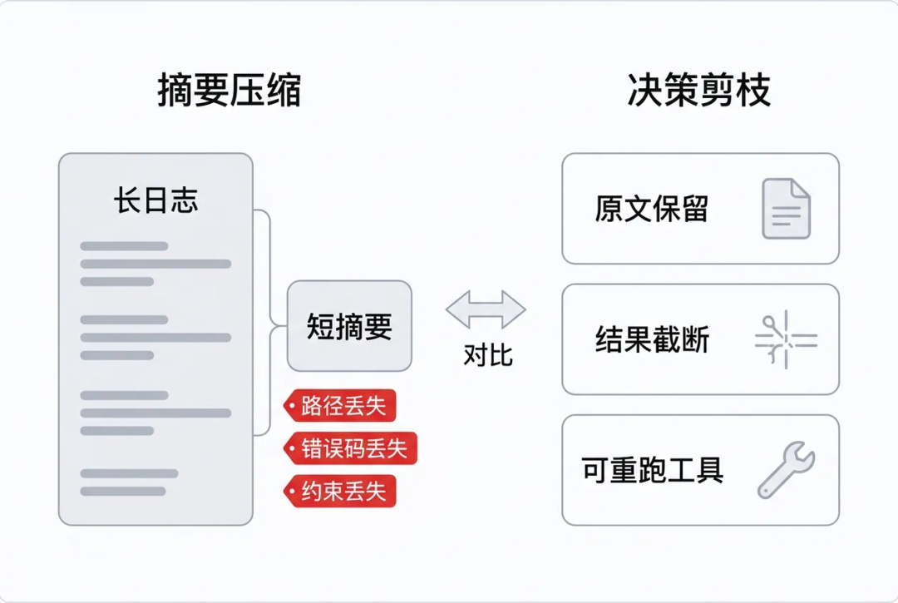
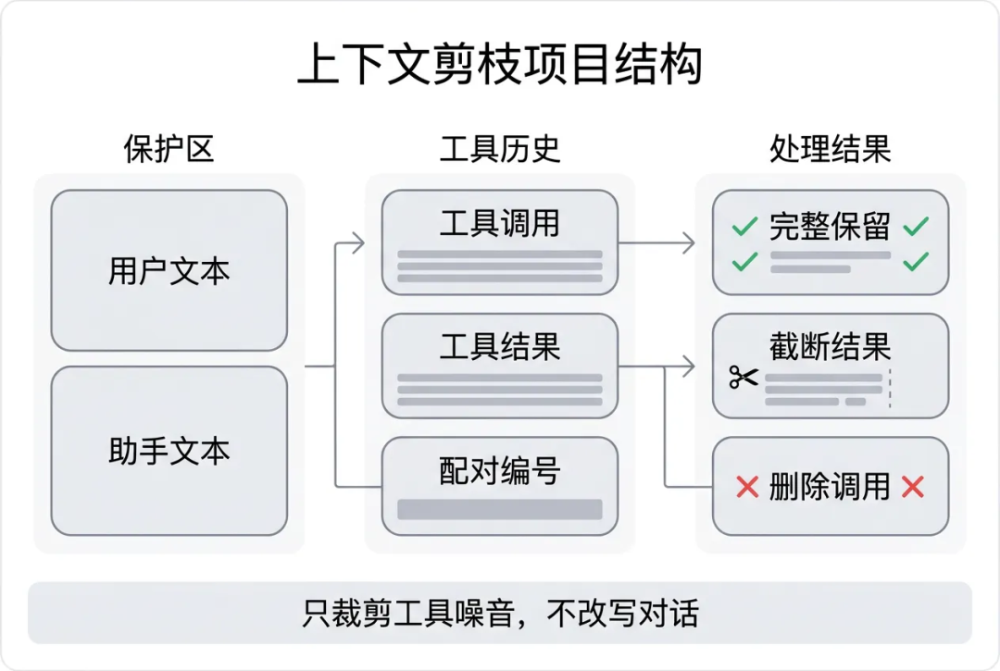
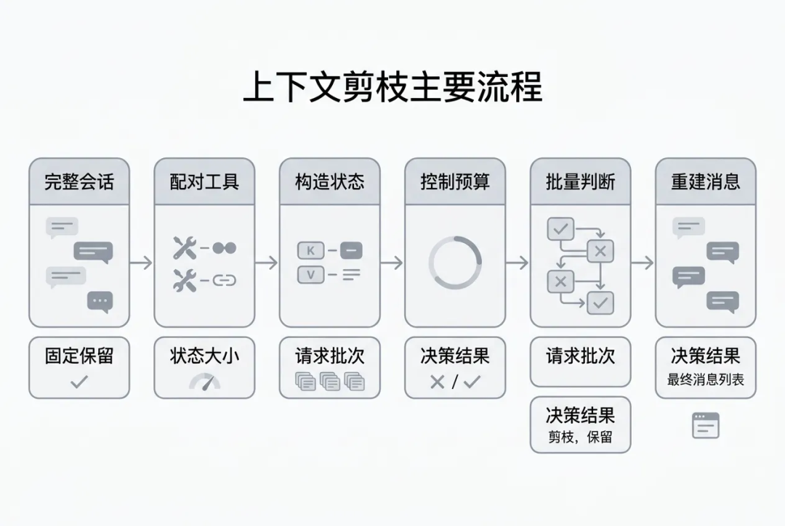
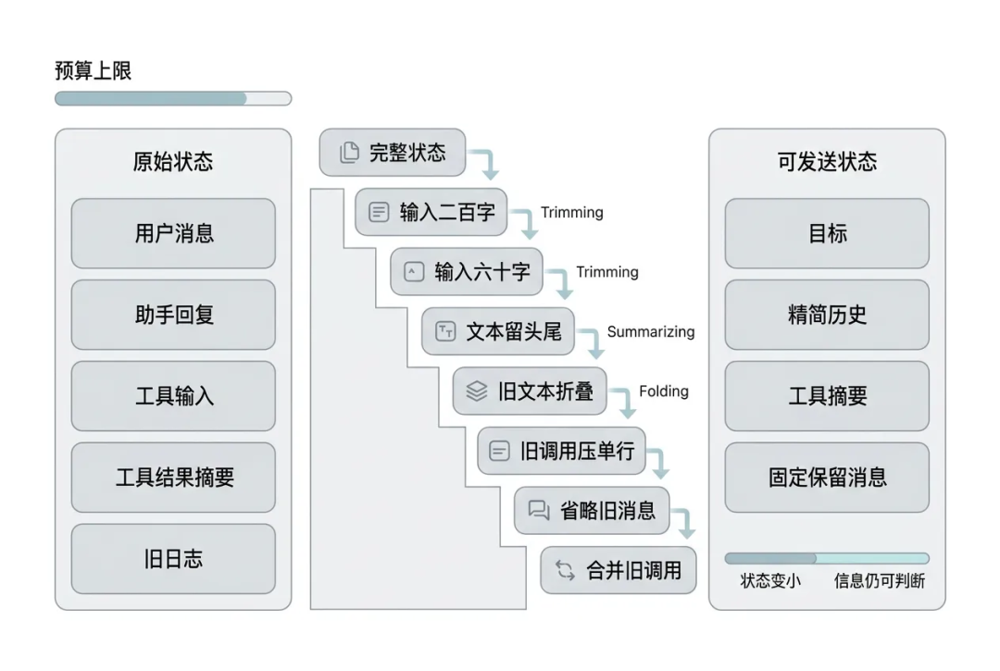
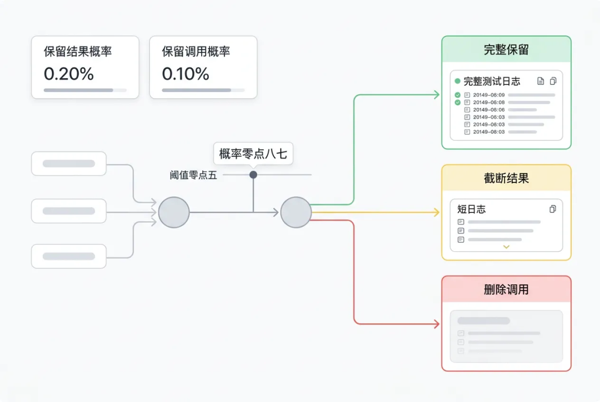
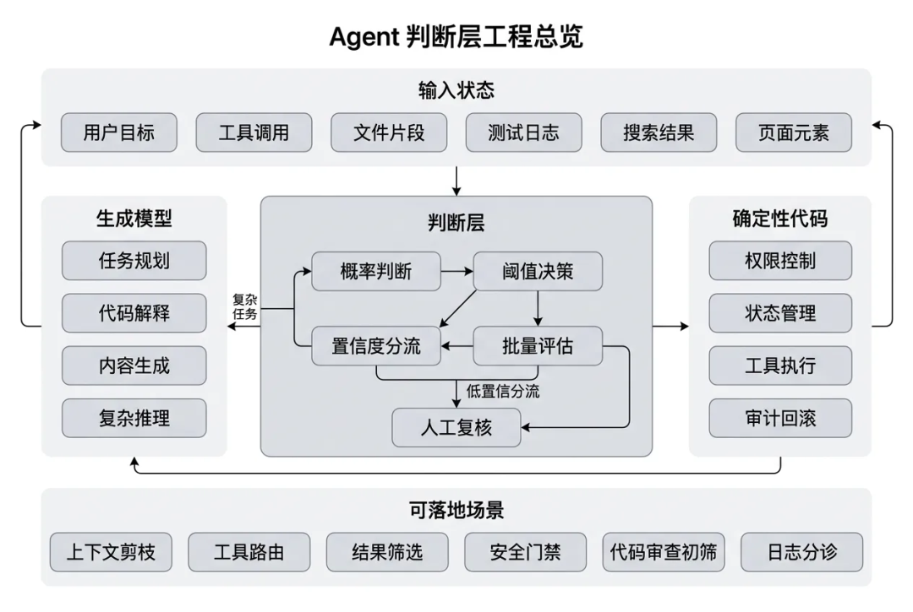

# 一万字Jev 工程实践长文：把 Agent 的“判断题”从大模型里拆出来

作者：daryl，高级前端开发

丨 导语 从 TypeSafe AI 的 System One Model，到 `fast-jev-compaction` 的上下文剪枝，再到一个可运行的本地尝试

最近 Jev 很火。它的传播路径很典型：先是 TypeSafe AI 发布一个听起来有点反常识的新模型，再是 Hacker News、知乎、Reddit 开始争论，接着 GitHub 上很快出现一批 Demo。有人拿它玩 Doom，有人拿它跑 Mario，也有人拿它接进浏览器自动化、代码审查、Agent 路由和上下文压缩里。

我一开始对它也有点怀疑。一个“不生成文本”的模型，能有多大空间？现在 GPT、Claude 已经能做 structured output，也能走 tool calling，为什么还要单独搞一个 Jev？

把几篇资料看完，再读 `fast-jev-compaction`，最后自己仿写了一个小 Demo 之后，我觉得它最值得聊的不是“模型本身有多神”，而是一个更具体的工程问题：

Agent 里很多模型调用不是为了生成答案，而是为了替代码做一次判断。

这句话如果成立，Jev 就不是“更便宜的 GPT”。它更像 Agent 系统里缺了很久的一个零件：快判断层。



## 一、Jev 是什么：把生成问题改成判断问题

Jev 是 TypeSafe AI 发布的 System One Model。它和我们熟悉的聊天模型不太一样：聊天模型擅长生成文本，Jev 则刻意放弃文本生成，只返回类型化的概率决策。

换句话说，它不是让模型“说一段话”，而是让模型回答一个程序能直接使用的问题：选哪个、打几分、是不是。

它的输入可以比较杂：用户目标、页面状态、工具结果摘要、业务字段、候选动作。它的输出必须很窄：选择哪个、打几分、某个命题成立的概率是多少。



它主要有三种原语：

| 原语 | 中文理解 | 输出形态 | 适合场景 |
|---|---|---|---|
| Choice | 单选题 | 选项 + 每个选项概率 + confidence | 工具路由、动作选择、分类 |
| Score | 打分题 | 连续分数 + 概率分布 + confidence | 风险评分、质量评分、相关性评分 |
| Noul | 判断题 | 0 ~ 1 的概率 | 是否保留、是否危险、是否达成目标 |

举个最贴近开发的例子。

如果现在上下文里有一段测试日志，系统只想知道“这段日志还要不要保留”，传统大模型可能会输出一段解释：

```
这段日志包含失败原因、文件路径和鉴权相关信息，建议保留。
```

这句话人能看懂，但代码还要继续解析。

Jev 的返回更像这样：

```
{
  "answers": {
    "result_t3": {
      "noul": 0.87
    }
  }
}
```

这就可以直接进入代码分支：

```
if (keepResult >= 0.5) {
  keepFullResult();
}
```

这就是 Jev 最核心的变化：**把模型输出从“文本”变成“可执行的概率判断”。**

和 GPT / Claude 的 structured output 相比，Jev 的差别不是“能不能返回 JSON”。现在大模型都能返回 JSON。真正的差别是：Jev 从一开始就放弃自由文本生成，只做封闭输出空间里的概率判断。



这带来一个很适合 Agent 的架构分工：

| 层次 | 职责 | 典型组件 |
|---|---|---|
| 慢思考层 | 规划、解释、生成、复杂推理 | GPT / Claude / Gemini |
| 快判断层 | 路由、筛选、评分、门禁 | Jev / Jev-like 模型 |
| 确定性层 | 权限、状态、副作用、回滚 | 普通代码 |
| 兜底层 | 高风险或低置信度处理 | 人工 / 更强模型 |

需要注意的是，Jev 不是“更便宜的 GPT”。它不适合写文章、解释复杂代码，也不适合做长链路规划。它更适合放在 Agent 内部，处理那些输出空间固定、调用频率高、又需要语义理解的小判断。

Jev 最适合的位置，不是 Agent 的大脑，而是 Agent 的反射神经。

## 二、为什么 Agent 需要一个快判断层

现在写 coding agent，最容易遇到的瓶颈不是“模型不会说话”，而是上下文越来越长。

一个稍微真实一点的修 Bug 过程，通常会经历这些步骤：

1. 用户描述问题；
2. Agent 搜索代码；
3. 读取多个文件；
4. 执行测试；
5. 查看失败日志；
6. 再读取相关文件；
7. 修改代码；
8. 再跑测试；
9. 如果失败，继续循环。

每一步都会往历史里塞内容。用户约束、助手推理、工具调用、工具结果、错误日志、文件片段，全都堆进一个 context 里。



真正撑爆上下文的，往往不是用户说的话，也不是助手说的话，而是工具结果。

| 内容类型 | 是否经常很长 | 是否必须全文保留 | 典型风险 |
|---|---|---|---|
| 用户需求 | 否 | 是 | 删掉会丢约束 |
| 助手回复 | 中 | 通常要保留 | 删掉会丢计划和承诺 |
| read_file 结果 | 是 | 看情况 | 文件全文可能过期或可重读 |
| search_content 结果 | 是 | 看情况 | 很多匹配只是探索痕迹 |
| execute_command 日志 | 是 | 看情况 | 失败栈重要，成功日志可能无用 |
| list_dir 结果 | 是 | 通常不需要全文 | 目录树容易占空间 |

这里有一个很具体的例子。

原始测试日志可能是：

```
FAIL order-export.test.ts
Error: Timeout of 5000ms exceeded
  at exportOrders (/repo/src/services/orderExport.ts:42:19)
Expected authorization header to be preserved.
```

如果被摘要成：

```
之前订单导出测试失败了。
```

听起来没错，但关键细节已经没了：

- `order-export.test.ts` 是哪个测试失败；
- `5000ms` 是什么超时阈值；
- `/repo/src/services/orderExport.ts:42:19` 是具体定位；
- `authorization header` 说明这个问题不只是性能，还牵涉鉴权约束。

所以传统 summary 有一个天然问题：它能省 token，但会改写事实。对 coding agent 来说，这个代价有时候很高。

上下文压缩最怕的不是删掉废话，而是把关键事实改写成一句“差不多”。

我们当然可以继续用通用大模型做上下文压缩。比如让模型读完整历史，然后输出一段总结。

这条路能用，但在高频 Agent 里会遇到三层断裂。

### 第一层：生成成本和判断需求不匹配

很多时候，系统不是想让模型“写一段总结”，而是想知道某个工具结果还值不值得留。

这是一个判断题，不是作文题。

如果为了回答“这段日志还要不要留”，调用一次大模型，让它读完整上下文、生成一段解释、再被代码解析，这个链路太重。

| 任务 | 真正需要的输出 | 用通用 LLM 的浪费点 |
|---|---|---|
| 是否保留工具结果 | 0 ~ 1 概率 | 生成解释文本 |
| 该调哪个工具 | 枚举选项 | 生成 reasoning + action |
| 搜索结果是否相关 | 分数 | 输出自然语言评价 |
| 是否转人工 | 布尔概率 | 写判断理由 |

### 第二层：摘要会破坏可复核性

工具结果常常是后续定位问题的证据。文件路径、错误码、栈信息、命令参数，都是精确内容。摘要会把这些精确内容变成“含义相近”的描述。

对文章、会议纪要来说，这种改写可以接受。对代码修复来说，风险更高。

因为 Agent 下一步不是“理解大意”，而是要继续执行动作。

### 第三层：置信度没有进入代码分支

通用大模型也可以说“我有 80% 把握”。但这通常只是文本里的自我描述，不一定是经过校准的概率。

Jev 的设计目标是把概率变成接口返回值，让代码可以用阈值控制行为：

| 概率区间 | 系统动作 | 说明 |
|---|---|---|
| >= 0.8 | 自动执行 | 适合低风险、高重复场景 |
| 0.5 ~ 0.8 | 保守处理 | 截断、保留摘要、请求补充信息 |
| < 0.5 | 删除或回退 | 低价值内容可清理，高风险场景转人工 |

当然，这里要非常谨慎。概率不是安全证明，必须用自己的数据做校准和 shadow mode 验证。

通用模型的问题不是不聪明，而是它把“判断”包装成了“生成”。

## 三、fast-jev-compaction：不做摘要，只做保留决策

`fast-jev-compaction` 是 GitHub 上一个很有代表性的 Jev 项目。它的目标不是让 Jev 写代码，也不是让 Jev 接管 Agent，而是处理一个更具体的问题：Claude Code / coding agent 的历史上下文越来越大，哪些工具调用和工具结果可以删？

它的策略很克制：

- 用户文本不改写；
- 助手文本不改写；
- 工具调用和工具结果配对处理；
- 旧工具结果要么完整保留，要么截断，要么删除；
- 如果 Jev 失败或压缩收益不够，可以回退到原来的 summary 流程。



这和传统 summary 是两条不同路线。

传统 summary 的做法是把旧历史改写成一段短文本。优点是省 token，缺点是路径、错误码、命令参数这类细节可能被“概括掉”。`fast-jev-compaction` 的做法是保留原文的精确性：重要的原样留下，不重要的直接删，中间态就保留调用并截断结果。

它真正有意思的地方在于，它没有沿用“让大模型总结历史”的惯性，而是把上下文压缩拆成两个判断题：

```
keepCall：这个工具调用本身还重要吗？
keepResult：这个工具结果全文还需要保留吗？
```

这两个概率组合起来，就能得到三种动作：完整保留、只保留调用并截断结果、调用和结果一起删除。

`fast-jev-compaction` 是一个 Claude Code 插件，也可以作为 npm 库使用。它解决的问题很窄：当会话需要 compact 时，不再把旧历史交给大模型总结，而是让 Jev 对历史里的工具调用逐个打分，判断哪些应该原样保留，哪些只需要留下调用痕迹，哪些可以整体删除。

它的核心约束是：**用户文本和助手文本不改写；只处理工具调用和工具结果。**

这个约束很重要。用户文本里通常有原始需求和硬约束，助手文本里有已承诺的计划和正在执行的思路，这两类内容被摘要改写后容易变味。工具结果不同：它们占空间最大，也最容易过期，而且很多内容可以重新读取或重新执行。

所以 `fast-jev-compaction` 不是“总结器”，而是“工具历史清理器”。它做的不是把历史改写成一段更短的话，而是在每个工具调用上做一次保留价值判断。



它的设计可以拆成三层：

| 层次 | 做什么 | 为什么重要 |
|---|---|---|
| 对象层 | 把 tool_use 和 tool_result 配成一组 | 避免留下孤立调用或孤立结果 |
| 判断层 | 为每组工具历史生成 keepCall / keepResult 两个问题 | 把复合压缩任务拆成两个窄判断 |
| 执行层 | 根据阈值执行 keep / drop_result / drop_call | 让压缩动作可测试、可回退、可统计 |

这个项目很适合用来理解 Jev，因为它把 Jev 的优势落到了一个真实问题上：高频、封闭、可回退、需要概率，但不需要生成。

## 四、Demo 实现拆解：从历史消息到压缩决策



它的主流程可以拆成 6 步：

1. 收集历史里的 `tool_use` 和 `tool_result`；
2. 按 `tool_use_id` 配对；
3. 标记 pinned：首条消息、最近 N 条消息固定保留；
4. 构造给 Jev 看的 `state`；
5. 对每个非 pinned 工具调用问两个 `Noul` 问题；
6. 根据 `keepCall` / `keepResult` 重建消息列表。

我们在 Demo 里保留了这个主流程。

📍 来源：src/compact.js 第 28-49 行
```
export async function compact(messages, asker, options = {}) {
  const config = resolveOptions(options);
  const startedAt = Date.now();
  const calls = collectToolCalls(messages, config.preserveRecentMessages);
  const candidates = calls.filter(call => !call.pinned);
  const charsBefore = messages.reduce((sum, message) => sum + messageChars(message), 0);
  const answers = new Map();
  let fitted = { state: null, tokens: 0, stage: 'skipped' };
  let requests = 0;

  if (candidates.length > 0) {
    fitted = fitState(messages, calls, config);
    const batches = batchCalls(candidates, fitted.tokens, config);
    const batchAnswers = await Promise.all(batches.map(batch => askBatch(asker, fitted.state, batch)));
```

这段代码里有几个关键词：

- `collectToolCalls：先把工具调用和结果配成一组；`
- `fitState：把状态压到 Jev 能接受的预算里；`
- `batchCalls：问题太多时分批；`
- `Promise.all：多个 batch 可以并发问；`
- `answers：最后收集概率，进入决策阶段。`

这就是 Jev 在 Agent 里的正确姿势：不要让它做全局规划，只让它对一批明确对象做窄判断。

### 4.1 工具调用配对：先把 `tool_use` 和 `tool_result` 绑定

上下文里，工具调用和工具结果通常不在同一条消息里。

assistant 发起：

```
{
  "type": "tool_use",
  "id": "toolu_003",
  "name": "execute_command",
  "input": {
    "command": "npm test -- order-export"
  }
}
```

user 返回：

```
{
  "type": "tool_result",
  "toolUseId": "toolu_003",
  "isError": true,
  "content": "FAIL order-export.test.ts..."
}
```

如果要压缩，就必须先把两者配起来。否则很容易出现一个危险状态：工具调用被删了，但工具结果还在；或者工具结果被删了，但上下文里还残留一个没有返回的工具调用。

Demo 里的配对逻辑在 `src/state.js`：

📍 来源：src/state.js 第 80-123 行
```
export function collectToolCalls(messages, preserveRecentMessages = 6) {
  const calls = [];
  const byToolUseId = new Map();
  const total = messages.length;
  const isPinned = index => index === 0 || index >= total - preserveRecentMessages;

  messages.forEach((message, index) => {
    const content = Array.isArray(message.content) ? message.content : [];

    content.forEach(item => {
      if (item.type === 'tool_use') {
        const call = {
          id: `t${calls.length + 1}`,
          toolUseId: item.id,
```

这一步做完后，每个工具调用会变成一个统一对象：

| 字段 | 含义 |
|---|---|
| id | 内部短 ID，例如 t1、t2 |
| toolUseId | 原始工具调用 ID |
| tool | 工具名 |
| input | 工具输入 |
| callIndex | 调用所在消息位置 |
| resultIndex | 结果所在消息位置 |
| resultChars | 结果字符数 |
| isError | 是否失败 |
| pinned | 是否固定保留 |

`pinned` 是一个很实用的工程保护。首条消息和最近 N 条消息不参与删除，避免刚发生的上下文被过早裁掉。

### 4.2 state 构造：只给 Jev 判断所需信息

这是 `fast-jev-compaction` 里最值得学习的设计。

它不会把完整工具结果发给 Jev。它只把工具结果变成一个短说明：

```
ok, 4213 chars (omitted)
error, 830 chars (omitted)
```

Demo 也是这么做的。

📍 来源：src/state.js 第 146-183 行
```
export function historyEntries(messages, calls, inputChars) {
  const callsByMessage = new Map();

  calls.forEach(call => {
    if (!callsByMessage.has(call.callIndex)) {
      callsByMessage.set(call.callIndex, []);
    }

    callsByMessage.get(call.callIndex).push(call);
  });

  return messages
    .map((message, index) => {
      const content = Array.isArray(message.content) ? message.content : [];
      const text = content
```

后面每个工具调用会被整理成：

```
{
  id: call.id,
  tool: call.tool,
  input: truncate(safeJson(call.input), inputChars),
  result: call.resultNote,
}
```

这就把“原始历史”变成了“判断用状态”。

| 原始内容 | 进入 state 后 |
|---|---|
| 完整文件内容 | 不进入，只保留工具名和输入 |
| 完整测试日志 | 不进入，只保留 error, N chars |
| 工具输入参数 | 截断后保留 |
| 用户文本 | 保留，但长文本可能 abridge |
| 最近消息 | 优先保留 |

这一步很关键。Jev 不是来重新理解所有上下文的，它只是判断某个工具结果还有没有保留价值。

压缩器不需要读完整历史，它只需要知道哪些历史值得继续被读到。

### 4.3 fitState：预算不够时逐级降级

如果 state 还是太大怎么办？

粗暴做法是删消息。`fast-jev-compaction` 没有这么做，它先做降级。

Demo 的 `fitState` 也保留了这个顺序：

📍 来源：src/state.js 第 192-241 行
```
export function fitState(messages, calls, options = {}) {
  const maxStateTokens = resolveNumber(options.maxStateTokens, 25000, 1);
  const preserveRecentMessages = resolveNumber(options.preserveRecentMessages, 6);
  const goal = options.goal || goalFromMessages(messages);
  const isPinnedIndex = index => index === 0 || index >= messages.length - preserveRecentMessages;
  const stateOf = entries => ({
    context: STATE_CONTEXT,
    goal,
    history: entries,
  });
```

核心降级链路是：



| 阶段 | 做什么 | 损失程度 |
|---|---|---|
| full | 工具输入最多 1000 字符 | 低 |
| inputs<=200 | 工具输入降到 200 字符 | 低 |
| inputs<=60 | 工具输入降到 60 字符 | 中 |
| texts abridged | 长文本保留头尾 | 中 |
| old messages collapsed | 旧文本折成省略说明 | 高 |
| old calls compacted | 旧工具调用压成单行 | 高 |
| old messages left out | 删除旧的纯文本消息 | 很高 |
| old calls merged | 合并连续旧工具调用 | 很高 |

这套顺序很有讲究：先削弱细节，再删除内容；先处理旧消息，再处理最近消息；先保护任务连续性，再追求压缩率。

在我们的测试里，小 transcript 可以停在 `full`，而当 `maxStateTokens` 压到 `600` 时，会进入降级阶段并成功 fit。

这类统计字段很重要，因为它让压缩过程可观察：

```
stateTokens: 669
stateStage: full
requests: 1
```

如果线上发现某类会话经常落到 `old messages left out`，说明不是 Jev 判断问题，而是 state 预算本身已经太紧，需要调整策略。

### 4.4 两个 Noul：拆出三种压缩动作

Jev 的一个核心使用原则是：一个问题只做一个判断。

不要问：

```
这个工具调用和工具结果是否还重要？如果重要请决定是否截断。
```

这个问题混了多个判断。

更好的做法是拆成两个 `Noul`：

1. 这个工具调用本身是否还重要？
2. 这个工具结果全文是否还需要保留？

Demo 里的问题构造是这样：

📍 来源：src/jev.js 第 100-113 行
```
export function questionsFor(call) {
  const summary = `${call.tool} input=${truncate(safeJson(call.input), 200)} result=${call.resultNote}`;

  return {
    [`call_${call.id}`]: {
      type: 'noul',
      instructions: `Does knowing that this tool call was made, with its inputs, still matter for the rest of the task?\nTool call: ${summary}`,
    },
    [`result_${call.id}`]: {
```

两个概率进入决策树：



📍 来源：src/compact.js 第 131-149 行
```
export function decideCall(call, answer, options) {
  const threshold = options.keepThreshold ?? DEFAULT_OPTIONS.keepThreshold;
  const keepCall = answer?.keepCall ?? 0;
  const keepResult = answer?.keepResult ?? 0;

  if (call.pinned) {
    return { id: call.id, tool: call.tool, action: 'keep', reason: 'pinned', keepCall: 1, keepResult: 1 };
  }

  if (keepResult >= threshold) {
    return { id: call.id, tool: call.tool, action: 'keep', reason: 'kept', keepCall, keepResult };
```

最终只有三种动作：

| 动作 | 条件 | 处理方式 |
|---|---|---|
| keep | keepResult >= threshold | 调用和结果都完整保留 |
| drop_result | keepResult < threshold 且 keepCall >= threshold | 保留调用，截断结果 |
| drop_call | 两者都低 | 调用和结果一起删除 |

这个三分法很适合上下文压缩。它不像 summary 那样改写事实，而是在“留多少”上做选择。

### 4.5 分批请求与失败回退

当工具调用很多时，一次 Jev 请求不一定放得下所有问题。`fast-jev-compaction` 的策略是每个请求都带相同 state，然后把工具调用问题拆批。

Demo 里的 `batchCalls` 逻辑如下：

📍 来源：src/compact.js 第 86-114 行
```
export function batchCalls(calls, stateTokens, options) {
  const budget = options.maxRequestTokens - stateTokens - REQUEST_OVERHEAD_TOKENS;
  const batches = [];
  let current = [];
  let currentTokens = 0;

  calls.forEach(call => {
    const cost = estimateTokens(JSON.stringify(questionsFor(call)));

    if (cost > budget) {
      throw new Error('state leaves no room for questions');
```

这里可以看到一个典型取舍：每批都重复发送完整 state，成本会上升，但实现简单，且每个判断都在同一上下文下完成。

真实项目里还要处理失败回退：

| 失败情况 | 建议处理 |
|---|---|
| Jev 请求失败 | 回退到内置 summary 或直接不压缩 |
| 返回格式异常 | 丢弃本轮压缩结果 |
| 压缩收益不足 | 保留原 transcript |
| state 无法 fit | 调大预算或切换传统压缩 |
| 低置信度 | 保守保留，不要激进删除 |

Demo 里做了一个轻量选择：有 `TYPESAFE_API_KEY` 时走真实 Jev；没有 key 时走本地启发式 mock，方便离线演示。

📍 来源：src/compact.js 第 72-84 行
```
export async function compactMessages(messages, options = {}) {
  const apiKey = options.apiKey ?? process.env.TYPESAFE_API_KEY;
  const asker = apiKey
    ? createHttpAsker({
      apiKey,
      model: options.model,
      baseUrl: options.baseUrl,
      fetchImpl: options.fetchImpl,
    })
    : createHeuristicAsker();
```

这也是我建议大家试 Jev 时采用的方式：先把接口抽象出来，真实模型只是一个 `asker`。这样后面想换官方 Jev、本地复现模型、普通 LLM 适配器，都不需要改主流程。

模型可以替换，决策协议要稳定。

## 五、Demo 跑出来了什么

Demo 的样本是一个修复订单导出超时的会话。

📍 来源：src/sampleTranscript.js 第 1-141 行
里面包含四个工具调用：

| ID | 工具 | 结果 | 当前任务相关性 |
|---|---|---|---|
| toolu_001 | list_dir | 长目录树 | 调用有用，全文无用 |
| toolu_002 | read_file | orderExport.ts，包含 getAuthToken | 有用 |
| toolu_003 | execute_command | 测试失败，包含超时和 authorization header | 高价值 |
| toolu_004 | read_file | 无关 legacy 文件 | 无关 |

运行命令：

```
cd jev-compaction-demo
npm test
npm start
```

测试结果：

```
tests 11
pass 11
fail 0
```

演示输出里，四个工具调用被分成三类：

```
id  tool             action        keepCall  keepResult
--  ---------------  ------------  --------  ----------
t1  list_dir         drop_result   0.54      0.00
t2  read_file        keep          0.59      0.69
t3  execute_command  keep          0.75      1.00
t4  read_file        drop_call     0.47      0.00
```

压缩前后对比：

| 指标 | 压缩前 | 压缩后 | 变化 |
|---|---|---|---|
| 字符数 | 10029 | 852 | 减少 9177 |
| 压缩率 | - | 0.915 | 上下文减少 91.5% |
| 工具调用数 | 4 | 3 可见 | 删除 1 个无关调用 |
| 完整保留 | - | 2 | 关键文件和失败日志保留 |
| 截断结果 | - | 1 | 目录树只保留头部 |

这个结果符合预期：

- `list_dir` 的完整目录树太长，且可以重跑，所以只保留调用和截断结果；
- `orderExport.ts` 里有 `getAuthToken`，和用户“不要破坏鉴权”的约束相关，所以保留；
- 测试失败日志包含超时和 `authorization header`，所以保留；
- `legacy/reportPrinter.ts` 和当前任务无关，删除。

这个 Demo 不证明 Jev 比大模型聪明，但它证明了一个工程模式：

**上下文压缩可以从“总结旧历史”改成“判断保留价值”。**

## 六、怎么选型：Jev、Structured Output 和传统分类器

很多开发者第一反应是：现在 OpenAI / Claude 都支持 structured output，我为什么不用 JSON schema？

我的判断是，不要把它们看成互斥关系。它们适合不同位置。

| 方案 | 优点 | 缺点 | 适合位置 |
|---|---|---|---|
| LLM + JSON Schema | 表达能力强，能解释复杂理由 | 仍然逐 token 生成，成本和延迟高 | 低频复杂判断 |
| Tool Calling | 能和工具系统集成 | 决策仍依赖生成式模型 | Agent 主流程动作 |
| 传统分类器 | 便宜、可本地部署 | 标签变化不灵活，语义泛化弱 | 稳定标签、大量数据 |
| Jev | 输出封闭，概率可用，适合高频 | 不能生成，复杂推理弱 | 高频局部判断 |

如果你的任务每小时只调用几十次，或者需要模型解释原因，通用大模型就够了。

如果你的任务每天调用几十万次，并且输出空间固定，Jev 这类模型才开始有明显意义。

可以用一个简单标准判断：

| 问题 | 如果答案是“是” |
|---|---|
| 输出选项能提前枚举吗？ | 适合 Jev |
| 是否需要自然语言解释？ | 更适合 LLM |
| 是否高频调用？ | 适合 Jev |
| 错误是否可兜底？ | 适合 Jev |
| 任务是否长期稳定且有大量标注？ | 可以考虑传统分类器 |
| 是否需要跨文件、多步推理？ | 不适合 Jev 单独承担 |

Jev 的宣传里有两个点容易被误读。

第一个是“不会幻觉”。

更准确的说法是：它不会输出 schema 之外的内容。比如你只给它 `keep`、`drop_result`、`drop_call` 三个动作，它不会编一个 `maybe_keep` 出来。

但它仍然可能选错。

这叫类型安全，不叫语义正确。

第二个是“概率可信”。

概率校准是 Jev 的核心卖点。它希望做到：模型说 `0.8` 的判断，长期看真的有接近 80% 是对的。这个方向很重要，但目前公开资料里，RLCD 的训练细节和第三方校准数据还不充分。

所以在工程里不能直接把 `0.9` 当成上线规则。

正确姿势是：

1. 先 shadow mode 跑一段时间；
2. 用自己的业务样本统计不同概率段的真实正确率；
3. 再定自动执行阈值；
4. 对高风险场景保守处理。

| 等级 | 动作类型 | 建议策略 |
|---|---|---|
| L1 只读 | 搜索、读取、分类、重排 | 可以自动执行 |
| L2 可逆 | 截断上下文、创建临时记录 | 低置信度保守保留 |
| L3 不可逆 | 删除数据、扣款、关闭权限 | 不让 Jev 单独决定 |

概率能帮代码分流，但不能替业务背锅。

## 七、从项目 Demo 到工程模式

如果只看宣传，很容易把 Jev 理解成一个“概念模型”。但 GitHub 上的社区项目说明，大家真正拿它做的是 Agent 内部组件。

| 方向 | 代表项目 | 核心思路 |
|---|---|---|
| 浏览器自动化 | browser-use/jev-ultrafast | 页面元素编号后，Jev 选择下一步操作和目标元素 |
| Agent 框架 | vercel/eve | 在 Agent 框架里使用 Jev 做评估和路由 |
| 上下文剪枝 | fast-jev-compaction | 判断工具调用和结果是否还需要留在 context 中 |
| 代码审查 | jev-review | 把代码 review 拆成一组是非判断和风险评分 |
| 本地复现 | SemIf、kev、laya | 用开源小模型复刻 Jev-like 接口 |
| 数据库扩展 | pg-jev | 在 SQL 里写语义判断条件 |
| 游戏仿真 | Doom、Mario、Snake | 每回合或每 tick 选择动作 |

游戏 Demo 很容易传播，但对开发者来说，`fast-jev-compaction` 更有参考价值。

原因很简单：上下文剪枝是每个 Agent 都会遇到的问题，而且它能清楚展示 Jev 的工程定位。

它没有让 Jev 写代码，也没有让 Jev 接管 Agent。它只让 Jev 做一件小事：判断这段工具历史还要不要留。

这也是这篇文章真正想强调的东西：**Jev 的价值不在于取代大模型，而在于把高频、封闭、可回退的判断从生成链路里拆出来。**

拆出来以后，系统会得到三个变化：

| 变化 | 具体含义 |
|---|---|
| 效率变化 | 不再为每个小判断启动一次完整生成链路 |
| 能力变化 | 路由、筛选、评分、门禁可以沉淀成统一接口 |
| 模式变化 | Agent 从“全靠大模型思考”变成“生成、判断、执行分层协作” |

生成负责表达，判断负责分流，代码负责执行。

这个分工一旦成立，Jev 就不只是一个新模型，而是一种新的 Agent 组件设计方式。

## 八、结语



Jev 不神秘。它的很多技术零件以前就有：分类、约束输出、logits 打分、概率校准、判别式路线。

但它把这些东西组合成了一个清晰的开发者接口。这个接口真正有价值的地方，是提醒我们重新拆分 Agent：哪些地方需要生成，哪些地方只是判断，哪些地方应该交给确定性代码。

`fast-jev-compaction` 是一个很好的切口。它没有试图让 Jev 变成另一个全能模型，而是把它放在一个很窄、很真实的位置上：判断工具历史还要不要留。

这也是我认为 Jev 最值得关注的原因。

把生成留给需要表达的地方，把判断交给可控的接口，把执行还给确定性代码。这套模式不只适用于上下文压缩，也适用于所有高频、封闭、可回退的 Agent 内部决策。

今晚19:00直播Jev实测不见不散！

一分钟视频速递！
