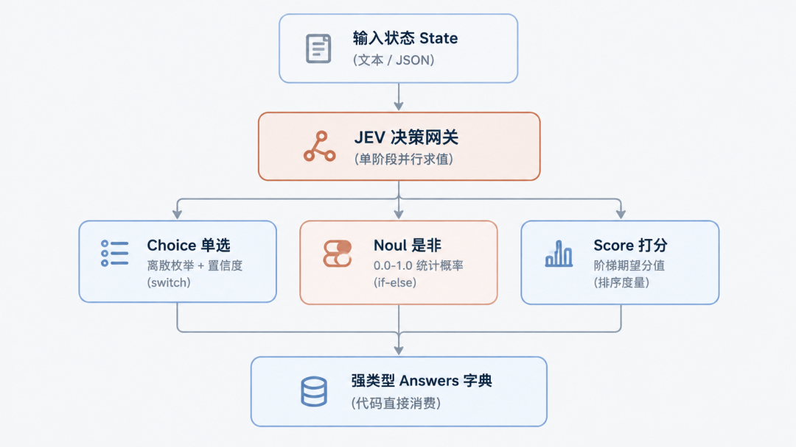
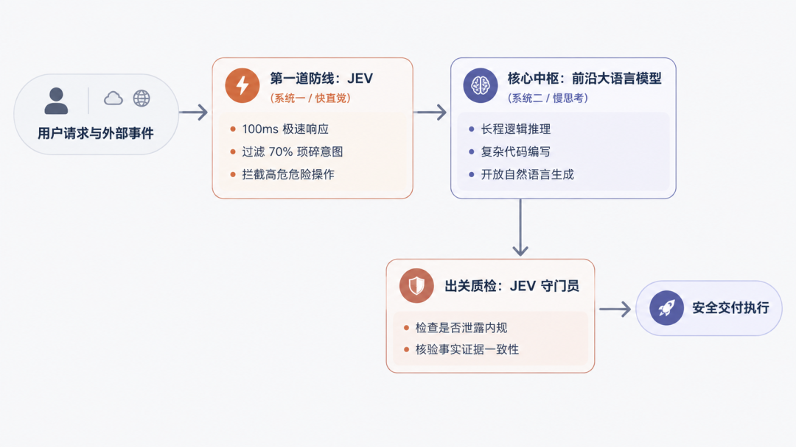

# JEV：在硅基世界掷圣杯

过去几年，全行业都在追逐那个能言善辩、无所不能的 AGI“圣杯”；但真实工业系统每天处理的成千上万次运转，并不需要一篇洋洋洒洒的小作文，只需要在分岔路口上，极为迅速、笃定地掷一次圣杯。

让大语言模型输出 JSON，正在成为现代软件工程里最昂贵、也最脆弱的妥协。

一个简单的条件分支判断，本该是程序世界里最轻量的工作，如今却往往要演变成一场漫长的等待：写上百字的系统提示词强行约束格式，让模型在后台自回归逐字敲出带有大括号的字符串，耗费两三秒钟，偶尔还会因为少了一个引号把下游服务搞崩；更荒谬的是，每一个为了拼凑格式而生成的序列化字符，都在按最昂贵的“输出 Token”价格计费。

9 月 15 日，一家名为 TypeSafe AI 的公司结束了长达两年的隐身状态，发布了一个奇特的新模型：**JEV**。

发布当天，JEV 登上 Hacker News 榜首，随后 Vercel AI Gateway 和 Cloudflare 火速宣布完成原生接入。这个模型最颠覆的地方在于：**它彻底被剥夺了说话的能力**。

它无法生成哪怕一句客套话，写不出一行代码，更不会输出连篇累牍的思维链过程。但只要把一段数据喂给它，并附上几个定义了形状的问题，它就能在几十到数百毫秒内，直接返回强类型的枚举结果或概率值，而且**输出 Token 永久不计费**。

在闽南与民间道家传统里，当人们面对不确定的境遇时，会向神明抛掷两片半月形的木块（称作“掷圣杯”或“掷筊”）：一正一反为“圣筊”，代表事情可行；双凸朝上为“怒筊”，代表断然不可；双平朝上为“笑筊”，代表因由未明、证据不足。

JEV 在现代软件栈里扮演的角色，恰恰就是这样一台**运行在硅基世界里的“高频预言机”**。它不负责描摹宏伟的蓝图，而是专门在代码最需要快速裁决的分岔路口上，替系统毫秒级地“掷一次圣杯”。

本文完全站在**使用者与系统开发者**的视角，不纠缠底层算法细节，系统拆解 JEV 是什么、为什么出现、具体怎么调用、能在哪些业务场景里实操、能帮业务省多少钱，以及如何将它与现有的 GPT/Claude 组合起来使用。

## 一、 JEV 是什么

如果用一句话概括 JEV：**它不是另一个聊天机器人，而是一个专做离散决策的类型化判断函数。**

### 1. 它是怎么交互的？

平时的 GPT 或 Claude 属于自回归生成模型，交互像是在跟一位顾问在线交流：发送一段文字，模型在后台逐字敲键盘，把一段长文本或带有结构的 JSON 字符串慢慢推流返回。

而 JEV 的交互契约极度干脆：

- • **给它一个状态（`state`）**：可以是一段长文本、一段运行日志，也可以是原生嵌套的 JSON 数据；
- • **给它一组具类型的问题（`questions`）**：明确指出这道题是单选题（Choice）、是非题（Noul），还是打分卡（Score）；
- • **它直接返回强类型字典（`answers`）**：没有任何寒暄与解释，直接给出选中的选项标识符、真实的统计概率分布以及置信度数值。

在底层实现上，它移除了传统大模型漫长逐字生成的解码过程，只对上下文数据做一次单向特征扫描，随后所有问题**完全并行计算**。在单次请求里问 1 个问题，和同时问 10 个问题，网络耗时几乎完全一样。



JEV 单阶段并行求值与三大决策原语工作流程
### 2. 三大核心决策原语：Noul、Choice 与 Score

为了让代码可以直接消费，JEV 把世界上所有的复杂决策归纳为了三个原子决策原语（Primitives）：

#### 原语一：Noul（是非判断：代码里的掷圣杯）

Noul 是**伯努利分布（Bernoulli）的缩写**。它专门回答真伪问题，直接返回一个 0.0 到 1.0 之间的经验概率标量。

- • 概率接近 1.0：对应“圣筊”，命题确凿成立；
- • 概率接近 0.0：对应“怒筊”，命题被明确否定；
- • 概率落在 0.5 附近：对应“笑筊”——**它代表当前证据不足以支撑判断或信息模糊，绝不代表“中等程度”**。
- • **特性**：Noul 不包含独立的置信度字段，因为这个二值概率本身就已经完整表达了把握的大小。

#### 原语二：Choice（单项选择：代码里的 switch-case）

从预先提供的一组选项（最多支持 255 个）里选出一个最佳答案。

- • 返回字段包括：选中的 `choice`、所有选项各自的 `probabilities` 概率分布，以及一个整体的 `confidence`（置信度）。
- • 如果输入的内容模棱两可，所有选项的概率被严重平摊，`confidence` 就会骤降接近于 0。代码只需检查这个数值，就能直接决定是否触发人工审核或走降级分支。

#### 原语三：Score（阶梯评分：有序标尺打分）

给状态在 2 到 10 个预设的语义台阶上打分。

- • 开发者按由低到高的顺序描述每个级别（例如 0 级是心平气和，1 级是略有抱怨，2 级是极度愤怒）。
- • JEV 返回概率加权后的**连续期望分值（例如 1.42 分）**。代码拿到这个分值，可以直接做阈值比较或列表排序，无需编写提示词要求大模型自行换算。

## 二、 它为什么会在这个时间点冒出来？

了解 JEV 的背景，有助于建立对现代 AI 工程分工的清晰体感。

### 1. 创始人背景：ChatGPT 联合发明人的“自我修正”

TypeSafe AI 创始人兼 CEO **Diogo Almeida** 是前 OpenAI 核心能力研究员。2022 年那篇让语言模型学会听懂人类指令并奠定 ChatGPT 基石的经典论文 Training language models to follow instructions with human feedback，他就是共同作者之一。

正是这位亲手参与教会大模型“像人一样聊天”的发明人，在隐身研发两年并获得 4000 万美元种子轮融资后，推出了这个绝不说话的模型。

他的公开反思非常直接：

“在共同发明了 ChatGPT 之后，我一直在问自己：为什么超人类的聊天模型没有带来真正的生产力自动化？”

原因在于：**聊天模型是为了让人类读着顺耳而优化的，但真实的工业代码流水线里，机器与机器之间的自动化通信占了 99%，人机对话只占 1%。代码不需要一个跟你客客气气的 AI 顾问，代码需要一个安分守己、输出可预测的执行零件。**

### 2. 软件工程撞上的四堵“工程墙”

如果过去在实际项目中频繁接入过各类大模型，多半对以下四种困境深有体会：

1. 1. **语义强拗**：业务只是需要判断用户想退款还是想换货，开发者却不得不写上百字的 System Prompt 逼大模型输出 `{"intent": "refund"}`，再用客户端代码反序列化。这无异于“拿文字打印机去模拟晶体管电路”。
2. 2. **延迟阻断**：哪怕选最便宜小巧的生成模型，为了逐字吐出那几十个字符的 JSON，也需要等上 1 到 5 秒。在交互式工具调用和高频循环任务里，这几秒钟足以毁掉所有流畅体验。
3. 3. **输出成本倒挂**：行业内公认“输出 Token 比输入贵数倍”。喂进去几千字的上下文日志，为了拿一个词的判定，却要为一整段括号、字段名等语法字符支付高昂的解码费用。
4. 4. **格式崩溃与虚假自信**：无论给模型下多严格的 Schema 指令，在高并发下偶发性的格式损坏总难以杜绝；更麻烦的是，传统模型为了显得博学，往往带着谄媚习惯，明明不确定的事情也能编造得合情合理。

JEV 的诞生，正是为了把“生成文本”和“做出决策”这两件事彻底剥离。

模型被命名为 JEV，直接致敬了 19 世纪英国经济学家威廉·斯坦利·杰文斯提出的 **杰文斯悖论（Jevons Paradox）**：**当某种资源的利用效率大幅提高、边际成本急剧下降时，该资源的总消耗量不但不会减少，反而会迎来爆发式增长。**

当一次具备通用常识的语义裁决成本降低数百倍、耗时进入百毫秒级别时，开发者不会减少对 AI 的使用，而是会把过去由于太慢、太贵而绝不敢接入 AI 的地方，全部换上这种毫秒级的智能开关。

## 三、 怎么用？API 格式与调用实操

JEV 现已接入主流平台（包括 Vercel AI Gateway、Cloudflare Workers AI、OpenRouter 以及官方 API），调用接口非常直观。

### 1. 真实的 HTTP 请求与响应

下面是一个标准的调用请求，演示如何在单次请求中把三种原语组合在一起使用：

#### 请求示例（POST）

```
{
  "model": "typesafe/jev-1.13",
  "state": {
    "ticket_id": "T-9021",
    "customer_message": "我昨天买的鼠标滚轮是坏的，包装也破了，等了三天才到货，我现在非常生气，请立刻给我退款！",
    "order_amount": 199.00
  },
  "questions": {
    "department": {
      "type": "choice",
      "instructions": "根据 `customer_message` 判断该工单应当流转给哪个处理部门？",
      "criteria": {
        "refund_dept": "明确要求退款、退货或退差价",
        "logistics_dept": "询问快递位置、催件或包裹破损责任",
        "tech_support": "设备使用问题、固件升级或使用指导"
      }
    },
    "demands_refund": {
      "type": "noul",
      "instructions": "`customer_message` 是否明确表达了退款诉求？"
    },
    "anger_level": {
      "type": "score",
      "instructions": "评估客户在 `customer_message` 中表现出的愤怒与不耐烦程度。",
      "criteria": [
        "语气客气，仅阐述客观事实",
        "略感不耐烦，有情绪抱怨但克制",
        "极其愤怒，要求立刻处理并带有强烈抗议"
      ]
    }
  }
}
```

注意细节：在 `instructions` 中可以使用反引号点名路径（如 ``customer_message``），JEV 能够精准穿透嵌套的 JSON 字典锁定特定字段。

#### 响应结果（Response）

```
{
  "answers": {
    "department": {
      "type": "choice",
      "choice": "refund_dept",
      "confidence": 0.94,
      "probabilities": {
        "refund_dept": 0.96,
        "logistics_dept": 0.04,
        "tech_support": 0.00
      }
    },
    "demands_refund": {
      "type": "noul",
      "noul": 0.99
    },
    "anger_level": {
      "type": "score",
      "score": 1.91,
      "legend": {
        "0": "语气客气，仅阐述客观事实",
        "1": "略感不耐烦，有情绪抱怨但克制",
        "2": "极其愤怒，要求立刻处理并带有强烈抗议"
      },
      "probabilities": {
        "0": 0.00,
        "1": 0.09,
        "2": 0.91
      },
      "confidence": 0.88
    }
  },
  "usage": {
    "input_tokens": 312,
    "output_tokens": 0
  }
}
```

可以看到一个显眼的细节：**`output_tokens` 永远为 0**。拿回来的就是清洗完毕的强类型数据，没有多余的字符串等待反序列化。

### 2. 投机式并发（Speculative Fan-out）特性

在传统模式下，如果要根据工单类别再决定是否打分，通常需要两阶段串行调用：

- • 第一步：调用大模型判断是不是故障（等 2 秒）；
- • 第二步：如果是故障，再发起一次调用判断严重等级（再等 2 秒）。

在 JEV 中，这种串行思维需要彻底转变。因为所有问题在底层是单次并行处理的，增加问题不消耗额外输出 Token，也不增加等待时间。**最佳策略是把决策树后续所有可能用到的问题一次性全问完**：

- • 同时问类别、严重度、是否退款、情绪等级；
- • 响应在 200 毫秒内整体返回；
- • 由本地代码根据第一个答案决定是否消费后面的字段，不用的答案直接丢弃。

这种模式被称为**投机式并发（Speculative Fan-out）**，它用极低的成本直接抹平了两阶段串行网络往返的开销。

## 四、 它到底能拿来做什么？

抛开抽象的概念，看看开发者在四个极具极客味道的真实场景里，是如何把 JEV 当作“代码预言机”嵌入系统的。

### 用法一：让浏览器 Agent 飞起来的“动静解耦”

以往让 AI 操控浏览器（例如查机票、自动化填表），通用的做法是每走一步，就截一张全屏高清图丢给多模态大模型。大模型在云端慢慢看图、推演、生成 JSON，单步往往要等 3 到 5 秒。查一次航班从打开网页到选定日期，动辄耗费一分多钟。

开源项目 `browser-use/jev-ultrafast` 探索出了一种完全不同的 **动静解耦** 思路：

- • **不截全屏图片**：直接由浏览器底层驱动把当前页面的 DOM 抽成纯文本的候选元素清单；
- • **动作只做单选**：把浏览器的操作离散化为有限几个选项（点击、滚动、等待），与目标元素编号一并交给 JEV。JEV 单步决策仅耗时 **178 毫秒**；
- • **关键解耦**：整个操作循环完全不需要大语言模型介入；**只有在需要输入自然语言文本（例如在搜索框里输入“苏黎世”）时，系统才单独唤醒轻量大模型去写具体的字符串**。

```
def browser_step(dom_elements: list[str], task_goal: str):
    # 第一步：高频动作由 JEV 毫秒级敲定
    payload = {
        "model": "typesafe/jev-1.13",
        "state": {
            "goal": task_goal,
            "visible_dom": dom_elements
        },
        "questions": {
            "action": {
                "type": "choice",
                "instructions": "为完成目标，当前视口下一步应当执行什么操作？",
                "criteria": {
                    "click": "点击特定按钮、输入框或链接",
                    "scroll": "当前视口未出现目标元素，需要向下滚动寻找",
                    "finish": "任务目标已经达成"
                }
            },
            "target_id": {
                "type": "choice",
                "instructions": "如果执行点击，应当点击候选列表中的哪一个元素编号？",
                "criteria": {elem_id: desc for elem_id, desc in parse_candidates(dom_elements)}
            }
        }
    }

    resp = requests.post("https://api.typesafe.ai/v1/systemone", json=payload).json()
    action = resp["answers"]["action"]["choice"]
    target = resp["answers"]["target_id"]["choice"]

    # 第二步：常规交互直接执行，仅在打字时才唤醒大模型
    if action == "click":
        if is_input_field(target):
            # 只有输入框需要动用大模型编写文本
            text_to_type = call_small_llm(f"为目标【{task_goal}】生成输入内容")
            browser.type(target, text_to_type)
        else:
            browser.click(target)  # 常规点击直接执行，零延迟等待
```

- • **实测成果**：在 Google Flights 真实查机票测试中，整个自动化链路仅耗时 **7.09 秒**，总 API 开销仅为 **$0.0039**。彻底颠覆了以往浏览器自动化极度迟缓的刻板印象。

### 用法二：给命令行装上“毫秒级安全刹车片”

在 Claude Code、Codex 等开发工具中，给智能体执行终端 Shell 命令的权限极其方便，但又时刻面临误执行高危指令（如意外删除生产代码或硬清空目录）的风险。

如果每跑一条命令都让传统大模型反思审核一次，每次执行前都要卡顿几秒钟，开发者的心流会被彻底打断。Vercel 团队在其命令行自动化中，直接换用 JEV 充当命令拦截器：

```
def verify_command_safety(command_str: str, current_dir: str) -> bool:
    payload = {
        "model": "typesafe/jev-1.13",
        "state": {
            "cwd": current_dir,
            "command": command_str
        },
        "questions": {
            "risk_verdict": {
                "type": "choice",
                "instructions": "评估该命令在当前目录执行的潜在破坏性与不可逆风险",
                "criteria": {
                    "safe": "只读查看、常规单元测试、安全构建或标准依赖安装 (如 git status, npm test, ls)",
                    "dangerous": "硬删除、覆盖敏感配置、修改全局环境变量或涉及外部不可逆推送"
                }
            }
        }
    }

    resp = requests.post("https://api.typesafe.ai/v1/systemone", json=payload).json()
    verdict = resp["answers"]["risk_verdict"]

    # 结合置信度与选项进行双重拦截
    if verdict["choice"] == "dangerous" or verdict["confidence"] < 0.70:
        print(f"[安全拦截] 发现高危或把握不足的指令: {command_str} (置信度: {verdict['confidence']})")
        return False  # 触发中断，弹出终端要求人工手动敲击 Y 确认

    return True  # 毫秒级无感放行
```

- • **生产实测对比**：在 210 次独立命令的对照测试中，JEV 的准确率高达 **98.6%**，中位延迟仅 **312 毫秒**，p95 尾部延迟仅 **374 毫秒**；而对照组的 GPT-5.6-luna p95 延迟高达 **6,583 毫秒**。速度提升近 **18 倍**，使“执行每条命令都必须过审”从严重卡顿变成了近乎原生的顺畅体验。

### 用法三：不看画面的“超级马里奥 / 毁灭战士外挂”

让 AI 玩游戏（如红白机《超级马里奥》或《毁灭战士 DOOM》），传统思维总觉得必须把游戏画面一帧帧截成视频流交给多模态大模型推演。但自回归模型以秒为单位的延迟，让游戏里的角色还没迈出第二步，就早已掉进深渊摔死了。

开源项目 `typesafe-mario` 展现了截然不同的解法：

- • **剥离高维视觉像素**：底层模拟器代码直接读取游戏内存（RAM）里的纯结构化实体数据（马里奥当前速度、前方第一个水管的相对距离、板栗仔敌人的 X/Y 坐标）；
- • **三大原语协同上阵**：将这些内存状态组装为 JSON，以 **每秒 10 次（10Hz）** 的超高频节奏调用 JEV：
  - • **Choice**：选择手势方向（向左跑、向右跑还是静止）；
  - • **Noul**：毫秒级断言跳跃时机（前方 20 像素内是否存在障碍，是否立即触发跳跃键）；
  - • **Score**：评估当前视口的整体综合危险等级。

```
{
  "model": "typesafe/jev-latest",
  "state": {
    "mario": { "x": 120, "y": 64, "speed_x": 3.2, "status": "small" },
    "nearest_enemy": { "type": "goomba", "dist_x": 18, "dist_y": 0 },
    "nearest_pipe": { "dist_x": 52, "height": 32 }
  },
  "questions": {
    "press_jump": {
      "type": "noul",
      "instructions": "根据障碍物距离与敌人间距，当前帧是否必须立刻触发起跳？"
    },
    "move_direction": {
      "type": "choice",
      "instructions": "决定马里奥的手柄十字键方向",
      "criteria": {
        "right": "安全向前推进",
        "left": "需要向后拉扯规避碰撞",
        "stop": "原地急停等待障碍消失"
      }
    }
  }
}
```

- • **运行收益**：没有语言，没有解释，一秒钟执行 10 次前向决策，每小时消耗的 API 费用加上电费还不到几块钱。它生动展示了：**一旦抛弃了不必要的自然语言外衣，AI 能直接嵌入毫秒级的物理控制闭环。**

### 用法四：链上高频做市与“策略交通警察”

在去中心化金融（DeFi）与高性能链（如 Monad 的 300 毫秒区块时间）上，自动化做市机器人面临极其严苛的延迟竞争。

社区最初有人尝试直接拿 JEV 去看盘口价格数字猜涨跌，跑了上百笔模拟交易，结果平仓胜率只有 30%，产生的手续费把利润吃得一干二净。这一反面案例迅速让开发者清醒过来：**JEV 不是计算器，它没有任何连续时间序列与复杂浮点运算能力，让它直接看价格猜涨跌是用其短板去赌博。**

真正精妙的用法，是把 JEV 当作量化系统里的 **策略交通警察（Meta-Controller）**：

- • 盘口买卖点差、滑点计算与具体限价单依然由纯数学算法和 C++ / Rust 代码执行；
- • JEV 专门负责在上层实时感知市场体制（Market Regime）的变化：
  - • 识别当前是震荡行情、单边逼空，还是突发黑天鹅流动性抽干；
  - • 用 Choice 毫秒级决定切换调用哪一套底层的量化策略（如网格做市、动量突破、还是完全防守）；
  - • 用 Noul 或 Score 评估异常风险，一旦置信度暴跌，直接触发代码级的风控熔断。

```
def meta_risk_controller(market_state: dict):
    payload = {
        "model": "typesafe/jev-1.13",
        "state": market_state,
        "questions": {
            "active_strategy": {
                "type": "choice",
                "instructions": "根据盘面波动率与订单簿深度，裁决当前最适配的执行策略",
                "criteria": {
                    "mean_reversion": "波动平缓、价差收窄的震荡做市策略",
                    "trend_following": "成交量放大、单边突破的趋势跟踪策略",
                    "circuit_breaker": "突发大单抛售、流动性骤降的避险撤单模式"
                }
            },
            "is_toxic_flow": {
                "type": "noul",
                "instructions": "当前盘口是否表现出明显的知情者毒性流攻击特征？"
            }
        }
    }

    resp = requests.post("https://api.typesafe.ai/v1/systemone", json=payload).json()
    strategy = resp["answers"]["active_strategy"]["choice"]
    toxic_prob = resp["answers"]["is_toxic_flow"]["noul"]

    # 策略路由与风控熔断完全由确定性代码执行
    if toxic_prob > 0.80 or strategy == "circuit_breaker":
        execution_engine.cancel_all_orders()  # 毫秒级紧急撤单熔断
    else:
        execution_engine.switch_strategy(strategy)
```

- • **架构启示**：这一模式代表了 JEV 在复杂系统中的终极定位——**不直接下场进行微观计算，而是在多套确定性算法之上，扮演那个毫秒级、带常识的调度中枢与风控闸门。**

## 五、 成本和性能的经济账

谈论新工具如果不算经济账和性能账，就脱离了工程实际。

### 1. 价格计算表（每 100 万次调用的账单对比）

假设一个典型的判断场景：输入一段 800 Token 的上下文（用户消息 + 背景知识），输出一个简单的分类判断。

| 模型方案 | 输入单价 | 输出单价 | 100 万次调用的输入成本 | 100 万次调用的输出成本 (约 50 Tokens/次) | 综合总开销 |
|---|---|---|---|---|---|
| **主力大模型** (如 Claude Sonnet) | $3.00 / MTok | $15.00 / MTok | $2,400 | $750 | **$3,150** |
| **同级生成小模型** (如 GPT-5.6-luna) | $0.20 / MTok | $1.20 / MTok | $160 | $60 | **$220** |
| **TypeSafe JEV** | **$0.042 / MTok** | **$0.00 (免费)** | **$33.60** | **$0.00** | **$33.60** |

- • **账面结论**：对比大模型，成本直降 **90 倍以上**；即使对比专门用来省钱的轻量小模型，JEV 的总开销依然便宜了 **近 7 倍**。
- • 为什么能省这么多？核心原因在于它**彻底没有输出费用**。传统模型哪怕只输出一个布尔值，也要为了那一串 JSON 序列化字符支付最昂贵的“输出 Token”单价。

### 2. 延迟体验体感

- • **传统生成式模型**：建立连接 → 自回归逐字解码 → 耗时 1,500ms ~ 5,000ms；
- • **JEV 决策模型**：建立连接 → 单次前向计算 → 耗时 100ms ~ 350ms；
- • **体感差异**：几秒的等待会迫使前端展示 Loading 动画，破坏交互式操作；而 200 毫秒以内的响应在人类感官中几乎等同于“即时触发”。

## 六、 LLM 的最佳辅助

很多开发者初看 JEV，容易产生非黑即白的误解：有了 JEV 是不是就不用大模型了？或者 JEV 是不是想取代现有的 LLM？

**完全相反。JEV 与大模型是天造地设的“快慢双脑”搭档。**

借用丹尼尔·卡尼曼在《思考，快与慢》中的经典理论：

- • **System 1（系统一 / 快直觉）**：对应 JEV。极速、低耗能、不说话、基于模式匹配的反射神经，负责高频过滤与即时断案。
- • **System 2（系统二 / 慢思考）**：对应 GPT / Claude。慢速、高耗能、善于逻辑演绎、代码生成与长篇创作的大脑皮层。



JEV 与前沿大模型的“快慢双脑”混合协同架构
### 1. 黄金选型判据（The Boundedness Rule）

在日常开发中，究竟什么时候该唤醒 JEV，什么时候必须留给大模型？一线架构师总结出了一条极度清晰的法则：

**“这个问题的答案，能不能在执行前被写成一张有限的清单？** **能列成清单的，交给 JEV；需要从虚无中创造出开放内容或复杂代码的，必须留给大语言模型。”**

- • 从 10 个预设工具里选出该调哪一个？——**选项有限，交给 JEV**。
- • 编写调用该工具所需要的长 SQL 语句或动态脚本？——**开放生成，必须交给 LLM**。
- • 判断这段用户投诉算不算故障？——**是非问题，交给 JEV**。
- • 给客户写一封安抚情绪、语气得体的长封回信？——**开放语言，必须交给 LLM**。

### 2. 核心架构法则：AI 负责执行，代码掌控全局

在以往的 Agent 架构里，开发者习惯把控制权一股脑推给大模型，让大模型在提示词里决定整个系统的命运，结果往往是系统发散不可控。

引入 JEV 后的现代架构核心原则是：**“AI executes, code decides”（AI 负责模式识别，传统代码牢牢掌控系统的控制流与决定权）。** 业务逻辑永远写在确定性的代码里，JEV 只是代码在遇到语义分岔时，顺手扔出去求签的一个高精度神谕工具。

## 七、 神谕的短板

把 JEV 捧上神坛是危险的。官方技术文档与社区的大规模实测，同样揭示了它在应用层上的几个明确软肋。开发接入时必须做好防御性准备：

### 1. 类型安全不等于答案正确（Type Safe ≠ Factually Accurate）

JEV 承诺的“0% 格式错误”，意味着它返回的对象绝对合法，绝不会缺括号少引号，也绝不会返回未定义过的野路子枚举。 但这**绝对不代表它的判断一定是对的**。在公开事实评测基准中，JEV 的实际推理准确率约为 **67.8%**（相当于当前中档模型的平均智力水平，显著低于重度推理模型）。它依然可能会非常笃定地选出一个错误答案。因此，涉及重大风险的操作，必须结合置信度门禁（如 `confidence < 0.8` 必须人工确认）。

### 2. 警惕“静默失败（Silent Failure）”

传统大模型发疯时，往往伴随着 JSON 解析崩溃、乱码或一眼就能看穿的胡话，这类错误很容易被异常捕获机制截获。 而 JEV 的失败极其隐蔽：它返回一个完完整整的枚举值，附带看似合理的概率。如果外围代码没有防御性校验，这种“静默错误”会在系统全自治运行中悄悄蔓延。

### 3. 它绝对不是计算器（Not a Calculator）

**JEV 没有任何基础算术、字符计数和时间比对能力。**

- • 问它一段文本里某个词出现了几次？——它算不准；
- • 让它计算商品打了八折后是多少钱？——它不会算；
- • 让它对比两个日期谁早谁晚？——它只把日期当成普通字符串，完全没有时间轴概念。

**所有的计数、求和、金额计算与时间差运算，必须全部写在自己的代码里！** 先用正则表达式或数据解析器把候选数字提取出来，再交给 JEV 做单选，算术永远留在本地。

### 4. 给选项留一条“逃生通道”

在编写 `choice` 问题的 `criteria` 时，**永远记得加上一个类似 `other`、`none` 或 `insufficient` 的保底选项**。 因为 JEV 是从给定的集合里做排他选择，如果现实发生的情况超出了预设列表，而又没给它留后路，它就会被迫把概率投射到最不相干的选项上，引发灾难性的误判。

### 5. 语言环境的工程建议

本文中的示例为了方便中文读者阅读理解，问题指令与选项均采用了中文编写。不过在实际生产环境中，由于 JEV 的底层训练语料偏向英语，**官方更推荐采用“规范的英文问题骨架 + 原始的中文业务数据”的组合方式**——即 `instructions` 和 `criteria` 保持为标准英文，待判断的 `state` 原样传入中文数据。这种组合在实测中能够兼顾最高的语义敏感度与最低的跨语言损耗。

## 八、 结语

在计算机科学诞生的最初几十年里，软件是由清晰的条件分支、严丝合缝的状态机和数学逻辑构筑起来的精密机械。

生成式大模型的到来，给冷冰冰的代码世界注入了前所未有的常识与灵气；但过去几年对“通用造神”的过度狂热，也让很多系统陷入了漫长等待、频繁格式崩溃与昂贵账单的工程泥潭。

JEV 的出现，像是一场及时的退火。

它没有去争夺那个全知全能的聊天霸权，而是极度克制地退回到了一个最务实的生态位：**它自废了长篇大论的武功，变成了一柄极速、强类型且输出免费的“代码手术刀”**。

它负责在毫秒之间落下一枚枚精准的是非断言；大模型负责退居二线进行深度长程推演；而传统代码，则重新夺回了对系统最高意志的控制权。

代码负责算账，大模型负责思考，而 JEV 负责在每一个关键分岔路上，替系统稳稳地掷出那一次圣杯。

这场在硅基世界里展开的全新分工，才刚刚拉开序幕。

## 参考资料

- • TypeSafe AI 官方文档：https://docs.typesafe.ai/introduction
- • JEV 1.13 已知局限与边界说明：https://docs.typesafe.ai/model-jaggedness/jev-1.13
- • TypeSafe 官方博客《Introducing System One Models & Jev》：https://typesafe.ai/blog/introducing-system-one-models-and-jev
- • Vercel AI SDK 7 核心评估原语文档：https://ai-sdk.dev/docs/ai-sdk-core/evaluation
- • Cloudflare Workers AI 模型文档（typesafe/jev）：https://developers.cloudflare.com/ai/models/typesafe/jev/
- • Try JEV 在线交互控制台源码：https://github.com/sugarforever/tryjev
- • browser-use / jev-ultrafast 极速浏览器 Agent 开源项目：https://github.com/browser-use/browser-use
- • typesafe-mario 模拟器高频内存决策开源项目：https://github.com/fhshaik/typesafe-mario
- • jev-trader 链上高频做市策略实验项目：https://github.com/jarrodwatts/jev-trader

