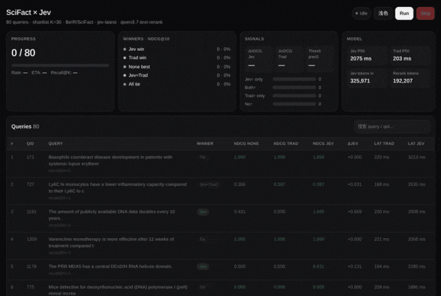
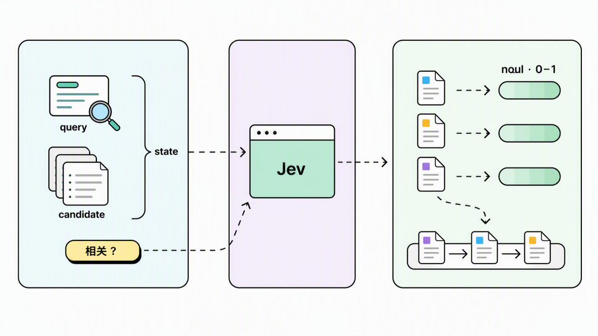
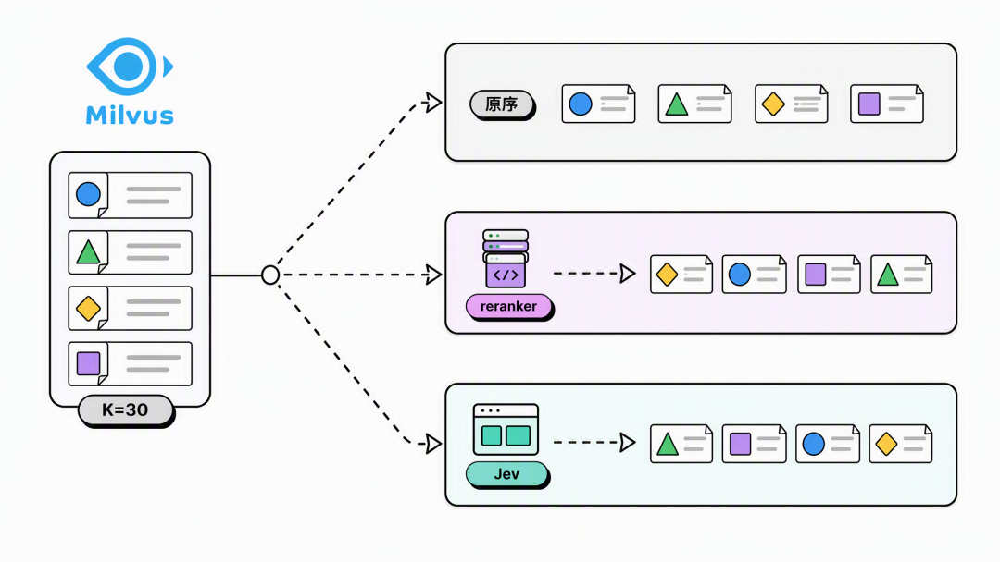
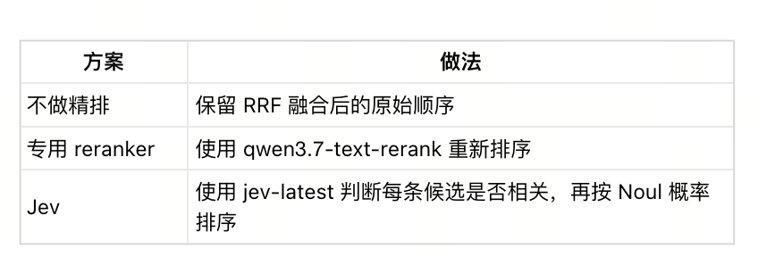
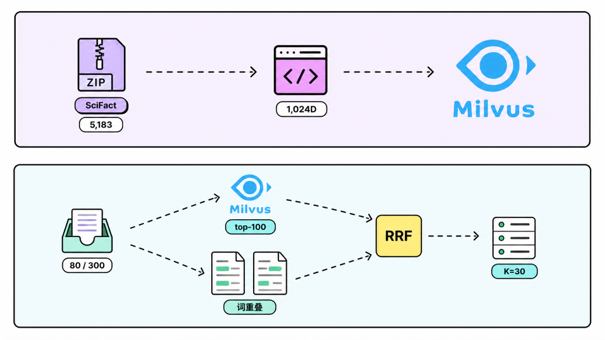
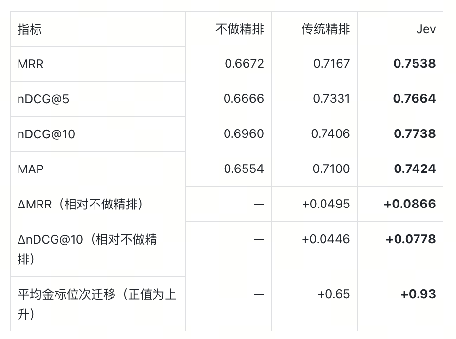
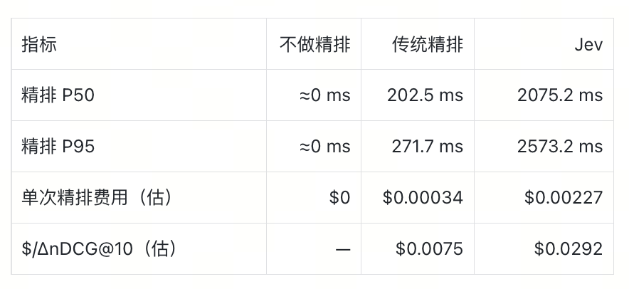
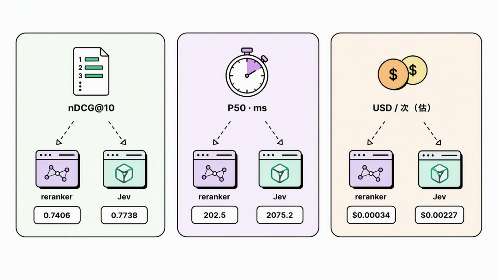
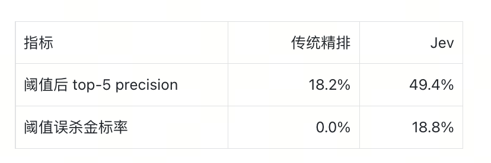
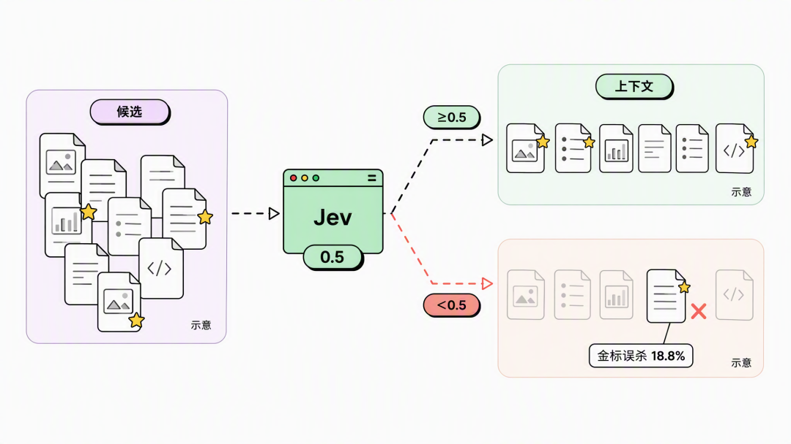

# 实验对比｜爆火的Jev能替代Rerank模型吗？


前不久，TypeSafe发布的 Jev模型，很快引发全网刷屏。

作为全球首个System One Model， Jev和我们熟悉的 LLM 不同，它的目标不是生成文字，而是接收当前状态和一组明确的问题，直接返回程序可以使用的结构化判断和概率。

相比传统大模型，它的效率更高，成本更低。这也使得Jev在搜索、浏览器 Agent、上下文管理、reranking 场景中，具备相当的优势。

比如在做rerank的时候，过去我们需要使用专用 reranker或者让 LLM 判断每篇文档是否相关；换成 Jev，则可以直接询问每篇候选是否与 query 相关，再把返回概率用于排序。


但Jev 相比现有 reranker到底表现如何？

我们做了一组实验。以Milvus作为默认的向量数据库，然后对比：不做精排、qwen3.7-text-rerank 精排和 Jev 精排，比较三者的排序效果与调用代价，并进一步测试阈值过滤表现。



## 01 · Jev 是如何参与精排的？

召回结束后，reranker 会给候选重新打分。包括 qwen3.7-text-rerank 在内的专用 reranker，会根据 query 和候选文档输出分数，再按分数重新排序。

而Jev 提供的是另一种输出方式。Jev 的一次请求主要包含两部分：state 和 questions。state 是模型判断时需要看到的信息，questions 定义它要回答什么。它支持 Noul、Choice、Score 等不同类型的判断，其中 Noul 用于 Yes / No 问题，并返回 Yes 的概率。

因此，用 Jev 做 reranking 时，可以把“相关性”写成一个 Yes / No 问题：

Query: 用户的问题

Candidate: 候选文档

Question: 这条 Candidate 是否与 Query 相关？

假设三个候选分别得到：

```
Candidate A → 0.91
Candidate B → 0.34
Candidate C → 0.76
```

最终顺序就是：

```
A → C → B
```

Jev 不会生成“这篇文档为什么相关”的解释，也不会一次生成一整份排行榜。最终的排序，需要专门的代码来完成。

这套做法还有一个和普通生成模型不同的接口特点。

一次 Jev 请求可以同时包含多道 Noul，这些问题并行求值。questions 里也可以带结构化数据，例如固定一个主体，把不同候选分别放进多道 question，一次请求返回多个判断结果。

不过，这次实验没有使用这种批量写法。

我们采用了更直接的实现：

```
1 个 query
×
30 个 candidates
=
30 个 query-document pair
```

每个 pair 单独请求 Jev，再并发等待结果。

这也是 TypeSafe 当前官方 reranking cookbook 使用的方式：每个 candidate 一次调用，多条请求并发执行。

这点会直接影响后面的延迟结果。



## 02 · 实验设计思路

这次实验只比较固定候选集上的精排效果。因此，默认的向量数据库都选用 Milvus，三条路径本身也共享同一份 shortlist，观察后续的 MRR、nDCG、MAP 和金标位次变化。

数据集使用的是BEIR 中的 SciFact。SciFact 的任务是根据一条科学 claim，从论文语料中找到相关证据文档。整个语料包含 5,183 篇文档，测试集包含 300 条查询。这次按照固定随机种子抽取其中 80 条。



第一步：用 Milvus 生成候选集

先使用 qwen3.7-text-embedding 为 5,183 篇文档生成 1,024 维向量，写入 Milvus，检索度量使用 IP。

从 300 条测试查询中，按固定随机种子抽取 80 条。每条 query 先从 Milvus 中召回 top-100。

此外，考虑到只用向量检索容易漏掉部分关键词高度匹配的结果，因此实验另外增加了一路基于词重叠的检索，再用 RRF 融合两路排序，截取前 30 条，作为后续精排共同使用的 shortlist。

注：这里的关键词通道采用词重叠近似，没有使用 Milvus 原生 BM25。因此，这次实验只讨论固定候选集上的精排效果，不代表完整 Hybrid Search pipeline 的效果。

第二步：三种方案对比

拿到同样的 30 条候选后，分别进入三条方案实验测试：



embedding、Milvus、关键词召回、RRF 和候选数量全部保持一致。

这样，最终指标的变化主要来自精排。

第三步：怎么评价排序效果

我们主要看 MRR、nDCG 和 MAP，以及精排耗时和 token 用量这几个指标。

MRR 更关注第一条相关结果出现得够不够早。如果正确文档原本排在第 8，精排后到了第 1，MRR 会明显改善。

nDCG 关注的是前 K 个结果整体排得好不好。这次同时关注 nDCG@5 和 nDCG@10，因此不仅关注第一名，也关注前几位整体有没有变好。

MAP 会综合多个相关结果的位置。

除此之外，我们还统计了金标文档——也就是 SciFact 标注为相关的文档——在 rerank 前后平均移动了多少位。

排序完成后，根据 SciFact 的相关性标注计算指标。过滤实验中，传统精排使用中位数阈值，Jev 使用 0.5 阈值，分别统计过滤后的 top-5 precision 和金标误杀率；另外统计 Jev 分数不低于 0.7 的候选中，实际相关的比例。



## 03 · 实验结果：Jev 效果更好，但代价也明显更高

先说结论，三个方案的Recall@K 均为 90%（这主要是因为三种方案使用的是同一份候选集）。在固定召回结果后，Jev 的平均排序指标最高。



相对不做精排，传统精排的 nDCG@10 提高 0.0446，Jev 提高 0.0778。Jev 比传统精排高 0.0332。这组结果来自 80 条 SciFact 查询，尚未进行显著性检验。

但Jev 的调用代价更高：



Jev 的精排 P50 约为传统精排的 10.2 倍，单次估算费用约为 6.7 倍。所以，在离线检索、数据清洗或者不敏感于一两秒延迟的任务，Jev的优势会很突出，但是在线场景中，如果仅精排就增加接近两秒，后面的生成模型还没有开始工作，整体体验很容易被拖慢。

（实验记录的是本次逐候选并发调用的精排耗时，也就是说，这两秒不仅包含并发执行的时间，也包含30次独立 API 调用的开销。TypeSafe 当前官方 reranking cookbook 同样是一个 candidate 一次请求，再并发执行。但是在在线场景中，我们也可以尝试固定一个主体，把多个 candidate 分别放进多道 question，一次返回所有结果，来节约时间。

本系列下一篇文章，我们会分享jev的开源实现，来解决这些问题)



另外，考虑到 Jev 已经返回相关概率，能不能设置一个 threshold，直接删掉低分文档？这样不仅能排序，还能减少最终交给 LLM 的上下文。

因此，这次实验里，我们设计：

- qwen reranker 使用中位数阈值；
- Jev 使用 0.5 阈值。

结果如下：



Jev 使用 0.5 阈值后，top-5 precision 达到 49.4%，但同时误删了 18.8% 的金标。也就是说，它确实把候选集筛得更干净，但代价是丢掉了一部分真正相关的文档。对 RAG 来说，这个代价可能比多保留几条无关文档更严重，因为被删掉的可能正是回答问题所需要的证据。

另外，由于qwen 使用中位数阈值，Jev 使用固定 0.5，两边的过滤强度并不相同，这也会直接影响最终的实验结果。

因此，Jev 的概率可以直接用于候选过滤，但阈值需要根据 RAG 对“误删证据”的容忍度来调，实验中的0.5 并不是默认答案。



## 04 · 推荐几个 Jev 项目

如果想看看 Jev 除了精排还能怎么用，可以先从几个具体项目入手。

fast-jev-compaction是一个 Claude Code 插件。每次工具调用后，它让 Jev 判断哪些内容应该保留、压缩或丢弃，用来控制上下文不断膨胀。

jev-browser把 LLM 和 Jev 放在浏览器操作的不同位置：LLM 负责规划，Jev 负责判断页面上的具体选择，同时提供 CLI、Library 和 MCP 接口。

jev-search则把 Jev 放进搜索流程里，用来理解查询、选择信息源和筛选结果。这个思路和本文的精排比较接近，但判断范围已经从“文档是否相关”扩展到了整个搜索过程。

Reticle面向 Web 和桌面应用，为 Agent 增加运行时感知能力，帮助它理解自己当前正在操作的界面。

还可以看看Awesome Jev 项目目录。这是一个社区维护的项目集合，适合用来寻找新的接入方式和实验方向。目录中的性能数据来自各项目说明，使用时仍需要自己复核。

如果让编码助手协助接入 Jev，也可以安装 TypeSafe 官方 skill：

npx skills add typesafe-ai/skills --skill typesafe-ai

作者介绍

Zilliz黄金写手：尹珉

```
阅读推荐
官宣开源｜Milvus 3.0 正式发布
Aquila语义去重精读：训练数据里的语义重复，白白烧掉了多少 GPU 时？
从条件匹配到相似检索：同程旅行慧行搜索的火车换乘方案向量化实践
19 万 Star 之后，我给 DeepSeek Harness 接入了Milvus
我们给DeepSeek Harness接入了MemSearch ，自动把Memory提炼成Skill
深度教程｜毕昇如何用Milvus实现千人千权的企业级 RAG 检索
```

