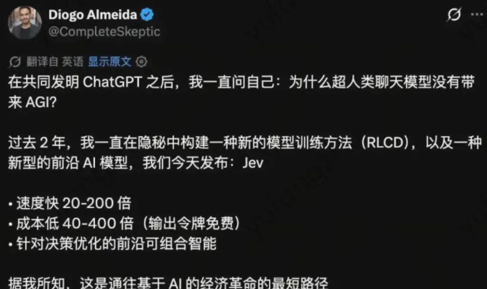
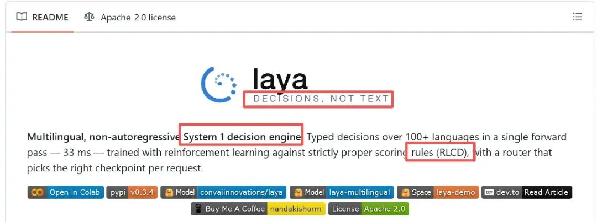
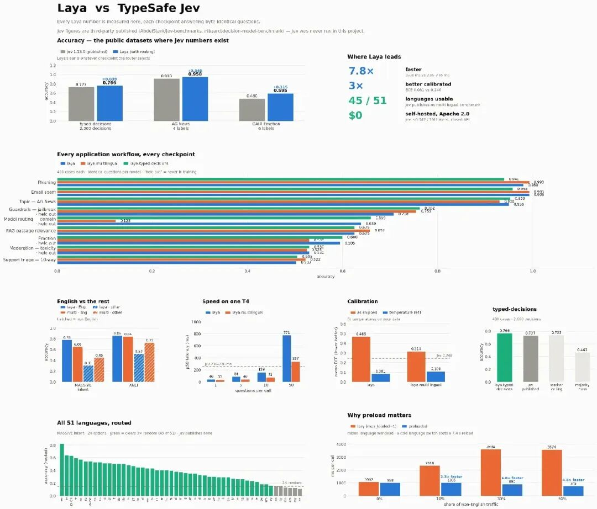
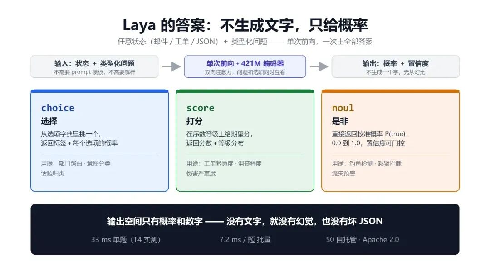
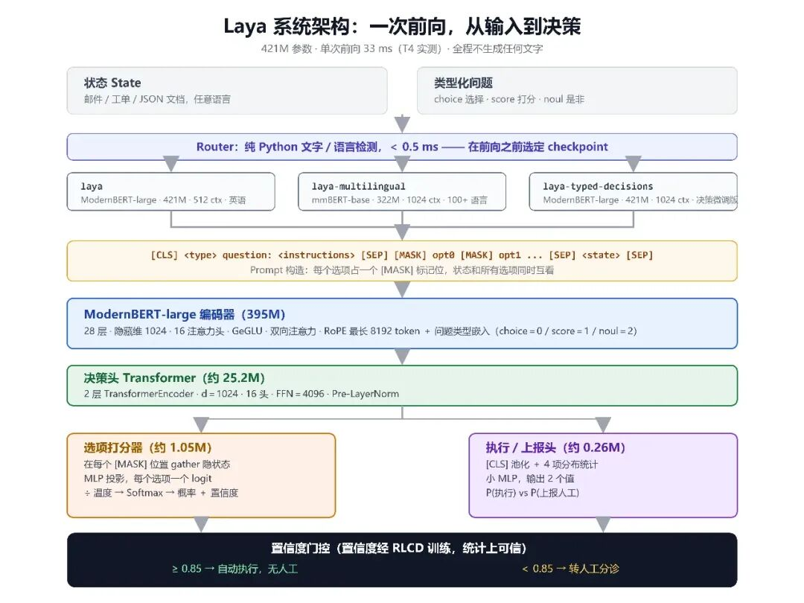
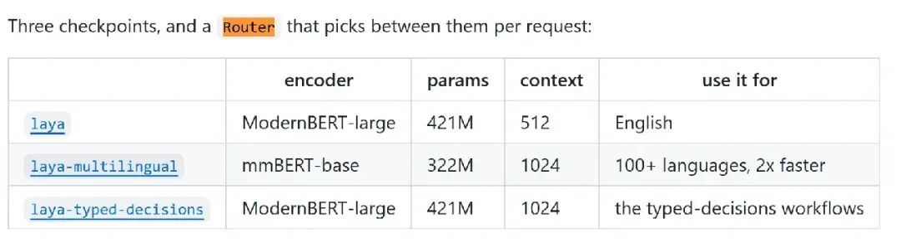
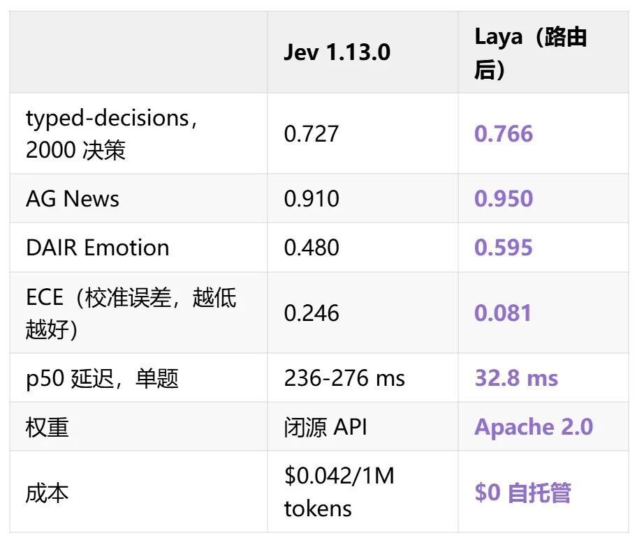
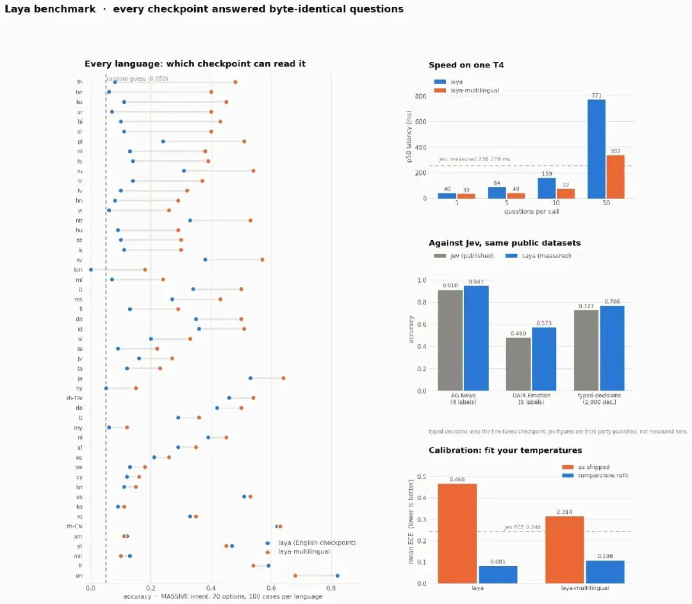
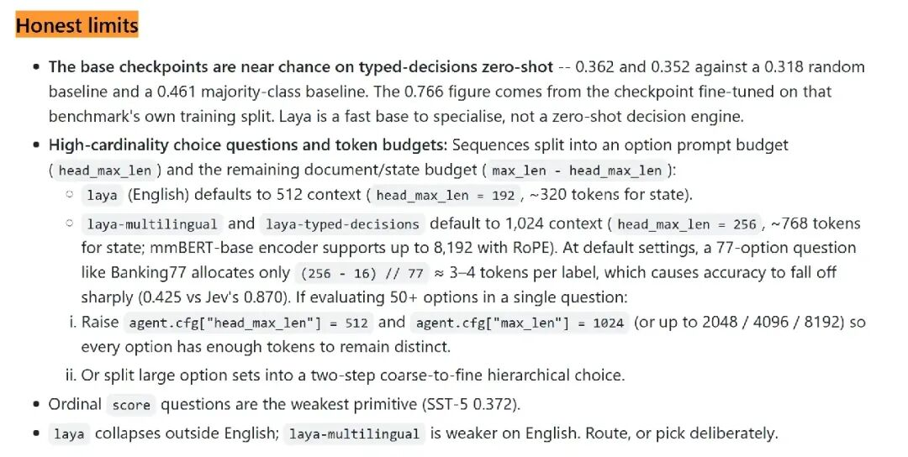

# 4.6k star，开源版Jev悄悄发布

近期，ChatGPT 的共同发明人 Diogo Almeida 创办的 TypeSafe AI 发布了 **Jev**，持续火爆。[杀疯了，字节豆包Skill竟能自动化了](https://mp.weixin.qq.com/s?__biz=Mzk0MTYzMzMxMA==&mid=2247512002&idx=1&sn=1e220b4710127998a3e94454842a3409&scene=21#wechat_redirect)



一个「非自回归决策模型」：**不生成文本，直接在结构化 schema 上给概率**，按 $0.042/1M tokens 计费，全新突破。



然后今天翻 GitHub 发现：同一个概念的开源实现，**4.6k star**，Apache 2.0，名字叫 **Laya**。


**工单分诊、钓鱼检测、越狱拦截这类「反射性小决策」，根本不需要会说话的模型——Laya 用一个 421M、不说一个字的开源小模型证明，它可以比闭源收费的 Jev 快 7.8 倍、准 3.9 个点、校准好 3 倍，而且免费。**



Laya 的输入是任意状态（邮件、工单、JSON 文档）加上一组「类型化问题」，所有问题在**单次前向**里一起出答案。问题只有三种形状：`choice` 从选项字典里挑一个，`score` 在序数等级上打分，`noul` 直接回答一个是非题。



Laya 方法要点：三个决策原语与单次前向
关键在于输出空间：**只有概率和数字，一个字都不生成**。没有文字，就没有幻觉；不写 JSON，就物理上不可能产出坏 JSON。在 T4 上实测，单题 33 ms，批量 7.2 ms 一题。



Laya系统架构
底子是 ModernBERT-large 双向编码器（421M 参数），每个选项占一个 `[MASK]` 标记位，编码后在这些位置上 gather 出每个选项的打分——这就是「非自回归」的全部含义：不用逐 token 生成，一次前向全出。训练用的是 RLCD（用严格适当评分规则当 reward 的强化学习），所以**置信度在统计上真的可信**，可以直接拿来做门控：置信度 ≥0.85 自动执行，否则转人工。



还有一个容易被忽略的设计：**Router**。Laya 有三个 checkpoint（英语版、100+ 语言版、typed-decisions 版），Router 在前向之前用不到 0.5 ms 的纯 Python 文字检测决定用哪个。为什么必须在前向之前？因为英语 checkpoint 遇上高棉语时是 **0.000 的准确率配上 0.952 的置信度**——错得理直气壮，模型自己的置信度根本不会报警。

## 证据：对 Jev 的实测对比

README 里的对比表相当完整，Laya 的数字全部为 T4 实测，Jev 的数字来自第三方发布（无 API 访问，口径不同，这点作者如实标注）：



两个细节值得单独说。一是 0.766 这个数字**越过了 0.735 的 teacher 自一致性上限**——微调后的学生模型比教它的 teacher 自己还稳定。二是在 DAIR Emotion 上，Jev 有 **16% 的样本给正确标签分配了零概率**——对任何基于置信度做分支的系统，这是硬故障，不是误差。



51 种语言逐语言准确率
多语言是 Router 存在的理由：英语 checkpoint 在 51 种语言上宏平均只有 0.227，多语言版把可用语言从 23/51 拉到 **45/51**，代价只是英语任务上让出一点点。Router 两头都拿最好的那个。

但真正让这个 repo 值得尊敬的，是「Honest limits」那一节：**基座 checkpoint 零样本接近瞎猜**——0.362 和 0.342，低于 0.461 的多数类基线，0.766 全部来自在该基准训练切分上微调过的版本。README 原话说得很直白：把 Laya 当「用来专精化的快底座」，不是零样本决策引擎。另外两个让步也给得干脆：50+ 选项的高基数场景 Jev 明显更强（Banking77 上 0.870 对 0.425，token 预算所限）；软分布匹配也输（0.471 对 0.580）。



```
Laya — Multilingual, non-autoregressive System 1 decision engine
https://github.com/NandhaKishorM/laya
https://huggingface.co/convaiinnovations/laya
```

[动手设计AI Agents：（编排、记忆、插件、workflow、协作）](https://mp.weixin.qq.com/s?__biz=Mzk0MTYzMzMxMA==&mid=2247492838&idx=2&sn=1e25832e7300ef312721325d0def30b4&scene=21#wechat_redirect)

[Loop工程已死，Graph工程永生](https://mp.weixin.qq.com/s?__biz=Mzk0MTYzMzMxMA==&mid=2247509270&idx=1&sn=53a5ffa2cd51583947e1cc379c8703d4&scene=21#wechat_redirect)

[一篇Loop+Harness的自进化Agent最新综述](https://mp.weixin.qq.com/s?__biz=Mzk0MTYzMzMxMA==&mid=2247508769&idx=1&sn=1c079514aee90450f55fccb41c7ec282&scene=21#wechat_redirect)

[2026，做Agentic AI，绕不开这两篇开年综述](https://mp.weixin.qq.com/s?__biz=Mzk0MTYzMzMxMA==&mid=2247508495&idx=1&sn=309c84ca5c2822416fddc1a9dd4f6048&scene=21#wechat_redirect)

已经读到这了，不妨点个👍、❤️、↗️三连，加个星标⭐，不迷路哦~

