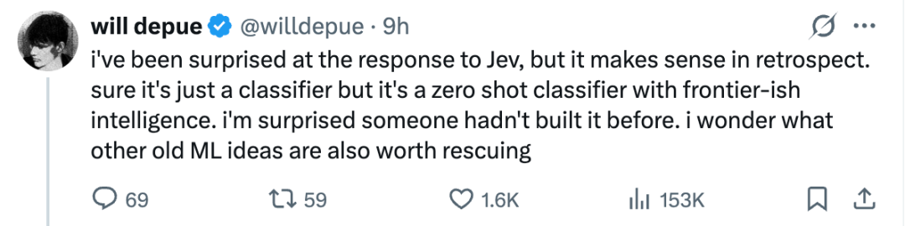
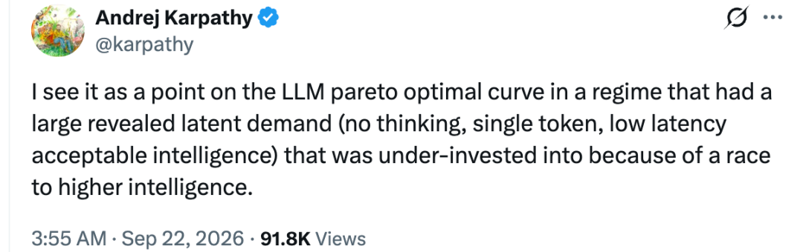
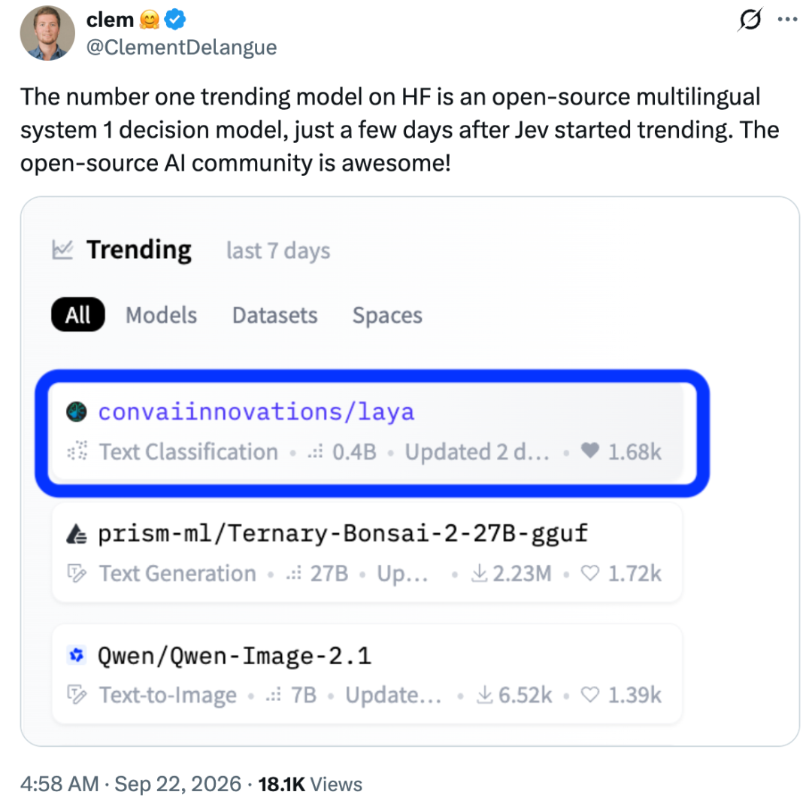
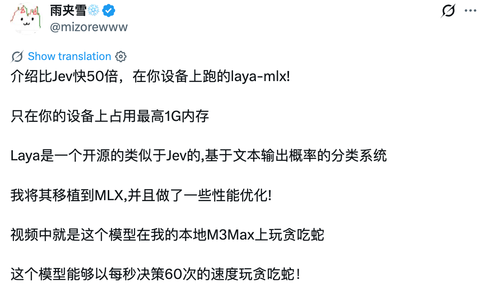
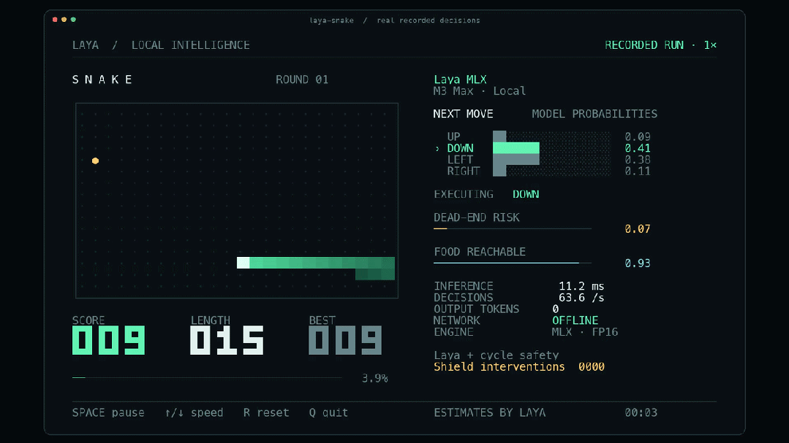
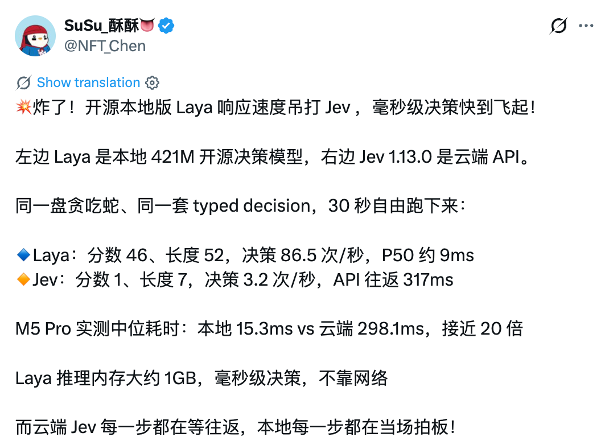
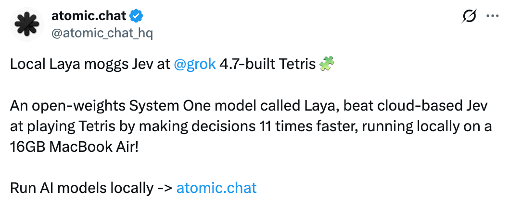
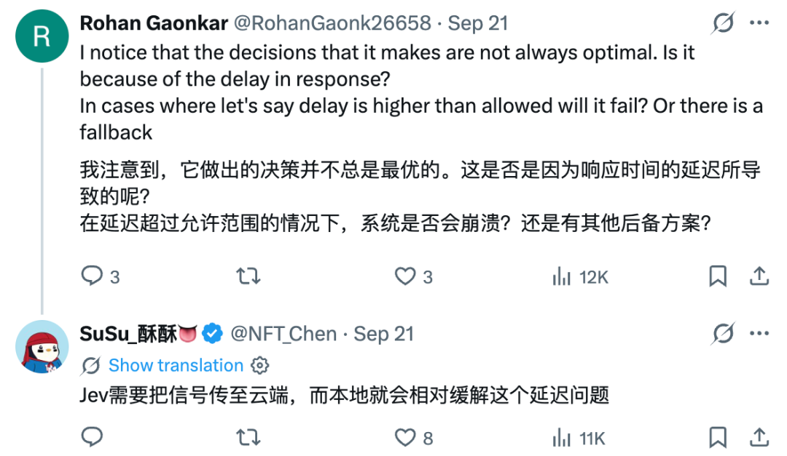

# 「开源版Jev」登上Hugging Face热榜第一

编辑｜杨文

这几天，Jev 模型在开发者社区引发讨论。

有网友认为，Jev 看起来只是分类器，却具备零样本能力和接近前沿模型水平的智能。许多曾被忽略的传统机器学习思路，或许值得重新挖掘。

Karpathy 对此评论称，Jev 处在大语言模型帕累托最优曲线上的一个位置，满足了一类长期被低估的需求，这类任务不要求模型展开复杂思考，只需输出单个 token，在低延迟条件下完成足够可靠的判断。

Jev 走红后，一个名为 Laya 的模型也迅速受到关注。

Laya 是一款开源多语言 System 1 决策模型，基于文本输出概率完成分类和选择。网友将其称为「开源版 Jev」。

目前，Laya 登上 Hugging Face 热门榜，随后出现了多个本地部署版本。

### Laya 几天内成为热门模型

Laya 的一个明显特点是支持本地运行。

社区项目 laya-mlx 将模型移植到 MLX，并进行了性能优化。

开发者介绍，模型在设备上运行时最高占用约 1GB 内存。在 M3 Max 上运行贪吃蛇，决策速度可达每秒 60 次。Core ML 版本在速度基本不变的情况下，功耗最高可降低 64%。

社区的一项对比测试使用 421M 版本 Laya 和云端 Jev 1.13.0，运行同一套 typed decision。

30 秒内，Laya 拿到 46 分，长度达到 52，平均每秒决策 86.5 次，P50 延迟约 9 毫秒；Jev 得分 1，长度 7，每秒决策 3.2 次，API 往返约 317 毫秒。

另一组 M5 Pro 测试显示，两者中位耗时分别为 15.3 毫秒和 298.1 毫秒，差距接近 20 倍。

在俄罗斯方块测试中，网友 atomic.chat 也称，Laya 在一台 16GB MacBook Air 上的决策速度约为云端 Jev 的 11 倍。

### 速度差异背后的部署取舍

这些结果首先反映了部署方式的差异。

Jev 每一步都要把请求发送到云端，再等待结果返回；Laya 直接在本地完成推理，不依赖网络。对于贪吃蛇、俄罗斯方块这类高频交互任务，几十到几百毫秒的延迟差距，足以改变最终表现。

网友调侃称，「上线三天的开源 Laya 击败发展两三年的 Jev」、「Jev 的护城河只维持了两天」。

Jev 和 Laya，展示了大模型竞争中的另一条路径，行业关注的不只有更长的思考和更复杂的推理，单步决策、低延迟和本地运行同样存在真实需求。

参考链接：

https://x.com/karpathy/status/2102124533729955960

https://x.com/ClementDelangue/status/2102140443194503358

https://x.com/atomic_chat_hq/status/2102160983409955244?s=20

https://x.com/NFT_Chen/status/2101675124747338229?s=20

https://x.com/mizorewww/status/2101473552956555427

© THE END

转载请联系本公众号获得授权

投稿或寻求报道：liyazhou@jiqizhixin.com

