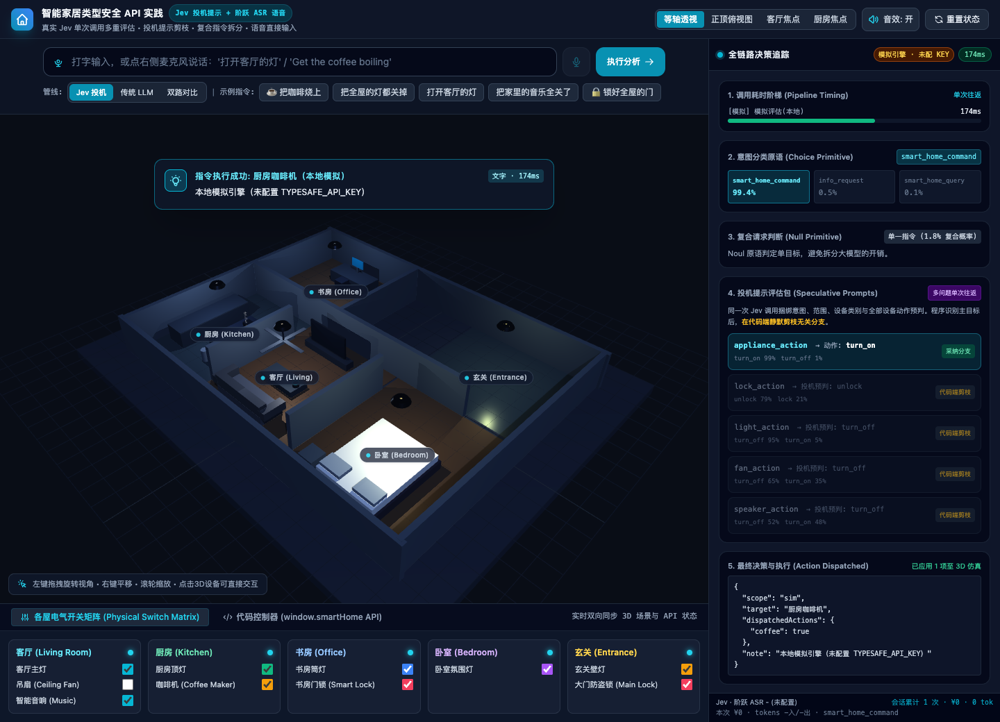
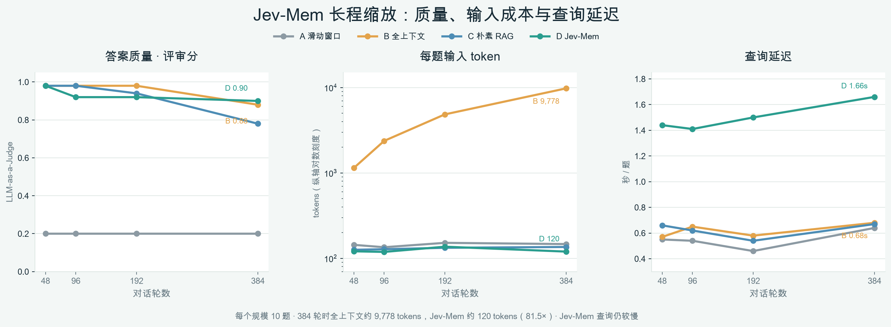
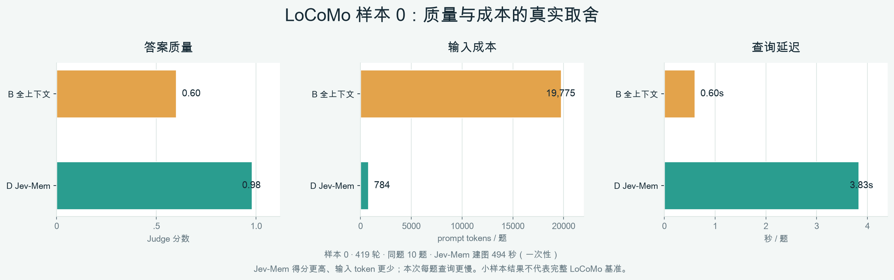

# 让 AI 少“说两句”，多做对一步：Jev Cookbook 开源教程

**从类型化判断、游戏闭环到 Agent、长期记忆与本地模型，带你系统认识一种不同的 AI 决策方式。**

## 开源初心

当 Agent 需要操作软件时，很多关键问题并不是“请写一段解释”，而是：

- 现在该调用搜索、数据库还是代码工具？
- 页面上应该点哪个按钮？
- 这一步证据够不够，应该继续、停止，还是交给人？
- 游戏局面变化后，下一步走、停还是攻击？

这些问题有明确的候选答案，但需要理解上下文。Jev Cookbook 围绕的就是这类**类型化判断**：把当前状态和问题交给决策模型，得到可被程序消费的选项或概率，再由代码执行规则、权限检查与动作。

```text
环境状态 → 类型化问题 → 模型给出选项 / 概率 → 代码校验与执行 → 新状态与反馈
```

Jev 不是要取代生成式大模型。需要开放式解释、写作或复杂规划时，生成模型仍然合适；当系统需要在有限选项里频繁作判断时，决策模型可以承担其中一部分工作。两者怎样分工、输出概率怎样评测、错误动作怎样拦截，才是教程真正关心的问题。

## 这套教程会带你走到哪里

Jev Cookbook 共 11 章，沿着“**理解判断 → 设计系统 → 动手实践 → 评测与集成 → 研究和训练**”逐步展开。你不需要先有模型训练经验；具备基础 Python 阅读能力，并了解如何调用一次模型 API，就可以从前几章开始。

- **第 1–3 章：建立概念。** 认识 Jev、State 与 Noul / Choice / Score 三种问题原语，再学习怎样把判断接入代码控制流。
- **第 4–5 章：做成可运行的东西。** 从 RAG、分类和工具选择配方，走到一个包含 3D 房间、设备状态和执行追踪的智能家居实验。
- **第 6–7 章：学会评测，也亲手看决策闭环。** 既看准确率、概率校准、延迟和成本，也看模型动作怎样经过环境规则裁定，再把反馈送入下一轮。
- **第 8–9 章：从案例走向研究与 Agent 集成。** 阅读 Jev-Mem、REFLEX、JEV-Star 等方向，并讨论工具权限、策略校验与模型判断之间的边界。
- **第 10–11 章：延伸到本地模型和资料证据。** 跟随 Laya 的数据、训练、校准和评测路线，回到来源、版本与实验范围，学会判断一个结果能支持什么结论。

如果你只想先看效果，可以从第七章的游戏和应用入口开始；想理解模型怎样参与长期记忆，再看第八章的 Jev-Mem。

## 第七章：让判断进入游戏和应用

第七章收录了 12 个项目，覆盖贪吃蛇、扫雷、狼人杀、迷宫、移动靶、Browser Use、斗地主、21 点、数独、Mario 和智能家居等场景。每个项目都可以沿着四个问题观察：模型看到了什么状态、它在什么候选里判断、代码怎样执行或拒绝动作、环境怎样反馈结果。


**图 1｜Jev Games 入口页。** 游戏与对照实验收在同一界面，可以从概览进入具体场景，再观察决策 trace。


**图 2｜扫雷中的局部判断。** 左侧是棋盘状态，右侧记录模型选择和已经揭开的格子。数字约束、风险判断与游戏规则各有分工，环境负责裁定动作是否合法。



**图 3｜智能家居的端到端演练界面。** 一句话指令之后，可以顺着页面看到意图判断、分支选择、动作派发和设备状态。此图展示本地模拟引擎的交互流程，不代表一次在线 API 性能测试。

游戏只是容易看懂的入口。同一个闭环也能迁移到网页自动化、工具路由和设备控制：动作由模型选择，合法性、权限与副作用由程序把关。教程不会把一个演示局的成功包装成通用能力，而是让你看到系统具体如何组成、该用什么指标评估。

## 第八章：把决策模型放进长期记忆

长期记忆不只是“把历史对话都存下来”。系统还要判断哪些信息值得写入、信息属于什么类型、与已有记忆有什么关系、提问时应该查哪类关系，以及证据够不够回答。


**图 4｜Jev-Mem 的三部分流程。** 写入阶段整理观察并建立关系；记忆平面按语义、时间、因果和实体组织信息；检索阶段按问题路由、检查证据，并在证据足够时交给生成模型组织答案。架构图来源：[Jev-Mem 上游项目](https://github.com/libingzheren/Jev-Mem)。

本仓库也保存了三组本地实验，观察短对话、上下文规模增长和 LoCoMo 样本上的质量与成本变化。下面的缩放图展示 48 到 384 轮合成对话：全上下文每题输入从约 1,144 增到 9,778 tokens；Jev-Mem 约为 120 tokens。384 轮时，评审分分别为 0.88 和 0.90。与此同时，Jev-Mem 每题查询更慢，建图也需要一次性投入——所以图里同时画出质量、token 和延迟。



**图 5｜48–384 轮长程缩放。** 每个规模回答 10 道题；这是一轮本地实验的观察值，适合看趋势和成本结构，不是多次重复后的统计结论。

在 LoCoMo 样本 0 的 419 轮对话中，10 道题的本地评审分为：Jev-Mem 0.98、全上下文 0.60；每题输入约 784 对 19,775 tokens。查询延迟则是 3.83 秒对 0.60 秒，此外 Jev-Mem 建图约需 494 秒。



**图 6｜同一个小样本里的质量与成本对照。** 结果提示：长对话中，筛选证据可能降低回答时的输入量并改善这组题目的得分；它没有显示更低的查询延迟。只有 10 道题，不能据此替代完整 LoCoMo 评测；分数也受本轮 LLM judge 影响。更多实验过程、Notebook 与 SVG 图见[第八章 README](../../../08_前沿研究/README.md)。

## 为什么值得动手

读完一套教程，最有用的不是记住一个 API，而是能把自己的问题拆清楚：

1. 哪些信息必须放进 State，哪些信息不能泄漏给模型？
2. 答案空间如何设计，才能让程序继续执行？
3. 概率和置信度各自表示什么，怎样用业务数据评测？
4. 什么时候直接执行，什么时候回退到大模型或人工？
5. 权限、规则、失败恢复和审计由哪一层负责？

这套路线也覆盖了模型评测、Agent 接入、研究论文阅读，以及 Laya 本地模型训练。你可以按需跳读，也可以从第一章开始一路搭出完整决策链。

## 开始学习与参与

- **开源仓库：** [datawhalechina/jev-cookbook](https://github.com/datawhalechina/jev-cookbook)
- **先入门：** 阅读第 1–3 章，认识 State、问题原语与概率输出。
- **先看项目：** 打开[第七章实战应用](../../../07_实战应用/README.md)，从游戏入口或智能家居开始。
- **先看前沿：** 打开[第八章前沿研究](../../../08_前沿研究/README.md)，查看 Jev-Mem 和其他近期方向。

如果你正在做 Agent、RAG 或模型评测，欢迎从一个具体任务开始：写清状态、列出候选动作、让环境裁定反馈，再用实验判断这类决策适不适合交给模型。

---

**图片说明：** 图 1、图 2 的游戏界面来自 [Jev Games 上游项目](https://github.com/lzdFeiFei/jev-games)；图 3 为仓库内的本地智能家居演练场；图 4 引自 [Jev-Mem 上游项目](https://github.com/libingzheren/Jev-Mem)；图 5、图 6 根据本仓库 Notebook 的已保存实验数据重新绘制。图中的单次、小样本数据均按正文所述范围阅读。

<!-- 编辑备注：第七章说明 Jev Games 上游仓库未附 LICENSE。公众号外部发布前，请与上游确认截图转载授权及署名要求。 -->
